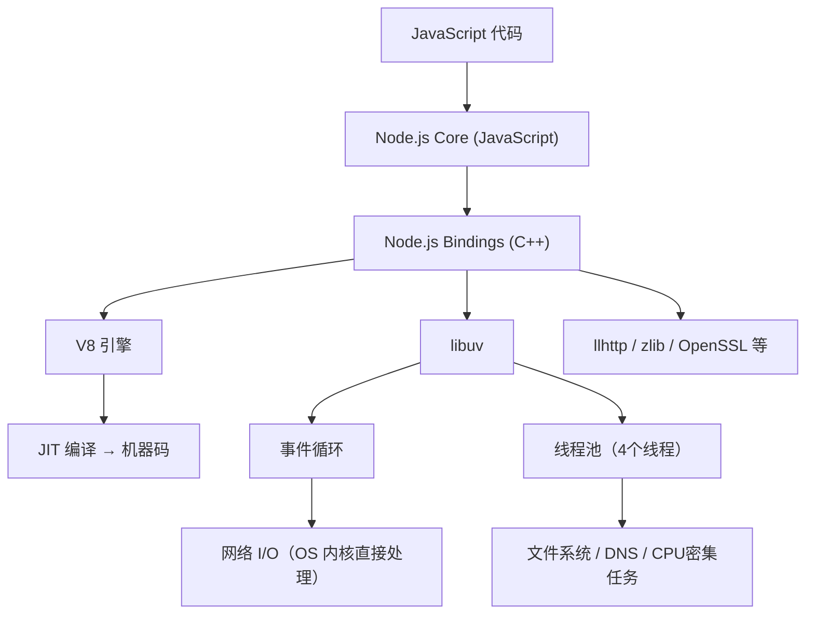
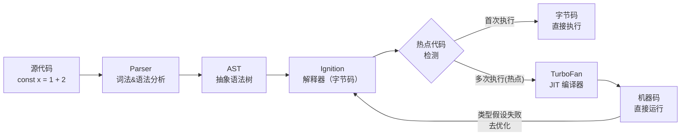
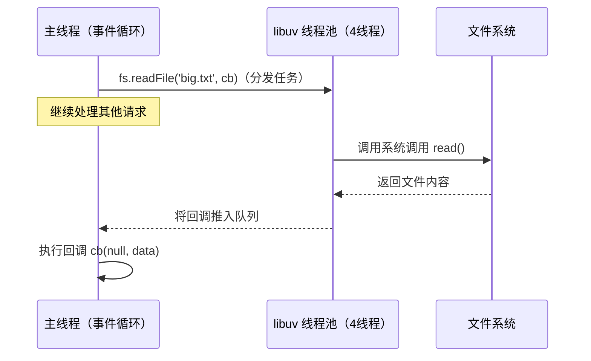
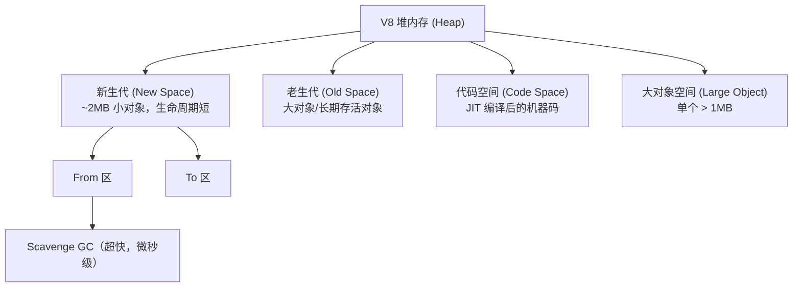
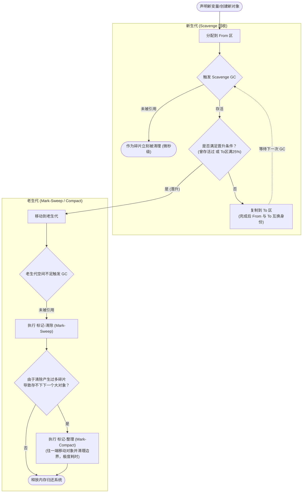
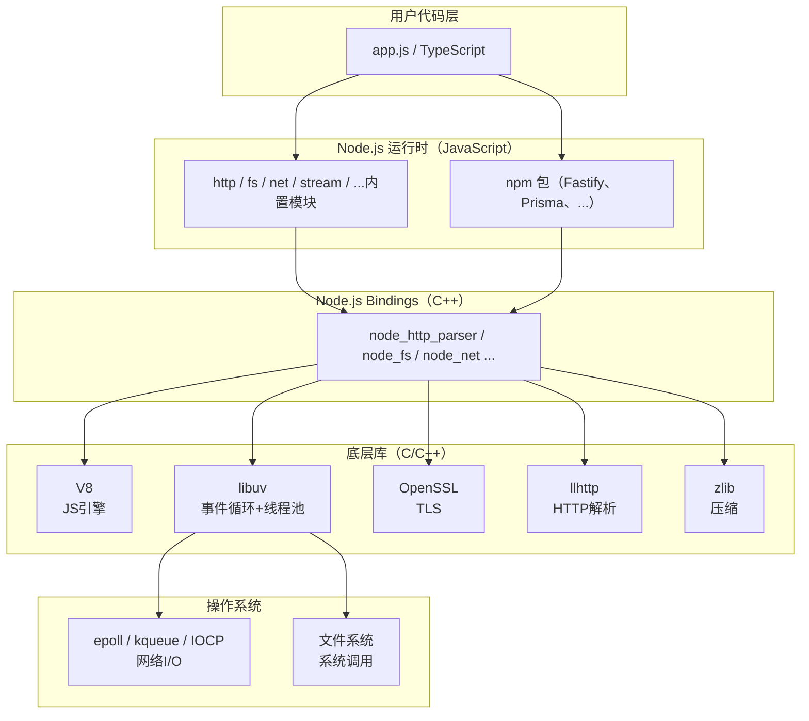

# Node.js 深度实战（一）—— 架构与运行时原理

用 Node.js 一年，能说清楚它的架构吗？这篇从 V8、libuv 到内存模型，把 Node.js 的底层搞透。

---

## 1. Node.js 整体架构

Node.js 不是一个单体程序，而是多个核心组件的精密组合：



### 核心组件解析

| 组件 | 语言 | 职责 |
|------|------|------|
| **V8** | C++ | 执行 JavaScript、JIT 编译、垃圾回收 |
| **libuv** | C | 事件循环、线程池、跨平台 I/O 抽象 |
| **llhttp** | C | HTTP 协议解析（前身 http_parser） |
| **OpenSSL** | C | TLS/HTTPS 加密 |
| **Node.js Bindings** | C++ | 连接 JS 世界和 C/C++ 底层 |

## 2. V8 引擎：让 JS 跑得飞快

V8 不是解释器，它是一个 **JIT（Just-In-Time）编译器**。

### 代码执行流程



**关键点：** V8 会对频繁执行的函数进行优化编译，转成机器码运行，速度接近 C++。一旦发现类型假设错误（比如传入了不同类型的参数），会回退到字节码解释执行（Deoptimization）。

### 如何写出对 V8 友好的代码

```javascript
// ❌ 不友好：函数参数类型不稳定，导致 V8 无法优化
function add(a, b) {
  return a + b;
}
add(1, 2);       // V8 优化为整数加法
add('a', 'b');   // V8 发现类型错误，去优化！

// ✅ 友好：保持参数类型一致
function addNumbers(a, b) {
  return a + b;
}
function addStrings(a, b) {
  return a + b;
}
```

```javascript
// ❌ 不友好：动态增删对象属性，破坏隐藏类（Hidden Class）
const obj = {};
obj.x = 1;
obj.y = 2;   // 每次添加属性都会创建新的隐藏类

// ✅ 友好：在构造时一次性声明所有属性
const obj = { x: 1, y: 2 };  // V8 创建稳定的隐藏类
```

## 3. libuv：Node.js 的异步引擎

libuv 解决了一个核心问题：**如何用单线程处理大量 I/O 而不阻塞？**

### 操作系统 I/O 的真相

不同操作系统提供不同的异步 I/O 机制：

| 操作系统 | 网络 I/O 机制 | 文件 I/O 机制 |
|---------|-------------|-------------|
| Linux | `epoll` | `io_uring`（新）/ 线程池（旧）|
| macOS | `kqueue` | 线程池 |
| Windows | `IOCP` | `IOCP` |

libuv 把这些差异统一封装，对上层提供一致的 API。

### 被误解的"单线程"

Node.js 主线程是单线程，但 libuv 内部维护了一个**线程池**（默认 4 个线程）。文件系统操作、DNS 解析等任务会被分发到线程池完成，主线程通过回调取回结果。



**调整线程池大小：**

```bash
# 文件系统密集型应用可适当增大
UV_THREADPOOL_SIZE=16 node app.js
```

## 4. Node.js 内存模型

### V8 堆内存结构



### 垃圾回收机制 (Garbage Collection)

V8 使用**分代垃圾回收**，并引入了并发回收来降低性能损耗。为了直观理解一个对象从生到死（或晋升）的完整脉络，请看下方流程图：



#### 1. 新生代（Scavenge 算法）
新生代空间分成两半：**From 区** 和 **To 区**。
- 大部分新创建的变量都在 From 区。
- 执行 GC 时，V8 会检查 From 区的存活对象，并将它们复制到 To 区，然后直接清空整个 From 区。
- 接着，From 区和 To 区的角色互换。
- **特点**：采用了 Cheney 算法，纯内存复制，速度极快（仅微秒级）。

#### 2. 对象的“晋升”（Promotion）
新生代的对象不会一直在两个区之间反复横跳。满足以下任一条件就会被“晋升”到老生代：
- **经历过一次 Scavenge 回收**：如果某个对象在上次 GC 中活了下来，再次 GC 时就会被移动到老生代。
- **To 区空间占用超过 25%**：为了不影响后续新对象的内存分配，存活对象会直接跳入老生代。

#### 3. 老生代（Mark-Sweep 与 Mark-Compact）
长期存活的对象在此安家。如果这里也满了，会触发两套组合拳：
- **标记-清除 (Mark-Sweep)**：遍历并标记活动对象，然后直接清除未标记的垃圾。**痛点**：会产生大量内存碎片。
- **标记-整理 (Mark-Compact)**：当大对象找不到连续的内存空间时，V8 会被迫执行整理，将存活对象往内存的一端移动，清理掉边界外的空间。虽然解决了碎片问题，但**非常耗时**。

#### 4. 如何解决全停顿（Stop-The-World）？
早期的 GC 一旦启动，JavaScript 线程就会被冻结（全停顿），导致接口响应出现数百毫秒的毛刺。现代 V8 通过 **Orinoco 项目** 彻底改造了这一过程：
- **增量标记 (Incremental Marking)**：把标记任务切成小块，和 JS 业务代码交替执行。
- **并发回收 (Concurrent GC)**：主线程专心跑 JS 代码，底层派发辅助线程在后台默默地进行垃圾回收。
- 结果：Node.js 的最大 GC 暂停时间被大幅压缩，服务变得极其平滑。

```javascript
// 模拟内存泄漏（常见错误）
const leaked = [];

setInterval(() => {
  leaked.push(new Array(1000).fill('leak'));  // 每秒泄漏约 8KB
  console.log('内存使用：', process.memoryUsage().heapUsed / 1024 / 1024, 'MB');
}, 1000);
```

### 查看内存使用

```javascript
const mem = process.memoryUsage();
console.log({
  rss: `${(mem.rss / 1024 / 1024).toFixed(2)} MB`,        // 进程总内存
  heapTotal: `${(mem.heapTotal / 1024 / 1024).toFixed(2)} MB`,  // 分配的堆大小
  heapUsed: `${(mem.heapUsed / 1024 / 1024).toFixed(2)} MB`,    // 实际使用的堆
  external: `${(mem.external / 1024 / 1024).toFixed(2)} MB`,    // C++ 对象占用（如 Buffer）
});
```

## 5. Node.js 24 LTS 新特性（2026年）

### 原生支持 `require(esm)`

过去 CommonJS 无法直接 `require` ES Module，Node.js 22 解除了这个限制，Node.js 24 正式稳定：

```javascript
// legacy.cjs（CommonJS 文件）
const { helper } = require('./utils.mjs');  // ✅ Node.js 22+ 直接支持！
```

### 原生 `--watch` 模式稳定化

无需 nodemon，Node.js 22 的内置文件监听正式稳定：

```bash
node --watch app.js
```

### `WebSocket` 客户端内置

无需安装 `ws` 包，Node.js 22 内置 WebSocket 客户端（WHATWG 标准规范）：

```javascript
const ws = new WebSocket('wss://echo.websocket.org');
ws.onopen = () => ws.send('Hello!');
ws.onmessage = (e) => console.log(e.data);
```

### `--strip-types`：TypeScript 原生支持（节点 24 正式稳定）

Node.js 22.6 引入实验性，Node.js 24 正式稳定，直接运行 TypeScript 文件无需编译：

```bash
# Node.js 24 中已无 experimental 前缀
node --strip-types app.ts
```

### `AbortSignal.timeout()` 内置支持稳定

```javascript
// 5秒超时自动取消请求
const response = await fetch('https://api.example.com/data', {
  signal: AbortSignal.timeout(5000)
});
```

## 6. 完整架构图



## 总结

- Node.js = V8（JS 执行） + libuv（异步 I/O） + 大量 C++ 绑定
- V8 的 JIT 编译让 JS 接近 C++ 速度，但需要保持类型一致性
- libuv 线程池处理文件/DNS，网络 I/O 直接走 OS 内核
- Node.js 24 LTS（24 是 2025~2028年的 Active LTS）带来了原生 TypeScript 类型剥离（`--strip-types`）、`require(esm)` 互通等重大改进

---

下一章将深入 **事件循环**，彻底搞清楚 `nextTick`、`Promise` 和 `setTimeout` 的执行顺序。
