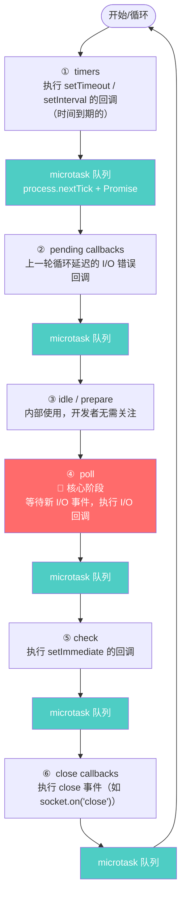
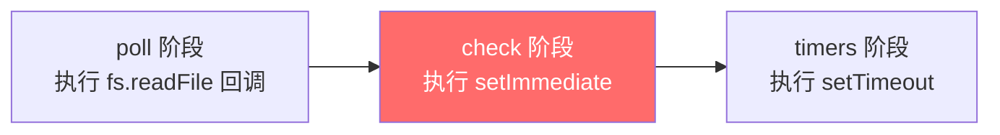
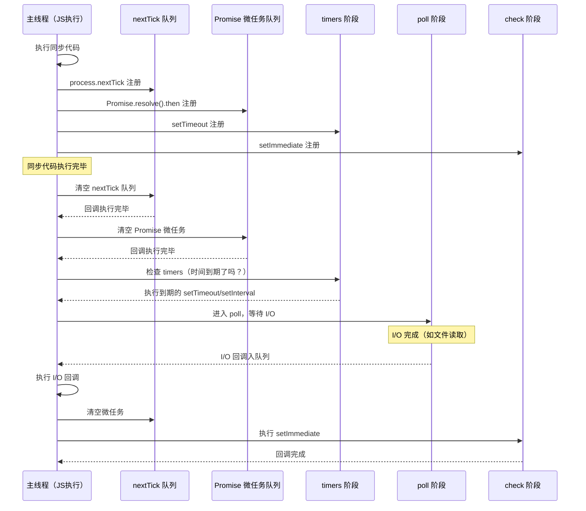

# Node.js 深度实战（二）—— 事件循环深度解析

这篇从 libuv 源码角度，把事件循环的每个细节讲清楚。

---

## 1. 为什么要有事件循环？

Node.js 是单线程的，同一时间只能执行一段代码。要支撑高并发请求，只有两条路：

1. **多线程**：每个请求分配一个线程（Java/Go 的传统方式），线程数受系统资源限制。
2. **事件驱动**：单线程处理请求，I/O 操作交给 OS，完成后通过事件通知主线程。

Node.js 选了第二条路。**事件循环**就是这个"等待 → 接收事件 → 处理 → 再等待"的无限循环机制。

## 2. 事件循环的六个阶段

libuv 实现的事件循环有 **6 个阶段**，每个阶段处理特定类型的回调：



> **重要：** 在每个阶段切换之间，Node.js 都会清空 **微任务队列**（`process.nextTick` 和 `Promise` 回调）。

### ④ poll 阶段：核心中的核心

poll 阶段有两种模式：

1. **有待执行的 timers**：计算最近的 timer 还需等待多少时间，最多等待这么长时间后离开 poll 阶段。
2. **没有 timers**：
   - 有 I/O 回调待执行 → 执行它们
   - 队列为空 → 阻塞等待新 I/O 事件（直到有 `setImmediate` 或 timer 到期才离开）

## 3. 微任务（Microtasks）的优先级

微任务在每个阶段结束后立刻执行，优先级高于下一阶段的宏任务。

```javascript
setTimeout(() => console.log('1. setTimeout'), 0);

Promise.resolve().then(() => console.log('2. Promise'));

process.nextTick(() => console.log('3. nextTick'));

console.log('4. 同步代码');
```

**执行顺序：**

```
4. 同步代码      ← 同步代码优先
3. nextTick      ← nextTick 在 Promise 之前
2. Promise       ← Promise 微任务
1. setTimeout    ← 宏任务最后
```

**微任务优先级：** `process.nextTick` > `Promise.then` / `queueMicrotask`

```javascript
// nextTick 会"插队"到 Promise 前面
Promise.resolve().then(() => console.log('Promise A'));
process.nextTick(() => console.log('nextTick'));
Promise.resolve().then(() => console.log('Promise B'));

// 输出顺序：
// nextTick
// Promise A
// Promise B
```

## 4. setTimeout vs setImmediate

这两个经常让人困惑：

```javascript
setTimeout(() => console.log('setTimeout'), 0);
setImmediate(() => console.log('setImmediate'));
```

**在主模块中**，这两个的顺序是**不确定的**，取决于系统调度耗时（定时器精度限制）。

**但在 I/O 回调中**，顺序是固定的：

```javascript
const fs = require('fs');

fs.readFile('./package.json', () => {
  // 此时已经在 poll 阶段，poll 结束后先执行 check（setImmediate），再回到 timers
  setTimeout(() => console.log('setTimeout'));
  setImmediate(() => console.log('setImmediate'));
  // 输出：setImmediate → setTimeout（永远如此）
});
```



## 5. 异步编程的三个时代

### 时代一：回调函数（Callback）

```javascript
// 地狱式嵌套（Callback Hell）
fs.readFile('a.txt', (err, a) => {
  if (err) return console.error(err);
  fs.readFile('b.txt', (err, b) => {
    if (err) return console.error(err);
    fs.writeFile('c.txt', a + b, (err) => {
      if (err) return console.error(err);
      console.log('完成！');
    });
  });
});
```

**问题：** 错误处理分散、难以理解逻辑流、无法复用。

### 时代二：Promise

```javascript
import { readFile, writeFile } from 'fs/promises';

readFile('a.txt', 'utf8')
  .then(a => readFile('b.txt', 'utf8').then(b => a + b))
  .then(content => writeFile('c.txt', content))
  .then(() => console.log('完成！'))
  .catch(err => console.error(err));
```

**改进：** 链式调用，统一错误处理（`.catch`），但嵌套 Promise 还是略显复杂。

### 时代三：async/await（现代最佳实践）

```javascript
import { readFile, writeFile } from 'fs/promises';

async function mergeFiles() {
  const a = await readFile('a.txt', 'utf8');
  const b = await readFile('b.txt', 'utf8');  // 顺序执行
  await writeFile('c.txt', a + b);
  console.log('完成！');
}

// 并行优化（两个文件同时读取）
async function mergeFilesParallel() {
  const [a, b] = await Promise.all([
    readFile('a.txt', 'utf8'),
    readFile('b.txt', 'utf8'),  // 并行读取，更快！
  ]);
  await writeFile('c.txt', a + b);
}

mergeFiles().catch(console.error);
```

## 6. 经典面试题：输出顺序

```javascript
async function main() {
  console.log('1');

  setTimeout(() => console.log('2'), 0);

  await Promise.resolve();
  console.log('3');

  process.nextTick(() => console.log('4'));

  await new Promise(resolve => {
    console.log('5');
    resolve();
  });

  console.log('6');
}

main();
console.log('7');
```

<details>
<summary>点击查看答案与解析</summary>

**正确输出顺序：`1 → 7 → 3 → 5 → 4 → 6 → 2`**

逐步拆解：

1. `console.log('1')` — 同步代码，立即输出 **`1`**
2. `setTimeout(() => ..., 0)` — 注册到 timers 阶段，跳过
3. `await Promise.resolve()` — 挂起 `main()`，执行权交回外部
4. `console.log('7')` — 外部同步代码，输出 **`7`**
5. 同步代码执行完毕，清空微任务：`await Promise.resolve()` 恢复，输出 **`3`**
6. `process.nextTick(() => console.log('4'))` — 注册到 nextTick 队列（还没执行）
7. `new Promise(resolve => { console.log('5'); resolve(); })` — 构造函数**同步**执行，输出 **`5`**，然后 `resolve()`，`main` 被挂起等待
8. 清空微任务：**nextTick 优先于 Promise**，先输出 **`4`**；再恢复 `await new Promise(...)` 后的代码，输出 **`6`**
9. 微任务清空，进入 timers 阶段，执行 `setTimeout`，输出 **`2`**

> **关键点：** `process.nextTick` 在 `resolve()` 之后注册，但因优先级更高，仍在 `await` 恢复之前执行。这是 nextTick 插队 Promise 微任务的经典体现。

</details>

## 7. 常见"阻塞事件循环"的坑

```javascript
// ❌ 危险：大量同步计算阻塞事件循环
app.get('/fibonacci', (req, res) => {
  function fib(n) {
    if (n <= 1) return n;
    return fib(n - 1) + fib(n - 2);  // 递归，CPU 密集型
  }
  const result = fib(40);  // 阻塞约 1 秒！期间无法处理任何其他请求
  res.send({ result });
});

// ✅ 解决方案：移入 Worker Thread（见第7章）
import { Worker } from 'worker_threads';

app.get('/fibonacci', (req, res) => {
  const worker = new Worker('./fibonacci.worker.js', {
    workerData: { n: 40 }
  });
  worker.on('message', result => res.send({ result }));
});
```

**事件循环健康检查工具：**

```javascript
// 监控事件循环延迟（生产环境必备）
import { monitorEventLoopDelay } from 'perf_hooks';

const h = monitorEventLoopDelay({ resolution: 20 });
h.enable();

setInterval(() => {
  console.log(`事件循环延迟 P99: ${h.percentile(99)}ms`);
  h.reset();
}, 5000);
```

## 8. 流程图：完整异步执行模型



## 总结

- 事件循环分 6 个阶段：timers → pending → idle → **poll** → check → close
- 微任务（nextTick、Promise）在每个阶段结束后立即执行，优先级优于下一阶段
- `process.nextTick` > `Promise.then`，两者都在宏任务（setTimeout）之前
- I/O 回调中的 `setImmediate` 永远比 `setTimeout(0)` 先执行
- CPU 密集型任务会阻塞事件循环，应当移入 Worker Thread

---

下一章探讨 **模块系统**，讲清楚 CommonJS 和 ES Modules 的内部实现原理。
