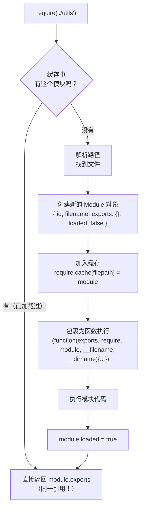
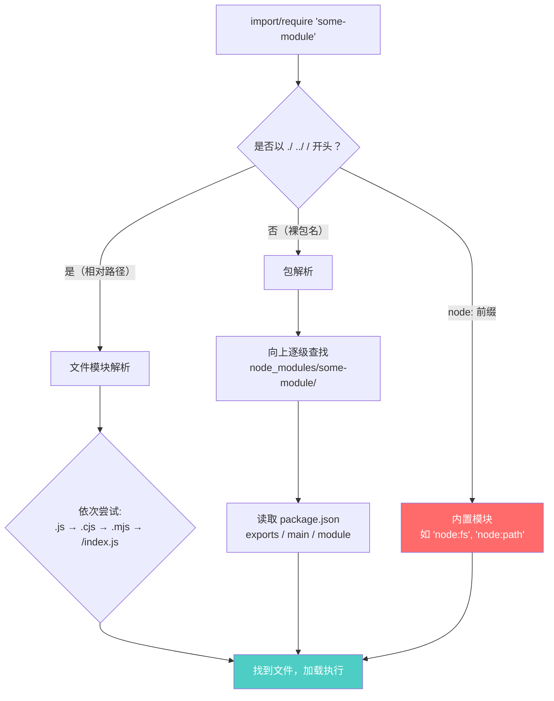

# Node.js 深度实战（三）—— 模块系统：ESM、CJS 与未来

`require` 和 `import` 共存了这么多年，底层到底有什么区别？双模块包该怎么写？

---

## 1. CommonJS：Node.js 的历史遗产

CommonJS（CJS）是 Node.js 最初使用的模块系统，浏览器端 JavaScript 当年没有模块系统，Node.js 自己造了一个。

### require 的实现原理

每次 `require` 一个模块时，Node.js 实际上做了以下几步：



**Node.js 将模块代码包裹在一个函数里执行：**

```javascript
(function(exports, require, module, __filename, __dirname) {
  // module.js 里的代码都在这里
  const x = 1;
  module.exports = { x };
});
```

这就是为什么 `__filename`、`__dirname`、`exports`、`module` 不是全局变量，而是这个包裹函数的参数。

### 循环依赖：CJS 的隐患

```javascript
// a.js
const b = require('./b');
console.log('a: b.value =', b.value);
module.exports = { value: 'A' };

// b.js
const a = require('./a');
console.log('b: a.value =', a.value);  // 输出 undefined！
module.exports = { value: 'B' };
```

**为什么 `a.value` 是 undefined？**

因为 CJS 遇到循环依赖时，会先返回当前未完成的 `exports`（空对象 `{}`），等模块执行完毕后再更新。这是 CJS 运行时动态加载的固有缺陷。

### ESM 是如何处理循环依赖的？

与 CJS 返回半成品不同，ESM 的加载机制分为三步：**解析（解析语法）、实例化（分配内存搭好所有导出的“管子”但不赋值）、求值（运行代码并填充值）**。

在 ESM 中，无论是导出还是导入，大家拿到的是同一个**活引用的地址**。
如果你在对方模块还没有执行到 `export` 赋值那一行时，就提前去读取它的变量，ESM 会非常严格地直接抛出：
`ReferenceError: Cannot access '...' before initialization`
因为该变量仍处于**暂时性死区（TDZ）**。这种“发现问题早报错”的机制，比 CJS 默默返回一个 `undefined` 要安全得多。

## 2. ES Modules：现代标准

### ESM vs CJS 的核心区别

| 特性 | CommonJS | ES Modules |
|------|----------|------------|
| 加载时机 | **运行时**动态加载 | **编译时**静态分析 |
| `exports` 类型 | 值的拷贝 | 活的绑定（Live Binding）|
| 循环依赖处理 | 导出未完成的 exports | 静态引用，可处理 |
| 顶层 `await` | ❌ 不支持 | ✅ 支持 |
| Tree Shaking | ❌ 困难 | ✅ 原生支持 |
| `__filename`/`__dirname` | ✅ 内置 | ❌ 需手动重建 |

### ESM 的活绑定（Live Binding）

ESM 导出的不是值的副本，而是对原始变量的**引用绑定**：

```javascript
// counter.mjs
export let count = 0;
export function increment() { count++; }

// main.mjs
import { count, increment } from './counter.mjs';
console.log(count); // 0
increment();
console.log(count); // 1 ← 不是副本，是活的引用！
```

对比 CJS：

```javascript
// counter.js
let count = 0;
module.exports = { count, increment() { count++; } };

// main.js
const { count, increment } = require('./counter');
console.log(count); // 0
increment();
console.log(count); // 0 ← 还是 0！导出的是值的拷贝
```

### 如何在 Node.js 中使用 ESM

**方案一：文件扩展名 `.mjs`**

```javascript
// utils.mjs
export const PI = 3.14159;
export function add(a, b) { return a + b; }
```

**方案二：`package.json` 中声明 `"type": "module"`**

```json
{
  "name": "my-app",
  "type": "module"
}
```

此时 `.js` 文件默认视为 ESM，`.cjs` 视为 CommonJS。

**方案三：ESM 中重建 `__dirname` 和 `__filename`**

```javascript
// ESM 中没有 __dirname，需要手动实现
import { fileURLToPath } from 'url';
import { dirname, join } from 'path';

const __filename = fileURLToPath(import.meta.url);
const __dirname = dirname(__filename);

// 或者更简洁（Node.js 21.2+）
const __dirname = import.meta.dirname;  // 新 API，直接用！
const __filename = import.meta.filename;
```

## 3. 使用 ESM 的注意事项

### 动态导入 `import()`

ESM 也支持动态加载（返回 Promise）：

```javascript
// 按需加载，减少启动时间
async function loadPlugin(name) {
  const { default: plugin } = await import(`./plugins/${name}.mjs`);
  return plugin;
}

// 条件导入
const config = process.env.NODE_ENV === 'production'
  ? await import('./config.prod.mjs')
  : await import('./config.dev.mjs');
```

### 顶层 `await`（ESM 专属）

```javascript
// 只有 ESM 支持顶层 await，CJS 中会报语法错误
const data = await fetch('https://api.example.com/config').then(r => r.json());

export default {
  serverUrl: data.url,
  apiKey: data.key,
};
```

## 4. 双模块包：同时支持 CJS 和 ESM

写 npm 包时，为了兼容老项目（CJS）和新项目（ESM），可以发布双格式包：

### 目录结构

```
my-lib/
├── src/
│   └── index.ts      # 源码
├── dist/
│   ├── cjs/
│   │   └── index.js  # CommonJS 格式
│   └── esm/
│       └── index.js  # ES Module 格式
└── package.json
```

### package.json exports 字段配置

```json
{
  "name": "my-lib",
  "version": "1.0.0",
  "main": "./dist/cjs/index.js",
  "module": "./dist/esm/index.js",
  "exports": {
    ".": {
      "import": {
        "types": "./dist/esm/index.d.ts",
        "default": "./dist/esm/index.js"
      },
      "require": {
        "types": "./dist/cjs/index.d.ts",
        "default": "./dist/cjs/index.js"
      }
    }
  },
  "types": "./dist/esm/index.d.ts"
}
```

**exports 的优先级高于 main/module**，是 Node.js 12+ 推荐的现代写法。

### 构建脚本（以 tsup 为例）

```bash
npm install -D tsup
```

```typescript
// tsup.config.ts
import { defineConfig } from 'tsup';

export default defineConfig({
  entry: ['src/index.ts'],
  format: ['cjs', 'esm'],  // 同时输出两种格式
  dts: true,               // 生成类型声明文件
  splitting: false,
  sourcemap: true,
  clean: true,
});
```

## 5. `require(esm)` 正式可用（Node.js 22 引入，24 稳定）

Node.js 22 解除了 CJS 无法直接 `require` ESM 的限制，Node.js 24 中该特性已正式稳定：

```javascript
// legacy.cjs（旧 CommonJS 文件）
// Node.js 22+ 可直接 require ESM 包，Node.js 24 正式稳定
const { helper } = require('./utils.mjs');  // ✅ 不再报错！

// 注意：如果 ESM 模块使用了顶层 await，require 仍然不可用
```

这大幅降低了迁移成本——不需要把整个项目改成 ESM 才能用那些"只支持 ESM"的包了。

## 6. 模块解析流程图



## 7. 最佳实践总结

```javascript
// ✅ 新项目：在 package.json 中设置 "type": "module"，全面使用 ESM
// ✅ npm 包：用 exports 字段发布双模块包
// ✅ 使用 import.meta.dirname 代替 __dirname（Node.js 21.2+）
// ✅ 内置模块使用 node: 前缀（更明确，避免命名冲突）
import { readFile } from 'node:fs/promises';
import { join } from 'node:path';

// ✅ 按需动态导入大型依赖
const { default: heavyLib } = await import('some-heavy-lib');
```

## 总结

- CJS 是运行时动态加载，有循环依赖问题；ESM 是静态分析，天然支持 Tree Shaking
- ESM 导出的是活绑定（Live Binding），不是值的拷贝
- 新项目首选 `"type": "module"` + ESM；npm 包用 `exports` 字段发布双格式
- `require(esm)` 在 Node.js 22 引入，Node.js 24 正式稳定，CJS/ESM 互通的历史隔阂彻底消除

---

下一章探讨 **Stream 与 Buffer**，理解 Node.js 高性能数据处理的核心原理。
