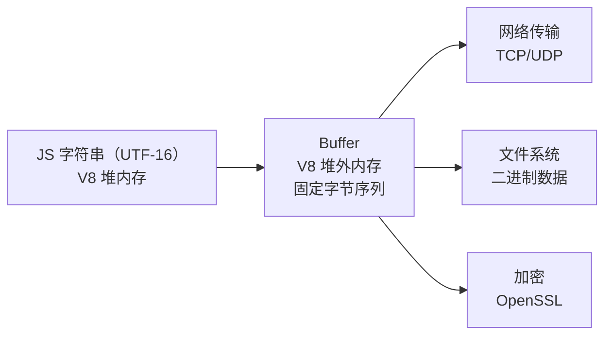
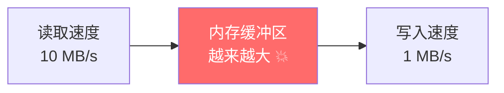
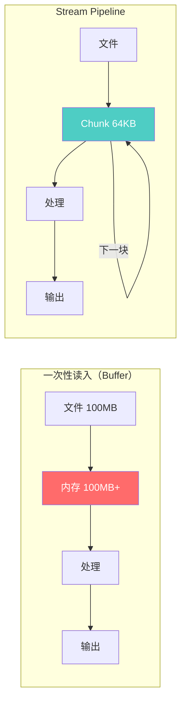

# Node.js 深度实战（四）—— Stream 与 Buffer：高性能数据处理

读大文件为什么会 OOM？视频上传为什么要分片？Stream 是 Node.js 处理海量数据的核心武器。

---

## 1. Buffer：内存中的原始二进制数据

JavaScript 原本只处理字符串，处理网络数据（TCP 包、文件字节）时没有合适的数据结构。`Buffer` 正是为此而生——它是存储在 **V8 堆外**（off-heap）的固定大小字节序列。



### Buffer 基础操作

```javascript
// 创建 Buffer（Node.js 10+ 统一使用 Buffer.from / Buffer.alloc）
const buf1 = Buffer.from('Hello, Node.js!', 'utf8');  // 从字符串创建
const buf2 = Buffer.alloc(8);                          // 创建填充 0 的 8 字节 Buffer
const buf3 = Buffer.from([0x48, 0x65, 0x6c, 0x6c, 0x6f]);  // 从字节数组创建

console.log(buf1.length);           // 15（字节数，不是字符数！）
console.log(buf1.toString('utf8')); // "Hello, Node.js!"
console.log(buf1.toString('hex'));  // "48656c6c6f..."
console.log(buf1.toString('base64')); // "SGVsbG8sIE5vZGUuanMh"

// Buffer 拼接（不要在循环里用 + 拼接！）
const parts = [Buffer.from('Hello'), Buffer.from(', '), Buffer.from('World')];
const combined = Buffer.concat(parts);
console.log(combined.toString()); // "Hello, World"
```

### 编码陷阱：多字节字符

```javascript
const str = '你好';  // 中文字符在 UTF-8 中每个占 3 字节
const buf = Buffer.from(str, 'utf8');
console.log(buf.length);  // 6，不是 2！

// ❌ 错误：按固定字节数分割 Buffer 会破坏多字节字符
const part1 = buf.subarray(0, 3);  // 只有"你"的字节
console.log(part1.toString('utf8'));  // "你"

const part2 = buf.subarray(1, 4);  // 从"你"的中间开始切
console.log(part2.toString('utf8'));  // 乱码！

// ✅ 正确：使用 StringDecoder 处理分片
import { StringDecoder } from 'string_decoder';
const decoder = new StringDecoder('utf8');
decoder.write(buf.slice(0, 4));  // 不完整的"好"字节暂存
decoder.end();                    // 输出剩余
```

## 2. Stream：流式处理大数据

想象一下：一个 2GB 的日志文件，如果用 `fs.readFile` 一次性读入内存，直接 OOM（内存溢出）。Stream 可以**边读边处理**，内存占用始终维持在几 MB。

### 四种 Stream 类型

| 类型 | 说明 | 例子 |
|------|------|------|
| **Readable** | 可读流（数据来源） | `fs.createReadStream`、HTTP Request |
| **Writable** | 可写流（数据目标） | `fs.createWriteStream`、HTTP Response |
| **Duplex** | 双工流（可读可写） | TCP Socket、`zlib.createGzip()` 的输入端 |
| **Transform** | 转换流（读写+变换） | `zlib.createGzip()`、加密流、CSV 解析器 |

### 可读流的工作模式

Readable 有两种模式：

```javascript
import { createReadStream } from 'node:fs';

const stream = createReadStream('./big-file.log');

// 模式1：flowing（流动模式）—— 数据自动推送
stream.on('data', (chunk) => {
  console.log('收到 chunk，大小：', chunk.length);
});
stream.on('end', () => console.log('读取完毕'));
stream.on('error', (err) => console.error('出错：', err));

// 模式2：paused（暂停模式）—— 手动 read()
stream.on('readable', () => {
  let chunk;
  while ((chunk = stream.read(64 * 1024)) !== null) {  // 每次读 64KB
    console.log('手动读取：', chunk.length);
  }
});
```

### 核心概念：背压（Backpressure）

背压是 Stream 中最重要也最容易忽视的概念。当**写入速度 < 读取速度**时，数据会积压在内存缓冲区。

```javascript
// ❌ 错误：没有处理背压，内存可能爆炸
const readStream = createReadStream('./huge-file.mp4');
const writeStream = createWriteStream('./output.mp4');

readStream.on('data', (chunk) => {
  // 如果 write 返回 false，说明缓冲区满了，但仍在继续读！
  writeStream.write(chunk);
});
```



### 正确处理背压

```javascript
// ✅ 方式一：手动处理 drain 事件
readStream.on('data', (chunk) => {
  const canContinue = writeStream.write(chunk);
  if (!canContinue) {
    readStream.pause();  // 缓冲区满，暂停读取
    writeStream.once('drain', () => {
      readStream.resume();  // 缓冲区清空，继续读取
    });
  }
});

// ✅ 方式二：pipe（自动处理背压，推荐）
readStream.pipe(writeStream);

// ✅ 方式三：pipeline（Node.js 10+，推荐，错误处理更完善）
import { pipeline } from 'node:stream/promises';
import { createReadStream, createWriteStream } from 'node:fs';
import { createGzip } from 'node:zlib';

await pipeline(
  createReadStream('./input.txt'),
  createGzip(),              // 压缩 Transform 流
  createWriteStream('./input.txt.gz')
);
console.log('压缩完成！');
```

## 3. 自定义 Transform Stream

Transform 流是最灵活的：输入一种数据，输出另一种数据。

```javascript
import { Transform } from 'node:stream';

// 自定义：将 CSV 每行解析为 JSON 对象
class CsvToJson extends Transform {
  constructor() {
    super({ objectMode: true });  // 开启对象模式，允许传输任意 JS 对象
    this.headers = null;
    this.buffer = '';
  }

  _transform(chunk, encoding, callback) {
    this.buffer += chunk.toString();
    const lines = this.buffer.split('\n');
    this.buffer = lines.pop();  // 保留最后一行（可能不完整）

    for (const line of lines) {
      if (!line.trim()) continue;

      if (!this.headers) {
        this.headers = line.split(',').map(h => h.trim());
      } else {
        const values = line.split(',').map(v => v.trim());
        const obj = Object.fromEntries(
          this.headers.map((h, i) => [h, values[i]])
        );
        this.push(obj);  // 向下游推送解析后的对象
      }
    }
    callback();
  }

  _flush(callback) {
    // 处理最后一行
    if (this.buffer.trim() && this.headers) {
      const values = this.buffer.split(',').map(v => v.trim());
      this.push(Object.fromEntries(this.headers.map((h, i) => [h, values[i]])));
    }
    callback();
  }
}

// 使用：Pipeline 处理大型 CSV 文件
import { pipeline } from 'node:stream/promises';
import { createReadStream } from 'node:fs';
import { createWriteStream } from 'node:fs';

const outputStream = new Transform({
  objectMode: true,
  transform(obj, enc, cb) {
    cb(null, JSON.stringify(obj) + '\n');  // 对象转 JSON 行
  }
});

await pipeline(
  createReadStream('./million-rows.csv'),
  new CsvToJson(),
  outputStream,
  createWriteStream('./output.jsonl')
);
```

## 4. 异步迭代器：Stream 的现代写法

Node.js 12+ 支持用 `for await...of` 迭代 Readable Stream：

```javascript
import { createReadStream } from 'node:fs';
import { createInterface } from 'node:readline';

async function processLargeFile(filePath) {
  const fileStream = createReadStream(filePath);
  const rl = createInterface({ input: fileStream, crlfDelay: Infinity });

  let lineCount = 0;
  let errorCount = 0;

  for await (const line of rl) {  // 逐行异步读取，无需手动处理背压
    lineCount++;
    if (line.includes('ERROR')) errorCount++;
  }

  console.log(`总行数: ${lineCount}, 错误行数: ${errorCount}`);
}

await processLargeFile('./application.log');
```

## 5. 实战：HTTP 流式上传与下载

```javascript
import Fastify from 'fastify';
import { pipeline } from 'node:stream/promises';
import { createWriteStream } from 'node:fs';
import { createGzip } from 'node:zlib';

const app = Fastify();

// 流式文件上传（不把整个文件读入内存）
app.post('/upload', async (request, reply) => {
  const filename = `upload-${Date.now()}.gz`;
  await pipeline(
    request.raw,           // 请求体本身是 Readable Stream
    createGzip(),          // 边传输边压缩
    createWriteStream(`./uploads/${filename}`)
  );
  return { saved: filename };
});

// 流式文件下载
app.get('/download/:file', async (request, reply) => {
  const filePath = `./uploads/${request.params.file}`;
  const readStream = createReadStream(filePath);

  reply.header('Content-Type', 'application/octet-stream');
  reply.header('Content-Disposition', `attachment; filename="${request.params.file}"`);

  return reply.send(readStream);  // Fastify 自动处理背压
});
```

## 6. 性能对比：Buffer vs Stream

```javascript
import { readFile, writeFile } from 'node:fs/promises';
import { pipeline } from 'node:stream/promises';
import { createReadStream, createWriteStream } from 'node:fs';
import { createGzip } from 'node:zlib';

// 测试文件：100MB

// ❌ 方式一：一次性读入（内存峰值 ~300MB）
import { gzipSync } from 'node:zlib';
console.time('buffer');
const data = await readFile('./100mb.log');
const compressed = gzipSync(data);          // 一次性压缩整个 Buffer（300MB+ 内存占用）
await writeFile('./100mb.log.gz.buf', compressed);
console.timeEnd('buffer'); // ~3s, 内存 300MB+

// ✅ 方式二：Stream pipeline（内存峰值 <10MB）
console.time('stream');
await pipeline(
  createReadStream('./100mb.log'),
  createGzip(),
  createWriteStream('./100mb.log.gz')
);
console.timeEnd('stream'); // ~1.5s, 内存 <10MB
```



## 总结

- `Buffer` 是堆外内存，用于高效处理二进制数据；拼接用 `Buffer.concat`，不要用 `+`
- Stream 的核心优势：**恒定内存占用**处理任意大小数据
- 背压（Backpressure）是 Stream 的核心机制，始终用 `pipeline` 代替裸 `pipe`
- `for await...of` 是迭代 Readable Stream 的现代写法，代码更简洁
- HTTP 请求/响应体本质上就是 Stream，框架底层都在用

---

下一章探讨 **HTTP/3 与网络编程**，了解 QUIC 协议是如何解决 TCP 的线头阻塞问题的。
