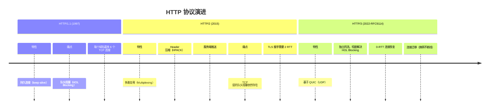
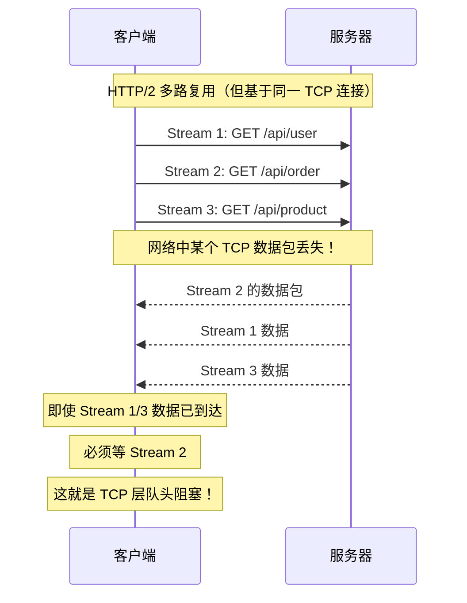
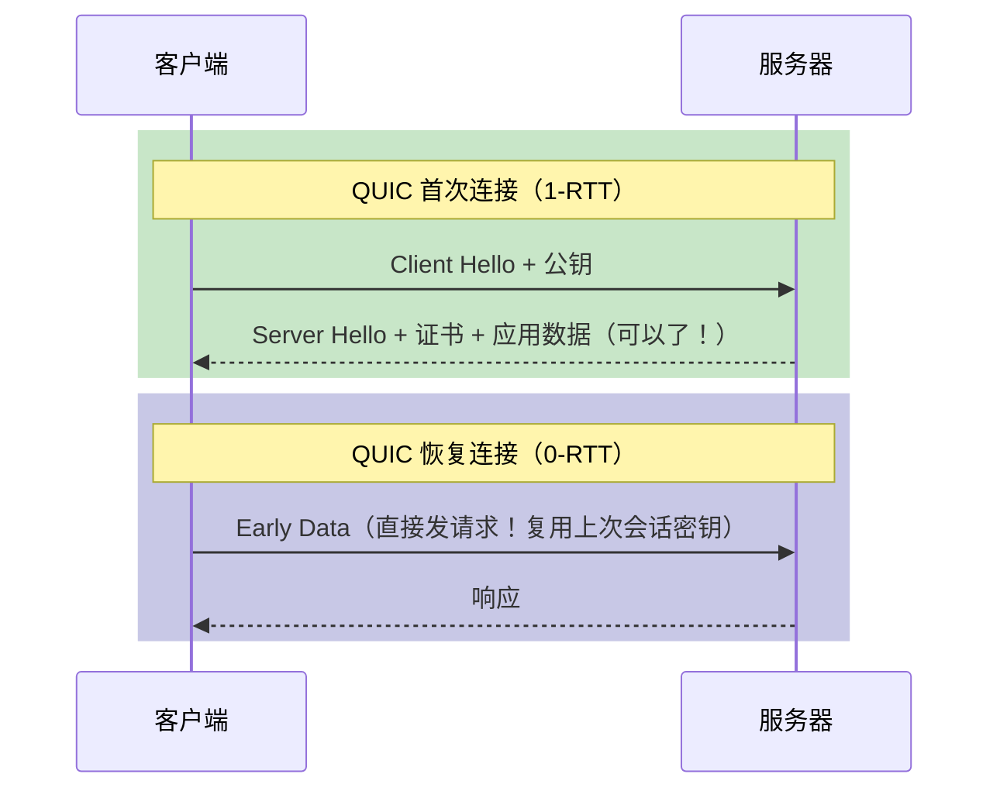

# Node.js 深度实战（五）—— HTTP/3 与网络编程

TCP 有线头阻塞，HTTPS 握手慢——QUIC/HTTP/3 如何解决这些老大难问题？Node.js 怎么用？

---

## 1. HTTP 协议的演进史



## 2. HTTP/2 的遗留问题：TCP 层队头阻塞

HTTP/2 的多路复用在应用层解决了 HTTP/1.1 的队头阻塞，但 TCP 层的问题依然存在：



## 3. QUIC：基于 UDP 重新设计的传输层协议

QUIC 由 Google 发明，2021 年成为 IETF 标准 RFC 9000，HTTP/3 = HTTP over QUIC。

### QUIC 的关键改进

**① 彻底解决队头阻塞**

QUIC 在 UDP 之上实现了独立的流（Stream），每个流有自己的确认和重传机制：

```
QUIC 连接中：
  Stream 1 丢包 → 只影响 Stream 1，其他 Stream 正常继续
  Stream 2 完好 → 正常交付，不受 Stream 1 影响
```

**② 更快的连接建立**



| 协议 | 首次连接 | 恢复连接 |
|------|---------|---------|
| HTTP/1.1 (TLS 1.2) | 3 RTT | 2 RTT |
| HTTP/2 (TLS 1.3) | 2 RTT | 1 RTT |
| HTTP/3 (QUIC) | 1 RTT | **0 RTT** |

**③ 连接迁移**

手机从 Wi-Fi 切到 5G 时，TCP 连接会断开（因为 IP 变了）。QUIC 使用 Connection ID 标识连接，IP 变化后连接不中断。

## 4. Node.js 中使用 HTTP/3

> **重要说明：** Node.js **没有**内置 `node:http3` 原生模块（截至 Node.js 24）。HTTP/3 **服务端**需要通过 Nginx/Caddy 反向代理实现；Node.js 作为客户端可通过 `undici` 发起 HTTP/3 请求。

### 方案一：undici 客户端（支持 HTTP/3 协商）

```bash
npm install undici
```

```javascript
import { fetch } from 'undici';

// undici 自动支持 HTTP/1.1、HTTP/2、HTTP/3 协议协商（ALPN）
const response = await fetch('https://cloudflare.com/cdn-cgi/trace');
const text = await response.text();
console.log(text);
// 查看 h= 字段，确认实际使用的 HTTP 版本
```

### 方案二：服务端 HTTP/3 —— 通过反向代理实现（生产推荐）

Node.js 应用本身运行 HTTP/1.1，由前端反向代理负责 HTTP/3 终止：

```
客户端 →（HTTP/3/QUIC）→ Nginx/Caddy（反向代理）→（HTTP/1.1）→ Node.js
```

Caddy 一行配置即可开启 HTTPS + HTTP/3，Node.js 完全不需要改动：

```caddyfile
# Caddyfile（自动申请证书 + 自动开启 HTTP/3）
api.example.com {
  reverse_proxy localhost:3000
}
```

如果需要 Node.js 原生承载 HTTP/3，可使用第三方库：

```bash
npm install @fails-components/h3
```

```javascript
import { createQuicSocket } from '@fails-components/h3';
// 适合边缘场景，生产环境仍推荐走 Nginx/Caddy
```

## 5. WebSocket：实时双向通信

### Node.js 22 内置 WebSocket 客户端

```javascript
// 客户端（浏览器 or Node.js 22+）
const ws = new WebSocket('wss://echo.websocket.org');

ws.addEventListener('open', () => {
  console.log('连接已建立');
  ws.send(JSON.stringify({ type: 'subscribe', channel: 'prices' }));
});

ws.addEventListener('message', (event) => {
  const data = JSON.parse(event.data);
  console.log('收到消息：', data);
});

ws.addEventListener('close', (event) => {
  console.log('连接关闭，代码：', event.code);
});
```

### Fastify + WebSocket 服务器

```bash
npm install @fastify/websocket
```

```javascript
import Fastify from 'fastify';
import websocket from '@fastify/websocket';

const app = Fastify();
await app.register(websocket);

// WebSocket 路由
app.get('/ws', { websocket: true }, (socket, req) => {
  console.log('新连接：', req.ip);

  socket.on('message', (message) => {
    const data = JSON.parse(message.toString());
    console.log('收到：', data);

    // 广播给其他客户端（需要维护连接池）
    socket.send(JSON.stringify({
      type: 'echo',
      data: data,
      timestamp: Date.now()
    }));
  });

  socket.on('close', () => console.log('连接断开'));
});

await app.listen({ port: 3000 });
```

## 6. Server-Sent Events（SSE）：服务器推送

SSE 比 WebSocket 更简单，适合**单向推送**场景（实时日志、AI 流式输出）：

```javascript
// Fastify SSE 端点
app.get('/events', (request, reply) => {
  reply.raw.writeHead(200, {
    'Content-Type': 'text/event-stream',
    'Cache-Control': 'no-cache',
    'Connection': 'keep-alive',
    'X-Accel-Buffering': 'no',  // 禁用 Nginx 缓冲
  });

  let count = 0;
  const interval = setInterval(() => {
    // SSE 格式：每条消息以 \n\n 结尾
    reply.raw.write(`data: ${JSON.stringify({ count: ++count, time: Date.now() })}\n\n`);

    if (count >= 10) {
      clearInterval(interval);
      reply.raw.end();
    }
  }, 1000);

  request.raw.on('close', () => {
    clearInterval(interval);  // 客户端断开时清理定时器
  });
});
```

```javascript
// 前端接收 SSE
const eventSource = new EventSource('/events');
eventSource.onmessage = (e) => {
  const data = JSON.parse(e.data);
  console.log('实时数据：', data);
};
```

### AI 流式输出场景（SSE 应用）

```javascript
import Fastify from 'fastify';

const app = Fastify();

app.post('/chat/stream', async (request, reply) => {
  const { message } = request.body;

  reply.raw.writeHead(200, {
    'Content-Type': 'text/event-stream',
    'Cache-Control': 'no-cache',
  });

  // 调用大模型流式 API（以 OpenAI 为例）
  const stream = await openai.chat.completions.create({
    model: 'gpt-4o',
    messages: [{ role: 'user', content: message }],
    stream: true,
  });

  for await (const chunk of stream) {
    const delta = chunk.choices[0]?.delta?.content;
    if (delta) {
      reply.raw.write(`data: ${JSON.stringify({ delta })}\n\n`);
    }
  }

  reply.raw.write('data: [DONE]\n\n');
  reply.raw.end();
});
```

## 7. 隐藏的网络黑洞：端口耗尽与 Keep-Alive

在微服务架构下，Node.js 经常需要作为客户端向其他服务发起大量 HTTP 请求。许多新手直接写个循环狂发 `fetch`，结果压测时很快收到 `EADDRINUSE` 或 `ECONNRESET` 报错。

**底层原因：**
每次 HTTP 请求如果不复用 TCP 连接（短连接），完成请求后内核会经历“四次挥手”。主动关闭连接的一方（Node.js），其端口会进入 `TIME_WAIT` 状态，并且必须维持这种状态 **2MSL**（通常是 60 秒）才会被释放。
服务器的可用临时端口范围大概只有 2~3 万个。如果 QPS 极高，临时端口会瞬间被榨干，新的网络请求根本发不出去。

**解决方案：长连接复用（Keep-Alive）**

在旧版本的 Node.js 中，你需要手动配置 `http.Agent`：
```javascript
import http from 'node:http';

const keepAliveAgent = new http.Agent({ 
  keepAlive: true, 
  maxSockets: 100 // 最大并发套接字数
});

http.get('http://api.internal/data', { agent: keepAliveAgent }, (res) => { ... });
```

**现代最佳实践：使用 Node 18+ 内置的 fetch (基于 Undici)**
好消息是，Node.js 内置的 `fetch`（依赖底层 `undici` 引擎）**默认已经开启了长连接复用，并管理了更高效的连接池**。
只要你正确使用了原生的 `fetch`（或者使用 Fastify 的 `@fastify/undici` 插件），你就不需要再手动管理 TCP 连接池了。这也是为什么 2026 年我们不再推荐使用如 `axios` + 旧 `http.Agent` 组合的原因。

## 8. TCP 编程：底层网络能力

```javascript
import { createServer } from 'node:net';

// 创建 TCP 服务器
const server = createServer((socket) => {
  console.log('新连接：', socket.remoteAddress, socket.remotePort);

  socket.on('data', (data) => {
    console.log('收到数据：', data.toString());
    socket.write('收到：' + data);  // 回显
  });

  socket.on('end', () => console.log('客户端断开'));
  socket.on('error', (err) => console.error('错误：', err));
});

server.listen(9000, () => console.log('TCP 服务器监听 9000'));
```

## 总结

- HTTP/3 基于 QUIC（UDP），解决了 TCP 队头阻塞，实现 0-RTT 恢复和连接迁移
- 生产环境用 Nginx/Caddy 处理 HTTP/3，Node.js 专注应用逻辑
- WebSocket 适合实时双向通信；SSE 适合服务器到客户端的单向推送，更简单
- Node.js 22 内置 WebSocket 客户端（无需 `ws` 包）

---

下一章探讨 **文件系统与操作系统交互**，讲清楚 `fs` 的正确用法和文件监听原理。
