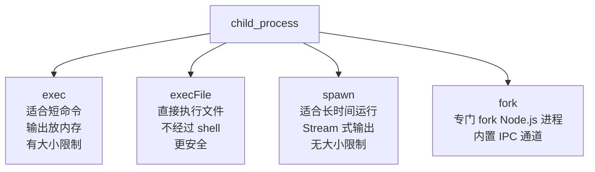
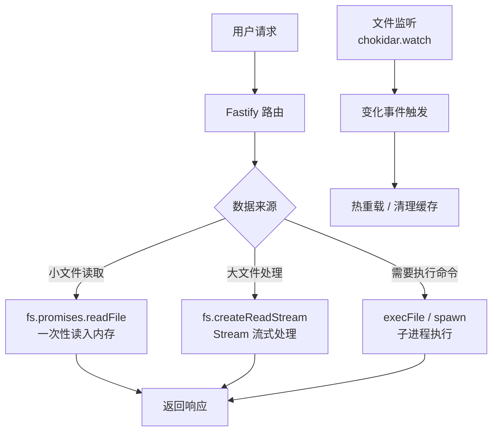

# Node.js 深度实战（六）—— 文件系统与操作系统交互

`fs.readFileSync` 在生产环境为什么是大忌？子进程怎么安全调用 shell 命令？

---

## 1. fs 模块：三种使用方式

Node.js 的 `fs` 模块提供了三种风格的 API：

```javascript
import fs from 'node:fs';          // 回调风格（最古老）
import fsSync from 'node:fs';      // 同步风格（阻塞，慎用）
import fsp from 'node:fs/promises'; // Promise 风格（现代推荐）
```

### 三种风格对比

```javascript
const filePath = './data.json';

// 风格一：回调（传统，不推荐新代码使用）
fs.readFile(filePath, 'utf8', (err, data) => {
  if (err) throw err;
  console.log(JSON.parse(data));
});

// 风格二：同步（阻塞！仅适用于启动时一次性读取）
// ✅ 合理用法：读取配置文件（服务启动时只执行一次）
const config = JSON.parse(fs.readFileSync('./config.json', 'utf8'));

// ❌ 危险用法：处理请求时调用同步 API，阻塞所有其他请求
app.get('/data', (req, res) => {
  const data = fs.readFileSync('./data.json');  // 危险！
  res.send(data);
});

// 风格三：Promise（现代最佳实践）
const data = await fsp.readFile(filePath, 'utf8');
const parsed = JSON.parse(data);
```

## 2. 常用 fs 操作最佳实践

### 读写文件

```javascript
import { readFile, writeFile, appendFile, copyFile, unlink } from 'node:fs/promises';

// 读取文件（自动处理 Buffer 编码）
const content = await readFile('./README.md', 'utf8');

// 写入文件（覆盖）
await writeFile('./output.json', JSON.stringify(data, null, 2));

// 追加内容
await appendFile('./app.log', `[${new Date().toISOString()}] 操作日志\n`);

// 复制文件
await copyFile('./source.txt', './dest.txt');

// 删除文件（不存在时不报错）
try {
  await unlink('./temp.txt');
} catch (err) {
  if (err.code !== 'ENOENT') throw err;  // 忽略文件不存在的错误
}
```

### 目录操作

```javascript
import { mkdir, readdir, stat, rm } from 'node:fs/promises';

// 递归创建目录（类似 mkdir -p）
await mkdir('./logs/2026/02', { recursive: true });

// 读取目录内容（带文件类型信息）
const entries = await readdir('./uploads', { withFileTypes: true });
for (const entry of entries) {
  if (entry.isFile()) {
    console.log('文件：', entry.name);
  } else if (entry.isDirectory()) {
    console.log('目录：', entry.name);
  }
}

// 获取文件/目录信息
const stats = await stat('./package.json');
console.log({
  size: stats.size,           // 文件大小（字节）
  isFile: stats.isFile(),     // 是否是文件
  mtime: stats.mtimeMs,       // 最后修改时间（毫秒时间戳）
});

// 递归删除目录（类似 rm -rf，Node.js 14.14+）
await rm('./node_modules', { recursive: true, force: true });
```

### 原子写入（防止数据损坏）

```javascript
import { writeFile, rename } from 'node:fs/promises';
import { tmpdir } from 'node:os';
import { join } from 'node:path';
import { randomBytes } from 'node:crypto';

// 直接写入目标文件有风险：写一半时进程崩溃 → 文件损坏
// ✅ 原子写入：先写临时文件，再用 rename（same filesystem）原子替换
async function atomicWrite(targetPath, data) {
  const tempPath = join(tmpdir(), `tmp-${randomBytes(6).toString('hex')}`);
  try {
    await writeFile(tempPath, data, 'utf8');
    await rename(tempPath, targetPath);  // rename 在同一文件系统上是原子操作
  } catch (err) {
    try { await unlink(tempPath); } catch {}  // 清理临时文件
    throw err;
  }
}

await atomicWrite('./config.json', JSON.stringify(newConfig, null, 2));
```

## 3. 文件监听：fs.watch 与 chokidar

### Node.js 内置 fs.watch

```javascript
import { watch } from 'node:fs';

// 监听文件变化（Node.js 18.11+ 支持 AbortSignal 取消监听）
const controller = new AbortController();

const watcher = watch('./src', { recursive: true, signal: controller.signal });

for await (const event of watcher) {
  console.log('变化：', event.eventType, event.filename);
  // eventType: 'rename' (创建/删除) 或 'change' (内容变化)
}

// 5 秒后停止监听
setTimeout(() => controller.abort(), 5000);
```

**fs.watch 的局限：**

- macOS 上 `recursive` 不稳定
- 无法区分创建/删除（都用 `rename`）
- 短时间内多次变化会触发多个事件（需要防抖）

### chokidar：生产级文件监听

```bash
npm install chokidar
```

```javascript
import chokidar from 'chokidar';

const watcher = chokidar.watch('./src', {
  ignored: /(^|[\/\\])\..|(node_modules)/,  // 忽略隐藏文件和 node_modules
  persistent: true,
  ignoreInitial: true,  // 启动时不触发 add 事件
  awaitWriteFinish: {   // 等待文件写入完成后再触发（防止读到不完整文件）
    stabilityThreshold: 300,
    pollInterval: 100
  }
});

watcher
  .on('add', path => console.log(`新增文件: ${path}`))
  .on('change', path => console.log(`文件变化: ${path}`))
  .on('unlink', path => console.log(`文件删除: ${path}`))
  .on('addDir', path => console.log(`新增目录: ${path}`))
  .on('error', error => console.error(`监听错误: ${error}`));
```

## 4. path 模块：跨平台路径处理

```javascript
import { join, resolve, extname, basename, dirname, parse, format } from 'node:path';

// ❌ 不要用字符串拼接路径（Windows 用反斜杠！）
const bad = './config' + '/' + 'app.json';

// ✅ 用 path.join 处理路径分隔符
const good = join('./config', 'app.json');   // './config/app.json'

// resolve：解析为绝对路径（相对于 cwd）
const abs = resolve('./src', 'index.ts');  // '/Users/lucas/project/src/index.ts'

// 在 ESM 中，用 import.meta 代替 __dirname
const __dirname = import.meta.dirname;
const configPath = join(__dirname, '../config/app.json');

// 路径信息提取
const filePath = '/home/user/docs/report.final.pdf';
console.log(extname(filePath));       // '.pdf'
console.log(basename(filePath));      // 'report.final.pdf'
console.log(basename(filePath, '.pdf')); // 'report.final'（去掉扩展名）
console.log(dirname(filePath));       // '/home/user/docs'
console.log(parse(filePath));
// { root: '/', dir: '/home/user/docs', base: 'report.final.pdf',
//   ext: '.pdf', name: 'report.final' }
```

## 5. 子进程：执行 Shell 命令

Node.js 可以创建子进程执行系统命令，有四种方式：



### exec：简单命令

```javascript
import { exec } from 'node:child_process';
import { promisify } from 'node:util';

const execAsync = promisify(exec);

// 执行 shell 命令，获取输出
const { stdout, stderr } = await execAsync('ls -la ./src');
console.log('输出：', stdout);
if (stderr) console.error('错误：', stderr);

// ⚠️ 安全警告：不要直接拼接用户输入！
const userInput = 'foo; rm -rf /';  // 命令注入！
const bad = await execAsync(`ls ${userInput}`);  // 危险！

// ✅ 安全：使用 execFile，参数独立传递（不经过 shell）
import { execFile } from 'node:child_process';
const execFileAsync = promisify(execFile);
const { stdout: safeOut } = await execFileAsync('ls', ['-la', './src']);
```

### spawn：流式输出

```javascript
import { spawn } from 'node:child_process';

// 适合长时间运行、输出大量数据的命令（如 npm install、ffmpeg）
function runCommand(command, args) {
  return new Promise((resolve, reject) => {
    const proc = spawn(command, args, {
      stdio: ['inherit', 'pipe', 'pipe'],  // 继承 stdin，捕获 stdout/stderr
    });

    let output = '';
    proc.stdout.on('data', (data) => {
      output += data;
      process.stdout.write(data);  // 实时输出
    });

    proc.stderr.on('data', (data) => {
      process.stderr.write(data);
    });

    proc.on('close', (code) => {
      if (code === 0) resolve(output);
      else reject(new Error(`命令退出码: ${code}`));
    });
  });
}

await runCommand('npm', ['install', '--production']);
```

### fork：Node.js 子进程通信

```javascript
// parent.js
import { fork } from 'node:child_process';

const child = fork('./worker.js');

// 通过 IPC 发送消息
child.send({ type: 'compute', data: [1, 2, 3, 4, 5] });

child.on('message', (result) => {
  console.log('子进程结果：', result);
  child.kill();
});

// worker.js
process.on('message', ({ type, data }) => {
  if (type === 'compute') {
    const result = data.reduce((a, b) => a + b, 0);
    process.send({ sum: result });
  }
});
```

## 6. 整体调用流程



## 总结

- **同步 API** 只用于服务启动时的一次性配置读取，请求处理中禁用
- **原子写入**（write temp + rename）保证数据文件不损坏
- 跨平台路径用 `path.join`；ESM 中用 `import.meta.dirname` 替代 `__dirname`
- 文件监听用 `chokidar`，比内置 `fs.watch` 更可靠
- 执行外部命令用 `execFile`（非 shell，防注入），大量输出用 `spawn`

---

下一章分析 **Worker Threads 与多进程架构**，解决 CPU 密集型任务阻塞事件循环的难题。
