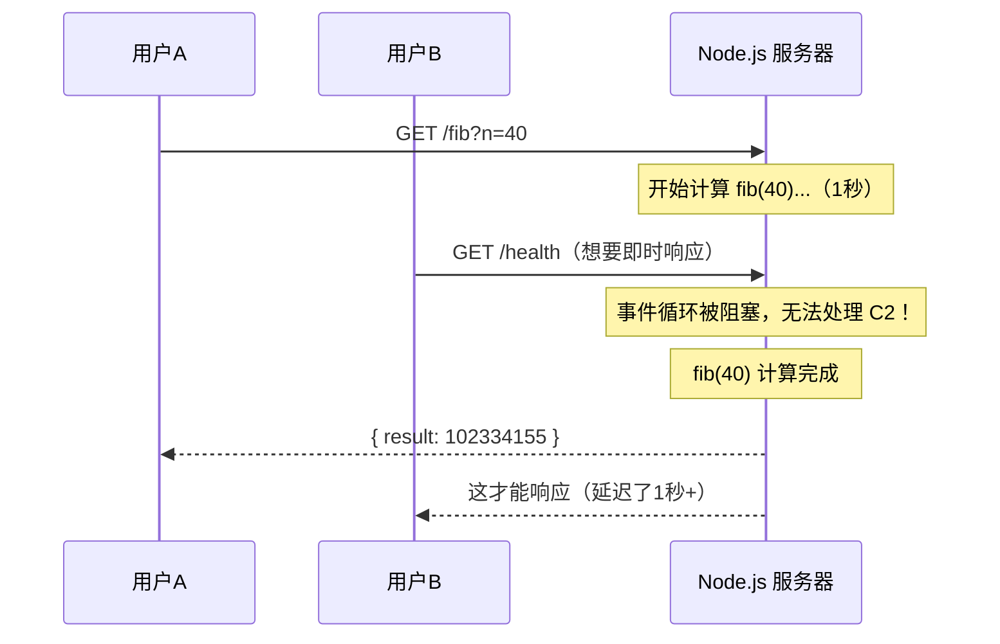
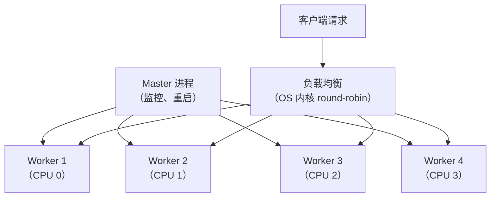
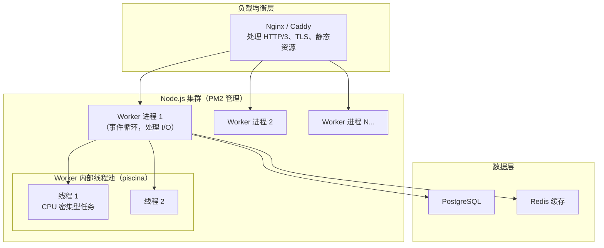

# Node.js 深度实战（七）—— Worker Threads 与多进程架构

Fibonacci(40) 一次请求，Node.js 服务器就彻底卡死了。Worker Threads 和 Cluster 如何破解单线程瓶颈？

---

## 1. 单线程的阿喀琉斯之踵

Node.js 单线程对 I/O：完美，异步处理，吞吐量碾压传统多线程服务器。

Node.js 单线程对 CPU 密集型任务：灾难性的。

```javascript
// ❌ CPU 密集型任务阻塞事件循环
import Fastify from 'fastify';
const app = Fastify();

app.get('/fib', async (request, reply) => {
  const n = parseInt(request.query.n);

  function fib(n) {
    if (n <= 1) return n;
    return fib(n - 1) + fib(n - 2);
  }

  // fib(40) 约需 1 秒，这 1 秒内服务器无法处理任何其他请求！
  return { result: fib(n) };
});
```



## 2. Worker Threads：多线程共享内存

Node.js 10.5+ 引入 `worker_threads`，允许创建真正的操作系统线程，每个线程有独立的 V8 实例，但可以通过 `SharedArrayBuffer` 共享内存。

### 基础用法

```javascript
// main.js
import { Worker, isMainThread, parentPort, workerData } from 'node:worker_threads';
import { fileURLToPath } from 'node:url';

const __filename = fileURLToPath(import.meta.url);

if (isMainThread) {
  // 主线程逻辑
  function fibInWorker(n) {
    return new Promise((resolve, reject) => {
      const worker = new Worker(__filename, {
        workerData: { n }  // 传递数据（深拷贝）
      });
      worker.on('message', resolve);
      worker.on('error', reject);
      worker.on('exit', (code) => {
        if (code !== 0) reject(new Error(`Worker 异常退出: ${code}`));
      });
    });
  }

  // 调用 Worker，主线程不阻塞
  const result = await fibInWorker(40);
  console.log('结果：', result);

} else {
  // Worker 线程逻辑
  function fib(n) {
    if (n <= 1) return n;
    return fib(n - 1) + fib(n - 2);
  }

  parentPort.postMessage(fib(workerData.n));
}
```

### 使用 Worker Pool（生产级）

频繁创建/销毁 Worker 有开销，应当使用 **线程池** 复用线程：

```bash
npm install piscina
```

**piscina** 是 Node.js 核心成员开发的高性能 Worker Pool：

```javascript
// fibonacci.worker.js
export default function fib(n) {
  if (n <= 1) return n;
  return fib(n - 1) + fib(n - 2);
}

// server.js
import Fastify from 'fastify';
import Piscina from 'piscina';
import { fileURLToPath } from 'node:url';

const app = Fastify({ logger: true });
const pool = new Piscina({
  filename: fileURLToPath(new URL('./fibonacci.worker.js', import.meta.url)),
  maxThreads: 4,  // 最多 4 个线程
  minThreads: 2,  // 预热 2 个线程
});

app.get('/fib', async (request, reply) => {
  const n = parseInt(request.query.n);
  // 从线程池取一个空闲 Worker 执行，主线程不阻塞
  const result = await pool.run(n);
  return { n, result };
});

await app.listen({ port: 3000 });
```

## 3. SharedArrayBuffer：线程间共享内存

Worker 之间默认通过 `postMessage` 传递数据（深拷贝，有开销）。`SharedArrayBuffer` 允许多线程共享同一块内存：

```javascript
// 创建一个共享内存缓冲区（16 字节 = 4 个 int32）
const sharedBuffer = new SharedArrayBuffer(16);
const sharedArray = new Int32Array(sharedBuffer);

// 在 Worker 中访问同一块内存
const worker = new Worker('./counter.worker.js', {
  workerData: { sharedBuffer }  // 传递的是引用，不是拷贝！
});

// 主线程修改
sharedArray[0] = 100;

// 等待 Worker 完成（使用 Atomics 防止竞争条件）
Atomics.wait(sharedArray, 1, 0);  // 等待 index=1 的值从 0 变化
console.log('Worker 已完成处理，共享值：', sharedArray[0]);
```

```javascript
// counter.worker.js
import { workerData, parentPort } from 'node:worker_threads';

const sharedArray = new Int32Array(workerData.sharedBuffer);

// 原子操作（线程安全的加法）
Atomics.add(sharedArray, 0, 1);  // sharedArray[0]++，原子操作

// 通知主线程完成
Atomics.notify(sharedArray, 1, 1);
```

## 4. Cluster：充分利用多核 CPU

`worker_threads` 适合单个计算任务；`cluster` 适合把整个 HTTP 服务复制到多个 CPU 核心：



```javascript
// cluster-server.js
import cluster from 'node:cluster';
import { cpus } from 'node:os';
import { createServer } from 'node:http';

const numCPUs = cpus().length;

if (cluster.isPrimary) {
  console.log(`主进程 ${process.pid} 启动，CPU 数：${numCPUs}`);

  // Fork 与 CPU 数量相同的工作进程
  for (let i = 0; i < numCPUs; i++) {
    cluster.fork();
  }

  // 自动重启崩溃的 Worker
  cluster.on('exit', (worker, code, signal) => {
    console.warn(`Worker ${worker.process.pid} 已退出，正在重启...`);
    cluster.fork();
  });

} else {
  // 每个 Worker 进程独立监听端口（OS 内核负责负载均衡）
  const server = createServer((req, res) => {
    res.writeHead(200);
    res.end(`由 Worker ${process.pid} 处理\n`);
  });

  server.listen(3000, () => {
    console.log(`Worker ${process.pid} 就绪`);
  });
}
```

### 现代替代方案：PM2

生产环境一般用 PM2 管理集群：

```bash
npm install -g pm2

# 自动根据 CPU 数量启动集群
pm2 start app.js -i max

# 查看状态
pm2 status
pm2 monit

# 零停机重启
pm2 reload all
```

## 5. Worker Threads vs Cluster vs 子进程

| 对比维度 | Worker Threads | Cluster | child_process |
|---------|----------------|---------|--------------|
| **适用场景** | CPU 密集型计算 | HTTP 服务多核扩展 | 运行外部命令/脚本 |
| **内存共享** | ✅ SharedArrayBuffer | ❌ 独立内存 | ❌ 独立内存 |
| **通信方式** | postMessage | IPC / 共享端口 | IPC / stdio |
| **创建开销** | 低（同进程内） | 高（新进程） | 高（新进程） |
| **崩溃隔离** | ❌ 影响主进程 | ✅ 独立进程 | ✅ 独立进程 |

## 6. 完整架构：高并发生产方案



## 7. 实战：图片压缩 API

```javascript
// compress.worker.js
import sharp from 'sharp';  // 需要 npm install sharp

export default async function compress({ inputBuffer, width, quality }) {
  return sharp(inputBuffer)
    .resize(width)
    .jpeg({ quality })
    .toBuffer();
}

// server.js
import Fastify from 'fastify';
import Piscina from 'piscina';
import multipart from '@fastify/multipart';

const app = Fastify();
await app.register(multipart);

const pool = new Piscina({
  filename: new URL('./compress.worker.js', import.meta.url).href,
  maxThreads: 4,
});

app.post('/compress', async (request, reply) => {
  const file = await request.file();
  const inputBuffer = await file.toBuffer();

  // 图片压缩移入 Worker Thread，主线程不阻塞
  const compressed = await pool.run({
    inputBuffer,
    width: 800,
    quality: 80,
  });

  reply.header('Content-Type', 'image/jpeg');
  return reply.send(compressed);
});
```

## 8. SEA：打包为单文件可执行程序（Node.js 22+）

Node.js 22 将 **Single Executable Applications（SEA）** 标记为 Stability 2（稳定），Node.js 24 进一步完善（移除实验性标志）。可将 Node.js 项目打包成无需安装 Node.js 环境的可执行文件，类似 Go 的 single binary。


### 操作步骤

```json
// sea-config.json
{
  "main": "app.js",
  "output": "sea-prep.blob"
}
```

```bash
# 1. 生成 blob 文件（Node.js 24 已去掉 --experimental 前缀）
node --sea-config sea-config.json

# 2. 复制 node 可执行文件作为基础
cp $(which node) myapp

# 3. 注入 blob（macOS）
npx postject myapp NODE_SEA_BLOB sea-prep.blob \
  --sentinel-fuse NODE_SEA_FUSE_fce680ab2cc467b6e072b8b5df1996b2 \
  --macho-segment-name NODE_SEA

# 4. 直接运行（不需要 node 环境）
./myapp
```

**适用场景：**
- CLI 工具分发给不懂 Node.js 的用户
- 企业内部工具部署（服务器上不允许安装 Node.js）
- 免安装的桌面应用

> **注意：** SEA 目前不支持 `require()` 动态加载 native addon（.node 文件），以及 `Worker Threads` 从文件系统加载脚本。复杂项目推荐用 [pkg](https://github.com/vercel/pkg) 或 [nexe](https://github.com/nexe/nexe) 替代。

## 总结

- 事件循环只适合 I/O 密集型任务，CPU 密集型任务必须移出主线程
- `Worker Threads` + `piscina`：计算任务线程池，可共享内存（SharedArrayBuffer）
- `Cluster` / PM2：把整个 HTTP 服务扩展到所有 CPU 核心，进程级隔离更安全
- 生产推荐：PM2 管理集群 + piscina 处理 CPU 密集任务，两者互补
- Node.js 22 SEA 可将应用打包为单文件可执行程序，无需目标机器安装 Node.js

---

下一章探讨 **Fastify + TypeScript 构建现代 REST API**，打造符合生产标准的后端框架。
