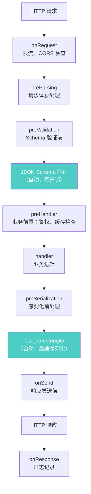
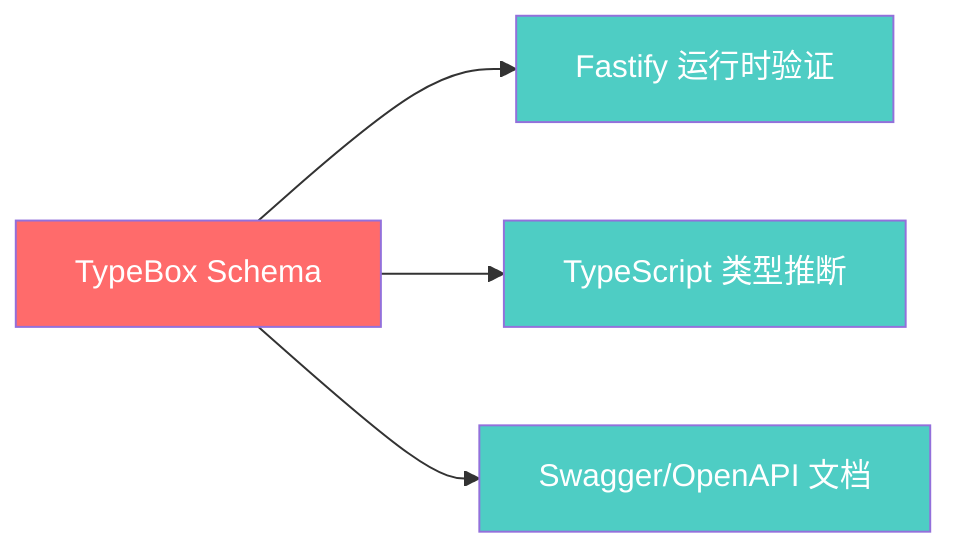

# Node.js 深度实战（八）—— Fastify + TypeScript 构建现代 REST API

Express 为什么在 2026 年已经是"遗留框架"？Fastify 的性能秘密是什么？

---

## 1. 为什么选 Fastify

2026 年 Node.js 后端框架性能榜（requests/second，4 核 CPU）：

| 框架 | 请求/秒 | 特点 |
|------|---------|------|
| **Fastify 5** | ~72,000 | Schema 驱动，插件体系，TypeScript 原生 |
| **Hono** | ~68,000 | 超轻量，跨平台（Edge/Bun/Node.js） |
| **Elysia（Bun）** | ~120,000+ | 基于 Bun 运行时，极速 |
| **Express 5** | ~22,000 | 生态最大，但性能最低 |
| **NestJS（Express）** | ~18,000 | 企业级架构，性能受限于 Express |
| **NestJS（Fastify）** | ~60,000 | NestJS 换底层为 Fastify |

**Fastify 快在哪里？**

1. **JSON 序列化**：内置 `fast-json-stringify`，提前通过 JSON Schema 编译出最高效的序列化代码，比原生 `JSON.stringify` 快 2-3 倍。
2. **Schema 预验证**：基于 `ajv` 引擎的 JSON Schema 预编译路由入参验证，运行时避免了逐个字段判断的开销。
3. **路由匹配算法（核心差异所在）**：
   - Express 底层使用**正则表达式**（通过 `path-to-regexp` 包）逐个遍历路由表。当你有 1000 个 API 接口时，每次请求都需要按定义顺序从头往下匹配，性能会随着项目规模扩大而**线性变差**。
   - Fastify 内置了自定义的路由引擎 `find-my-way`，它使用的是 **Radix Tree（基数树/压缩字典树）** 算法。无论你注册了 10 个还是 10,000 个路由，匹配的时间复杂度仅取决于你请求 URL 的长度（接近 $O(k)$）。庞大的企业级应用在 Fastify 下依然能保持常数级的极速响应。

## 2. 项目初始化

```bash
mkdir fastify-api && cd fastify-api
npm init -y
npm install fastify @fastify/type-provider-typebox
npm install -D typescript @types/node tsx
npx tsc --init
```

`tsconfig.json` 关键配置：

```json
{
  "compilerOptions": {
    "target": "ES2022",
    "module": "NodeNext",
    "moduleResolution": "NodeNext",
    "outDir": "./dist",
    "rootDir": "./src",
    "strict": true,
    "skipLibCheck": true
  }
}
```

`package.json` 脚本：

```json
{
  "type": "module",
  "scripts": {
    "dev": "tsx watch src/index.ts",
    "build": "tsc",
    "start": "node dist/index.js"
  }
}
```

## 3. Schema 驱动开发：类型安全 + 高性能

Fastify 的核心理念是 **通过 JSON Schema 驱动 API 开发**。结合 TypeBox，可以同时获得：
- ✅ 运行时请求验证（schema 编译，零开销）
- ✅ 自动生成 Swagger 文档
- ✅ TypeScript 类型推断

```typescript
// src/schemas/user.ts
import { Type, Static } from '@sinclair/typebox';

// 定义 Schema（同时作为运行时验证和 TypeScript 类型）
export const UserSchema = Type.Object({
  id: Type.Number(),
  name: Type.String({ minLength: 1, maxLength: 100 }),
  email: Type.String({ format: 'email' }),
  role: Type.Union([Type.Literal('admin'), Type.Literal('user')]),
  createdAt: Type.String({ format: 'date-time' }),
});

export const CreateUserSchema = Type.Omit(UserSchema, ['id', 'createdAt']);
export const UpdateUserSchema = Type.Partial(CreateUserSchema);

// 从 Schema 推断 TypeScript 类型（无需手动声明！）
export type User = Static<typeof UserSchema>;
export type CreateUser = Static<typeof CreateUserSchema>;
```

## 4. 插件体系：模块化架构

Fastify 的一切都是插件，包括路由：

```
src/
├── index.ts           # 入口，创建 app
├── plugins/
│   ├── database.ts    # 数据库插件
│   ├── auth.ts        # 认证插件
│   └── rate-limit.ts  # 限流插件
├── routes/
│   ├── users.ts       # 用户路由
│   └── products.ts    # 商品路由
└── schemas/
    └── user.ts        # Schema 定义
```

```typescript
// src/index.ts
import Fastify from 'fastify';
import { TypeBoxTypeProvider } from '@fastify/type-provider-typebox';

export const buildApp = async () => {
  const app = Fastify({
    logger: {
      level: process.env.NODE_ENV === 'production' ? 'info' : 'debug',
      transport: process.env.NODE_ENV !== 'production'
        ? { target: 'pino-pretty' }  // 开发环境美化日志
        : undefined,
    },
  }).withTypeProvider<TypeBoxTypeProvider>();

  // 注册插件（按顺序，有依赖关系）
  await app.register(import('./plugins/database.js'));
  await app.register(import('./plugins/auth.js'));

  // 注册路由（带前缀）
  await app.register(import('./routes/users.js'), { prefix: '/api/v1/users' });
  await app.register(import('./routes/products.js'), { prefix: '/api/v1/products' });

  return app;
};

// 启动服务
const app = await buildApp();
try {
  await app.listen({ port: 3000, host: '0.0.0.0' });
} catch (err) {
  app.log.error(err);
  process.exit(1);
}
```

## 5. 完整路由实现

```typescript
// src/routes/users.ts
import { FastifyPluginAsyncTypebox } from '@fastify/type-provider-typebox';
import { Type } from '@sinclair/typebox';
import { UserSchema, CreateUserSchema, UpdateUserSchema } from '../schemas/user.js';

const plugin: FastifyPluginAsyncTypebox = async (app) => {
  // GET /api/v1/users — 获取用户列表
  app.get('/', {
    schema: {
      tags: ['Users'],
      summary: '获取用户列表',
      querystring: Type.Object({
        page: Type.Optional(Type.Number({ minimum: 1, default: 1 })),
        limit: Type.Optional(Type.Number({ minimum: 1, maximum: 100, default: 20 })),
      }),
      response: {
        200: Type.Object({
          data: Type.Array(UserSchema),
          total: Type.Number(),
          page: Type.Number(),
        }),
      },
    },
    // preHandler: [app.authenticate],  // 可选：添加认证守卫
  }, async (request, reply) => {
    const { page = 1, limit = 20 } = request.query;
    // request.query 已经过验证，类型完全安全
    const users = await app.db.user.findMany({
      skip: (page - 1) * limit,
      take: limit,
    });
    return { data: users, total: users.length, page };
  });

  // POST /api/v1/users — 创建用户
  app.post('/', {
    schema: {
      tags: ['Users'],
      body: CreateUserSchema,
      response: { 201: UserSchema },
    },
  }, async (request, reply) => {
    const user = await app.db.user.create({ data: request.body });
    return reply.code(201).send(user);
  });

  // PATCH /api/v1/users/:id — 更新用户
  app.patch('/:id', {
    schema: {
      tags: ['Users'],
      params: Type.Object({ id: Type.Number() }),
      body: UpdateUserSchema,
      response: { 200: UserSchema },
    },
  }, async (request, reply) => {
    const { id } = request.params;
    const updated = await app.db.user.update({
      where: { id },
      data: request.body,
    });
    return updated;
  });

  // DELETE /api/v1/users/:id
  app.delete('/:id', {
    schema: {
      params: Type.Object({ id: Type.Number() }),
      response: { 204: Type.Null() },
    },
  }, async (request, reply) => {
    await app.db.user.delete({ where: { id: request.params.id } });
    return reply.code(204).send();
  });
};

export default plugin;
```

## 6. 认证插件：JWT

```bash
npm install @fastify/jwt
```

```typescript
// src/plugins/auth.ts
import fp from 'fastify-plugin';
import jwt from '@fastify/jwt';
import { FastifyRequest, FastifyReply } from 'fastify';

export default fp(async (app) => {
  await app.register(jwt, {
    secret: process.env.JWT_SECRET!,
    sign: {
      // 教学示例用 7d 便于调试。
      // 生产环境建议：Access Token 15m + Refresh Token 机制（见第 10 章安全加固）
      expiresIn: '7d',
    },
  });

  // 将 authenticate 方法添加到所有路由可用
  app.decorate('authenticate', async (request: FastifyRequest, reply: FastifyReply) => {
    try {
      await request.jwtVerify();
    } catch (err) {
      reply.code(401).send({ error: 'Unauthorized' });
    }
  });
});

// 类型扩展（让 TypeScript 知道 app.authenticate 存在）
declare module 'fastify' {
  interface FastifyInstance {
    authenticate: (request: FastifyRequest, reply: FastifyReply) => Promise<void>;
  }
}
```

```typescript
// 登录路由
app.post('/auth/login', {
  schema: {
    body: Type.Object({
      email: Type.String({ format: 'email' }),
      password: Type.String(),
    }),
  }
}, async (request, reply) => {
  const { email, password } = request.body;
  const user = await validateUser(email, password);  // 自行实现

  if (!user) {
    return reply.code(401).send({ error: '邮箱或密码错误' });
  }

  const token = app.jwt.sign({ userId: user.id, role: user.role });
  return { token, user };
});
```

## 7. 错误处理：统一错误响应

```typescript
// src/plugins/error-handler.ts
import fp from 'fastify-plugin';

export default fp(async (app) => {
  app.setErrorHandler((error, request, reply) => {
    const statusCode = error.statusCode ?? 500;

    // 记录 5xx 错误
    if (statusCode >= 500) {
      request.log.error({ err: error }, '服务器内部错误');
    }

    // Fastify 验证错误（Schema 不匹配）
    if (error.validation) {
      return reply.code(400).send({
        error: 'Validation Error',
        message: '请求参数不合法',
        details: error.validation,
      });
    }

    return reply.code(statusCode).send({
      error: error.name ?? 'InternalServerError',
      message: statusCode < 500 ? error.message : '服务器内部错误',
    });
  });
});
```

## 8. 请求生命周期



## 9. Swagger/OpenAPI 文档自动生成

在 Schema 驱动开发下，API 文档几乎是零成本的——Fastify 的 Schema 直接就是 OpenAPI 规范的一个子集。

```bash
npm install @fastify/swagger @fastify/swagger-ui
```

```typescript
// src/plugins/swagger.ts
import fp from 'fastify-plugin';
import swagger from '@fastify/swagger';
import swaggerUI from '@fastify/swagger-ui';

export default fp(async (app) => {
  await app.register(swagger, {
    openapi: {
      openapi: '3.0.0',
      info: {
        title: 'My API',
        description: '基于 Fastify + TypeBox 的类型安全 API',
        version: '1.0.0',
      },
      components: {
        securitySchemes: {
          BearerAuth: {
            type: 'http',
            scheme: 'bearer',
            bearerFormat: 'JWT',
          },
        },
      },
    },
  });

  // 仅在非生产环境暴露 Swagger UI
  if (process.env.NODE_ENV !== 'production') {
    await app.register(swaggerUI, {
      routePrefix: '/docs',   // 访问 http://localhost:3000/docs
      uiConfig: { docExpansion: 'list' },
    });
  }
});
```

路由中加上认证声明，Swagger UI 中就会出现 🔒 锁的图标：

```typescript
app.get('/profile', {
  schema: {
    tags: ['Users'],
    summary: '获取当前用户信息',
    security: [{ BearerAuth: [] }],  // 标注此接口需要 JWT
    response: { 200: UserSchema },
  },
  preHandler: [app.authenticate],
}, async (request) => {
  return request.user;  // JWT payload
});
```

效果：访问 `http://localhost:3000/docs` 即可看到完整的交互式 API 文档，所有接口的参数、响应、认证要求一目了然，前后端联调再也不需要手写文档。



一份 Schema，三份收益。

## 总结

- Fastify 的性能优势来自 `fast-json-stringify` 和编译时 Schema 验证
- TypeBox 让 Schema 同时成为运行时验证和 TypeScript 类型，一处定义，两处受益
- `@fastify/swagger` 让 API 文档自动生成，无需额外维护文档
- 插件体系保证了封装性：每个插件的作用域独立，`fastify-plugin` 打破封装共享给父作用域
- 所有功能（认证、限流、错误处理、文档）都是插件，可按需组合

---

下一章探讨 **Prisma ORM 实战**，TypeScript 类型安全的数据库操作方式。
