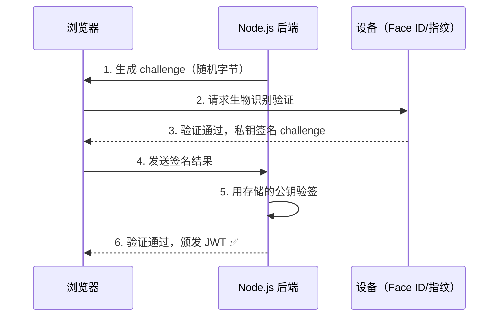

# Node.js 深度实战（十）—— 安全加固指南

Node.js 应用每年因为安全漏洞导致大量数据泄露。这份指南覆盖 OWASP Top 10 在 Node.js 中的具体防御手段。

---

## 1. 注入攻击（SQL Injection）

使用 Prisma/Drizzle 等类型安全 ORM 天然防注入，但以下场景仍需注意：

```typescript
// ❌ 危险：拼接原始 SQL
const userId = req.params.id;  // 如果 id = "1; DROP TABLE users;--"
await prisma.$queryRaw(`SELECT * FROM users WHERE id = ${userId}`);

// ✅ 安全：使用内置参数化查询
await prisma.$queryRaw`SELECT * FROM users WHERE id = ${parseInt(userId)}`;
// 或者使用 Prisma.sql 模板标签
import { Prisma } from '@prisma/client';
await prisma.$queryRaw(Prisma.sql`SELECT * FROM users WHERE id = ${userId}`);
```

## 2. XSS（跨站脚本攻击）

Node.js API 通常返回 JSON，XSS 更多是前端问题。但 SSR 场景需要注意：

```bash
npm install xss
```

```typescript
import xss from 'xss';

// 对用户输入的富文本内容进行 XSS 过滤
const safeHtml = xss(userInputHtml, {
  whiteList: {
    a: ['href', 'title'],
    b: [],
    code: [],
    p: [],
  },
});

// 响应头：防止浏览器 MIME 嗅探
reply.header('X-Content-Type-Options', 'nosniff');
reply.header('X-Frame-Options', 'DENY');
reply.header('Content-Security-Policy', "default-src 'self'");
```

## 3. CSRF（跨站请求伪造）

```bash
npm install @fastify/csrf-protection @fastify/cookie
```

```typescript
import csrf from '@fastify/csrf-protection';
import cookie from '@fastify/cookie';

await app.register(cookie, { secret: process.env.COOKIE_SECRET });
await app.register(csrf, { sessionPlugin: '@fastify/cookie' });

// 需要 CSRF token 的路由
app.post('/transfer', {
  preHandler: app.csrfProtection  // 验证 CSRF token
}, async (request, reply) => {
  // ...
});
```

## 4. 速率限制（Rate Limiting）

```bash
npm install @fastify/rate-limit
```

```typescript
import rateLimit from '@fastify/rate-limit';
import Redis from 'ioredis';

const redis = new Redis(process.env.REDIS_URL);

await app.register(rateLimit, {
  global: true,           // 全局限制
  max: 100,               // 每个 IP 每分钟最多 100 次请求
  timeWindow: '1 minute',
  redis,                  // 使用 Redis 存储（支持多实例部署）
  keyGenerator: (request) => {
    // 支持代理时，从 X-Forwarded-For 获取真实 IP
    return request.headers['x-forwarded-for'] as string || request.ip;
  },
  errorResponseBuilder: (request, context) => ({
    code: 429,
    error: 'Too Many Requests',
    message: `请求过于频繁，请 ${context.ttl / 1000} 秒后重试`,
    retryAfter: context.ttl,
  }),
});

// 敏感接口更严格的限制
app.post('/auth/login', {
  config: {
    rateLimit: {
      max: 5,      // 每分钟最多 5 次登录尝试
      timeWindow: '1 minute',
    }
  }
}, loginHandler);
```

## 5. JWT 安全实践

```typescript
// ❌ 危险：JWT Secret 太弱、不设置过期时间
app.register(jwt, { secret: '123456' });

// ✅ 安全配置
import { randomBytes } from 'node:crypto';

app.register(jwt, {
  secret: {
    // 使用非对称加密（RS256），公钥可安全共享
    private: await readFile('./keys/private.key'),
    public: await readFile('./keys/public.key'),
  },
  sign: {
    algorithm: 'RS256',
    expiresIn: '15m',  // Access Token 只有 15 分钟有效期
  },
});

// 使用 Refresh Token 机制
app.post('/auth/refresh', async (request, reply) => {
  const { refreshToken } = request.body;

  // Refresh Token 存储在数据库中，可以主动吊销
  const stored = await redis.get(`refresh:${refreshToken}`);
  if (!stored) {
    return reply.code(401).send({ error: '无效的 Refresh Token' });
  }

  const userId = JSON.parse(stored).userId;
  const newAccessToken = app.jwt.sign({ userId });
  return { accessToken: newAccessToken };
});
```

## 6. Passkey（WebAuthn）：无密码认证

Passkey 是 2026 年主流的无密码认证方案，基于 WebAuthn/FIDO2 标准，用设备生物识别（Face ID、指纹）替代密码：

```bash
npm install @simplewebauthn/server @simplewebauthn/browser
```

```typescript
import {
  generateRegistrationOptions,
  verifyRegistrationResponse,
  generateAuthenticationOptions,
  verifyAuthenticationResponse,
} from '@simplewebauthn/server';

const RP_NAME = 'My App';
const RP_ID = 'localhost';  // 生产环境改为域名

// ── 注册流程 ────────────────────────────────────────────────
// 步骤 1：后端生成注册挑战（challenge）
app.get('/auth/passkey/register/challenge', async (request, reply) => {
  const user = request.user;  // 已登录用户

  const options = await generateRegistrationOptions({
    rpName: RP_NAME,
    rpID: RP_ID,
    userID: Buffer.from(user.id.toString()),
    userName: user.email,
    // 排除已注册的凭证（防止重复注册）
    excludeCredentials: user.passkeys.map(pk => ({
      id: pk.credentialId,
      type: 'public-key',
    })),
  });

  // 将 challenge 存入 Session（验证时用）
  await redis.setex(`challenge:${user.id}`, 60, options.challenge);

  return options;
});

// 步骤 2：验证前端返回的注册结果
app.post('/auth/passkey/register/verify', async (request, reply) => {
  const { registrationResponse } = request.body;
  const user = request.user;
  const expectedChallenge = await redis.get(`challenge:${user.id}`);

  const verification = await verifyRegistrationResponse({
    response: registrationResponse,
    expectedChallenge: expectedChallenge!,
    expectedOrigin: 'https://example.com',
    expectedRPID: RP_ID,
  });

  if (verification.verified && verification.registrationInfo) {
    // 将凭证保存到数据库
    await app.db.passkey.create({
      data: {
        userId: user.id,
        credentialId: Buffer.from(verification.registrationInfo.credential.id),
        publicKey: Buffer.from(verification.registrationInfo.credential.publicKey),
        counter: verification.registrationInfo.credential.counter,
      },
    });
  }

  return { verified: verification.verified };
});

// ── 认证流程 ────────────────────────────────────────────────
// 步骤 3：生成认证挑战
app.get('/auth/passkey/login/challenge', async (request, reply) => {
  const { email } = request.query;
  const user = await app.db.user.findUnique({
    where: { email },
    include: { passkeys: true },
  });

  if (!user?.passkeys.length) {
    return reply.code(400).send({ error: '该用户未注册 Passkey' });
  }

  const options = await generateAuthenticationOptions({
    rpID: RP_ID,
    allowCredentials: user.passkeys.map(pk => ({
      id: pk.credentialId,
      type: 'public-key',
    })),
  });

  await redis.setex(`auth-challenge:${email}`, 60, options.challenge);
  return options;
});

// 步骤 4：验证认证结果，返回 JWT
app.post('/auth/passkey/login/verify', async (request, reply) => {
  const { email, authResponse } = request.body;
  const expectedChallenge = await redis.get(`auth-challenge:${email}`);

  const user = await app.db.user.findUnique({
    where: { email }, include: { passkeys: true },
  });

  const passkey = user!.passkeys.find(
    pk => pk.credentialId.equals(Buffer.from(authResponse.id, 'base64url'))
  );

  const verification = await verifyAuthenticationResponse({
    response: authResponse,
    expectedChallenge: expectedChallenge!,
    expectedOrigin: 'https://example.com',
    expectedRPID: RP_ID,
    credential: {
      id: passkey!.credentialId,
      publicKey: passkey!.publicKey,
      counter: passkey!.counter,
    },
  });

  if (verification.verified) {
    // 更新 counter（防重放攻击）
    await app.db.passkey.update({
      where: { id: passkey!.id },
      data: { counter: verification.authenticationInfo.newCounter },
    });

    const token = app.jwt.sign({ userId: user!.id });
    return { token };
  }

  return reply.code(401).send({ error: '认证失败' });
});
```



> **Passkey 的优势：** 私钥从不离开用户设备，服务端只存公钥。即使数据库泄漏，攻击者也无法登录（没有私钥）。

## 7. 安全响应头（Helmet）

```bash
npm install @fastify/helmet
```

```typescript
import helmet from '@fastify/helmet';

await app.register(helmet, {
  contentSecurityPolicy: {
    directives: {
      defaultSrc: ["'self'"],
      styleSrc: ["'self'", "'unsafe-inline'"],
      scriptSrc: ["'self'"],
      imgSrc: ["'self'", 'data:', 'https:'],
    },
  },
  hsts: {
    maxAge: 31536000,  // 1 年 HSTS
    includeSubDomains: true,
    preload: true,
  },
});
```

## 7. 依赖安全管理

```bash
# 检测依赖漏洞
npm audit

# 自动修复（不含 breaking change）
npm audit fix

# 查看所有过时依赖
npm outdated

# 使用 Socket.dev CLI（比 npm audit 更全面）
npx socket@latest scan

# Snyk：更强大的依赖安全扫描
npx snyk test
```

**GitHub Actions 自动检测：**

```yaml
# .github/workflows/security.yml
name: Security Audit
on: [push, pull_request]
jobs:
  audit:
    runs-on: ubuntu-latest
    steps:
      - uses: actions/checkout@v4
      - uses: actions/setup-node@v4
        with: { node-version: '22' }
      - run: npm ci
      - run: npm audit --audit-level=high  # 有 high 以上漏洞则 CI 失败
```

## 8. 敏感数据保护

```typescript
import bcrypt from 'bcrypt';
import { createCipheriv, createDecipheriv, randomBytes } from 'node:crypto';

// ✅ 密码哈希（不可逆）
async function hashPassword(password: string): Promise<string> {
  const saltRounds = 12;  // 成本因子，越高越慢（越安全）
  return bcrypt.hash(password, saltRounds);
}

async function verifyPassword(password: string, hash: string): Promise<boolean> {
  return bcrypt.compare(password, hash);
}

// ✅ 敏感字段加密（可逆，用于存储需要还原的数据如手机号）
function encrypt(text: string): string {
  const iv = randomBytes(16);
  const cipher = createCipheriv('aes-256-gcm', Buffer.from(process.env.ENCRYPTION_KEY!, 'hex'), iv);
  const encrypted = Buffer.concat([cipher.update(text), cipher.final()]);
  const tag = cipher.getAuthTag();
  return [iv.toString('hex'), encrypted.toString('hex'), tag.toString('hex')].join(':');
}
```

## 安全检查清单

- [ ] 所有用户输入通过 JSON Schema 验证（Fastify 已内置）
- [ ] 使用 ORM 参数化查询，杜绝 SQL 注入
- [ ] 生产环境 JWT 使用 RS256 非对称加密
- [ ] 配置速率限制，敏感接口更严格
- [ ] 部署 Helmet，设置安全响应头
- [ ] 密码使用 bcrypt 哈希存储（saltRounds ≥ 12）
- [ ] 加密密钥通过环境变量传入，不写入代码仓库
- [ ] CI 自动运行 `npm audit`
- [ ] 定期更新依赖（每月一次）

---

下一章探讨 **性能优化与可观测性**，用火焰图找出真正的性能瓶颈。
