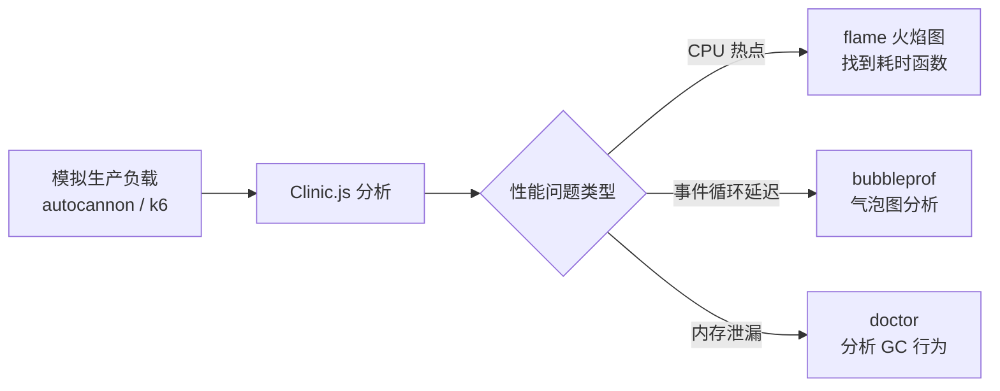

# Node.js 深度实战（十一）—— 性能优化与可观测性

性能问题靠猜是没有出路的。火焰图显示真相，OpenTelemetry 让问题无处遁形。

---

## 1. 性能剖析：找到真正的瓶颈

### 使用 --prof 和火焰图

```bash
# 运行时开启 V8 分析
node --prof app.js

# 在生产流量负载下运行压测工具
autocannon -c 100 -d 30 http://localhost:3000/api/users

# 处理分析数据
node --prof-process isolate-*.log > profile.txt

# 或生成 SVG 火焰图（使用 0x）
npx 0x -o app.js
```

### 使用 Clinic.js

```bash
# 综合健康诊断
npx clinic doctor -- node app.js

# 火焰图（CPU 分析）
npx clinic flame -- node app.js

# 气泡图（事件循环延迟分析）
npx clinic bubbleprof -- node app.js
```



## 2. 内存泄漏排查

```javascript
// ❌ 常见内存泄漏场景 1：事件监听器未移除
class DataProcessor extends EventEmitter {
  start() {
    setInterval(() => {
      this.emit('data', someData);
    }, 100);
    // 忘记清理 interval → 内存泄漏
  }
}

// ✅ 正确做法
class DataProcessor extends EventEmitter {
  #interval = null;

  start() {
    this.#interval = setInterval(() => this.emit('data', someData), 100);
  }

  stop() {
    clearInterval(this.#interval);
    this.removeAllListeners();  // 清理所有监听器
  }
}
```

```typescript
// 监控内存使用，检测泄漏
import { monitorEventLoopDelay } from 'node:perf_hooks';
import v8 from 'node:v8';

// 定期输出内存指标
setInterval(() => {
  const heap = v8.getHeapStatistics();
  const mem = process.memoryUsage();

  console.log({
    heapUsed: `${(mem.heapUsed / 1024 / 1024).toFixed(1)} MB`,
    heapTotal: `${(mem.heapTotal / 1024 / 1024).toFixed(1)} MB`,
    external: `${(mem.external / 1024 / 1024).toFixed(1)} MB`,
    rss: `${(mem.rss / 1024 / 1024).toFixed(1)} MB`,
    externalMemory: `${(heap.external_memory_size / 1024).toFixed(0)} KB`,  // V8 堆外内存（Buffer 等）
  });
}, 10_000);
```

## 3. OpenTelemetry：分布式链路追踪

```bash
npm install @opentelemetry/api @opentelemetry/sdk-node \
  @opentelemetry/auto-instrumentations-node \
  @opentelemetry/exporter-trace-otlp-http
```

```typescript
// instrumentation.ts（必须在 app 入口之前加载）
import { NodeSDK } from '@opentelemetry/sdk-node';
import { OTLPTraceExporter } from '@opentelemetry/exporter-trace-otlp-http';
import { getNodeAutoInstrumentations } from '@opentelemetry/auto-instrumentations-node';

const sdk = new NodeSDK({
  serviceName: 'user-service',
  traceExporter: new OTLPTraceExporter({
    url: 'http://otel-collector:4318/v1/traces',
  }),
  instrumentations: [
    getNodeAutoInstrumentations({
      // 自动追踪 HTTP、数据库、Redis 等调用
      '@opentelemetry/instrumentation-http': { enabled: true },
      '@opentelemetry/instrumentation-pg': { enabled: true },
      '@opentelemetry/instrumentation-ioredis': { enabled: true },
    }),
  ],
});

await sdk.start();
process.on('SIGTERM', () => sdk.shutdown());
```

```bash
# ESM 项目（"type": "module"）使用 --import
node --import ./instrumentation.js app.js

# CJS 项目使用 --require / -r
# node -r ./instrumentation.js app.js
```

## 4. 自定义 Span（业务链路追踪）

```typescript
import { trace, context, SpanStatusCode } from '@opentelemetry/api';

const tracer = trace.getTracer('user-service', '1.0.0');

async function processOrder(orderId: number) {
  // 创建自定义 Span
  return tracer.startActiveSpan('processOrder', async (span) => {
    span.setAttributes({
      'order.id': orderId,
      'service.name': 'order-service',
    });

    try {
      const order = await fetchOrder(orderId);
      const payment = await chargePayment(order);

      span.addEvent('payment.completed', {
        'payment.id': payment.id,
        'payment.amount': payment.amount,
      });

      span.setStatus({ code: SpanStatusCode.OK });
      return { order, payment };
    } catch (error) {
      span.setStatus({
        code: SpanStatusCode.ERROR,
        message: (error as Error).message,
      });
      span.recordException(error as Error);
      throw error;
    } finally {
      span.end();
    }
  });
}
```

## 5. 内置性能钩子

```typescript
import { PerformanceObserver, performance } from 'node:perf_hooks';

// 监控所有 DNS 查询耗时
const obs = new PerformanceObserver((list) => {
  for (const entry of list.getEntries()) {
    if (entry.duration > 100) {
      console.warn(`慢 DNS 查询: ${entry.name} 耗时 ${entry.duration.toFixed(2)}ms`);
    }
  }
});
obs.observe({ type: 'dns', buffered: true });

// 手动测量代码块性能
performance.mark('db-query-start');
const users = await prisma.user.findMany();
performance.mark('db-query-end');
performance.measure('数据库查询', 'db-query-start', 'db-query-end');

const [measure] = performance.getEntriesByName('数据库查询');
console.log(`查询耗时: ${measure.duration.toFixed(2)}ms`);
```

## 6. 监控指标暴露（Prometheus）

```bash
npm install prom-client
```

```typescript
import client from 'prom-client';

// 开启默认系统指标（CPU、内存、GC 等）
client.collectDefaultMetrics({ prefix: 'node_' });

// 自定义业务指标
const httpRequestDuration = new client.Histogram({
  name: 'http_request_duration_seconds',
  help: 'HTTP 请求耗时分布',
  labelNames: ['method', 'route', 'status_code'],
  buckets: [0.001, 0.01, 0.1, 0.5, 1, 5],
});

// Fastify 钩子，自动记录所有请求耗时
app.addHook('onResponse', (request, reply, done) => {
  httpRequestDuration.observe(
    { method: request.method, route: request.routeOptions.url, status_code: reply.statusCode },
    reply.elapsedTime / 1000
  );
  done();
});

// 暴露 Prometheus 指标端点
app.get('/metrics', async (request, reply) => {
  reply.header('Content-Type', client.register.contentType);
  return client.register.metrics();
});
```

## 总结

- 性能优化必须先度量，用 Clinic.js / 0x 找到真正的 CPU 热点
- 内存泄漏常见原因：未清理的定时器、事件监听器、全局缓存无上限增长
- OpenTelemetry 是可观测性标准，一次接入，多种后端（Jaeger/Grafana Tempo）
- Prometheus + Grafana 是 Node.js 服务监控的黄金搭档

---

下一章探讨 **测试策略与工程化**，用 Vitest 建立可靠的测试套件。
