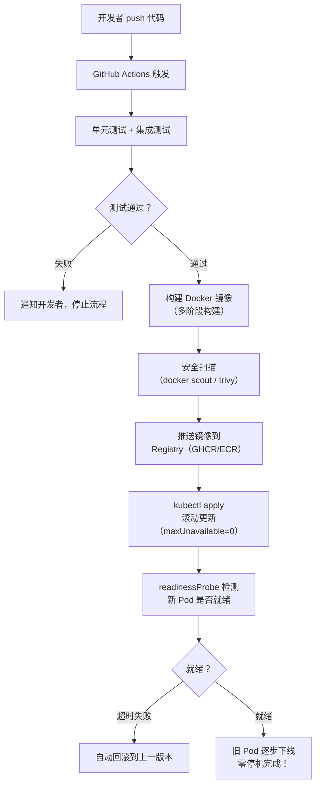

# Node.js 深度实战（十三）—— 容器化与云原生部署

把 Node.js 服务打包进 Docker、部署到 Kubernetes，实现零停机上线。

---

## 1. Dockerfile 最佳实践：多阶段构建

```dockerfile
# Dockerfile

# ─── 阶段一：依赖安装 ───────────────────────────────────────────
FROM node:24-alpine AS deps
WORKDIR /app

# 先只复制 package 文件（利用 Docker 缓存层）
COPY package*.json ./
COPY prisma ./prisma/

# 安装生产依赖（跳过 devDependencies）
RUN npm ci --only=production
# 生成 Prisma Client
RUN npx prisma generate

# ─── 阶段二：TypeScript 编译 ────────────────────────────────────
FROM node:24-alpine AS builder
WORKDIR /app

COPY package*.json ./
RUN npm ci  # 安装所有依赖（含 devDeps，用于编译）
COPY . .
RUN npm run build  # tsc 编译

# ─── 阶段三：最终运行镜像 ───────────────────────────────────────
FROM node:24-alpine AS runner
WORKDIR /app

# 创建非 root 用户（安全最佳实践）
RUN addgroup --system --gid 1001 nodejs
RUN adduser --system --uid 1001 nodeapp

# 只复制运行时所需文件
COPY --from=deps --chown=nodeapp:nodejs /app/node_modules ./node_modules
COPY --from=builder --chown=nodeapp:nodejs /app/dist ./dist
COPY --from=builder --chown=nodeapp:nodejs /app/prisma ./prisma
COPY --chown=nodeapp:nodejs package.json ./

USER nodeapp

EXPOSE 3000

# 健康检查
HEALTHCHECK --interval=30s --timeout=3s --start-period=5s --retries=3 \
  CMD wget -qO- http://localhost:3000/health || exit 1

CMD ["node", "dist/index.js"]
```

### 镜像大小对比

| 基础镜像 | 构建方式 | 最终大小 |
|---------|---------|---------|
| `node:24` | 单阶段 | ~980 MB |
| `node:24-slim` | 单阶段 | ~260 MB |
| `node:24-alpine` | 多阶段 | **~88 MB** ✅ |

```bash
# 构建镜像
docker build -t myapp:latest .

# 扫描安全漏洞
docker scout quickview myapp:latest

# 本地运行
docker run -p 3000:3000 \
  -e DATABASE_URL="postgresql://..." \
  -e JWT_SECRET="..." \
  myapp:latest
```

## 2. docker-compose：本地开发环境

```yaml
# docker-compose.yml（开发环境）
version: '3.9'
services:
  app:
    build:
      context: .
      target: deps  # 使用 deps 阶段镜像，保留 source map
    volumes:
      - ./src:/app/src  # 挂载源码，配合 --watch 热重载
    command: node --watch dist/index.js
    environment:
      DATABASE_URL: postgresql://postgres:postgres@db:5432/myapp
      REDIS_URL: redis://redis:6379
    ports:
      - "3000:3000"
    depends_on:
      db:
        condition: service_healthy
      redis:
        condition: service_started

  db:
    image: postgres:16-alpine
    environment:
      POSTGRES_DB: myapp
      POSTGRES_PASSWORD: postgres
    volumes:
      - pgdata:/var/lib/postgresql/data
    healthcheck:
      test: ['CMD-SHELL', 'pg_isready -U postgres']
      interval: 5s
      timeout: 5s

  redis:
    image: redis:7-alpine
    volumes:
      - redisdata:/data

volumes:
  pgdata:
  redisdata:
```

```bash
# 一键启动所有服务
docker compose up -d

# 查看日志
docker compose logs -f app

# 执行数据库迁移
docker compose exec app npx prisma migrate dev
```

## 3. Kubernetes 部署

### Deployment（应用部署）

```yaml
# k8s/deployment.yaml
apiVersion: apps/v1
kind: Deployment
metadata:
  name: myapp
  namespace: production
spec:
  replicas: 3
  selector:
    matchLabels:
      app: myapp
  strategy:
    type: RollingUpdate
    rollingUpdate:
      maxSurge: 1        # 最多多出 1 个 Pod
      maxUnavailable: 0  # 滚动更新期间始终保持 replicas 个正常 Pod（零停机）
  template:
    metadata:
      labels:
        app: myapp
    spec:
      containers:
        - name: myapp
          image: myregistry/myapp:v1.2.3
          ports:
            - containerPort: 3000
          env:
            - name: DATABASE_URL
              valueFrom:
                secretKeyRef:
                  name: myapp-secrets
                  key: database-url
            - name: JWT_SECRET
              valueFrom:
                secretKeyRef:
                  name: myapp-secrets
                  key: jwt-secret

          # 资源限制（防止 OOM 影响其他 Pod）
          resources:
            requests:
              memory: "128Mi"
              cpu: "100m"
            limits:
              memory: "512Mi"
              cpu: "500m"

          # 就绪探针：Pod 还没准备好时，不接收流量
          readinessProbe:
            httpGet:
              path: /health
              port: 3000
            initialDelaySeconds: 5
            periodSeconds: 10
            failureThreshold: 3

          # 存活探针：Pod 彻底挂掉时，自动重启
          livenessProbe:
            httpGet:
              path: /health
              port: 3000
            initialDelaySeconds: 30
            periodSeconds: 15
            failureThreshold: 5
```

### 健康检查端点

```typescript
// src/routes/health.ts
app.get('/health', {
  schema: {
    response: {
      200: Type.Object({
        status: Type.Literal('ok'),
        uptime: Type.Number(),
        timestamp: Type.String(),
      }),
    },
  },
  // 不记录日志（避免日志噪音）
  logLevel: 'silent',
}, async () => ({
  status: 'ok' as const,
  uptime: process.uptime(),
  timestamp: new Date().toISOString(),
}));

// 深度健康检查（检查数据库连接）
app.get('/health/deep', async (request, reply) => {
  try {
    await app.db.$queryRaw`SELECT 1`;
    return { status: 'ok', db: 'connected' };
  } catch (err) {
    return reply.code(503).send({ status: 'error', db: 'disconnected' });
  }
});
```

## 4. Serverless：Cloudflare Workers

Node.js 应用也可以部署到边缘网络：

```typescript
// worker.ts（Cloudflare Workers）
import { Hono } from 'hono';  // Hono 框架，原生支持 CF Workers

const app = new Hono();

app.get('/api/hello', (c) => {
  return c.json({
    message: 'Hello from Edge!',
    location: c.req.header('cf-ipcountry'),  // 访客所在国家
    colo: c.req.raw.cf?.colo,               // Cloudflare 数据中心
  });
});

export default app;
```

```bash
npm install -D wrangler hono
npx wrangler deploy  # 部署到全球 300+ 边缘节点
```

## 5. 完整部署流程



## 总结

- Docker 多阶段构建：分离编译环境和运行环境，镜像体积缩小 80%
- 容器内使用非 root 用户（adduser nodeapp），降低安全风险
- Kubernetes 滚动更新 + `readinessProbe` 是实现零停机部署的关键
- Cloudflare Workers 适合边缘轻量服务，延迟极低（全球 300+ 节点）

---

**恭喜！Node.js 深度实战系列到此完结。** 从零基础到云原生部署，覆盖了 2026 年 Node.js 全栈工程师的核心技术栈。

回顾系列路径：

```
入门 → 原理（V8/libuv/事件循环）→ 核心能力（Stream/HTTP）
→ 多线程 → 框架实战（Fastify）→ 数据库（Prisma）
→ 安全/性能/测试 → 云原生部署
```
