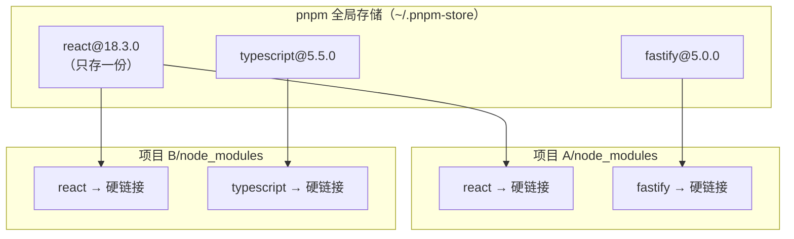
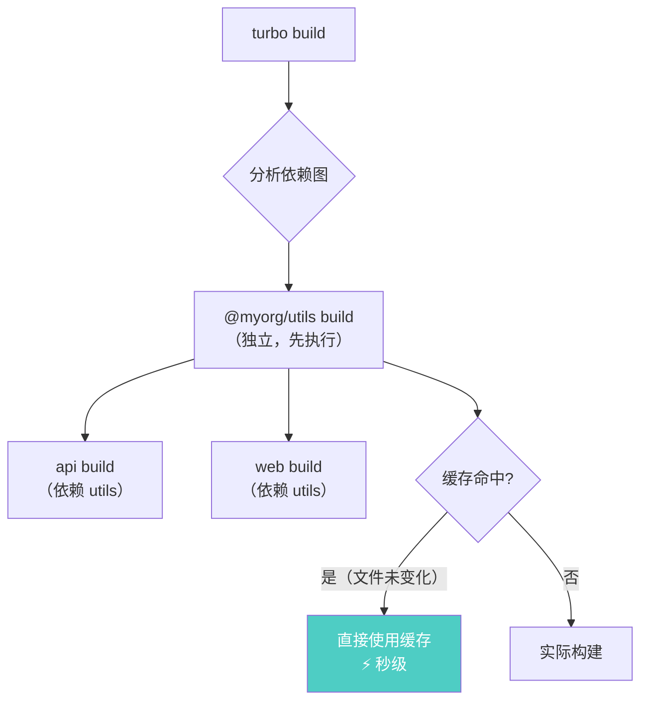

# Node.js 深度实战（十四）—— 现代包管理：pnpm、Corepack 与 Monorepo

npm 够用，但 pnpm 更快、更安全。大型项目还需要 Monorepo。这章把 2026 年的包管理体系捋清楚。

---

## 1. pnpm：为什么值得迁移

### npm 的磁盘问题

每个 Node.js 项目都有独立的 `node_modules`，同一个版本的包被复制 N 次：

```
项目 A/node_modules/react@18.3.0   → 复制一份（15MB）
项目 B/node_modules/react@18.3.0   → 再复制一份（15MB）
项目 C/node_modules/react@18.3.0   → 再复制一份（15MB）
```

10 个项目，`node_modules` 可能占用几十 GB。

### pnpm 的解决方案：全局内容寻址存储



**硬链接**（不是符号链接）意味着文件在磁盘上只有一份，多个路径指向同一块数据。

### 安装速度对比

| 场景 | npm | pnpm |
|------|-----|------|
| 首次安装（冷启动） | 基准 | 快约 50% |
| 再次安装（缓存命中）| 基准 | **快 2-3 倍** |
| CI 环境（全新缓存）| 基准 | 快约 70% |

## 2. pnpm 完整使用指南

```bash
# 推荐通过 Corepack 安装（Node.js 内置）
corepack enable
corepack prepare pnpm@latest --activate

# 验证
pnpm -v  # 10.x.x
```

### 常用命令

```bash
# 初始化项目
pnpm init

# 安装依赖
pnpm add fastify              # 生产依赖
pnpm add -D vitest            # 开发依赖
pnpm add -g pm2               # 全局安装

# 安装所有依赖（对应 npm install）
pnpm install

# 删除
pnpm remove express

# 运行脚本
pnpm dev
pnpm test

# 查看依赖树
pnpm list --depth=3

# 过时依赖检查
pnpm outdated

# 安全审计
pnpm audit
```

### pnpm 的幻影依赖防护

npm 存在"幻影依赖"问题：A 依赖 B，B 依赖 C，但代码中可以直接 `require('C')`（虽然 package.json 没声明 C）。pnpm 通过严格的隔离机制防止这种情况：

```
# npm node_modules（平铺，可访问所有包）
node_modules/
├── A/
├── B/
└── C/   ← 可以直接 require('C')，即使没声明

# pnpm node_modules（严格隔离）
node_modules/
├── .pnpm/   ← 所有包在这里，通过符号链接引用
├── A/       ← 符号链接 → .pnpm/A/node_modules/A
└── # C 不在这里！require('C') 会报 Module not found
```

## 3. Corepack：包管理器版本锁定

Corepack 是 Node.js 16.9+ 内置的工具，可以在 `package.json` 中声明包管理器版本，团队成员自动使用相同版本：

```json
{
  "name": "my-project",
  "packageManager": "pnpm@10.6.0"
}
```

```bash
# 启用 Corepack（第一次需要）
corepack enable

# 之后在此项目目录下运行 pnpm，会自动使用 9.15.0
# 即使系统安装的是其他版本
pnpm install  # ✅ 自动使用 package.json 中声明的版本
npm install   # ⚠️ 会警告：此项目需要使用 pnpm
```

**在 CI 中使用：**

```yaml
# .github/workflows/ci.yml
- uses: actions/setup-node@v4
  with:
    node-version: '24'

# Corepack 会读取 package.json 中的 packageManager 字段，自动安装正确版本
- run: corepack enable
- run: pnpm install --frozen-lockfile  # CI 中用 frozen-lockfile，防止意外更新
```

## 4. Monorepo：多包项目管理

项目规模增大时，可能需要在一个仓库中管理多个包（前端、后端、公共库等），这就是 **Monorepo**。

### pnpm Workspace：原生 Monorepo 支持

```
my-monorepo/
├── pnpm-workspace.yaml     # 声明 workspace 成员
├── package.json            # 根 package.json
├── apps/
│   ├── web/               # 前端应用
│   │   └── package.json
│   └── api/               # 后端 API
│       └── package.json
└── packages/
    ├── ui/                # 共享 UI 组件库
    │   └── package.json
    └── utils/             # 共享工具函数
        └── package.json
```

```yaml
# pnpm-workspace.yaml
packages:
  - 'apps/*'
  - 'packages/*'
```

```json
// packages/utils/package.json
{
  "name": "@myorg/utils",
  "version": "1.0.0",
  "exports": {
    ".": "./src/index.ts"
  }
}
```

```json
// apps/api/package.json
{
  "name": "api",
  "dependencies": {
    "@myorg/utils": "workspace:*"  // 引用本地包
  }
}
```

```bash
# 安装所有包的依赖
pnpm install

# 只在某个子包中运行命令
pnpm --filter api dev
pnpm --filter @myorg/utils build

# 在所有包中运行（并行）
pnpm -r run build

# 在所有包中按依赖顺序运行（串行）
pnpm -r --stream run test
```

### Turborepo：Monorepo 的构建加速

pnpm workspace 解决了依赖管理，但构建缓存需要 **Turborepo**：

```bash
npx create-turbo@latest
# 或者加入到已有 monorepo
pnpm add -D turbo -w  # -w 表示安装到根 workspace
```

```json
// turbo.json（构建编排配置）
{
  "$schema": "https://turbo.build/schema.json",
  "tasks": {
    "build": {
      "dependsOn": ["^build"],  // 先构建依赖包
      "outputs": ["dist/**"]    // 缓存这些目录
    },
    "test": {
      "dependsOn": ["build"]
    },
    "dev": {
      "cache": false,           // dev 模式不缓存
      "persistent": true
    }
  }
}
```

```bash
# 构建所有包（Turbo 自动分析依赖图，并行执行）
turbo build

# 第二次构建：没有变更的包直接读缓存（秒级完成）
turbo build  # ✅ cache hit, replaying output...

# 只构建受影响的包（Turbo 通过 git diff 分析）
turbo build --filter="...[HEAD^1]"
```



## 5. 迁移现有项目到 pnpm

```bash
# 1. 删除现有 node_modules 和 lockfile
rm -rf node_modules package-lock.json yarn.lock

# 2. 启用 Corepack + 安装 pnpm
corepack enable
corepack prepare pnpm@latest --activate

# 3. 导入现有 lockfile（可选，保持依赖版本不变）
pnpm import  # 从 package-lock.json 生成 pnpm-lock.yaml

# 4. 安装依赖
pnpm install

# 5. 在 package.json 中声明包管理器版本
# 添加 "packageManager": "pnpm@10.x.x"
```

**.npmrc 推荐配置：**

```ini
# .npmrc
shamefully-hoist=false   # 保持严格隔离（默认）
auto-install-peers=true  # 自动安装 peer dependencies
strict-peer-dependencies=false  # peer dep 版本不严格匹配时仍可安装
```

## 总结

- pnpm 通过全局内容寻址存储+硬链接解决磁盘浪费，速度比 npm 快 2-3 倍
- pnpm 的严格隔离消除"幻影依赖"，让包之间的边界更清晰
- Corepack 锁定团队的包管理器版本，避免"在我机器上好好的"问题
- pnpm Workspace 原生支持 Monorepo，Turborepo 提供构建缓存和任务编排

---

下一章探讨 **Node.js 原生 TypeScript 支持**，分析 `--strip-types` 与完整编译器的适用边界。
