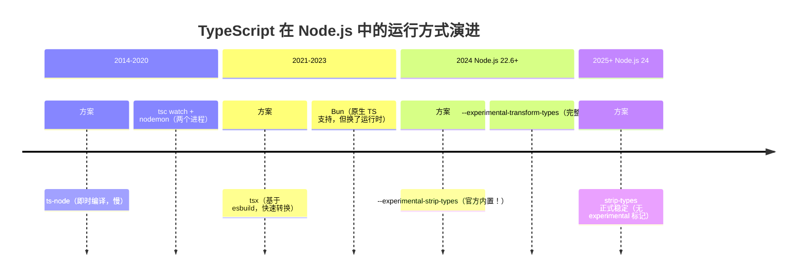
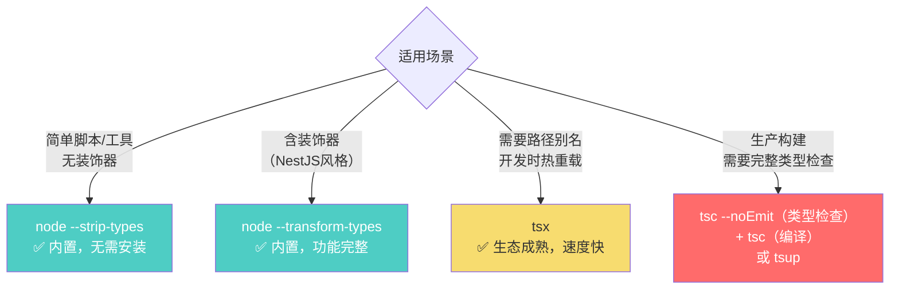
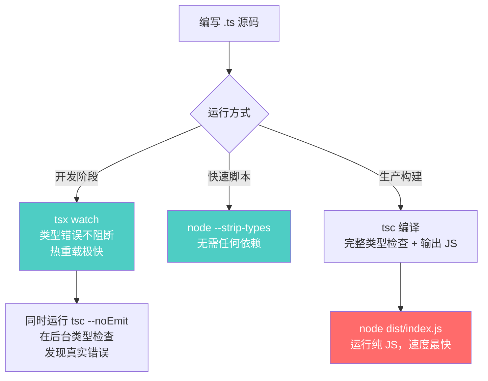

# Node.js 深度实战（十五）—— Node.js 原生 TypeScript 支持

2026 年最受关注的 Node.js 特性：不需要 tsc，不需要 ts-node，直接 `node` 运行 `.ts` 文件。

---

## 1. 背景：TypeScript 运行方式的演进



## 2. 三种方式的完整对比

| 方式 | 工具 | 速度 | 类型检查 | 装饰器 | 适用场景 |
|------|------|------|---------|--------|---------|
| **tsc 编译** | TypeScript 官方 | 慢（编译步骤） | ✅ 完整 | ✅ | 生产构建 |
| **tsx** | esbuild-based | ⚡ 极快 | ❌ 仅转换 | ✅ | 开发时热重载 |
| **ts-node** | TypeScript 内置 | 慢 | ✅ 完整（可选） | ✅ | 旧项目兼容 |
| **node --strip-types** | Node.js 内置 | ⚡ 极快 | ❌ 仅剥离类型 | ❌ | 脚本/工具/简单服务 |
| **node --transform-types** | Node.js 内置 | 快 | ❌ 仅转换 | ✅ | 含装饰器的服务 |

## 3. `--experimental-strip-types`：最简单的方式

Node.js 22.6 引入，直接剥离 TypeScript 类型注解，其余代码原样执行：

```typescript
// hello.ts
const greet = (name: string): string => {
  return `你好，${name}！`;
};

interface User {
  id: number;
  name: string;
}

const user: User = { id: 1, name: '张三' };
console.log(greet(user.name));
```

```bash
# Node.js 22.6+ 引入，Node.js 24 正式稳定（无 experimental 前缀）
node --strip-types hello.ts
# 你好，张三！
```

### 它做了什么？

"剥离类型"是一个纯粹的文本替换过程，把类型注解替换为等长的空白（保留行号以便 source map 对齐），完全不进行语义分析：

```typescript
// 原始 TypeScript
const greet = (name: string): string => {
  return `Hello, ${name}!`;
};

// 剥离后（等价 JavaScript）
const greet = (name        )         => {
  return `Hello, ${name}!`;
};
```

### 支持和不支持的特性

```typescript
// ✅ 支持：类型注解
const x: number = 1;

// ✅ 支持：泛型
function identity<T>(arg: T): T { return arg; }

// ✅ 支持：interface 和 type（剥离）
interface Foo { bar: string }
type ID = number | string;

// ✅ 支持：enum（纯 const enum）
const enum Direction { Up, Down }  // ✅

// ❌ 不支持：装饰器（需要代码转换，不只是剥离）
@Injectable()
class MyService { }

// ❌ 不支持：namespace（复杂的 TS 专有语法）
namespace MyNS { export const x = 1; }

// ❌ 不支持：非字面量 enum（需要运行时代码生成）
enum Status { Active = 'active', Inactive = 'inactive' }
```

## 4. `--transform-types`：完整转换

Node.js 22.7+ 新增，Node.js 24 正式稳定。在 `--strip-types` 基础上增加了需要代码生成的特性（装饰器、non-const enum 等）：

```typescript
// 使用装饰器（NestJS 风格）
@Controller('/users')
class UserController {
  @Get('/:id')
  async getUser(@Param('id') id: string) {
    return { id };
  }
}

// 非字面量 enum
enum HttpStatus {
  OK = 200,
  NOT_FOUND = 404,
  INTERNAL_SERVER_ERROR = 500,
}
```

```bash
# Node.js 24（正式稳定，无需 experimental 标记）
node --transform-types app.ts
```

## 5. tsconfig.json 支持（Node.js 22.10+）

Node.js 22.10+ 开始读取 `tsconfig.json` 中的配置：

```json
{
  "compilerOptions": {
    "target": "ES2022",
    "module": "NodeNext",
    "moduleResolution": "NodeNext",
    "experimentalDecorators": true,  // 影响 --transform-types 的行为
    "paths": {
      "@utils/*": ["./src/utils/*"]  // 路径别名（transform-types 支持）
    }
  }
}
```

## 6. 与 tsx 的对比：该用哪个？



### tsx 安装和使用

```bash
npm install -D tsx
```

```json
{
  "scripts": {
    "dev": "tsx watch src/index.ts",       // 热重载（类似 ts-node-dev）
    "start": "node dist/index.js",         // 生产：运行编译后的 JS
    "build": "tsc",                        // 类型检查 + 编译
    "typecheck": "tsc --noEmit"            // 只做类型检查，不输出文件
  }
}
```

## 7. 推荐的 2026 年 TypeScript 项目配置

### 小型脚本 / CLI 工具

```json
{
  "scripts": {
    "start": "node --strip-types index.ts"
  }
}
```

### 开发服务器（热重载）

```json
{
  "scripts": {
    "dev": "tsx watch src/index.ts",
    "typecheck": "tsc --noEmit --watch"
  }
}
```

### 生产 API 服务（Fastify / NestJS）

```json
{
  "scripts": {
    "dev": "tsx watch src/index.ts",
    "build": "tsc",
    "start": "node dist/index.js",
    "typecheck": "tsc --noEmit"
  }
}
```

### tsconfig.json 生产推荐配置

```json
{
  "compilerOptions": {
    "target": "ES2022",
    "lib": ["ES2022"],
    "module": "NodeNext",
    "moduleResolution": "NodeNext",
    "outDir": "./dist",
    "rootDir": "./src",

    // 严格模式（建议全开）
    "strict": true,
    "noUncheckedIndexedAccess": true,   // 数组/对象访问时包含 undefined
    "exactOptionalPropertyTypes": true,  // 可选属性不允许赋值 undefined

    // 开发体验
    "sourceMap": true,
    "declaration": true,
    "declarationMap": true,
    "skipLibCheck": true,

    // 模块互操作
    "esModuleInterop": true,
    "forceConsistentCasingInFileNames": true
  },
  "include": ["src/**/*"],
  "exclude": ["node_modules", "dist"]
}
```

## 8. 完整工作流程图



## 总结

- `--strip-types`：Node.js 24 正式稳定，适合脚本和工具，不做类型检查，速度极快
- `--transform-types`：支持装饰器和复杂 TS 特性，Node.js 24 同步稳定
- `tsx`：开发环境首选，速度快、支持热重载和路径别名，生态成熟
- **生产环境**始终用 `tsc` 编译，类型检查是安全网，不要省
- 核心原则：**开发时快速迭代（tsx/strip-types），CI 时严格类型检查（tsc --noEmit）**

---

**Node.js 深度实战系列 · 完结**

从 V8 引擎、事件循环，到 Fastify、Prisma、Kubernetes，再到 2026 年最新的 pnpm Monorepo 和原生 TypeScript 支持，本系列尝试覆盖 Node.js 技术栈的核心环节。
