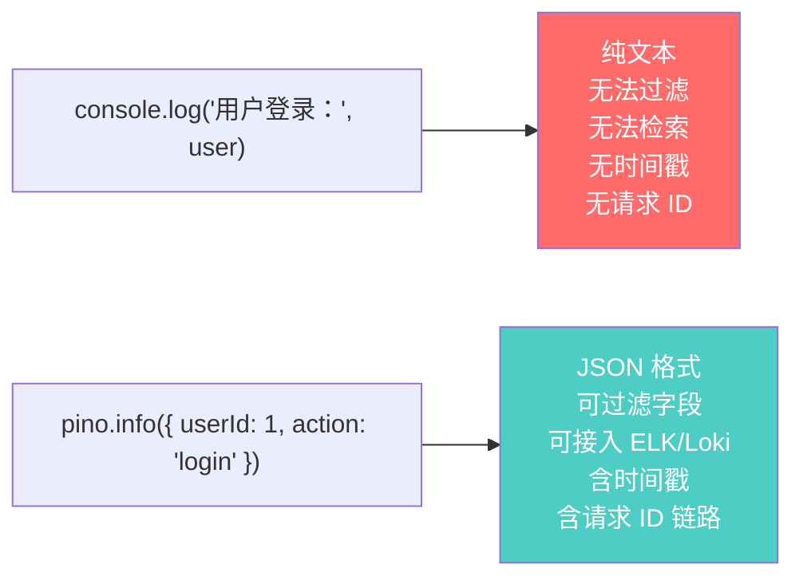
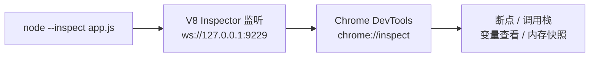

# Node.js 深度实战（十七）—— 结构化日志与调试技巧

`console.log` 够用，但在生产环境是盲人摸象。Pino 日志 + Chrome DevTools 调试，让问题无处遁形。

---

## Part 1：Pino 结构化日志

## 1. 为什么不用 console.log



Fastify 内置 **Pino** 作为日志库，是 Node.js 生态速度最快的日志库（JSON 序列化比 Winston 快 5x）。

## 2. Pino 基础配置

```typescript
// src/index.ts
import Fastify from 'fastify';

const app = Fastify({
  logger: {
    level: process.env.LOG_LEVEL ?? (process.env.NODE_ENV === 'production' ? 'info' : 'debug'),

    // 生产环境：纯 JSON（方便 ELK/Loki 解析）
    // 开发环境：pretty-print（方便人眼阅读）
    transport: process.env.NODE_ENV !== 'production'
      ? {
          target: 'pino-pretty',
          options: {
            colorize: true,
            translateTime: 'SYS:standard',
            ignore: 'pid,hostname',
          },
        }
      : undefined,

    // 给每条日志添加服务标识（微服务环境区分来源）
    base: {
      service: 'user-service',
      version: process.env.npm_package_version,
      env: process.env.NODE_ENV,
    },

    // 敏感字段脱敏（不要记录密码、token）
    redact: {
      paths: ['req.headers.authorization', 'body.password', 'body.token'],
      censor: '[REDACTED]',
    },
  },
});
```

```bash
npm install -D pino-pretty
```

## 3. 请求 ID 追踪（链路日志）

每个请求都应有唯一 ID，便于关联同一次请求的所有日志：

```typescript
import { randomUUID } from 'node:crypto';

const app = Fastify({
  // 生成请求 ID
  genReqId: (req) => {
    // 优先使用网关传入的 Trace ID（分布式追踪）
    return req.headers['x-request-id'] as string ?? randomUUID();
  },
  logger: true,
});

// 将请求 ID 回传给客户端（方便用户反馈问题时提供）
app.addHook('onSend', (request, reply, payload, done) => {
  reply.header('x-request-id', request.id);
  done();
});
```

## 4. 子 Logger（模块级日志）

```typescript
// 给不同模块打不同的标签
const authLogger = app.log.child({ module: 'auth' });
const dbLogger = app.log.child({ module: 'database' });

authLogger.info({ userId: 1 }, '用户登录成功');
// 输出：{ "module": "auth", "userId": 1, "msg": "用户登录成功", ... }

dbLogger.warn({ query: 'SELECT *', duration: 500 }, '慢查询警告');
// 输出：{ "module": "database", "query": "SELECT *", "duration": 500, ... }
```

## 5. 日志级别与使用规范

| 级别 | 方法 | 适用场景 |
|------|------|---------|
| `fatal` | `log.fatal()` | 服务即将崩溃，必须立即告警 |
| `error` | `log.error()` | 需要人工干预的错误 |
| `warn` | `log.warn()` | 不影响服务但需要关注（慢查询、重试） |
| `info` | `log.info()` | 重要的业务事件（登录、下单、支付） |
| `debug` | `log.debug()` | 开发排查用，生产不输出 |
| `trace` | `log.trace()` | 极细粒度，通常只在本地开发用 |

```typescript
// 正确的日志写法：结构化数据 + 消息分离
// ✅
request.log.info({ userId: user.id, action: 'login', ip: request.ip }, '用户登录成功');
request.log.error({ err: error, userId, orderId }, '订单创建失败');

// ❌ 避免字符串拼接（无法过滤字段）
app.log.info(`用户 ${userId} 登录成功`);

// ✅ 错误对象用 err 字段（Pino 会自动序列化 stack）
app.log.error({ err: new Error('数据库连接失败') }, '操作失败');
```

## 6. 日志聚合：接入 Grafana Loki

```yaml
# docker-compose.yml（开发环境日志查看）
services:
  loki:
    image: grafana/loki:latest
    ports: ['3100:3100']

  grafana:
    image: grafana/grafana:latest
    ports: ['3001:3000']
    environment:
      GF_AUTH_ANONYMOUS_ENABLED: 'true'
```

```typescript
// 生产环境：使用 pino-loki 直接推送日志到 Loki
import pinoLoki from 'pino-loki';

const transport = pinoLoki({
  host: 'http://loki:3100',
  labels: { service: 'user-service' },
  batching: true,
  interval: 5,  // 每 5 秒批量发送
});
```

---

## Part 2：Node.js 调试技巧

## 7. `--inspect`：用 Chrome DevTools 调试

Node.js 内置 V8 Inspector 协议，无需任何额外工具：

```bash
# 启动调试模式（等待 DevTools 连接）
node --inspect app.js

# 启动并立即暂停（在第一行代码处断点）
node --inspect-brk app.js

# 指定端口（避免冲突）
node --inspect=0.0.0.0:9229 app.js
```

连接方式：

1. 打开 Chrome，访问 `chrome://inspect`
2. 点击 "Open dedicated DevTools for Node"
3. 在 Sources 面板设置断点，像调试前端一样调试 Node.js



## 8. VS Code 调试配置

```json
// .vscode/launch.json
{
  "version": "0.2.0",
  "configurations": [
    {
      "name": "调试 Node.js 服务",
      "type": "node",
      "request": "launch",
      "runtimeExecutable": "node",
      "runtimeArgs": ["--loader", "tsx/esm"],
      "program": "${workspaceFolder}/src/index.ts",
      "env": {
        "NODE_ENV": "development"
      },
      "sourceMaps": true,
      "console": "integratedTerminal",
      "restart": true  // 文件变化自动重启
    },
    {
      "name": "调试当前 .ts 文件",
      "type": "node",
      "request": "launch",
      "runtimeExecutable": "node",
      "runtimeArgs": ["--experimental-strip-types"],
      "program": "${file}",
      "console": "integratedTerminal"
    },
    {
      "name": "附加到运行中的进程",
      "type": "node",
      "request": "attach",
      "port": 9229,
      "restart": true,
      "sourceMaps": true
    }
  ]
}
```

## 9. 常见调试场景

### 调试异步代码（async/await 调用栈）

```bash
# 开启异步调用栈追踪（性能有开销，仅开发使用）
node --async-stack-traces --inspect app.js
```

### 调试内存泄漏

```bash
# 启动时允许内存堆快照
node --inspect --expose-gc app.js
```

在 Chrome DevTools → Memory 面板：
1. 选择 "Heap snapshot"
2. 执行可能泄漏的操作
3. 再次快照，对比两次快照的差异
4. 找到持续增长的对象

### 调试性能问题（CPU Profile）

```bash
node --inspect app.js
```

在 DevTools → Profiler 面板：
1. 点击 "Start" 开始录制
2. 模拟负载（运行几秒）
3. 点击 "Stop" 停止
4. 查看火焰图，找出耗时最多的函数

### 使用 `node:inspector` API 程序化调试

```typescript
import inspector from 'node:inspector';
import { writeFileSync } from 'node:fs';

// 在代码中触发 CPU Profiling（无需 DevTools）
const session = new inspector.Session();
session.connect();

// 开始 CPU 分析
await new Promise<void>((resolve, reject) => {
  session.post('Profiler.enable', () => {
    session.post('Profiler.start', resolve);
  });
});

// 执行要分析的代码...
await runHeavyTask();

// 停止并保存结果
await new Promise<void>((resolve) => {
  session.post('Profiler.stop', (err, { profile }) => {
    writeFileSync('./cpu-profile.cpuprofile', JSON.stringify(profile));
    resolve();
  });
});

session.disconnect();
console.log('CPU Profile 已保存，用 Chrome DevTools → Profiler 打开查看');
```

## 10. 实用调试技巧速查

```bash
# 查看 Node.js 内部模块加载日志
NODE_DEBUG=module,http node app.js

# 打印所有环境变量（验证配置）
node -e "console.log(process.env)"

# 交互式 REPL（测试代码片段）
node --input-type=module <<'EOF'
import { readFile } from 'node:fs/promises';
const data = await readFile('./package.json', 'utf8');
console.log(JSON.parse(data).name);
EOF

# 查看加载的所有模块
node --trace-require app.js 2>&1 | head -50

# 分析启动时间（找出启动慢的原因）
node --prof app.js
node --prof-process isolate-*.log | head -100
```

## 总结

- Pino 结构化日志：每条日志是 JSON，支持字段过滤、请求 ID 追踪、敏感字段脱敏
- `request.log`（包含 reqId）比 `app.log` 更好——日志天然带请求链路信息
- `--inspect` + Chrome DevTools = 完整的断点调试、内存快照、CPU Profiling
- VS Code `launch.json` 让调试 TypeScript 服务和调试浏览器前端一样方便
- `NODE_DEBUG=module,http` 是快速确认模块加载/HTTP 请求问题的利器

---

下一章探讨 **消息队列（BullMQ）**，处理异步任务、定时任务和可靠的后台作业。
