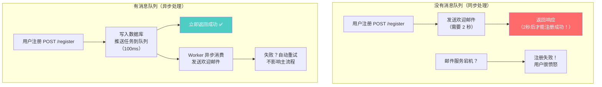
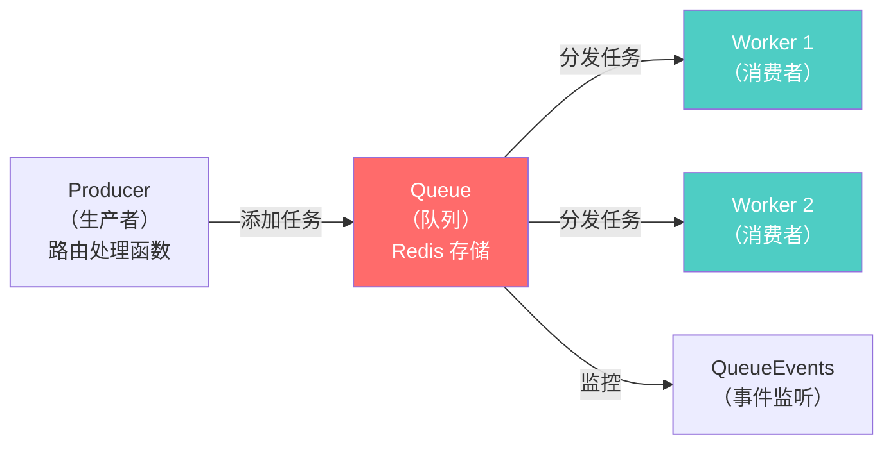
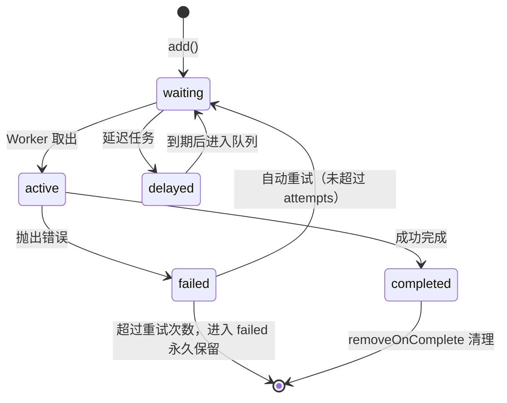

# Node.js 深度实战（十八）—— 消息队列：BullMQ 任务调度

发送欢迎邮件为什么不能同步做？视频转码为什么要异步？消息队列是高可用后端服务的必备组件。

---

## 1. 为什么需要消息队列



**适合放入消息队列的任务：**
- 发送邮件/短信通知
- 图片/视频处理（压缩、转码、生成缩略图）
- 数据导出（生成 Excel、PDF）
- 定时任务（每日报表、缓存预热）
- 第三方 API 调用（可能慢或不稳定）
- 批量数据处理

## 2. BullMQ 简介

**BullMQ** 是 2026 年 Node.js 生态最成熟的消息队列库（基于 Redis），相比 RabbitMQ/Kafka 更轻量，适合大多数业务场景：

| 特性 | BullMQ | RabbitMQ | Kafka |
|------|--------|----------|-------|
| 依赖 | Redis | 独立服务 | 独立集群 |
| 学习成本 | ⭐ 低 | ⭐⭐ 中 | ⭐⭐⭐ 高 |
| 延迟任务 | ✅ 原生支持 | ⚠️ 需插件 | ❌ 不适合 |
| 定时任务 | ✅ Cron 支持 | ❌ | ❌ |
| 任务重试 | ✅ 自动 | ✅ | ✅ |
| 顺序保证 | 队列内有序 | 可配置 | 分区内有序 |
| 适用量级 | 千万级任务/天 | 亿级消息/天 | 百亿级/天 |

```bash
npm install bullmq ioredis
```

## 3. 核心概念



- **Queue**：任务队列，负责接收和存储任务
- **Worker**：任务消费者，从队列取出任务并执行
- **Job**：单个任务，包含数据和配置（重试次数、延迟时间等）
- **QueueEvents**：监听任务的完成/失败等事件

## 4. 基础实现：发送欢迎邮件

### 队列定义

```typescript
// src/queues/email.queue.ts
import { Queue } from 'bullmq';
import Redis from 'ioredis';

// 共享 Redis 连接（使用 maxRetriesPerRequest: null 防止连接断开）
export const redisConnection = new Redis(process.env.REDIS_URL!, {
  maxRetriesPerRequest: null,  // BullMQ 要求设置为 null
});

// 定义任务数据类型
export interface EmailJobData {
  to: string;
  type: 'welcome' | 'reset-password' | 'order-confirm';
  payload: Record<string, unknown>;
}

// 创建队列
export const emailQueue = new Queue<EmailJobData>('email', {
  connection: redisConnection,
  defaultJobOptions: {
    attempts: 3,                    // 最多重试 3 次
    backoff: {
      type: 'exponential',          // 指数退避：1s, 2s, 4s
      delay: 1000,
    },
    removeOnComplete: { count: 100 },   // 只保留最近 100 条成功记录
    removeOnFail: { count: 200 },       // 只保留最近 200 条失败记录
  },
});
```

### Worker（消费者）

```typescript
// src/workers/email.worker.ts
import { Worker, Job } from 'bullmq';
import { redisConnection, EmailJobData } from '../queues/email.queue.js';
import nodemailer from 'nodemailer';

const transporter = nodemailer.createTransport({
  host: process.env.SMTP_HOST,
  port: Number(process.env.SMTP_PORT),
  auth: { user: process.env.SMTP_USER, pass: process.env.SMTP_PASS },
});

// 邮件模板
const templates: Record<string, (payload: Record<string, unknown>) => string> = {
  welcome: (p) => `
    <h1>欢迎加入，${p.name}！</h1>
    <p>您的账号已注册成功。</p>
  `,
  'reset-password': (p) => `
    <h1>重置密码</h1>
    <a href="${p.resetUrl}">点击重置密码（30分钟内有效）</a>
  `,
};

const worker = new Worker<EmailJobData>(
  'email',
  async (job: Job<EmailJobData>) => {
    const { to, type, payload } = job.data;

    job.log(`开始发送 ${type} 邮件到 ${to}`);

    await transporter.sendMail({
      from: '"My App" <noreply@example.com>',
      to,
      subject: { welcome: '欢迎注册', 'reset-password': '重置密码' }[type] ?? '通知',
      html: templates[type]?.(payload) ?? '',
    });

    job.log('邮件发送成功');
    return { sentAt: new Date().toISOString() };  // 可以作为任务结果保存
  },
  {
    connection: redisConnection,
    concurrency: 5,  // 最多同时处理 5 个任务
  },
);

worker.on('completed', (job) => {
  console.log(`任务 ${job.id} 完成`, job.returnvalue);
});

worker.on('failed', (job, err) => {
  console.error(`任务 ${job?.id} 失败（第 ${job?.attemptsMade} 次重试）:`, err.message);
});

console.log('Email Worker 已启动，等待任务...');
```

### 路由中添加任务（生产者）

```typescript
// src/routes/auth.ts
import { emailQueue } from '../queues/email.queue.js';

app.post('/auth/register', async (request, reply) => {
  const { email, name, password } = request.body;

  // 创建用户
  const user = await app.db.user.create({
    data: { email, name, password: await bcrypt.hash(password, 12) },
  });

  // 异步发送欢迎邮件（不阻塞注册响应！）
  await emailQueue.add('welcome-email', {
    to: email,
    type: 'welcome',
    payload: { name, userId: user.id },
  });

  return reply.code(201).send({ userId: user.id, message: '注册成功' });
  // 立即返回，邮件在后台发送
});
```

## 5. 高级功能

### 延迟任务（定时发送）

```typescript
// 30 分钟后自动发送密码重置链接过期提醒
await emailQueue.add(
  'reset-password-reminder',
  { to: email, type: 'password-expired', payload: {} },
  { delay: 30 * 60 * 1000 },  // 延迟 30 分钟
);

// 定时任务：每天凌晨 2 点生成报表（Cron 语法）
const reportQueue = new Queue('report', { connection: redisConnection });

await reportQueue.upsertJobScheduler(
  'daily-report',           // 调度器 ID（唯一标识）
  { pattern: '0 2 * * *' }, // Cron：每天 02:00
  {
    name: 'generate-daily-report',
    data: { reportType: 'daily' },
    opts: { attempts: 3 },
  },
);
```

### 任务优先级

```typescript
// 数字越小优先级越高
await emailQueue.add('vip-email', data, { priority: 1 });    // VIP 用户优先
await emailQueue.add('normal-email', data, { priority: 10 }); // 普通用户等待
```

### 等待任务完成（同步等待）

```typescript
// 某些场景需要等待任务结果（如图片处理后返回 URL）
const job = await imageQueue.add('resize', { imageUrl, width: 800 });

// 等待最多 30 秒
const result = await job.waitUntilFinished(queueEvents, 30_000);
console.log('处理结果：', result.resizedUrl);
```

## 6. 任务监控：Bull Board

```bash
npm install @bull-board/fastify @bull-board/api
```

```typescript
// src/plugins/bull-board.ts
import fp from 'fastify-plugin';
import { FastifyAdapter } from '@bull-board/fastify';
import { createBullBoard } from '@bull-board/api';
import { BullMQAdapter } from '@bull-board/api/bullMQAdapter';
import { emailQueue } from '../queues/email.queue.js';

export default fp(async (app) => {
  if (process.env.NODE_ENV === 'production') return;  // 生产环境不暴露

  const serverAdapter = new FastifyAdapter();
  serverAdapter.setBasePath('/admin/queues');

  createBullBoard({
    queues: [new BullMQAdapter(emailQueue)],
    serverAdapter,
  });

  await app.register(serverAdapter.registerPlugin(), {
    prefix: '/admin/queues',
  });

  console.log('Bull Board: http://localhost:3000/admin/queues');
});
```

访问 `http://localhost:3000/admin/queues` 即可看到：
- 所有队列的等待/处理/完成/失败任务数量
- 任务详情、重试日志、错误信息
- 手动重试失败任务

## 7. 完整任务生命周期



## 8. Worker 独立进程部署

Worker 建议和 API 服务分开部署（独立进程），这样可以独立扩容：

```json
// package.json
{
  "scripts": {
    "start:api": "node dist/index.js",
    "start:worker": "node dist/workers/email.worker.js",
    "start:all": "concurrently \"npm run start:api\" \"npm run start:worker\""
  }
}
```

```yaml
# docker-compose.yml
services:
  api:
    build: .
    command: node dist/index.js
    scale: 3          # 3 个 API 实例

  email-worker:
    build: .
    command: node dist/workers/email.worker.js
    scale: 2          # 2 个 Email Worker 实例（可独立扩容）

  redis:
    image: redis:7-alpine
```

## 总结

- 耗时操作（邮件、图片处理、数据导出）都应异步化，放入消息队列
- BullMQ 核心：**Queue**（存储任务）+ **Worker**（执行任务）+ Redis
- 任务内置重试（指数退避），邮件服务抖动时自动恢复
- 延迟任务和 Cron 定时任务原生支持，无需额外 cron 服务
- Bull Board 提供可视化监控面板，方便排查失败任务
- Worker 和 API 分离部署，可以独立横向扩容

---

**Node.js 深度实战系列 · 终章完结**

从 V8 引擎到消息队列，这个系列覆盖了 2026 年 Node.js 全栈工程师的完整技术栈。
