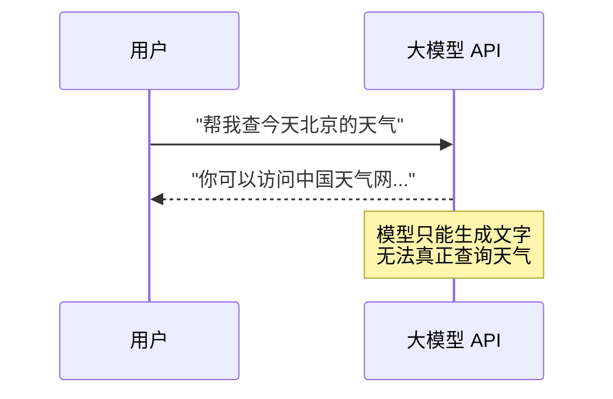
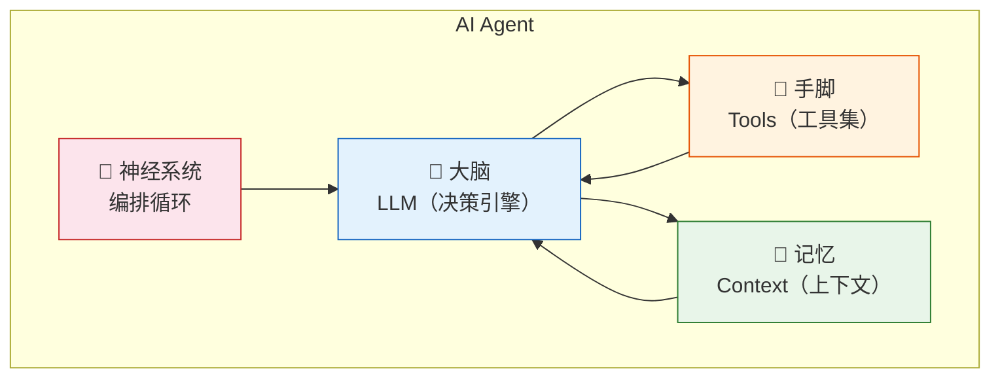
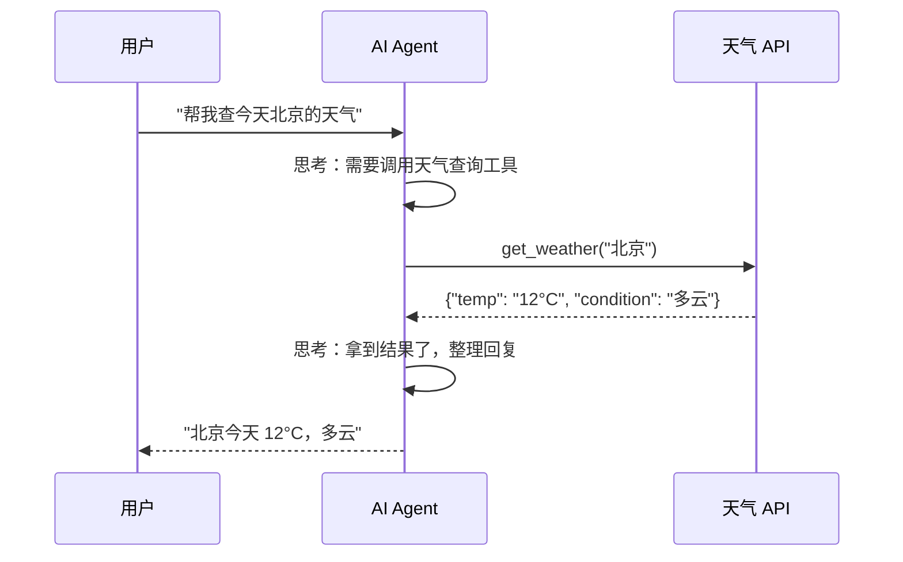
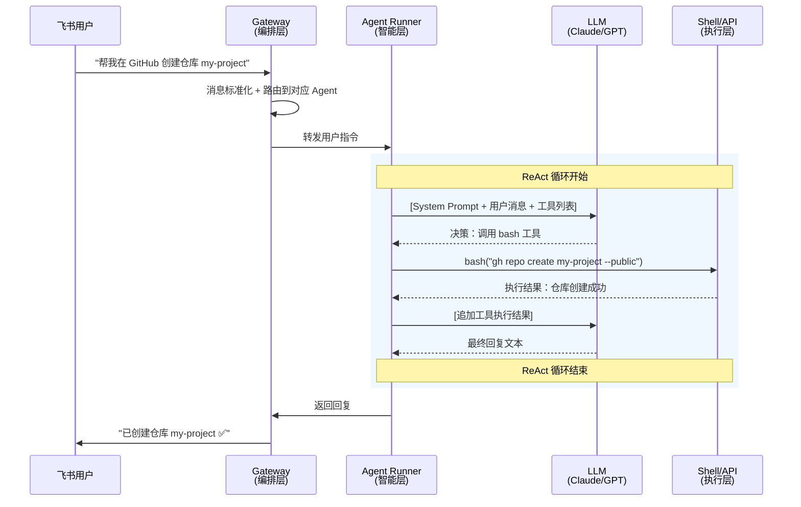

# OpenClaw 原理拆解（一）—— 从聊天机器人到自主 Agent

你给 ChatGPT 发一句"帮我订明天下午的会议室"，它会回一段文字告诉你怎么操作。你给 OpenClaw 发同样的话，它会直接打开日历、创建事件、发送邀请链接，然后告诉你"已搞定"。

这就是 Chatbot 和 Agent 的区别。一个只动嘴，一个真动手。

---

## 1. 一次 API 调用能干什么

先从最基础的场景看起。

直接调用大模型 API（比如 OpenAI 的 Chat Completions），本质是一个请求-响应模型：

```
你发一段文字 → 模型返回一段文字 → 结束
```

整个过程是**无状态**的。模型不记得上次聊了什么（除非你手动把历史消息塞进去），也没法操作任何外部系统。它只会"说"，不会"做"。



这就好比打电话给一个百科全书般博学的朋友——他什么都知道，但永远待在电话那头，没法替你跑腿。

## 2. Agent 多了什么

AI Agent 在大模型的基础上，加了三样东西：



- **大脑（LLM）**：负责理解意图、拆解任务、决定下一步做什么。
- **手脚（Tools）**：Shell 命令、文件读写、浏览器操控、API 调用——真正执行操作的部分。
- **记忆（Context）**：对话历史、用户偏好、任务中间状态。让 Agent 知道"之前做过什么"。
- **神经系统（编排循环）**：把上面三者串起来的控制逻辑。Agent 不是调一次 LLM 就结束，而是**循环执行**：思考 → 行动 → 观察结果 → 再思考。

同样的问题，Agent 的处理方式完全不同：



区别一目了然：Agent 的 LLM 不直接回答，而是**决定调用哪个工具**，拿到真实数据后再组织回复。

## 3. Agent 和 API 调用的本质区别

把核心差异压缩成一张表：

| 维度 | 直接调 API | AI Agent |
|------|-----------|----------|
| 交互模式 | 单次请求-响应 | 多轮循环（ReAct Loop） |
| 外部操作 | 无，只生成文字 | 调用工具执行真实操作 |
| 状态管理 | 无状态（手动管理） | 有状态（自动维护上下文） |
| 决策能力 | 无，固定流程 | 动态决策：根据中间结果调整下一步 |
| 错误处理 | 调用方自己处理 | Agent 自行重试、换方案 |
| 复杂任务 | 只能拆成多次手动调用 | 自动拆解子任务、逐步执行 |

一句话总结：**API 调用是"一问一答"，Agent 是"给个目标，自己搞定"**。

## 4. OpenClaw 是什么

OpenClaw（吉祥物是一只太空龙虾 🦞）是一个开源的自主 AI Agent，2025 年底由 Peter Steinberger 发布。上线一周 GitHub Star 破 10 万，截至 2026 年 3 月已有超过 1,000 位贡献者。

跟其他 Agent 框架（LangGraph、CrewAI、AutoGen）不同，OpenClaw 不是一个给开发者用的 SDK/库，而是一个**开箱即用的 Agent 产品**。它有几个鲜明的特征：

### 4.1 执行型代理，不是聊天助手

OpenClaw 的核心能力不是"聊天"，而是"干活"：

- 执行 Shell 命令（`ls`、`git push`、`npm install`）
- 读写本地文件
- 通过 CDP 协议操控浏览器
- 收发邮件、管理日历
- 操控 macOS/iOS/Android 设备节点

它能直接在你的系统上跑命令、改文件、打开网页——这是普通聊天机器人做不到的。

### 4.2 消息渠道统一

OpenClaw 没有自己的专属界面。它"寄生"在已有的消息平台上——WhatsApp、Telegram、Slack、Discord、飞书、iMessage、Signal 等 25+ 个渠道。

这意味着你不用下载新 App，直接在飞书或 Telegram 里跟它对话，它就能帮你操控各种系统。

### 4.3 模型无关

底层的 LLM 随时可切。Claude、GPT-4o、DeepSeek-R1、Doubao，通过 API Key 接入。主模型挂了自动切备用（failover），不绑定任何厂商。

### 4.4 本地数据主权

核心配置用 Markdown 文件管理：`SOUL.md`（人格）、`AGENTS.md`（行为指令）、`TOOLS.md`（工具说明）、`USER.md`（用户偏好）。对话记录存本地磁盘，数据不上传云端。

### 4.5 主动执行

OpenClaw 不只是被动等指令。它内置心跳调度器（Heartbeat），能按设定间隔主动"醒来"执行任务，支持 Cron 表达式和 Webhook 触发。比如每天早上 8 点自动汇总邮件、每小时检查服务器状态。

## 5. 一个完整请求的生命周期

串起来看一次完整的交互流程。你在飞书上跟 OpenClaw 说"帮我在 GitHub 上创建一个新仓库叫 my-project"：



整个流程分四步：

1. **消息进入**。飞书消息通过 Gateway 进入 OpenClaw，被标准化为统一格式。
2. **LLM 决策**。Agent Runner 把用户消息连同 System Prompt 和可用工具列表一起发给 LLM。LLM 分析后决定调用 `bash` 工具执行 `gh repo create` 命令。
3. **工具执行**。Agent Runner 在本地执行 Shell 命令，拿到执行结果。
4. **结果返回**。执行结果喂回 LLM，LLM 生成最终回复，经 Gateway 发回飞书。

如果 GitHub CLI 没安装或者 Token 过期，LLM 会看到报错信息，然后自行决定：是先安装 `gh`、还是换用 GitHub API、还是直接告诉你需要配置。这种**根据中间结果动态调整策略**的能力，正是 Agent 和简单脚本的区别。

## 6. OpenClaw 要解决什么问题

回到最初的问题：OpenClaw 为什么火？

它切中的痛点很具体——**信息散落 + 操作碎片化**。

一个典型的开发者日常：飞书看消息、Gmail 收邮件、GitHub 审 PR、Notion 记笔记、Jira 跟进度、终端跑命令。每个工具一个 Tab，每个操作一套流程。OpenClaw 把这些全收拢到一个对话窗口里，用自然语言统一操控。

它的价值主张可以压缩成一句：**用一个消息窗口操控所有系统工具**。

但代价也很明显：

- 安全风险比聊天机器人高一个量级（能跑 Shell 意味着能删文件）
- 7×24 在线 + 心跳调度持续消耗 Token，成本不是零
- 权限模型还不成熟（ClawJacked 漏洞已经证明过一次）

这些 Trade-offs 会在第 06 篇详细展开。

---

## 小结

- **直接调 API** 是无状态的单轮问答，模型只能生成文字
- **AI Agent** = LLM（大脑）+ Tools（手脚）+ Context（记忆）+ Loop（编排循环），能执行多步任务
- **OpenClaw** 是一个开箱即用的开源 Agent 产品，核心能力是系统级操控，支持 25+ 消息渠道，模型无关，数据本地存储
- 一条消息的生命周期：消息进入 → LLM 决策 → 工具执行 → 结果回传（ReAct 循环）

下一篇拆解 OpenClaw 的**四层架构**——输入层、编排层、智能层、执行层各自干什么，数据怎么流转。
