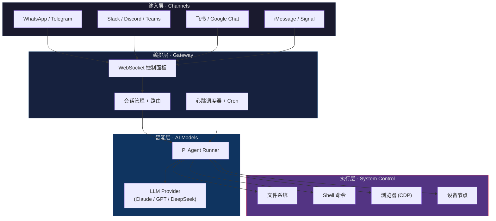
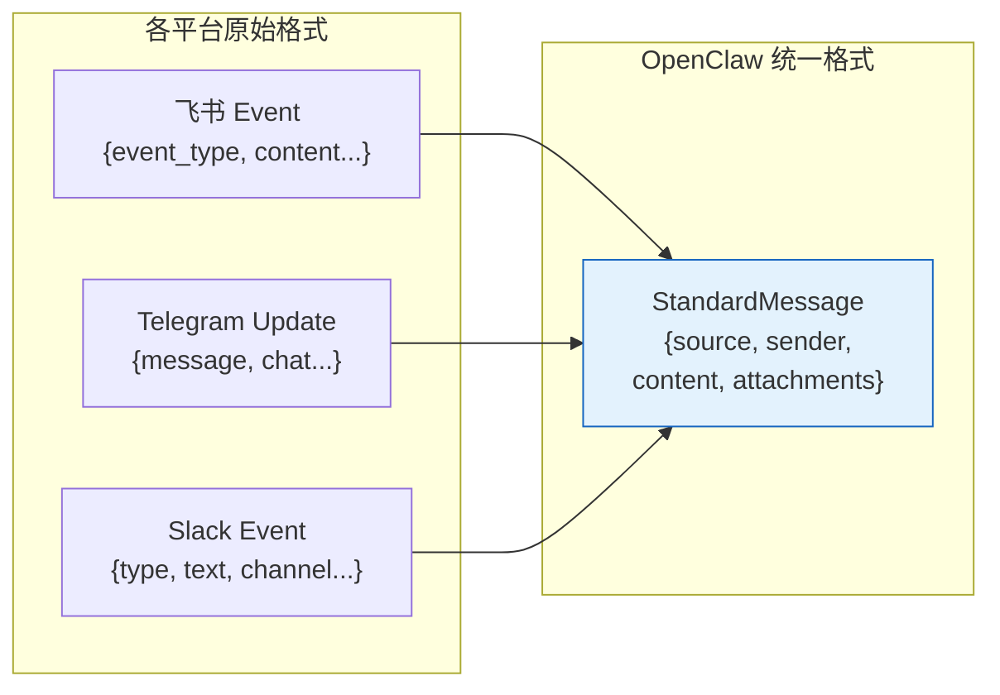
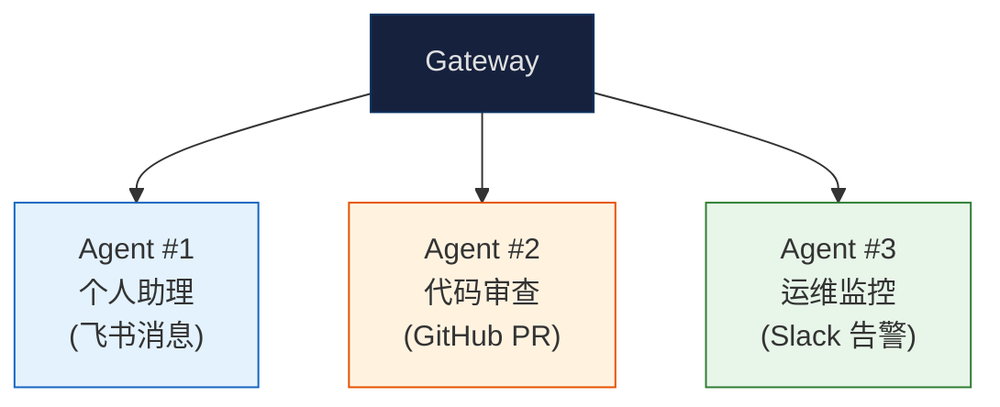
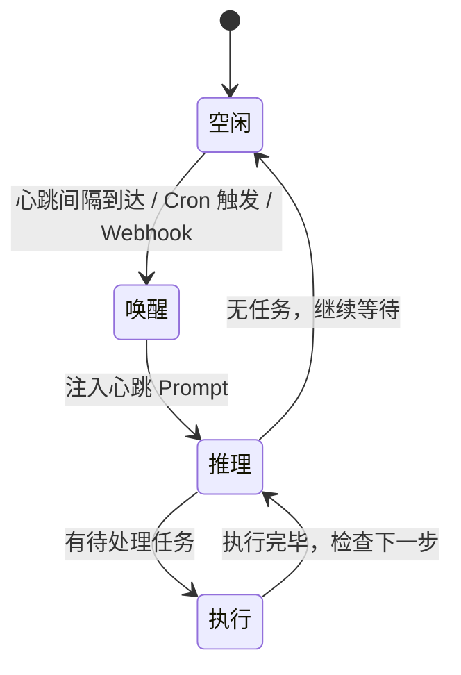
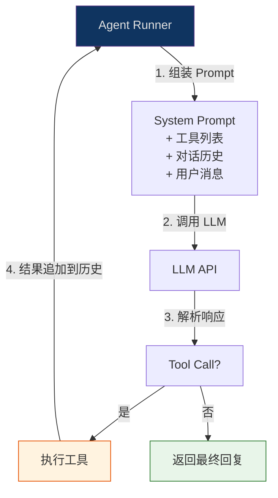
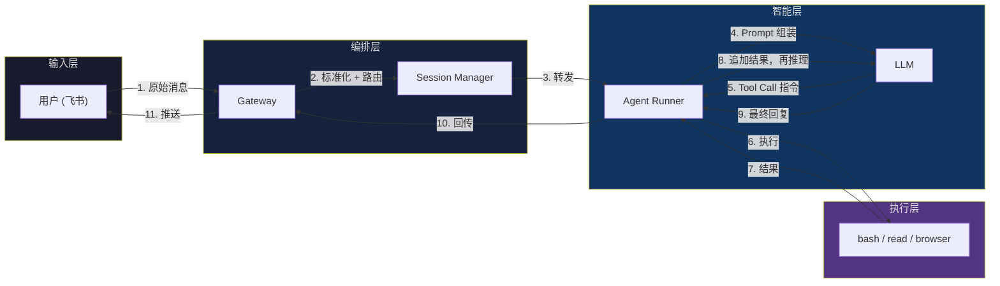

# OpenClaw 原理拆解（二）—— 四层架构拆解

上一篇讲了 Agent 和普通 API 调用的区别。这篇往里走一层，拆开 OpenClaw 的内部结构——它由哪些核心组件组成，组件之间怎么配合。

---

## 1. Hub-and-Spoke 总览

OpenClaw 采用 Hub-and-Spoke（轮辐式）架构，分成四层：

四层各管一摊事，彼此解耦。下面逐层拆。

## 2. 输入层：25+ 渠道的统一入口

OpenClaw 不做自己的聊天界面。它通过适配器（Adapter）接入外部消息平台。

每个平台的消息格式都不一样——飞书用 JSON event，Telegram 用 Bot API webhook，iMessage 走 Apple 的推送通道。输入层的工作就是**把所有渠道的消息标准化**为 OpenClaw 内部的统一格式，包括消息内容、发送者身份、附件（图片/文件/语音）。

这种设计的好处：**后面的编排层、智能层、执行层完全不关心消息从哪来**。加一个新渠道只需要写一个新的 Adapter，不影响 Agent 的核心逻辑。

支持的渠道数量（25+）本身就是 OpenClaw 的护城河之一。Telegram、WhatsApp、Slack、Discord、飞书、Google Chat、iMessage、Signal、Matrix、IRC、WebChat，甚至 SMS——基本覆盖了主流的即时通信工具。

## 3. 编排层：Gateway —— 整个系统的中枢

Gateway 是 OpenClaw 的"交通枢纽"，承担三个核心职责。

### 3.1 WebSocket 控制面板

Gateway 通过 WebSocket（默认 `ws://127.0.0.1:18789`）跟前端设备建立长连接。所有指令和状态更新走这条通道。

这个设计选择有代价——WebSocket 连接是有状态的，服务重启就断开。但换来的是实时双向通信：Agent 执行到一半，中间结果可以即时推送给用户，不用等全部跑完。

### 3.2 会话管理 + Multi-Agent 路由

一个 Gateway 可以管理多个隔离的 Agent 实例。不同渠道、不同用户的消息会被路由到不同的 Agent workspace：

每个 Agent 实例有独立的 workspace 目录、独立的配置文件、独立的对话历史。互不干扰，互不可见。

### 3.3 心跳调度器（Heartbeat + Cron）

这是 OpenClaw 从"被动工具"升级为"主动助手"的关键组件。

心跳调度器按设定间隔（或 Cron 表达式）唤醒 Agent Runner，即使没有用户消息也会触发一轮推理：

典型用法：每天早 8 点自动汇总未读邮件，每小时检查服务器状态，每周五下午提醒填写周报。

代价是 Token 消耗——每次心跳唤醒都会触发一轮 LLM 推理。心跳间隔太短，Token 费会快速累积。

## 4. 智能层：Pi Agent Runner —— Agent 的"大脑"

Pi Agent Runner 是 OpenClaw 的核心推理引擎。它的职责只有一个：**驱动 ReAct 循环**。

几个值得注意的设计：

**模型无关 + Failover**。Agent Runner 通过抽象的 LLM Provider 接口跟模型通信。配置里可以指定主模型和备用模型——Claude 挂了自动切 GPT，GPT 也挂了切 DeepSeek。对上层业务逻辑透明。

**RPC 调用**。Agent Runner 跟 Gateway 之间走 RPC 通信，而不是直接内嵌。好处是可以独立部署、独立扩缩容。坏处是多了一跳网络延迟。

**工具执行权限**。Agent Runner 不直接跑 Shell 命令，而是通过执行层的工具接口。每个工具有白名单/黑名单控制——这是安全分层的关键点。

## 5. 执行层：System Control —— Agent 的"手脚"

执行层是 OpenClaw 区别于普通 Chatbot 的核心能力所在。它包含四大工具类型：

| 工具类型 | 能力 | 风险等级 |
|---------|------|---------|
| **Shell 命令** (`bash`) | 执行任意命令行操作 | 🔴 高 |
| **文件系统** (`read`/`write`/`edit`) | 读写本地文件 | 🟠 中 |
| **浏览器** (`browser`, CDP 协议) | 操控 Chromium 浏览器 | 🟠 中 |
| **设备节点** (`nodes`) | 操控 macOS/iOS/Android 设备 | 🔴 高 |

辅助工具：
| 工具类型 | 能力 |
|---------|------|
| **Cron** | 创建/管理定时任务 |
| **Sessions** | 跨 Agent 实例通信 |
| **Canvas** | 可视化渲染（Live Canvas） |

Shell 命令是最强大的工具，也是最危险的。`rm -rf /` 也是一条合法的 Shell 命令。这就是为什么安全分层（第 06 篇展开）至关重要。

## 6. 一条消息的完整数据流

把四层串起来，看一条消息从用户到执行结果的完整流转：

步骤 5→6→7→8 是一个循环——如果 LLM 决定需要多次工具调用（比如先查文件内容、再修改、再验证），这个循环会执行多轮，直到 LLM 判断任务完成。

## 7. 架构的 Trade-offs

这套四层架构并非没有代价：

**优势**：
- 渠道解耦：加新平台只需写 Adapter
- 模型无关：LLM 随时可切
- 安全分层：工具权限可精细控制
- 水平扩展：Agent Runner 可独立部署

**代价**：
- WebSocket 有状态连接增加了运维复杂度（断线重连、状态恢复）
- RPC 调用链较长，每条消息至少经过 4 跳（用户 → Gateway → Agent Runner → LLM），延迟比端到端方案更高
- 本地部署的资源占用不低——Gateway + Agent Runner + LLM API 调用 + 浏览器实例

对于个人用户，Coze 一键部署可以绕开运维复杂度（沙箱由平台托管）。但离集群化部署还有一段距离。

---

## 小结

- OpenClaw 采用 **Hub-and-Spoke 四层架构**：输入层（渠道适配）→ 编排层（Gateway 路由）→ 智能层（Agent Runner 推理）→ 执行层（工具操控）
- **输入层**把 25+ 渠道的消息标准化，后续层不关心消息来源
- **编排层**的 Gateway 管理 WebSocket 连接、会话路由、心跳调度
- **智能层**的 Agent Runner 驱动 ReAct 循环，通过 failover 实现模型无关
- **执行层**提供 Shell/文件/浏览器/设备四类系统级工具
- 一条消息至少经过 4 跳完成一轮处理，复杂任务会循环多轮

下一篇深入 Agent Runner 的推理循环——ReAct 的具体实现、Tool Calling 的完整链路、System Prompt 的四大配置文件。
