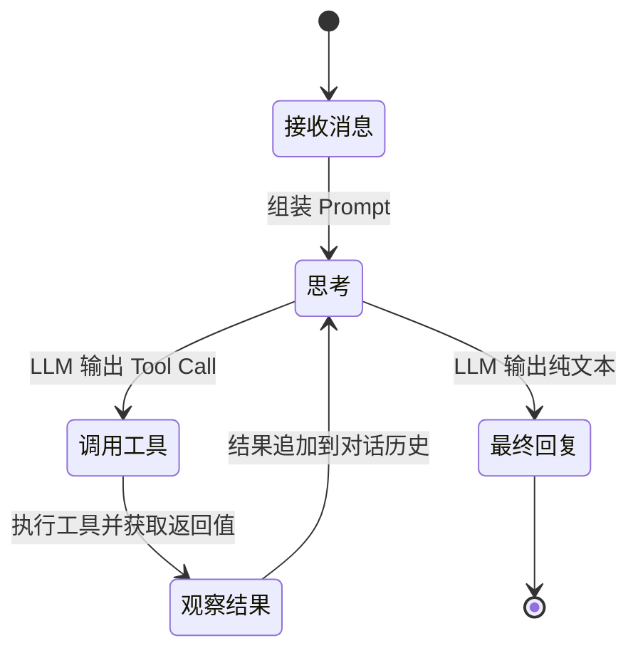
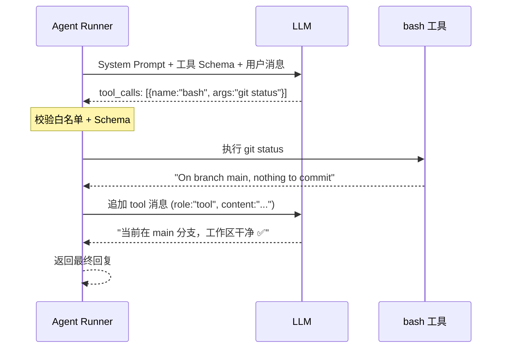
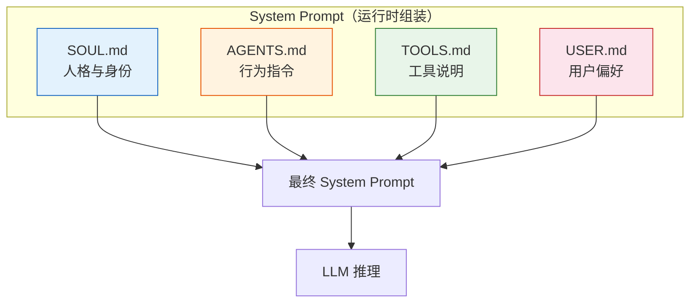

# OpenClaw 原理拆解（三）—— Agent 循环与 Tool Calling

上一篇拆了四层架构的物理结构。这篇聚焦逻辑层面——Agent Runner 内部的推理循环怎么跑、Tool Calling 的完整链路、以及 Markdown 配置文件如何塑造 Agent 的行为。

---

## 1. ReAct 循环：Agent 的思考回路

Agent 的核心运行模式叫 **ReAct**（Reason + Act）。

不同于一次性生成回复，ReAct 是一个**循环**：思考 → 行动 → 观察 → 再思考……直到任务完成或判定无法完成为止。



用大白话说：

1. **思考（Thought）**。LLM 收到用户消息和上下文，判断下一步该做什么。
2. **行动（Action）**。如果需要动手，LLM 输出一个结构化的"工具调用指令"（Tool Call），指定调用哪个工具、传什么参数。
3. **观察（Observation）**。程序执行工具，把真实的返回结果追加到对话历史里。
4. **循环**。LLM 再次看到包含工具执行结果的完整历史，决定是继续操作还是回复用户。

关键点在第 3 步：**LLM 本身不执行工具**。它只"说"了要调用什么工具，真正跑命令的是 Agent Runner。这步强制打断（Stop Sequence）是防止 LLM 幻觉的核心机制——如果不打断，LLM 会自己"想象"工具返回了什么结果，然后愉快地基于幻觉继续推理。

### 实际案例

用户说"把 README.md 里的版本号从 1.0 改成 2.0"。Agent Runner 内部发生了什么：

```
第 1 轮：
  思考 → 需要先看一下文件内容
  行动 → read("README.md")
  观察 → 文件内容："# My Project v1.0 ..."

第 2 轮：
  思考 → 找到了 v1.0，需要替换
  行动 → edit("README.md", "v1.0", "v2.0")
  观察 → 编辑成功

第 3 轮：
  思考 → 任务完成，可以回复了
  最终回复 → "已将 README.md 中的版本号从 1.0 更新为 2.0 ✅"
```

三轮循环，两次工具调用。LLM 并没有被预先编程"改版本号要先读再改"——它是根据每一步的中间结果自行决定下一步动作。这种动态决策能力是 Agent 的核心价值。

## 2. Tool Calling 的完整链路

Tool Calling（工具调用）是 Agent 从"只会说"到"能动手"的桥梁。拆成三段看：怎么定义工具、LLM 怎么调用、结果怎么回传。

### 2.1 工具定义

每个工具通过 JSON Schema 描述自己的能力——名字、功能说明、参数列表和类型约束。这段 Schema 会在每次 LLM 推理时作为 System Prompt 的一部分发送过去。

OpenClaw 内置的工具定义（简化版）：

```json
{
  "name": "bash",
  "description": "在系统终端执行命令",
  "parameters": {
    "type": "object",
    "properties": {
      "command": {
        "type": "string",
        "description": "要执行的 Shell 命令"
      }
    },
    "required": ["command"]
  }
}
```

LLM 看到的信息是：有一个叫 `bash` 的工具，能执行 Shell 命令，需要传一个 `command` 字符串。LLM 会根据用户的请求，**自行判断是否需要调用这个工具**。

### 2.2 LLM 生成调用指令

当 LLM 决定调用工具时，它不再输出普通文本，而是输出一段结构化的 JSON：

```json
{
  "tool_calls": [
    {
      "id": "call_abc123",
      "function": {
        "name": "bash",
        "arguments": "{\"command\": \"git status\"}"
      }
    }
  ]
}
```

三个核心字段：
- `id`：这次调用的唯一标识。用于后续把执行结果跟调用请求匹配上。
- `name`：调用哪个工具。
- `arguments`：传什么参数。JSON 字符串格式。

Agent Runner 拿到这段 JSON 后：
1. 校验 `name` 是否在白名单中。
2. 校验 `arguments` 是否符合工具的 Schema 定义。
3. 通过则执行，否则返回错误信息。

### 2.3 结果回传

工具执行完毕后，结果以 `tool` 角色的消息追加到对话历史中：

```json
{
  "role": "tool",
  "tool_call_id": "call_abc123",
  "content": "On branch main\nnothing to commit, working tree clean"
}
```

`tool_call_id` 跟前面的 `id` 对应。LLM 看到这条消息后，知道"那个 `git status` 命令跑完了，结果是工作区干净"，然后决定下一步。

### 完整链路图



注意步骤 3→4 之间的**校验**不是装饰——如果 LLM 试图调用一个不存在的工具或传错参数类型，Agent Runner 会拦截并把错误信息喂回给 LLM，让它自行纠正。

## 3. System Prompt：Agent 的"出厂设置"

System Prompt 是 Agent 行为的根基。它在每次推理时作为第一条消息注入 LLM，定义了 Agent"是谁、能做什么、怎么做"。

在 OpenClaw 中，System Prompt 不是一个单一的大字符串，而是由四个 Markdown 文件组合而成：



### SOUL.md —— 人格定义

定义 Agent 的"核心身份"。比如：

```markdown
你是 OpenClaw，一个自主 AI 助手。
你的沟通风格是简洁、直接、技术导向。
你优先使用工具执行任务，而不是给出操作步骤让用户自己做。
如果不确定，先确认再行动。
```

### AGENTS.md —— 行为指令

定义 Agent 在特定场景下的行为规则。等同于精细调优的操作手册：

```markdown
## 文件操作
- 修改文件前先 read 确认内容
- 删除操作需要二次确认

## 代码审查
- 阅读 diff，聚焦安全和性能问题
- 给出具体修改建议，不要只说"可以优化"
```

### TOOLS.md —— 工具说明

补充工具的使用场景和约束，是对 JSON Schema 的自然语言增强：

```markdown
## bash
- 适合：文件操作、Git 命令、系统查询
- 禁止：不要执行 rm -rf、不要修改系统配置文件
- 超时：单次执行不超过 30 秒
```

### USER.md —— 用户偏好

存储用户的个性化信息：

```markdown
- 使用中文沟通
- 代码仓库在 ~/projects/
- 偏好 TypeScript
- 工作时间：09:00-18:00
```

### 为什么用 Markdown 而不是 JSON/YAML

这是一个有意的设计选择。

Markdown 的优势：**人类可读、AI 可解析、版本可追踪**。用户不需要学 JSON 的嵌套语法，直接用标题、列表、代码块组织配置。Git diff 里也一目了然。

代价在于 Markdown 没有严格的 Schema 约束。写错了不会报语法错误，只会让 Agent 的行为变得怪异。这跟 JSON Schema 的显式校验形成对比——灵活性换了健壮性。

### System Prompt 过长怎么办

完整的 System Prompt（四个文件合并后）动辄上千 Token。随着功能增加，这个数字会持续膨胀。

常见的应对策略：

- **分层加载**：基础人格（SOUL.md）和工具定义（TOOLS.md）始终加载；行为指令（AGENTS.md）按当前任务类型动态加载相关片段。
- **Skill 注入**：复杂的行为指令抽成 Skill，只在触发条件匹配时才注入，不占常驻 Prompt 空间。
- **压缩与摘要**：对 USER.md 中历史过长的偏好信息做摘要压缩。

System Prompt 的长度问题本质上是 Context Window 的预算分配——这个话题放到下一篇展开。

---

## 小结

- **ReAct 循环**是 Agent 的核心运行模式：思考 → 行动 → 观察 → 再思考，直到任务完成
- **Tool Calling 三段链路**：工具定义（JSON Schema）→ LLM 生成调用指令 → 结果以 `tool` 角色回传
- LLM 不执行工具——它只输出调用意图，Agent Runner 负责真正的执行和结果回传
- **System Prompt** 由 SOUL.md / AGENTS.md / TOOLS.md / USER.md 四个 Markdown 文件组装而成，各管一摊
- Markdown 作为配置格式的 Trade-off：人类可读 + 版本可追踪，换了 Schema 约束的健壮性

下一篇聊 Agent 最核心的约束——Context Window，以及 OpenClaw 如何用短期/长期记忆来突破这个天花板。
