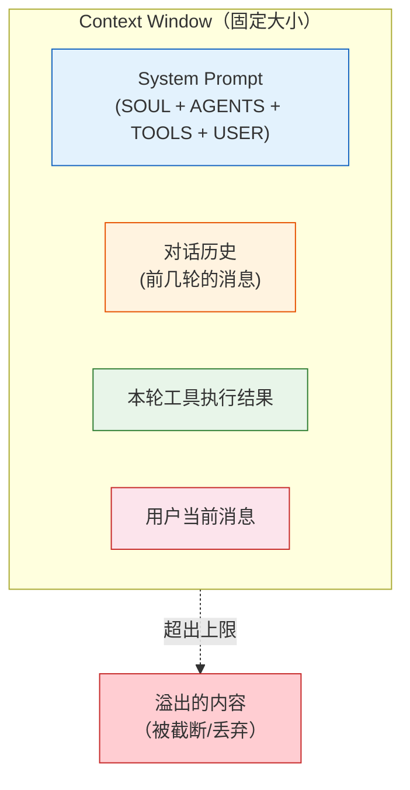
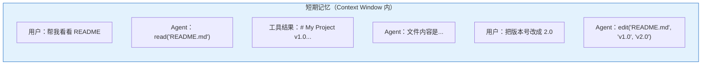
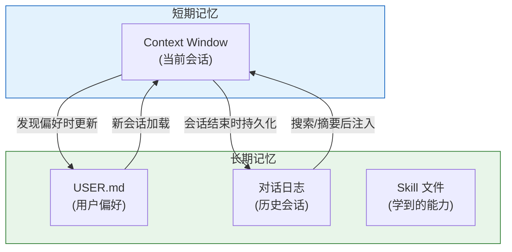
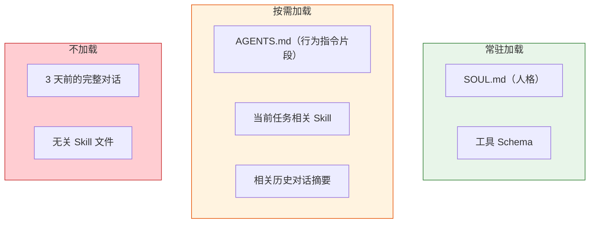

# OpenClaw 原理拆解（四）—— Context Window 与记忆机制

上一篇讲了 ReAct 循环和 Tool Calling 的链路。但有一个问题一直没说——每次推理时，LLM 到底能"看到"多少信息？Agent 的记忆是怎么管理的？

这篇要讲的 Context Window，是 Agent 工程中最核心的硬约束。

---

## 1. Context Window 是什么

Context Window（上下文窗口）是 LLM 单次推理能处理的 **Token 总量上限**。

把 LLM 想象成一张固定大小的工作台。每次推理时，所有需要处理的信息——System Prompt、对话历史、工具定义、工具返回结果、用户当前消息——全部堆在这张工作台上。**工作台放不下的东西，LLM 看不到**。



主流模型的 Context Window 大小：

| 模型 | Context Window |
|------|---------------|
| GPT-4o | 128K tokens |
| Claude 3.5 Sonnet | 200K tokens |
| DeepSeek-V3 | 128K tokens |

128K tokens 听起来很大，但在 Agent 场景下消耗速度极快。

### 为什么说它是"最核心的约束"

一轮完整的 Agent 推理，Context Window 要装这些东西：

```
System Prompt（SOUL + AGENTS + TOOLS + USER）     ≈ 2,000-5,000 tokens
工具定义（JSON Schema，内置 10+ 个工具）             ≈ 1,500-3,000 tokens
对话历史（前 N 轮消息 + 工具执行结果）               ≈ 变量，可能数万
当前消息                                           ≈ 100-500 tokens
LLM 需要生成的回复空间                              ≈ 1,000-4,000 tokens
```

System Prompt + 工具定义是**固定开销**，每次推理都要带上，无法省略。这部分已经吃掉了 3,000-8,000 tokens。

剩下的空间留给对话历史和工具结果。一次 `bash` 命令的输出可能几千 tokens（比如 `git log` 的输出），一次 `read` 大文件也轻松上万。几轮循环下来，Context Window 就满了。

满了会怎样？LLM 看不到早期的对话内容，就会"忘记"之前做过什么、用户说过什么。行为上要么重复操作，要么做出矛盾的决策。

## 2. 短期记忆 vs 长期记忆

为了在有限的 Context Window 中管理好 Agent 的记忆，需要区分两种记忆类型。

### 短期记忆（Working Memory）

**定义**：当前会话中的对话历史和工具执行结果。



特点：
- 存在 Context Window 内，LLM 直接可见
- 会话结束（或 Context Window 满了）就丢失
- 信息密度高：包含完整的消息内容和工具返回值

**类比**：大脑的工作记忆。正在处理的任务信息放在这里，容量有限、随时更新。

### 长期记忆（Persistent Memory）

**定义**：跨会话持久化存储的信息。

在 OpenClaw 中，长期记忆主要通过两种方式实现：

**1. 本地 Markdown 文件**

OpenClaw 把对话历史和用户偏好写入本地文件。`USER.md` 就是最直接的长期记忆载体——Agent 在交互中发现用户偏好后，更新 `USER.md`，下次会话自动加载。

```
用户：以后代码都用 TypeScript 写
Agent：好的，已记录。
（Agent 更新 USER.md：- 偏好 TypeScript）
```

**2. 对话日志（Conversation Logs）**

每次会话的完整对话记录持久化到磁盘。后续会话可以通过搜索/摘要的方式检索历史内容。



两种记忆的对比：

| 维度 | 短期记忆 | 长期记忆 |
|------|---------|---------|
| 存储位置 | Context Window（内存） | 本地文件（磁盘） |
| 生命周期 | 当前会话 | 跨会话持久化 |
| 容量 | 受 Context Window 限制 | 受磁盘空间限制 |
| 访问方式 | LLM 直接可见 | 需要检索/加载后注入 |
| 写入时机 | 每轮自动追加 | 显式持久化（会话结束/偏好发现） |
| 典型内容 | 当前任务的上下文 | 用户偏好、历史经验、学到的技能 |

## 3. Context Window 管理策略

Context Window 不够用是 Agent 工程的日常。几种常见的管理策略：

### 3.1 滑动窗口

最直接的方案：只保留最近 N 轮对话，老的消息被截断丢弃。

```
保留策略：最近 20 轮
第 1-20 轮 → 保留
第 21 轮进来 → 第 1 轮被丢弃
```

优点：实现简单。缺点：丢失早期上下文。如果用户在第 3 轮说过一个关键信息，到第 24 轮时 Agent 已经不记得了。

### 3.2 摘要压缩

把老的对话历史用 LLM 压缩成一段摘要，然后丢弃原始内容，只保留摘要。

```
原始 20 轮对话 (8,000 tokens)
    ↓ LLM 摘要
"用户要求修改 my-project 仓库的 README，
 已完成版本号更新(v1.0→v2.0)和描述修改。
 用户偏好 TypeScript。" (200 tokens)
```

优点：信息损失可控，省大量 tokens。缺点：摘要本身需要一次额外的 LLM 调用（有成本），摘要过程中可能丢失关键细节。

### 3.3 工具结果截断

工具返回值通常是 Context Window 的最大消费者。一次 `git log` 或 `cat` 大文件轻松上万 tokens。

策略：对工具返回值设置最大长度，超出部分截断，并附注"结果已截断，完整内容共 N 行"。

```
bash("git log") 返回 50,000 tokens
    ↓ 截断
保留前 2,000 tokens + "[结果已截断，完整日志共 1,284 条]"
```

### 3.4 分层注入

不是所有信息都需要常驻 Context Window。



SOUL.md 和工具定义必须常驻；AGENTS.md 的行为指令按当前任务类型选择性注入；历史对话只在被引用时检索注入。

## 4. OpenClaw 的记忆实践

OpenClaw 的记忆机制体现了"本地优先"的设计哲学。

**对话历史**：每个 Agent workspace 下有独立的日志目录，完整记录每次会话。新会话启动时，Agent Runner 不会自动加载所有历史（那样 Context Window 立即爆炸），而是通过搜索/检索的方式在需要时查阅。

**用户偏好**：通过 `USER.md` 持久化。Agent 在交互中主动学习——比如发现用户反复要求用中文、反复使用 TypeScript，就更新 `USER.md`。这个文件在每次推理时作为 System Prompt 的一部分加载。

**Skill 注入**：每个 Skill 自带一个 `SKILL.md` 文件（类似微型 System Prompt）。只有当用户的请求与 Skill 的触发条件匹配时，对应的 `SKILL.md` 才被注入 Context Window，不占常驻空间。

这套设计的原则是：**能不往 Context Window 里塞的就不塞，需要时再捞**。

## 5. 记忆机制的 Trade-offs

| 策略 | 节省的 Context | 付出的代价 |
|------|---------------|-----------|
| 滑动窗口 | 只保留最近 N 轮 | 丢失早期关键信息 |
| 摘要压缩 | 大幅压缩历史 | 额外 LLM 调用成本 + 细节丢失风险 |
| 工具结果截断 | 控制单次输出 | 可能截掉关键信息 |
| 分层注入 | 按需加载 | 检索延迟 + 可能遗漏相关信息 |
| USER.md 持久化 | 跨会话记忆偏好 | 偏好可能过时、文件可能膨胀 |

没有完美的方案。实际使用中，这几种策略通常组合使用——滑动窗口兜底、关键对话做摘要、工具结果做截断、偏好持久化到 USER.md。

---

## 小结

- **Context Window** 是 LLM 单次推理能处理的 Token 总量上限，是 Agent 工程中最硬的物理约束
- System Prompt + 工具定义的固定开销通常占 3,000-8,000 tokens，剩余空间留给对话历史和工具结果
- **短期记忆**存在 Context Window 中（当前会话），**长期记忆**持久化到磁盘（USER.md、对话日志）
- 管理策略：滑动窗口、摘要压缩、工具结果截断、分层注入，通常组合使用
- OpenClaw 的本地优先设计：对话日志存磁盘、偏好存 USER.md、Skill 按需注入

下一篇进入 Skill 生态——OpenClaw 如何通过可扩展的"技能包"解锁更多能力，Skill 的内部结构和执行流程长什么样。
