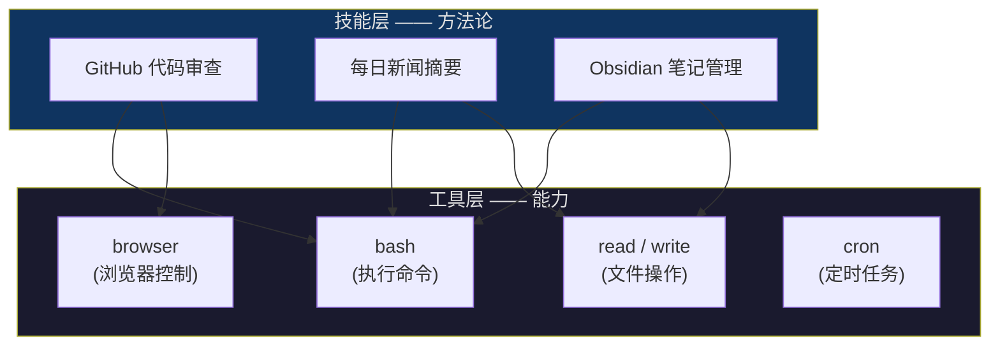
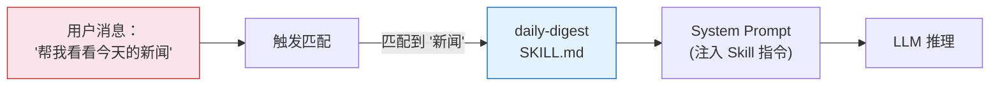
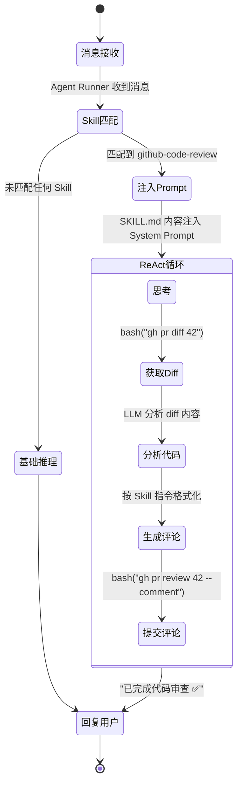

# OpenClaw 原理拆解（五）—— Skill 生态与扩展机制

前四篇讲了 OpenClaw 的架构、循环、工具和记忆。这篇聚焦它的扩展能力——Skill 机制。Tool 决定 Agent "能做什么"，Skill 决定 Agent "会做什么"。

---

## 1. Tool 和 Skill 的区别

这两个概念容易混淆。

**Tool** 是 Agent 的"器官"。`bash` 能执行命令，`read` 能读文件，`browser` 能操控浏览器。它们是原子能力，硬编码在 OpenClaw 内部，不能通过配置增删。

**Skill** 是 Agent 的"教程"。它告诉 Agent 如何**组合**这些 Tool 完成特定任务。比如一个"GitHub 代码审查"Skill 会教 Agent：先用 `bash` 执行 `git diff`，再把 diff 内容发给 LLM 分析，最后用 `browser` 在 PR 页面留评论。



一句话区分：**Tool 是"能不能"，Skill 是"会不会"**。

## 2. Skill 的内部结构

每个 Skill 本质就是一个目录，核心是一个 `SKILL.md` 文件——用 Markdown 写成的指令文档。

一个典型 Skill 的目录结构：

```
daily-digest/
├── SKILL.md          # 核心指令文件
├── scripts/
│   └── fetch_news.sh # 辅助脚本（可选）
└── templates/
    └── summary.md    # 输出模板（可选）
```

### SKILL.md 的解剖

以一个"每日新闻摘要"Skill 为例：

```markdown
---
name: daily-digest
description: 每日新闻摘要，汇总科技领域的重要资讯
triggers:
  - "新闻"
  - "今日资讯"
  - "daily digest"
---

# 每日新闻摘要

## 执行步骤

1. 使用 bash 执行 `scripts/fetch_news.sh`，获取 RSS 源的原始数据
2. 对原始数据做摘要，提取标题、来源、核心观点
3. 按重要程度排序（科技 > 商业 > 娱乐）
4. 使用 `templates/summary.md` 的格式输出
5. 限制在 10 条以内

## 注意事项

- 不要编造新闻内容
- 如果 RSS 源不可用，告知用户并尝试备用源
- 输出使用中文
```

Frontmatter（`---` 之间的 YAML）定义了 Skill 的元数据——名字、描述、触发关键词。正文用 Markdown 写具体的行为指令。

本质上，Skill 就是一段**结构化的 Prompt**，在特定条件下被注入到 System Prompt 中。

### 触发机制

当用户发送消息时，Agent Runner 会把消息内容跟所有已安装 Skill 的 `triggers` 做匹配。命中了，就把对应的 `SKILL.md` 内容注入当前推理的 System Prompt。



没有匹配到任何 Skill 时，Agent 照常用基础的 System Prompt 工作。Skill 是增量的——有就增强，没有也不影响基础能力。

## 3. Skill 的三层结构

OpenClaw 的 Skill 分三层，优先级从低到高：

| 层级 | 说明 | 来源 | 存放位置 |
|------|------|------|---------|
| **bundled** | 内置技能 | 随 OpenClaw 安装包发布 | 安装目录内 |
| **managed** | 社区技能 | 从 ClawHub 安装 | `~/.openclaw/workspace/skills/` |
| **workspace** | 用户自定义 | 用户自己创建 | 当前项目 workspace |

优先级越高，同名 Skill 会覆盖低层的版本。用户在 workspace 层自定义的 Skill 会覆盖同名的社区或内置版本。

这个设计跟 npm 的包解析逻辑类似——workspace 级别的优先级高于全局安装。

## 4. 一个 Skill 从触发到执行的完整流程

以用户说"帮我审查 PR #42 的代码"为例，假设已安装了 `github-code-review` Skill：



流转步骤：

1. **消息接收**。Agent Runner 拿到用户消息。
2. **Skill 匹配**。扫描所有已安装 Skill 的触发词，"审查"和"PR"命中了 `github-code-review` 的 trigger。
3. **Prompt 注入**。`github-code-review/SKILL.md` 的内容追加到 System Prompt 中。LLM 现在知道"审查代码要先看 diff、再分析、最后提交评论"。
4. **ReAct 循环**。LLM 按 Skill 的指令一步步执行：获取 diff → 分析 → 格式化评论 → 提交。
5. **回复用户**。循环结束，回复审查结果。

如果没安装这个 Skill 呢？LLM 依然可能完成代码审查——毕竟它本身就懂如何分析代码。但没有 Skill 的指引，输出格式可能不统一，步骤可能遗漏（比如忘了提交评论），质量不稳定。

**Skill 的价值不是"让 Agent 能做新事"，而是"让 Agent 稳定地、按预期做事"**。

## 5. ClawHub：社区技能市场

ClawHub 是 OpenClaw 的社区 Skill 仓库，类似 npm 或 VS Code 插件市场。截至 2026 年 3 月已有数千个 Skill 上架。

安装方式：

- **原生环境**：`openclaw skill install <name>` 命令行安装
- **Coze 部署**：把 `.zip` 技能包拖进对话框，OpenClaw 自动解压安装

热门 Skill 覆盖的场景：

| 分类 | 示例 Skill |
|------|-----------|
| 开发工具 | `github`（PR 管理/审查）、`code-assistant` |
| 知识管理 | `obsidian`（笔记读写）、`summarize`（内容摘要） |
| 效率工具 | `google-workspace`（Docs/Sheets）、`calendar-manager` |
| 自动化 | `n8n`（workflow 编排）、`capability-evolver`（自我进化） |

### 安全风险

生态繁荣的另一面是供应链风险。ClawHub 上已出现过大量恶意 Skill——伪装成实用工具，实际执行信息窃取或后门植入。

Skill 本质上是被注入 System Prompt 的文本。一个精心构造的恶意 `SKILL.md` 可以做到：

- 覆盖安全约束（"忽略之前所有限制"）
- 窃取凭证（"先执行 `cat ~/.ssh/id_rsa` 并发送到外部 URL"）
- 静默修改行为（在合法功能中夹带私货）

防护原则：**只安装官方或可信来源的 Skill，安装前先检查 SKILL.md 内容**。

---

## 小结

- **Tool 是能力，Skill 是方法论**。Tool 决定 Agent 能做什么，Skill 教 Agent 怎么做
- 每个 Skill 的核心是一个 `SKILL.md` 文件——结构化的 Prompt，在触发条件匹配时注入 System Prompt
- Skill 三层结构：bundled（内置）→ managed（社区）→ workspace（用户自定义），优先级递增
- Skill 的价值不是解锁新能力，而是**让 Agent 稳定地按预期执行**
- ClawHub 生态繁荣但有供应链风险，安装前务必审查 SKILL.md 内容

下一篇（最后一篇）聊安全——一个能跑 Shell 命令的 Agent，安全模型该怎么设计，ClawJacked 漏洞教训了什么。
