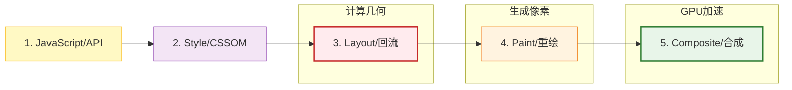

# 第一部分：认知篇 —— 为什么要优化？

很多开发者谈性能优化，往往从“图片懒加载”、“防抖节流”入手。这种碎片化的优化往往收效甚微。真正的性能优化专家，是拿着**数据（Metrics）**和**规范（Specs）**说话的医生。本章抛弃“感觉很快”的玄学，从浏览器底层视角重新审视什么是性能。

## 1.1 性能与业务：不仅是体验，更是生死

### Case Study: 某海外 OTA 平台首屏优化
*   **背景**：该平台移动端 M 站 LCP (Largest Contentful Paint) 长达 4.2s。用户在大促期间流失率极高。
*   **分析**：通过 Performance Panel 发现，主线程在 `onload` 之前被大量第三方 Marketing 脚本（GTM, Facebook Pixel）阻塞，导致关键渲染路径被切断。
*   **动作**：实施“脚本降级策略”，将非关键营销脚本推迟到 `requestIdleCallback` 中执行。
*   **结果**：
    *   LCP: 4.2s -> **1.8s**
    *   Bounce Rate (跳出率): **降低 18%**
    *   Ad Revenue (广告收入): 并未因脚本推迟而下降，反而因流量留存增加而 **提升 5%**。
*   **数据洞察**：注意区分 **P50（中位数）** 与 **P99（长尾）**。优化往往是为了拯救那 1% 的极慢用户，因为在电商场景下，他们可能贡献了极高的流失率。
*   **结论**：性能预算（Performance Budget）必须作为业务 KPI 的一部分。建议团队设定明确红线，例如：
    *   首屏关键 JS < 170KB (Gzip后)
    *   LCP < 2.5s
    *   所有长任务 (Long Task) 总和 < 100ms

## 1.2 性能指标演进：从 “加载中” 到 “交互中”

不再关注 `window.onload`，因为在这个单页应用（SPA）横行的时代，`onload` 触发时页面可能还是白的。Google 在 2020 年提出了 **Core Web Vitals**，重新定义了性能标准。

### 1. LCP (Largest Contentful Paint) - 最大内容绘制
*   **定义**：视口内最大可见元素（通常是 Banner 图或 H1 标题）完成渲染的时间。
*   **底层规范**：根据 [Paint Timing API](https://w3c.github.io/paint-timing/)，浏览器会在渲染过程中不断分发 `PerformanceEntry`，直到用户进行交互（点击/滚动）。
    ```javascript
    new PerformanceObserver((entryList) => {
      for (const entry of entryList.getEntries()) {
        console.log('LCP candidate:', entry.startTime, entry.element);
        // 生产环境建议通过 Beacon API 上报到日志服务器
      }
    }).observe({type: 'largest-contentful-paint', buffered: true});
    ```
*   **深度拆解**：LCP 不仅仅是“图片下载快慢”。完整的 LCP 链路包含：
    *   `TTFB` (服务器响应)
    *   `Resource Load Delay` (资源排队/发现延迟)
    *   `Resource Load Time` (下载耗时)
    *   `Element Render Delay` (渲染延迟)
    *   *这表明：优化 LCP 不止要压缩图片，还要优化后端接口响应（TTFB）和消除 CSS 阻塞（Render Delay）。*
*   **[Diagram Trigger]**: *插入核心指标时间轴图：展示 TTFB -> Load -> Render 的流水线。*

```mermaid
gantt
    title 前端性能核心指标时间轴
    dateFormat  X
    axisFormat %s
    
    section 网络层
    DNS/TCP/TLS握手     :a1, 0, 30
    TTFB (服务器响应)    :a2, 30, 80
    内容下载 (HTML)      :a3, 80, 110
    
    section 浏览器解析
    DOM解析             :a4, 110, 160
    
    section 关键指标
    FCP (首次绘制)       :milestone, m1, 160, 0
    LCP (最大内容绘制)   :milestone, m2, 240, 0
    
    section 渲染完成
    DOMContentLoaded    :160, 180
    Window Load         :260, 280
```

*   **为什么重要**：它代表了用户**感知**到的加载速度。

### 2. INP (Interaction to Next Paint) - 交互到下一次绘制
*   **离散交互的全量衡量**：INP 衡量的是**所有**离散交互（点击、键盘输入、拖拽），而不仅仅是第一次。
    *   *INP vs FID*：FID (First Input Delay) 仅关注“第一印象”的响应延迟；INP 关注由于交互逻辑复杂导致的“全生命周期”卡顿。Google 替换它的原因正是为了捕捉那些发生在页面使用中途的卡顿。
*   **底层原理**：INP = Input Delay（输入延迟）+ Processing Time（事件处理耗时）+ Presentation Delay（渲染延迟）。
    *   *Case Study*: Vue 3 中常见的 `v-model` 绑定在大表单上，每次输入都触发全量组件更新，这就是典型的 INP 杀手。
    *   *Case Study*: 用户点击“添加到购物车”，按钮卡住不动。这倒逼开发者必须优化**整个**交互链路（比如不要在 点击回调里做全量 DOM Diff）。

### 3. CLS (Cumulative Layout Shift) - 累积布局偏移
*   **计算公式**：`Layout Shift Score = Impact Fraction × Distance Fraction`。
*   **常见 Bug**：图片未指定宽高。浏览器先渲染文字，图片下载完后撑开高度，导致下方文字跳动。
*   **Best Practice**：始终为 `` 和 `<video>` 设置 `width` 和 `height` 属性（或 CSS 宽高比 `aspect-ratio`），预留空间。

## 1.3 性能测量工具深度解析

### 1. Chrome DevTools (Performance Panel) - 火焰图大师
这是排查“卡顿”的终极核武器。

#### 🔴 火焰图 (Flame Chart) 怎么看？
*   **X 轴**：时间。
*   **Y 轴**：调用栈深度。
*   **颜色与像素管道**：
    *   🟨 **黄色 (Scripting)**：JavaScript 执行。
    *   🟪 **紫色 (Rendering)**：涉及 Style 计算与 Layout 布局。
    *   🟩 **绿色 (Painting)**：涉及 Paint 绘制与 Composite 合成。
    *   *理解这一点，就能明白为什么 JS 耗时太久会阻塞后续的 样式 -> 布局 -> 绘制 流程。*
*   **[Diagram Trigger]**: *插入渲染流水线图：JavaScript -> Style -> Layout -> Paint -> Composite。*

*   **Long Task（长任务）**：如果在 Main 线程上看到一个任务条带红色三角形（Red Triangle），且时长 > 50ms，这就是我们要杀的“怪”。
    *   *实战技巧*：点击红色任务，在 Bottom-Up 面板中按 `Self Time` 排序，直接定位到是哪个函数（如 `calculateExpensiveData`）占用了 CPU。

### 2. WebPageTest - 瀑布图 (Waterfall) 专家
 Lighthouse 只是实验室跑分，WebPageTest 能告诉你真实网络下的惨状。

#### 🌊 瀑布图解读关键点
*   **Queueing (排队)**：白色条。如果太长，说明浏览器发不出请求了（HTTP/1.1 并发限制 6 个）。**解法**：切 HTTP/2。
*   **TTFB (Time To First Byte)**：绿色条。等待服务器响应的时间。如果太长，说明后端数据库慢或没上 CDN。
*   **Content Download**：蓝色条。下载资源的时间。如果太长，说明文件体积太大。**解法**：压缩、拆包。

### 3. 编程方式：Performance API
不要只依赖工具，要在代码里埋点。
```javascript
// 获取精准的关键时间点
const timing = performance.getEntriesByType('navigation')[0];
console.log('DNS耗时:', timing.domainLookupEnd - timing.domainLookupStart);
console.log('TCP握手:', timing.connectEnd - timing.connectStart);
console.log('DOM解析:', timing.domInteractive - timing.responseEnd);
```

---


## 1.4 实践练习

**操作**：打开项目，按 F12 进入 Performance 面板录制一次刷新，观察 Main 线程里有多少个“红色小三角”？

---

**(下一章预告)**：了解了怎么看病（测量），接下来要开药方。首先解决最致命的瓶颈——网络传输。如何让资源“瞬移”到浏览器？
