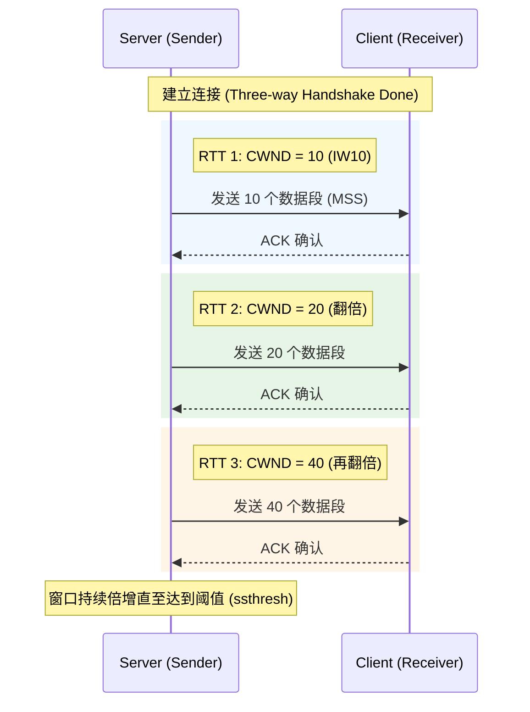
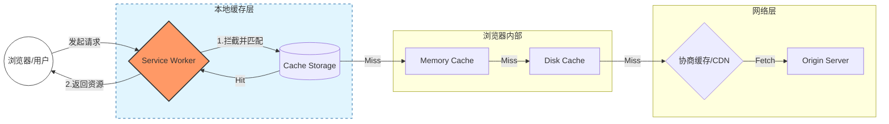

# 第二部分：网络传输优化 —— 越快越小越好

浏览器渲染页面的前提是拿到 HTML、CSS 和 JS。在这一层，每一毫秒的延迟都源于物理距离和协议开销。目标是战胜 TCP/IP 的物理限制。

## 2.1 HTTP 协议优化：从线头阻塞到多路复用

### 1. 为什么 HTTP/1.1 慢？(底层原理)
除了众所周知的**队头阻塞 (Head-of-Line Blocking)**，还有一个容易被忽视的机制：**TCP 慢启动 (Slow Start)**。
*   **CWND (Congestion Window)**：TCP 连接刚建立时，服务器不敢发太多数据，通常只有 10 个 TCP 段（约 14KB）。只有收到客户端的 ACK 确认后，窗口才会倍增。[RFC 6928 (IW10)](https://tools.ietf.org/html/rfc6928)
*   **影响**：如果 `index.html` 有 100KB，它至少需要 4 次 RTT（往返）才能下完。这就是为何要极力控制首屏 HTML 在 **14KB** 以内（Critical Chunk）。
    *   *实战意义*：这正是现代框架（如 Next.js 或 Vite）会尝试将 **关键 CSS (Critical CSS)** 直接内联到 HTML 的 `<head>` 中。目的是让这 14KB 包含页面渲染所需的全部骨架，从而实现“一跳出图”。
*   **[Diagram Trigger]**: *插入 TCP 慢启动示意图：展示 CWND 窗口如何从 10 呈指数级（10 -> 20 -> 40）增长。*


### 2. HTTP/2 的多路复用详解
HTTP/2 引入了 **二进制分帧层 (Binary Framing Layer)**，从根本上解决了 **TCP 连接复用** 的问题。
*   **深度原理**：为什么“连接多”就是慢？
    *   在 HTTPS 普及的今天，建立一个新连接不仅仅是 TCP 三次握手，还有 TLS 四次握手。
    *   **Visual Tips**: *[新连接: RTT x 3] -> [HTTP/2 复用: RTT x 0]*。复用已有的连接意味着 0 延迟发送数据，这对抗弱网环境至关重要。
*   **可视化想象**：
    *   *HTTP/1.1*：是一条单行道。前车（大图片）坏了，后车（关键 CSS）只能干等。
    *   *HTTP/2*：把大图片切碎成一个个带 ID 的小包裹（Frame），和 CSS 的小包裹在同一条路上混着跑。浏览器收到后根据 ID 重新组装。
*   **Tips - 压缩算法的降维打击**：Gzip 已经是过去式了。
    *   **Brotli (br)**：比 Gzip 高 15%-25% 的压缩率。对于 JS/CSS 这种文本资源，开启 Brotli 是成本最低、收益最高的网络层优化。
*   **Case Study: 某新闻门户**
    *   **问题**：首页有 50+ 张缩略图，导致 CSS 加载被挂起（Pending），首屏样式错乱（FOUC）。
    *   **优化前**：Waterfall 图中呈现出经典的 **“阶梯状” (Staircase Effect)**，因为浏览器限制了每域名 6 个并发链接，后续请求都在排队。
    *   **优化后**：开启 HTTP/2。
    *   **结果**：Waterfall 图中 50 个图片请求变成了 **“齐刷刷的一条直线”**，几乎同时开始下载（Start Time 相同）。LCP 提升 300ms。
*   **[Diagram Trigger]**: *插入 Waterfall 对比图：左边是一组一组的阶梯状请求（HTTP/1.1），右边是齐发的垂直直线（HTTP/2）。*

<div style="display: flex; gap: 20px; align-items: flex-start;">
<div style="flex: 1; min-width: 0;">

**1. HTTP/1.1：队头阻塞与阶梯效应**

```mermaid
gantt
    title HTTP/1.1 瀑布图 (受限于并发限制)
    dateFormat  ss
    axisFormat  %S
    section TCP 连接 1
    关键 CSS           :a1, 00, 01s
    图片 1             :after a1, 1s
    section TCP 连接 2
    关键 JS            :a2, 00, 01s
    图片 2             :after a2, 1s
    section TCP 连接 3-6
    其他资源...        :a3, 00, 01s
    图片 3-6           :after a3, 1s
    section 排队等待 (Pending)
    图片 7 (等待连接释放) :after a1, 1s
    图片 8 (等待连接释放) :after a2, 1s
```


</div>
<div style="flex: 1; min-width: 0;">

**2. HTTP/2：多路复用与并发齐发**

```mermaid
gantt
    title HTTP/2 瀑布图 (多路复用)
    dateFormat  ss
    axisFormat  %S
    section 单个 TCP 连接
    关键 CSS           :00, 01s
    关键 JS            :00, 01s
    图片 1             :00, 1s
    图片 2             :00, 1s
    图片 3             :00, 1s
    图片 4             :00, 1s
    图片 5             :00, 1s
    图片 6             :00, 1s
    图片 7             :00, 1s
    图片 8             :00, 1s
```


</div>
</div>

### 3. HTTP/3 (QUIC)
解决 TCP 在操作系统内核层面的阻塞。基于 UDP，在用户态实现了可靠传输。对于丢包率高的弱网环境（如电梯、地铁），提升巨大。

## 2.2 缓存策略：多级缓存防线

请求资源的最佳路径：Memory Cache -> Disk Cache -> Service Worker -> CDN -> Origin Server。
*   **[Diagram Trigger]**: *插入缓存层级图：重点展示 Service Worker 位于所有网络请求的最前端，就像一个本地代理服务器。*


### Case Study: 304 Not Modified 的陷阱
**场景**：某 JS 文件配置了协商缓存（Example: `Etag: "v1"`）。
**分析**：虽然 304 没传 Body，但还是要发一次 HTTP 请求去问服务器。这次网络往返（RTT）本身就是开销（可能是 100ms）。
**优化**：对于带 Hash 指纹的静态资源（如 `app.8f9a2b.js`），**完全不应该走协商缓存**，而应该直接走强缓存 `Cache-Control: max-age=31536000, immutable`。
**原理**：`immutable` 指令明确告诉浏览器：“只要指纹没变，这个文件长期有效，无需询问服务器”。
**⚠️ 避坑指南：启发式缓存 (Heuristic Caching)**
*   **危险操作**：如果不设置 `Cache-Control`，浏览器会根据 `Date` - `Last-Modified` 的差值计算一个默认缓存时间。
*   **后果**：用户反馈页面没更新，哪怕服务端已发布新版。务必显式设置 `Cache-Control: no-cache` (需要协商) 或具体的 `max-age`。

### Service Worker：不仅是离线
它是一个能够拦截网络请求的 **Programmable Network Proxy**。
```javascript
// sw.js
// 经典的 Cache-First 策略示例
self.addEventListener('fetch', event => {
  event.respondWith(
    caches.match(event.request).then(response => {
      // 1. 如果缓存里有，直接返回缓存 (快如闪电)
      if (response) {
        return response;
      }
      // 2. 如果没有，再去网络下载
      return fetch(event.request);
    })
  );
});
/* 
  甚至可以拦截图片请求，替换成本地占位图，或者做 WebP 自动降级！
  if (/\.jpg$/.test(event.request.url)) { ... }
*/
```

## 2.3 CDN 的核心：关键不在“分发”，在“边缘”

### 1. 减少 RTT
光速是有限的。从北京请求纽约的数据，光纤往返最快也要 100ms+。
CDN 将内容推送到离用户只有 5ms 的“家门口”基站。

### 2. 动静分离与动态加速
*   **静态资源**：推送到边缘节点存储。
    *   **防止缓存击穿 (Cache Breakdown)**：CDN 的性能取决于命中率。
    *   **Tip**: 使用 `Cache-Control: s-maxage=3600`。`s-maxage` 是专门给 CDN 代理服务器看的，而 `max-age` 是给浏览器看的。
    *   *实战场景*：可以设置 `s-maxage=3600` (CDN 存1小时) 但 `max-age=0` (浏览器不存)。这样当紧急回滚代码时，只需要刷新 CDN 缓存，用户浏览器因为没存缓存，立刻就能获取到最新版本，避免了“浏览器缓存清不掉”的尴尬。
*   **动态 API**：虽然不能缓存，但可以使用 CDN 的**链路优化**（回源线路优化）。CDN 厂商通常有高质量的专线网络，比公网直连更稳定。

### 3. HTTP/2 Push vs 103 Early Hints
*   **HTTP/2 Push**：那是服务器强推。问题是服务器不知道浏览器缓存里有没有，容易浪费带宽推送重复资源。已被 Chrome 废弃。
*   **103 Early Hints**：HTTP 状态码。服务器在处理 HTML（需要几百毫秒查询数据库）的同时，先发一个 103 响应头：
    `Link: </style.css>; rel=preload`
    *   **区别**：
        *   `rel=preload`: 优先级高，明确告诉浏览器“这个资源页面渲染马上要用，赶紧下！”
        *   `rel=preconnect`: 仅建立 TCP/TLS 连接，不下载。
    *   **场景**：当 HTML 还在后端生成时，浏览器利用这段闲置时间利用 Early Hints 提前开始 DNS 解析 + TCP 握手 + 资源下载。这在 LCP 曲线上表现为资源下载时间轴的显著左移。

---

**(下一章预告)**：资源下载回来了，但如果你的 JS 包有 5MB，再快的 5G 也没用。下一章深入构建环节，看 Tree Shaking 如何像园丁一样修剪代码枯枝。
