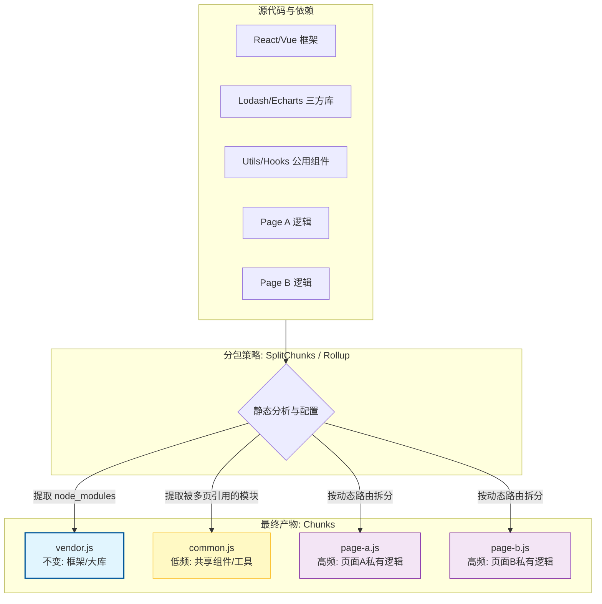

# 第三部分：资源构建优化 —— 现代工程化方案

构建工具（Webpack/Vite）不仅是打包器，更是代码的“抽脂机”。优化的核心在于：**只加载当前所需的代码**。

## 3.1 包体积瘦身：从“全量打包”到“按需精确制导”

**逻辑补充：Vite 的“依赖预构建” (Dependency Pre-bundling)**
Vite 利用 `esbuild` 将成百上千个 ESM 请求合并，并处理 CommonJS 依赖。这不仅极大地加速了开发环境启动，更解决了浏览器请求瀑布流的问题，是工程化方案中不可或缺的一环。

### 1. Tree Shaking 的底层原理与失效陷阱
```mermaid
graph TD
    subgraph Source_Code [源代码模块: math.js]
        A[export function add(a, b) {...}]
        B[export function subtract(a, b) {...}]
        C[export function multiply(a, b) {...}]
    end

    subgraph Entry_Point [入口文件: app.js]
        D[import { add } from './math.js';]
        E[console.log(add(1, 2));]
        F[// subtract 和 multiply 未被引用]
    end

    subgraph Bundler_Analysis [构建工具的静态分析 (Tree Shaking)]
        G{构建Module Graph & 标记引用}
        H[分析: add 被引用]
        I[分析: subtract 未被引用]
        J[分析: multiply 未被引用]
    end

    subgraph Output_Bundle [最终输出的 Bundle]
        K[function add(a, b) {...}]
        L[console.log(add(1, 2));]
        M((Dead Code: subtract 被移除))
        N((Dead Code: multiply 被移除))
    end

    Source_Code --> D
    D --> G
    A --> H
    B --> I
    C --> J
    G --> H
    G --> I
    G --> J
    H --> K
    D --> L
    I --> M
    J --> N

    %% 样式美化，突出"死代码"
    style Source_Code fill:#f9f,stroke:#333,stroke-width:2px
    style Entry_Point fill:#e6e6fa,stroke:#333,stroke-width:2px
    style Bundler_Analysis fill:#f0fff0,stroke:#333,stroke-width:2px
    style M fill:#eee,stroke:#999,stroke-dasharray: 5 5
    style N fill:#eee,stroke:#999,stroke-dasharray: 5 5
```
Tree Shaking 依赖于 ES Modules 的**静态结构**。Bundler 会构建一个 Module Graph，标记哪些 export 被引用了，没被引用的就是 "Dead Code"。

#### 💀 为什么你的 Tree Shaking 没生效？(Case Study)
*   **Bug 现象**：即使只用了 `lodash` 的一个函数 `import { merge } from 'lodash'`, 打包体积依然巨大。
*   **原因分析**：
    1.  **模块规范**：老版本的 `lodash` 导出的是 CommonJS。Webpack 无法静态分析 CommonJS 的依赖关系，只能全量打包。
        *   *Fix*: 使用 `lodash-es`。
    2.  **Side Effects（副作用）**：如果一个文件里写了 `Date.prototype.format = ...`，Webpack 不敢删它，怕删了导致原型链方法丢失。
    *   *Fix*: 在 `package.json` 显式声明 `"sideEffects": false`，告知 Webpack 该包无副作用，可安全清理。
        *   **⚠️ 避坑指南**：很多 UI 组件库（如 Element Plus / Ant Design）会在 CSS 文件中包含副作用。如果直接设为 `false`，样式可能会丢失！
        *   *Correct Config*:
            ```json
            "sideEffects": ["*.css", "*.scss"]
            ```

### 2. Code Splitting：策略重于技术


不要一股脑全拆，或者拆得太碎。

*   **分包策略：Vendor 缓存 (The Chunking Strategy)**：
    *   **核心逻辑**：避免单体打包或过度碎片化打包。
    *   **最佳实践**：将三方库（node_modules）打成一个 `vendor.js`，将业务逻辑打成 `index.js`。这样在下次访问时可以利用**强缓存**直接命中 `vendor.js`，只需下载变动的业务代码。
*   **Granular Chunking (细粒度拆分)**：
    *   Vite/Rollup 默认策略较好。Webpack 需要调优 `SplitChunksPlugin`。
*   **Case Study: Next.js 的按需加载**
    *   Next.js 针对每个 Page 自动做拆分。但在 Page 内部，假设有一个巨大的 `HeavyChart` 组件，只有用户点某个按钮才显示。
    *   *Bad*: `import HeavyChart from './HeavyChart'` (导致首屏 Bundle 包含了图表库)。
    *   *Good*: Dynamic Import。
        ```javascript
        const HeavyChart = dynamic(() => import('./HeavyChart'), {
          loading: () => <p>Loading...</p>
        })
        ```
    *   **效果**：首屏 JS 体积减少 200KB。
    *   *Tip*: 目标是让首屏 JS 块尽量控制在 **14KB** (Initial Window 10) 的倍数内，以获得最佳的网络响应。

### 3. 自动化利器：可视化你的包体积
“If you can't measure it, you can't improve it.”
*   **工具推荐**：`rollup-plugin-visualizer` (Vite) 或 `webpack-bundle-analyzer`。
*   **实战价值**：构建后生成一张 Treemap，直观展示包体积占比，发现潜在的冗余依赖。可能会发现看似人畜无害的工具库里竟然藏着完整的 `lodash`。

## 3.2 图片专项优化：AVIF 与 响应式
```mermaid
graph TD
    subgraph Image_Size_Comparison [图片文件体积对比 (同等视觉质量)]
        direction LR
        A["JPEG (基线)"] --> A_size("100% (例如: 1.2MB)")
        B["WebP"] --> B_size("~60-70% (例如: 800KB)")
        C["AVIF"] --> C_size("~30-40% (例如: 400KB)")
    end

    %% 强调 AVIF 的优势
    style A_size fill:#ffcdd2,stroke:#c62828
    style B_size fill:#fff9c4,stroke:#fbc02d
    style C_size fill:#e8f5e9,stroke:#2e7d32,stroke-width:2px

    Note right of C_size: AVIF 体积通常仅为 JPEG 的 1/3
```

### Case Study: 某新闻落地页的图片优化复盘
*   **背景**：页面包含大量高清新闻图，LCP 长达 3s。Lighthouse 提示 "Serve images in next-gen formats"。
*   **动作 1：格式升级**
    *   原图：JPEG (1.2MB)。
    *   WebP (Quality 80): 800KB。
    *   AVIF (Quality 65): **400KB**。包含同样的视觉细节，体积只有原来的 1/3。
*   **动作 2：响应式加载 (Responsive Images)**
    *   移动端用户无需加载 4K 图片。
    *   使用 `srcset` 让浏览器根据屏幕密度（DPR）和视口宽度选图。
    ```html
    
    ```
    *   **结果**：移动端流量消耗降低 60%，LCP 提升 1s。

## 3.3 字体优化：肉眼可见的体验提升

### 1. 字体子集化 (Subsetting)
中文字体包动辄 5MB+，全量加载是不现实的。
*   **技术**：`font-spider` 或 Google Fonts 的 `unicode-range`。只把页面上用到的几百个字打包。
*   **效果**：字体文件从 5MB -> 60KB。
*   **进阶：Variable Fonts (可变字体)**：现代浏览器支持原生 Variable Fonts，一个字体文件即可包含多种字重和样式，这是一种极佳的体积优化手段。

### 2. `font-display: swap` 的取舍
*   **FOIT (Flash of Invisible Text)**：文字隐形，体验极差。
*   **FOUT (Flash of Unstyled Text)**：文字先用 Arial 显示，字体下好后变成自定义字体。
*   **建议**：始终使用 `swap`。宁可文字回退一秒，也不能出现内容空白。

---

**(下一章预告)**：代码已发送至浏览器。接下来进入渲染流水线环节。及解析为何修改 `width` 导致高昂开销，而 `transform` 则不然？我们将解读浏览器的“图层合成”机制。
