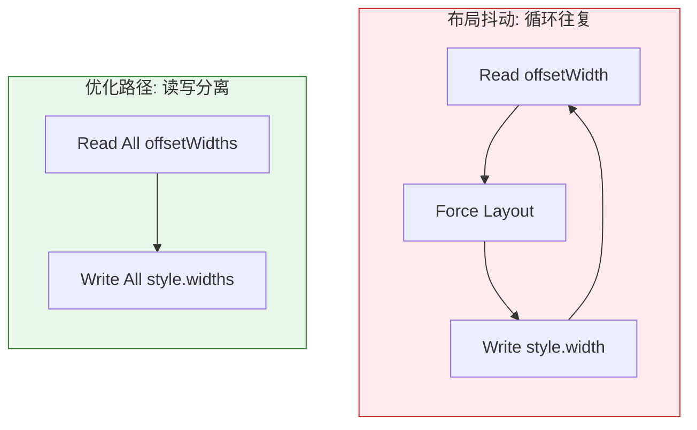
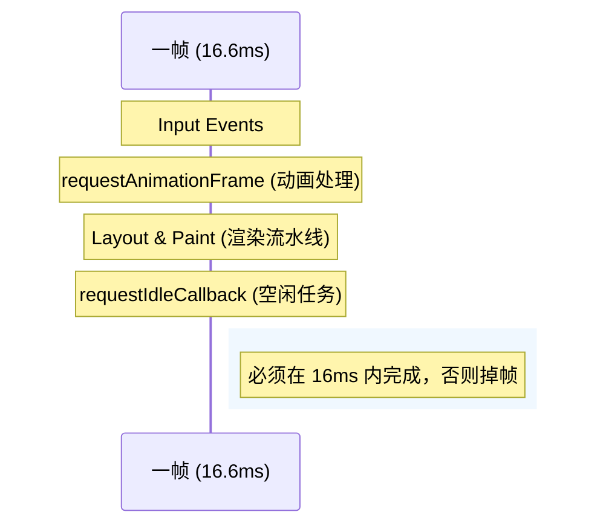

# 第四部分：渲染性能优化 —— 丝滑般的交互体验

如果 Performance Panel 里的紫色（Rendering）和绿色（Painting）条太长，表明 CSS 写法或 DOM 操作可能存在性能瓶颈。

## 4.1 关键渲染路径 (CRP) 的微观世界
浏览器不是一次性画完页面的。
1.  **Parse HTML -> DOM** (字节流 -> 令牌 -> 节点 -> 树)
2.  **Parse CSS -> CSSOM**
3.  **Combine -> Render Tree** (DOM 树中可见的节点 + CSS 样式)
4.  **Layout** (计算盒模型：位置、大小)
5.  **Paint** (填充像素：绘制文字、颜色、阴影)
6.  **Composite** (GPU合成图层)

*   **[Diagram Trigger]**: *插入渲染流水线图：重点展示 CSSOM 与 DOM 合并生成 Render Tree 的过程。*
```mermaid
graph TD
    HTML[HTML] -->|Parse| DOM[DOM Tree]
    CSS[CSS] -->|Parse| CSSOM[CSSOM Tree]
    
    DOM --> Merger{Attachment}
    CSSOM --> Merger
    
    Merger -->|Combine| RenderTree[Render Tree]
    
    subgraph Visible_Nodes_Only [仅包含可见节点]
    RenderTree
    end
    
    RenderTree --> Layout[Layout (Geometry)]
    RenderTree --> Paint[Paint (Pixels)]
    Paint --> Composite[Composite (Layers)]
    
    style RenderTree fill:#e1f5fe,stroke:#01579b,stroke-width:2px
    style DOM fill:#fff3e0,stroke:#ef6c00
    style CSSOM fill:#f3e5f5,stroke:#7b1fa2
```

### 🧐 为什么 `opacity` 比 `visibility` 快？
这需要理解浏览器的 **Layer Model (分层模型)**。
*   现代浏览器（如 Chrome）会将某些特定元素提升为独立的**合成层 (Compositing Layer)**。
*   **GPU 加速**：合成层由 GPU 处理，而不是 CPU。
*   **💡 比喻**：类似于在 Photoshop 中分层修图。
    *   **Opacity/Transform**: 就像调整一个**独立图层**的透明度或位置。底层画布不需要重画，只需要 GPU 调整一下这个图层的属性。
    *   **Width/Margin**: 类似于改变了画面中某个元素的形状。这会挤占其他元素的位置，导致整个画布都需要重新排版（Layout）和上色（Paint）。
*   当改变 `opacity` 或 `transform` 时，浏览器不需要重新计算 Layout (回流) 也不需要 Paint (重绘)，只需要 GPU 调整一下纹理的透明度或坐标。这被称为 **Composite-Only Properties**。
*   相比之下，`visibility: hidden` 可能会触发 Paint，甚至在某些复杂布局下触发 Layout。

#### ⚠️ 避坑：层爆炸 (Layer Explosion)
虽然分层能加速（避免重绘），但**分层不是越多越好**。
*   **代价**：每个合成层都需要消耗显存 (GPU Memory)。管理图层本身也有 CPU 开销。
*   **反面教材**：给所有 `div` 都加上 `will-change: transform`。这会导致低端手机内存耗尽而崩溃。
*   **最佳实践**：只给**正在做动画**或**频繁变动**的元素（如侧滑菜单、固定头部）提升图层。经常使用 `transform` 和 `opacity` 属性来实现高性能动画，因为它们不会触发布局和绘制。

### 🔌 CSS 的“减负”策略：Containment
对于复杂页面，`contain` 属性是隔离性能瓶颈的绝佳利器。
*   **`contain: content`**：属性告诉浏览器“这个元素的子孙节点怎么变，都不会影响元素外面的布局”。
*   **实战场景**：长列表、复杂的 Widget 组件。当组件内部发生回流（Layout）时，浏览器可以放心大胆地**只重新计算该组件内部**，而不用回溯到 `<body>`，从而极大缩小“渲染受灾区”。

## 4.2 强制同步布局 (Forced Synchronous Layout) —— 性能杀手

### Case Study: 滚动列表卡顿
*   **代码片段**：
    ```javascript
    // Bad Practice
    function resizeAllParagraphs() {
      const paragraphs = document.querySelectorAll('p');
      for (let i = 0; i < paragraphs.length; i++) {
        // 读取宽度：触发 Layout！
        const width = paragraphs[i].offsetWidth;
        // 写入宽度：标记 Layout 脏（Invalidate Layout）
        paragraphs[i].style.width = width + 'px';
      }
    }
    ```
*   **问题解析**：
    *   正常流水线：JS -> Style -> Layout -> Paint。
    *   上述代码：JS -> **Layout** -> JS -> **Layout** -> JS -> **Layout**...
    *   每次读取 `offsetWidth`（或者 `scrollTop`, `clientHeight`, `getBoundingClientRect()`），浏览器为返回最新值，被迫立即中断 JS，先执行一次 Layout。如果在循环里这么做，就是**布局抖动 (Layout Thrashing)**。
    *   **⚠️ 隐形陷阱**：`window.getComputedStyle(el)` 也会触发强制同步布局。调试时打印日志可能意外导致页面卡顿。
*   **火焰图特征**：Performance 面板里看到密密麻麻的小紫色长条（Layout），且每个条上方都有红色警告。
*   **Fix**：读写分离 (Batching)。利用 `FastDOM` 的思想，先批量读（Force 一次 Layout），再批量写。

```javascript
// Good Practice: 读写分离 (Batching)
const paragraphs = document.querySelectorAll('p');

// 1. 批量读 (Measure) - 触发一次 Layout
const widths = Array.from(paragraphs).map(p => p.offsetWidth); 

// 2. 批量写 (Mutate) - 触发样式计算，但不会再次触发 Layout (直到下一帧)
paragraphs.forEach((p, i) => {
  p.style.width = widths[i] + 'px';
});
```

*   **[Diagram Trigger]**: *插入布局抖动循环对比图。*


### 🧱 视觉稳定性：消灭 CLS 的终极答案
图片加载前的“突然撑开”是导致 CLS (累积布局偏移) 的头号元凶。
*   **传统解法**：写死 `width` 和 `height` 属性。
*   **现代解法**：**`aspect-ratio`**。
    ```css
    img {
      width: 100%;
      aspect-ratio: 16 / 9; /* 浏览器在图片下载前就能计算出准确高度，预留空间 */
      object-fit: cover;
    }
    ```
*   **效果**：即使图片还没下载下来，浏览器依然能渲染出正确的占位空间，实现 0 偏移渲染。

## 4.3 脚本执行：给主线程喘息的机会

### 1. 长任务 (Long Task) 的危害
浏览器主线程是单线程的。若执行死循环 `while(true)`，UI 即会死锁。
**标准**：任何超过 **50ms** 的任务都被视为长任务。

### 2. Web Workers 与 并行计算
*   **场景**：图片滤镜处理、大文件 MD5 计算。
*   **实战**：把这些 CPU 密集型任务丢给 Worker。主线程只负责 UI 响应。

### 3. requestAnimationFrame vs requestIdleCallback
*   **requestAnimationFrame (rAF)**：
    *   **时机**：每一帧渲染**之前**执行。高优先级。
    *   **核心优势**：**与屏幕刷新率对齐**。
        *   显示器通常是 60Hz (每 16.6ms 刷新一次) 或 120Hz。
        *   `setTimeout(fn, 16)` 无法保证精确对齐，容易出现“掉帧”或“画面撕裂”。
        *   `rAF` 由浏览器调度，确保回调恰好在下一次屏幕刷新信号到来前执行，实现完美的流畅度。
*   **requestIdleCallback**：
    *   **时机**：一帧渲染完，如果还有**剩余时间**，才执行。低优先级。
    *   **用途**：数据上报、预加载资源、非关键 DOM 初始化。

*   **[Diagram Trigger]**: *插入一帧的时间分配图，展示 rAF 和 rIC 的位置。*


---

**(下一章预告)**：React 和 Vue 屏蔽了 DOM 操作细节，但也引入了自身的瓶颈。为何 React 需要 Fiber？为何 Vue 3 采用 Proxy？下一部分深入框架内部机制。
