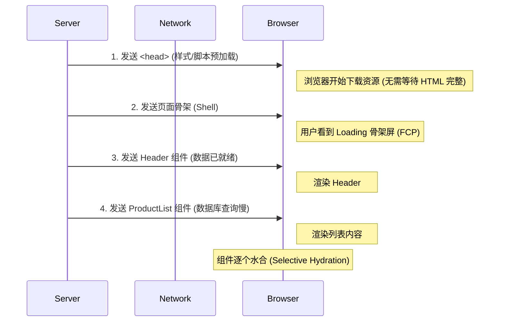

# 第六部分：前沿技术与未来趋势

当常规手段（压缩、缓存、代码分割）已经做到极致，LCP 依然卡在 1.5s 无法突破时，通常意味着需进行**架构级**的升级。

## 6.1 渲染架构的变革：从“一把抓”到“渐进式”

### 1. 客户端渲染 (CSR) 的瀑布流困局
*   **现象**：HTML 只是个壳，用户看到的是长时间的白屏或 Loading。
*   **痛点**：由于 JS 执行与数据请求深度耦合，LCP 受限于用户的设备性能和网络延迟。

### 2. SSR 与 Streaming SSR (流式渲染)
现代 SSR 不再是“等服务器拼完整个 HTML 才发送”的黑盒，而是利用 HTTP 流 (Transfer-Encoding: chunked)。
*   **原理**：服务器并不需要等待整个页面渲染完成。它可以先**即时**吐出 `<head>` 和页面骨架 (Shell)，然后再随着组件渲染完成，逐步将内容“流”回浏览器。
*   **API**：React 18 的 `renderToReadableStream`。
*   **优势**：显著降低 TTFB (Time To First Byte)。浏览器可以边下载边解析样式，不再需要等到 500ms 后才开始加载 CSS。

#### ⚠️ 新陷阱：INP (Interaction to Next Paint)
*   **问题**：虽然内容显示得很快，但 Hydration (水合) 过程会占用主线程。
*   **定量描述**：SSR 虽然优化了 FCP/LCP，但往往会恶化 **TBT (Total Blocking Time)**。如果 JS 包体积过大（> 200KB），主线程会被持续锁定，导致用户点击按钮无响应。
*   **趋势**：为了解决注水开销，业界正在向 **Resumability (可恢复性，如 Qwik)** 和 **React Server Components (RSC)** 演进，试图达成“0 Hydration”的终极目标。

*   **[Diagram Trigger]**: *插入 Streaming SSR 传输示意图：展示 HTML 片段如何随着时间轴分块到达浏览器。*


### 3. ISR (Incremental Static Regeneration) —— 静态的极致
*   **核心逻辑**：将静态生成的快 (CDN) 与动态数据的准 (后台刷新) 结合。
*   **场景**：对于百万级页面的电商系统，`revalidate: 60` 确保了即使是热门商品页，也能拥有毫秒级的 CDN 响应速度，且数据最多只延迟 1 分钟。

*   **[Diagram Trigger]**: *插入 ISR 工作流图：展示 CDN 缓存、用户请求与后台异步刷新 (Revalidate) 的三角关系。*
```mermaid
graph TD
    User((用户)) -- 1. 请求 /product/1 --> CDN{CDN 缓存}
    
    CDN -- 2. 命中缓存 (Hit) --> User
    
    subgraph Background_Process [后台异步更新]
        CDN -. 3. 缓存过期 (Stale) .-> NextJS[Next.js Server]
        NextJS -- 4. 重新生成 HTML --> CDN
    end
    
    style CDN fill:#fff9c4,stroke:#fbc02d
    style Background_Process fill:#f3e5f5,stroke:#7b1fa2
```

## 6.2 WebAssembly (Wasm)：突破 JS 算力天花板

JavaScript 是单线程且动态类型的，天生不适合密集计算。

### Case Study: Figma 的 Web 版与 WebCodecs 协同
当 UI 逻辑不再是瓶颈，计算逻辑（如视频解码、复杂滤镜、加密算法）成为痛点时，Wasm 是唯一解。
*   **WebCodecs 的协同**：
    *   **现状**：单纯用 Wasm 软解视频依然吃力。
    *   **解法**：Wasm 负责**计算**（如 OpenCV 图像识别、复杂的剪辑时间轴逻辑），而 WebCodecs 负责**底层硬件加速**（调用 GPU 解码器）。
    *   **效果**：这才是目前 Web 视频剪辑工具（如剪映 Web 版）能达到 4K 60fps 流畅预览的核心秘密。
*   **平民级应用场景**：
    *   **FFmpeg.wasm**：前端直接转码、提取音频，节省巨大的服务器带宽压力。
    *   **Canvas 滤镜**：从 JS 的 10fps 提升到 Wasm 的 60fps。

#### ⚠️ 避坑：Wasm 通信成本
Wasm 很多时候并不比 JS 快，是因为**数据传输开销**。
*   **Copy Overhead**：JS 和 Wasm 的内存空间是隔离的。将 10MB 的视频帧传入 Wasm 需要进行内存拷贝 (Memory Copy)。
*   **建议**：
    *   对于大文件，使用 `SharedArrayBuffer` 减少拷贝。
    *   尽量让数据流“留”在 Wasm 侧，只把最终结果（如压缩后的图片）传回 JS。

## 6.3 浏览器的新“黑魔法”

### 1. 资源特权：`fetchpriority` 与 `Early Hints`
*   **`fetchpriority="high"`**：可使 LCP 图片在主文档解析初期就抢占带宽，甚至排在某些非核心 CSS 之前。
*   **Early Hints (103)**：
    *   **原理**：在服务器还在拼命查数据库生成 HTML 的那几百毫秒里，先发一个 `103 Early Hints` 响应。
    *   **Payload**：`Link: </main.css>; rel=preload`
    *   **效果**：告知浏览器：“HTML 生成期间，预先加载关键 CSS 和字体”。这能进一步压缩 LCP 路径中的“空闲等待期”。

### 2. 预测加载：Speculation Rules API
这是从“被动优化”向“主动预测”的跨越。
*   **场景**：当用户悬停在“下一页”或“编辑器详情”时，浏览器在后台开启一个不可见的标签页进行预渲染 (Prerender)。
*   **体感性能**：当用户真的点击链接时，耗时为 **0ms**。页面是瞬间替换的。
```html
<script type="speculationrules">
{
  "prerender": [
    {
      "source": "list",
      "urls": ["/page/2", "/page/3"]
    }
  ]
}
</script>
```

*   **[Diagram Trigger]**: *插入预渲染示意图：展示浏览器如何在后台隐形标签页中提前加载资源并执行 JS。*
```mermaid
graph TD
    User[用户当前浏览 Page A]
    HiddenTab[隐形标签页 (Prerender Target)]
    
    User -- 悬停链接 --> Trigger{Speculation Rules}
    Trigger -- 触发预渲染 --> HiddenTab
    
    subgraph Background [后台静默执行]
    HiddenTab -- 下载 HTML/JS/CSS --> Ready[Page B Ready]
    end
    
    User -- 点击链接 --> Swap{瞬间替换}
    Ready -- 0ms --> User
    
    style HiddenTab fill:#e0f7fa,stroke:#006064,stroke-dasharray: 5 5
    style Swap fill:#fce4ec,stroke:#880e4f,stroke-width:2px
```

## 6.4 性能优化的“最后一公里”：离线与缓存
*   **Service Worker**：利用 `CacheStorage` 拦截网络请求。对于 Electron 开发者来说，这是实现离线可用和秒开的关键。
*   **V8 Bytecode Cache**：通过特定配置，让 Service Worker 缓存 JS 编译后的**字节码 (Bytecode)**，跳过 Parse 和 Compile 时间，实现 JS 的“秒执行”。

### 3. 监控闭环：RUM (Real User Monitoring)
技术实现后，如何证明有效？仅依赖 Lighthouse (实验室数据) 是不够的，因为用户的网络环境千差万别。
*   **核心工具**：Google 的 `web-vitals` 库。
*   **监控哲学**：**Field Data > Lab Data**。
*   **实施**：收集真实用户的 LCP、INP、CLS 数据，上报到 Grafana 或 Sentry，形成性能监控的完整闭环。

---

**总结**
性能优化不是一次性的任务，而是一场与主线程争夺毫秒的持久战。从网络层的 HTTP/3，到构建层的 Tree Shaking，再到渲染架构的 Streaming SSR，每一步微小的优化叠加起来，就是用户眼中“快如闪电”的体验。

---

**(下一章预告)**：技术再卓越，若无人守门，代码库也易腐烂。需将性能优化写入制度，集成至 DevOps 流水线。
