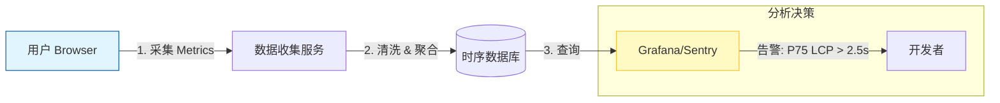
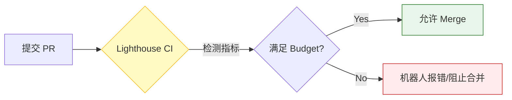

# 第七部分：体系建设篇 —— 让优化可持续

> "Performance is not a checklist, it's a continuous mindset."

若无监控与卡点机制，单次优化的成果极易被后续改动抵消（如引入巨大的 `moment.js` 包）。

## 7.1 RUM (Real User Monitoring) 实战

### 1. 上报什么？
Lab 数据（Lighthouse）仅代表开发环境表现。RUM 数据代表真实用户（不同手机、不同弱网环境）的体验。
*   **关键指标**：LCP, FID (INP), CLS, FCP, TTFB, Resource Timing.
*   **关键指标**：LCP, FID (INP), CLS, FCP, TTFB, Resource Timing.
*   **维度**：Device Type (Mobile/Desktop), Network (4G/Wifi/3G), Region (Geo).
*   **因果关联 (Context)**：务必带上 **Page URL** 和 **Release Version**。否则 LCP 暴涨时难以定位问题页面或版本。

#### ⚠️ 避坑：平均数的谎言 (Percentile Trap)
不要看 Average！平均值会掩盖真相。
*   **建议指标**：关注 **P75**（Google 标准）或 **P95**。
*   **场景**：如果平均 LCP 是 1.2s，但 P99 是 8s，表明应用在弱网环境几乎不可用。Dashboard 需展示长尾用户体验，此为优化的深水区。

*   **[Diagram Trigger]**: *插入 RUM 数据流向图：展示从用户侧 (Field Data) 到收集器，再到可视化 Dashboard 的闭环。*


### 2. 代码实现
无论自建监控还是使用 Sentry / Datadog，核心 API 均为 PerformanceObserver。

```javascript
```javascript
// 核心监控代码示例
const reportWebVital = (metric) => {
  const body = JSON.stringify(metric);
  // 优化：在浏览器空闲时处理数据转换，避免占用关键渲染帧
  requestIdleCallback(() => {
     // 使用 navigator.sendBeacon 确保页面关闭/跳转前数据能发出去
     // 别用 fetch/axios，可能会被 cancel
     if (navigator.sendBeacon) {
         navigator.sendBeacon('/analytics', body);
     } else {
         // Fallback
         fetch('/analytics', { body, method: 'POST', keepalive: true });
     }
  });
};

// 监听可交互时间 (LCP)
new PerformanceObserver((entryList) => {
  const entries = entryList.getEntries();
  const lastEntry = entries[entries.length - 1];
  reportWebVital({ name: 'LCP', value: lastEntry.startTime });
}).observe({ type: 'largest-contentful-paint', buffered: true });
```

## 7.2 性能防腐化：把性能当成一种测试

### 1. Performance Budgets (性能预算)
在构建阶段（Build Time）就拦截性能劣化。
*   **配置**：在 webpack 或 vite 配置中设定阈值。
    ```json
    // package.json (使用 size-limit 库)
    "size-limit": [
      {
        "path": "dist/index.js",
        "limit": "150 KB" // 超过就报错，CI 红灯
      }
    ]
    ```
    ```

#### 进阶预算：不仅仅是体积
*   **任务时长预算 (Time Budget)**：在 CI 中运行冒烟测试，检测 **Total Blocking Time (TBT)**。若 PR 引入的代码让主线程阻塞超过 300ms，视为性能劣化。
*   **缓存命中率 (Cache Hit Ratio)**：在生产环境监控 Service Worker 或 HTTP 缓存的命中率。如果过低，说明版本 hash 策略有问题，导致用户每次都在下载“新”资源。
    *   *自测技巧*：在控制台输入 `performance.getEntriesByType('resource')`，检查重要资源的 `transferSize`。如果为 `0` 且 `duration > 0`，通常意味着命中了浏览器缓存。
### 2. Lighthouse CI
在 GitLab CI / GitHub Actions 里跑无头浏览器。
*   **Assert**：如果 `performance-score < 90`，不允许 Merge。
*   **Diff**：不仅仅看绝对值，还要对比。比如这次 PR 导致 LCP 增加了 10%，机器人自动评论警告。

*   **[Diagram Trigger]**: *插入 CI/CD 性能卡点流程图。*


## 7.3 总结：性能优化的终局

性能优化是一个**漏斗**模型：
1.  **网络层**：HTTP/2, CDN, Gzip —— 确保资源下得快。
2.  **构建层**：Tree Shaking, SplitChunks —— 确保资源体积小。
3.  **渲染层**：CRP 优化, GPU 合成 —— 确保画得快。
4.  **框架层**：Memo, Virtual List —— 确保交互流畅。
5.  **制度层**：RUM, CI/CD —— 确保不退步。

*   **[Diagram Trigger]**: *插入性能优化漏斗图：全系列总结。*
```mermaid
graph TD
    subgraph Funnel [性能优化漏斗]
    L1[1. 网络层: 传输快<br/>(HTTP/3, CDN, Gzip)] --> L2[2. 构建层: 体积小<br/>(Tree Shaking, AVIF, SplitChunks)]
    L2 --> L3[3. 渲染层: 渲染快<br/>(CRP 优化, GPU 合成)]
    L3 --> L4[4. 框架层: 交互顺<br/>(Memo, Virtual List, Concurrent)]
    L4 --> L5[5. 制度层: 可持续<br/>(RUM, CI/CD 卡点)]
    end
    
    style L1 fill:#e1f5fe,stroke:#01579b
    style L2 fill:#e0f2f1,stroke:#004d40
    style L3 fill:#fff3e0,stroke:#e65100
    style L4 fill:#f3e5f5,stroke:#4a148c
    style L5 fill:#ffebee,stroke:#b71c1c
```

愿页面始终保持流畅体验。
