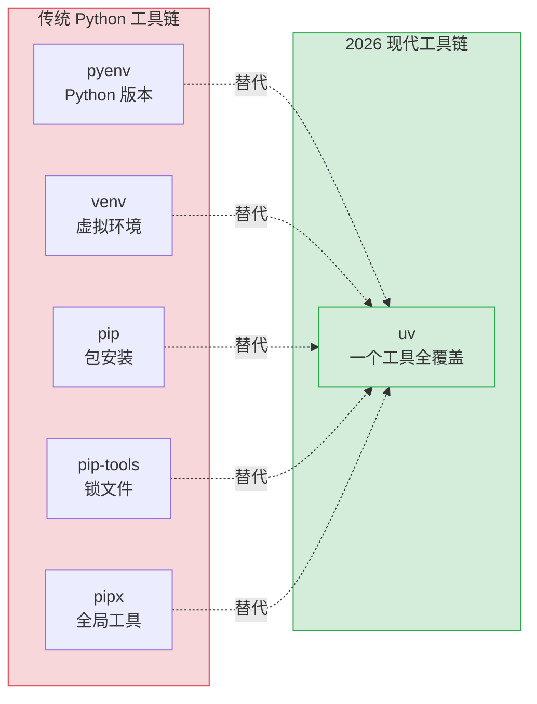
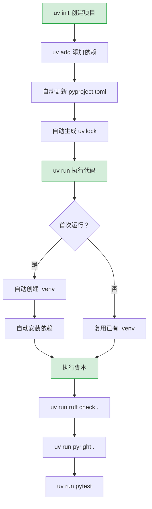

# Python 全栈实战（一）—— 环境搭建与现代工具链

Python 的包管理一直是个老大难问题——pip、venv、pyenv、pipx、poetry、conda，光是选工具就能纠结半天。2026 年的答案很简单：**一个 uv 全部搞定**。

> **环境：** Python 3.14.3, uv 0.11+, Ruff 0.15+, Pyright

---

## 1. Python 工具链的历史包袱

在 JavaScript/TypeScript 生态里，`npm` 或 `pnpm` 一个工具就能管理依赖和脚本。Python 的生态长期碎片化：

| 需求 | 传统方案 | 问题 |
|------|---------|------|
| 安装 Python | 官网下载 / pyenv | pyenv 编译慢，Windows 支持差 |
| 虚拟环境 | venv / virtualenv | 手动激活，忘了切环境就污染全局 |
| 安装包 | pip | 没有锁文件，无法确保可复现 |
| 依赖管理 | pip-tools / poetry | poetry 解析速度慢，跟 PEP 标准有偏差 |
| 全局工具 | pipx | 又多一个工具要装 |

这些工具各管一块、互不打通。换台机器重建环境，半小时起步。

[uv](https://docs.astral.sh/uv/) 是 Astral 团队（Ruff 的作者）用 Rust 写的 Python 包管理器，一个二进制文件覆盖了上面所有场景。速度比 pip 快 10-100 倍，依赖解析比 poetry 快 8-10 倍。



## 2. 安装 uv

uv 不依赖系统的 Python——它是一个独立的 Rust 二进制，装完即用。

```bash
# macOS / Linux
curl -LsSf https://astral.sh/uv/install.sh | sh

# Windows（PowerShell）
powershell -ExecutionPolicy ByPass -c "irm https://astral.sh/uv/install.ps1 | iex"

# 或者用 Homebrew
brew install uv

# 验证
uv --version
# uv 0.11.x
```

安装完成后，终端输出版本号即成功。uv 会自动写入 `~/.local/bin`（macOS/Linux）或 `%USERPROFILE%\.local\bin`（Windows），确保这个路径在 `$PATH` 中。

## 3. 用 uv 安装和管理 Python

不需要再去官网下载安装包，也不需要 pyenv。uv 内置了 Python 版本管理：

```bash
# 查看可安装的 Python 版本
uv python list

# 安装 Python 3.14（uv 会下载预编译的二进制，几秒搞定）
uv python install 3.14

# 验证
uv python list --only-installed
# cpython-3.14.3-macos-aarch64-none    ~/.local/share/uv/python/...

# 直接运行（不需要手动切版本）
uv run --python 3.14 python --version
# Python 3.14.3
```

跟 pyenv 的对比：pyenv 需要从源码编译 Python，在 macOS 上经常因为缺少 openssl、readline 等依赖而失败。uv 下载的是预编译好的二进制，没有编译依赖问题，安装时间从几分钟缩短到几秒。

## 4. 创建第一个项目

```bash
# 创建项目目录并初始化
uv init hello-python
cd hello-python
```

uv 自动生成以下结构：

```
hello-python/
├── .python-version    # 锁定 Python 版本（如 3.14）
├── pyproject.toml     # 项目元数据与依赖声明
├── README.md
└── hello.py           # 入口文件
```

看一下 `pyproject.toml`：

```toml
# pyproject.toml
[project]
name = "hello-python"
version = "0.1.0"
description = "Add your description here"
readme = "README.md"
requires-python = ">=3.14"
dependencies = []
```

这个文件是 PEP 621 标准格式，不是 uv 的私有配置。pip、poetry 等工具都能读取它。

### 运行代码

```bash
# 方式一：uv run（推荐，自动管理虚拟环境）
uv run hello.py

# 方式二：传统方式（手动激活虚拟环境后用 python 命令）
source .venv/bin/activate  # macOS/Linux
python hello.py
```

`uv run` 的好处：首次执行时自动创建 `.venv` 虚拟环境、安装依赖，省掉了 `python -m venv .venv && source .venv/bin/activate && pip install -r requirements.txt` 这串操作。

把 `hello.py` 改成一个更有意义的程序：

```python
# hello.py
import sys
import platform

print(f"Python {sys.version}")
print(f"操作系统：{platform.system()} {platform.machine()}")
print(f"解释器路径：{sys.executable}")
```

```bash
uv run hello.py
# Python 3.14.3 (main, Feb  3 2026, 10:22:18) [Clang 19.1.6 ]
# 操作系统：Darwin arm64
# 解释器路径：/Users/you/hello-python/.venv/bin/python
```

注意 `sys.executable` 指向的是 `.venv` 下的 Python，说明 uv 已经自动创建好了虚拟环境。

## 5. 依赖管理

```bash
# 添加依赖
uv add httpx          # 生产依赖
uv add --dev pytest   # 开发依赖（不会打包到生产环境）

# 安装完成后查看 pyproject.toml，依赖已自动写入
```

安装后 `pyproject.toml` 变成：

```toml
[project]
name = "hello-python"
version = "0.1.0"
requires-python = ">=3.14"
dependencies = [
    "httpx>=0.28.1",
]

[dependency-groups]
dev = [
    "pytest>=9.0.2",
]
```

同时 uv 生成了 `uv.lock` 锁文件（类似 `pnpm-lock.yaml`），记录了所有依赖的精确版本和哈希值，确保团队成员和 CI 环境安装的依赖完全一致。

```bash
# 其他常用命令
uv remove httpx       # 移除依赖
uv sync               # 根据 uv.lock 同步安装（类似 pnpm install）
uv lock               # 只更新锁文件，不安装

# 查看依赖树
uv tree
# hello-python v0.1.0
# ├── httpx v0.28.1
# │   ├── anyio v4.8.0
# │   ├── certifi v2024.12.14
# │   ├── httpcore v1.0.7
# │   └── idna v3.10
# ...
```

### uv 对比传统 pip 工作流

| 操作 | pip 传统方式 | uv 方式 |
|------|-------------|---------|
| 创建虚拟环境 | `python -m venv .venv` | `uv init`（自动创建） |
| 激活环境 | `source .venv/bin/activate` | 不需要，`uv run` 自动处理 |
| 安装依赖 | `pip install httpx` | `uv add httpx` |
| 锁定版本 | `pip freeze > requirements.txt` | 自动生成 `uv.lock` |
| 在新机器还原 | `pip install -r requirements.txt` | `uv sync` |
| 运行脚本 | `python script.py` | `uv run script.py` |

## 6. 配置 Ruff：格式化 + Lint 二合一

Ruff 是 Python 生态的 "ESLint + Prettier"——一个工具同时搞定代码格式化和 Lint 检查。跟 uv 一样出自 Astral 团队，用 Rust 编写，速度是 Flake8 的 10-100 倍。

```bash
# 安装为开发依赖
uv add --dev ruff
```

在 `pyproject.toml` 中添加 Ruff 配置：

```toml
# pyproject.toml（追加以下内容）

[tool.ruff]
target-version = "py314"     # 目标 Python 版本
line-length = 88             # 行宽（与 Black 默认一致）

[tool.ruff.lint]
select = [
    "E",    # pycodestyle 错误
    "W",    # pycodestyle 警告
    "F",    # Pyflakes
    "I",    # isort（import 排序）
    "UP",   # pyupgrade（自动升级旧语法）
    "B",    # flake8-bugbear（常见 Bug 检测）
    "SIM",  # flake8-simplify（简化代码建议）
    "N",    # pep8-naming（命名规范）
]
ignore = [
    "E501",  # 行长度由 formatter 控制，lint 不重复检查
]

[tool.ruff.format]
quote-style = "double"       # 统一双引号
indent-style = "space"       # 空格缩进（Python 社区标准）
```

日常使用：

```bash
# 检查代码问题（Lint）
uv run ruff check .

# 自动修复可修复的问题
uv run ruff check --fix .

# 格式化代码
uv run ruff format .

# 检查格式是否符合规范（CI 中使用，不修改文件）
uv run ruff format --check .
```

写一段有问题的代码来验证 Ruff 是否工作：

```python
# bad_code.py
import os
import sys
import json  # 未使用的 import

def BadFunctionName(x):  # 命名不符合 PEP 8
    y=x+1  # 缺少空格
    if y == True:  # 不应该跟 True 比较
        return y
    return None
```

```bash
uv run ruff check bad_code.py
# bad_code.py:3:8: F401 `json` imported but unused
# bad_code.py:5:5: N802 Function name `BadFunctionName` should be lowercase
# bad_code.py:6:6: E225 Missing whitespace around operator
# bad_code.py:7:10: E712 Comparison to `True` should be `cond is True` or `if cond:`
```

四个问题一目了然。`ruff check --fix` 能自动修复其中的 import 排序和未使用的 import。

## 7. 配置 Pyright：类型检查

Python 是动态类型语言，但从 3.5 开始支持 Type Hints（类型注解）。Pyright 是微软开发的类型检查器，速度比 mypy 快 5 倍左右，跟 VS Code 深度集成。

```bash
# 安装为开发依赖
uv add --dev pyright
```

在 `pyproject.toml` 中配置：

```toml
# pyproject.toml（追加）

[tool.pyright]
pythonVersion = "3.14"
typeCheckingMode = "basic"    # basic / standard / strict
reportMissingTypeStubs = false
```

`typeCheckingMode` 三档：
- **basic**：只报明显的类型错误，适合刚开始用类型注解的项目
- **standard**：更严格，会检查函数返回值、参数类型
- **strict**：最严格，要求所有函数都有类型注解

建议新项目从 `basic` 起步，逐步切到 `standard`。

写一段带类型问题的代码测试：

```python
# type_check.py
def add(a: int, b: int) -> int:
    return a + b

result: str = add(1, 2)  # <--- 类型错误：int 赋给 str
```

```bash
uv run pyright type_check.py
# type_check.py:4:16 - error: Type "int" is not assignable to type "str" (reportAssignmentType)
```

IDE 里装了 Pylance 插件（VS Code）的话，这些错误会实时在编辑器中标红，不用手动跑命令。

## 8. VS Code 集成

推荐安装以下扩展：

| 扩展 | 作用 |
|------|------|
| **Python** (ms-python) | Python 语言支持（自带 Pylance） |
| **Ruff** (charliermarsh.ruff) | Ruff Lint + Format 集成 |
| **Even Better TOML** (tamasfe.even-better-toml) | `pyproject.toml` 语法高亮 |

在项目根目录创建 `.vscode/settings.json`：

```json
{
  "[python]": {
    "editor.defaultFormatter": "charliermarsh.ruff",
    "editor.formatOnSave": true,
    "editor.codeActionsOnSave": {
      "source.fixAll.ruff": "explicit",
      "source.organizeImports.ruff": "explicit"
    }
  },
  "python.analysis.typeCheckingMode": "basic"
}
```

保存代码时自动格式化、自动修复 Lint 问题、自动排序 import。体验跟 TypeScript + ESLint + Prettier 一致。

## 9. 完整项目结构与配置

把前面的配置整合到一起，一个新 Python 项目的标准起步结构：

```
hello-python/
├── .python-version          # Python 版本锁定
├── .vscode/
│   └── settings.json        # VS Code 配置
├── pyproject.toml           # 项目元数据 + 工具配置
├── uv.lock                  # 依赖锁文件（自动生成，提交到 Git）
├── hello.py                 # 入口文件
└── .gitignore
```

完整的 `pyproject.toml`：

```toml
[project]
name = "hello-python"
version = "0.1.0"
description = "Python 全栈实战系列 - 第一个项目"
readme = "README.md"
requires-python = ">=3.14"
dependencies = [
    "httpx>=0.28.1",
]

[dependency-groups]
dev = [
    "pytest>=9.0.2",
    "ruff>=0.15.7",
    "pyright>=1.1.394",
]

[tool.ruff]
target-version = "py314"
line-length = 88

[tool.ruff.lint]
select = ["E", "W", "F", "I", "UP", "B", "SIM", "N"]
ignore = ["E501"]

[tool.ruff.format]
quote-style = "double"
indent-style = "space"

[tool.pyright]
pythonVersion = "3.14"
typeCheckingMode = "basic"

[tool.pytest.ini_options]
testpaths = ["tests"]
```

`.gitignore` 最小配置：

```gitignore
# 虚拟环境
.venv/

# Python 缓存
__pycache__/
*.pyc

# IDE
.idea/

# 系统文件
.DS_Store
```

## 10. 写一个能跑的完整程序

把环境验证一遍。创建一个简单的 HTTP 请求程序，用 httpx 获取 GitHub API 数据：

```python
# hello.py
import httpx


def fetch_python_info() -> None:
    """获取 Python 在 GitHub 上的仓库信息"""
    api_url = "https://api.github.com/repos/python/cpython"
    response = httpx.get(api_url, timeout=10)
    response.raise_for_status()  # 非 2xx 状态码抛异常

    repo = response.json()
    print(f"仓库：{repo['full_name']}")
    print(f"描述：{repo['description']}")
    print(f"Star 数：{repo['stargazers_count']:,}")
    print(f"Fork 数：{repo['forks_count']:,}")
    print(f"默认分支：{repo['default_branch']}")


if __name__ == "__main__":
    fetch_python_info()
```

```bash
uv run hello.py
# 仓库：python/cpython
# 描述：The Python programming language
# Star 数：65,432
# Fork 数：31,234
# 默认分支：main
```

终端输出了 CPython 仓库的实时数据，说明 httpx 安装成功、虚拟环境正常运行。

顺手跑一遍全套检查：

```bash
# Lint 检查
uv run ruff check .
# All checks passed!

# 格式检查
uv run ruff format --check .
# 1 file already formatted

# 类型检查
uv run pyright .
# 0 errors, 0 warnings, 0 informations
```

三项全绿，环境搭建完成。

### uv 日常开发工作流



## 常见坑点

**1. uv 和 pip 能混用吗？**

技术上可以——`.venv` 目录下的 `pip` 仍然存在。但混用会导致 `uv.lock` 和实际安装的包不一致。一旦用了 uv 管理项目，就别再手动跑 `pip install`。团队中如果有人习惯用 pip，统一切到 `uv add` / `uv sync` 即可。

**2. `uv run` 和直接用 `python` 有什么区别？**

`uv run` 会自动激活项目的虚拟环境再执行命令。直接用 `python` 可能调用的是系统 Python（或者其他项目的 Python），导致"在我机器上能跑"的经典问题。养成用 `uv run` 的习惯，跟 `npx` 的思路一样。

**3. Ruff 的规则选择**

Ruff 内置了 800+ 条 Lint 规则，全部打开会疯掉。本文选的 `E, W, F, I, UP, B, SIM, N` 是一个平衡选择——覆盖了代码风格、未使用变量、命名规范、常见 Bug 和代码简化。第 12 篇会深入讲 Ruff 在团队项目中的完整配置策略。

## 总结

- **uv** 是 2026 年 Python 工具链的标准答案，一个工具覆盖 Python 版本管理、虚拟环境、包安装、锁文件、全局工具
- **Ruff** 替代了 Black + Flake8 + isort，格式化和 Lint 一步到位，Rust 实现，毫秒级响应
- **Pyright** 提供类型检查，从 `basic` 模式起步，逐步提升类型覆盖率
- 所有配置集中在 `pyproject.toml`，符合 PEP 标准，不锁定任何特定工具

下一篇进入 Python 语法核心——对照 JavaScript/TypeScript，快速掌握 Python 的独特范式。

## 参考

- [uv 官方文档](https://docs.astral.sh/uv/)
- [Ruff 官方文档](https://docs.astral.sh/ruff/)
- [Pyright 配置参考](https://github.com/microsoft/pyright/blob/main/docs/configuration.md)
- [PEP 621 - pyproject.toml 元数据](https://peps.python.org/pep-0621/)
- [Python 3.14 Release Notes](https://docs.python.org/3.14/whatsnew/3.14.html)
