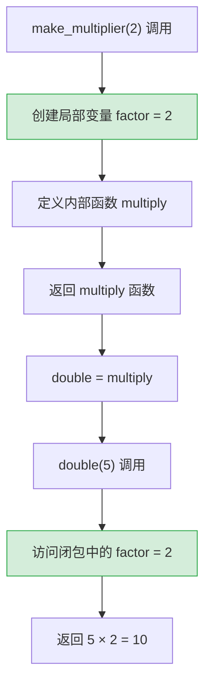
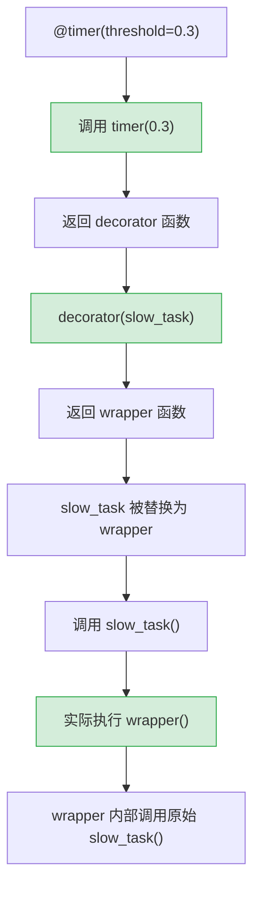

# Python 全栈实战（三）—— 函数与装饰器

装饰器看着像黑魔法，本质上就是一个接收函数、返回函数的高阶函数。理解了闭包，装饰器就没有秘密了。

> **环境：** Python 3.14.3

---

## 1. 函数是一等公民

Python 的函数跟 JavaScript 的一样，是一等公民——可以赋值给变量、作为参数传递、作为返回值。

```python
def add(a: int, b: int) -> int:
    return a + b

# 函数赋值给变量
operation = add
print(operation(3, 4))  # 7

# 函数作为参数
def apply(func, x: int, y: int) -> int:
    return func(x, y)

print(apply(add, 10, 20))  # 30
```

`add` 本身就是一个对象。`add(3, 4)` 是调用这个对象，`add`（不带括号）是引用这个对象本身。

## 2. *args 与 **kwargs

`*args` 收集任意数量的位置参数为 tuple，`**kwargs` 收集任意数量的关键字参数为 dict。

```python
def log_event(event_type: str, *args, **kwargs) -> None:
    """记录事件日志"""
    print(f"[{event_type}]")
    for arg in args:
        print(f"  位置参数：{arg}")
    for key, value in kwargs.items():
        print(f"  {key}={value}")

log_event("USER_LOGIN", "张三", ip="192.168.1.1", device="iPhone")
# [USER_LOGIN]
#   位置参数：张三
#   ip=192.168.1.1
#   device=iPhone
```

`args` 和 `kwargs` 只是约定命名，`*` 和 `**` 才是语法核心。参数顺序有严格规定：

```python
def func(positional, /, normal, *, keyword_only):
    pass
# positional  → / 之前：只能按位置传
# normal      → 中间：位置或关键字都行
# keyword_only→ * 之后：只能用关键字传
```

`/` 和 `*` 是 Python 3.8 引入的参数位置标记。实际项目中最常用的场景是 `*` ——强制调用者用关键字传参，提高可读性：

```python
def create_user(name: str, *, age: int, email: str) -> dict:
    """age 和 email 必须用关键字传递"""
    return {"name": name, "age": age, "email": email}

create_user("张三", age=25, email="z@test.com")    # ✅
# create_user("张三", 25, "z@test.com")            # ❌ TypeError
```

## 3. 闭包

闭包是装饰器的基础。一个函数引用了外层函数的变量，外层函数返回内层函数——内层函数就"捕获"了那些变量。

```python
def make_multiplier(factor: int):
    """返回一个乘以 factor 的函数"""
    def multiply(x: int) -> int:
        return x * factor    # <--- 引用外层的 factor
    return multiply

double = make_multiplier(2)
triple = make_multiplier(3)

print(double(5))   # 10
print(triple(5))   # 15
```

`make_multiplier` 执行完后，`factor` 按理说应该被回收。但 `multiply` 引用了它，形成闭包，`factor` 的生命周期被延长了。

用 Mermaid 图看闭包的内存结构：



### 闭包的坑：循环变量捕获

```python
# ❌ 经典错误（跟 JavaScript var 的问题类似）
functions = []
for i in range(3):
    functions.append(lambda: i)

print([f() for f in functions])  # [2, 2, 2]（全是 2，不是 0, 1, 2）
```

`lambda` 捕获的是变量 `i` 的引用，不是值。循环结束后 `i = 2`，所有 lambda 都引用同一个 `i`。

```python
# ✅ 修复：用默认参数绑定当前值
functions = []
for i in range(3):
    functions.append(lambda x=i: x)   # x=i 在定义时求值

print([f() for f in functions])  # [0, 1, 2]
```

## 4. 装饰器：语法糖背后的真相

装饰器的本质就是一个高阶函数——接收一个函数，返回一个新函数。`@decorator` 只是语法糖。

```python
import time


def timer(func):
    """计时装饰器：测量函数执行时间"""
    def wrapper(*args, **kwargs):
        start = time.perf_counter()
        result = func(*args, **kwargs)        # <--- 调用原函数
        elapsed = time.perf_counter() - start
        print(f"{func.__name__} 耗时 {elapsed:.4f}s")
        return result
    return wrapper


@timer
def slow_operation():
    """模拟耗时操作"""
    time.sleep(0.5)
    return "完成"
```

`@timer` 等价于 `slow_operation = timer(slow_operation)`。拆开看就没有任何神秘感了：

```python
# 这两种写法完全等价：
@timer
def slow_operation(): ...

# 等价于：
def slow_operation(): ...
slow_operation = timer(slow_operation)
```

```bash
slow_operation()
# slow_operation 耗时 0.5012s
# '完成'
```

## 5. functools.wraps：保留原函数信息

上面的 `timer` 有一个问题——被装饰后，函数的名字和文档都变了：

```python
print(slow_operation.__name__)   # "wrapper"（不是 "slow_operation"）
print(slow_operation.__doc__)    # None（文档丢了）
```

`functools.wraps` 解决这个问题：

```python
import functools
import time


def timer(func):
    @functools.wraps(func)       # <--- 核心：把原函数的元信息复制到 wrapper 上
    def wrapper(*args, **kwargs):
        start = time.perf_counter()
        result = func(*args, **kwargs)
        elapsed = time.perf_counter() - start
        print(f"{func.__name__} 耗时 {elapsed:.4f}s")
        return result
    return wrapper


@timer
def slow_operation():
    """模拟耗时操作"""
    time.sleep(0.5)
    return "完成"

print(slow_operation.__name__)   # "slow_operation" ✅
print(slow_operation.__doc__)    # "模拟耗时操作" ✅
```

**规则**：写装饰器时永远加 `@functools.wraps(func)`。不加的话，pytest、Sphinx 文档生成、IDE 类型提示都会出问题。

## 6. 带参数的装饰器

计时装饰器只能打印耗时，如果想要设定一个阈值——超过阈值才告警——就需要装饰器本身接受参数。

这意味着要再套一层函数：**装饰器工厂** → 装饰器 → wrapper：

```python
import functools
import time


def timer(threshold: float = 0.0):
    """带阈值的计时装饰器（装饰器工厂）"""
    def decorator(func):                         # <--- 真正的装饰器
        @functools.wraps(func)
        def wrapper(*args, **kwargs):            # <--- 替换原函数的包装
            start = time.perf_counter()
            result = func(*args, **kwargs)
            elapsed = time.perf_counter() - start
            if elapsed > threshold:              # <--- 使用外层的 threshold
                print(f"⚠️ {func.__name__} 耗时 {elapsed:.4f}s（超过阈值 {threshold}s）")
            return result
        return wrapper
    return decorator


@timer(threshold=0.3)         # timer(0.3) 返回 decorator，decorator 装饰 fast_task
def fast_task():
    time.sleep(0.1)

@timer(threshold=0.3)
def slow_task():
    time.sleep(0.5)

fast_task()    # （无输出，0.1s < 0.3s 阈值）
slow_task()    # ⚠️ slow_task 耗时 0.5008s（超过阈值 0.3s）
```

三层嵌套看着头疼。用流程图理清调用链：



## 7. 实用装饰器案例

### 重试装饰器

网络请求、数据库连接这类 IO 操作容易遇到临时故障。重试装饰器是生产代码中的常见模式：

```python
import functools
import time


def retry(max_attempts: int = 3, delay: float = 1.0):
    """自动重试装饰器"""
    def decorator(func):
        @functools.wraps(func)
        def wrapper(*args, **kwargs):
            last_exception = None
            for attempt in range(1, max_attempts + 1):
                try:
                    return func(*args, **kwargs)
                except Exception as exc:
                    last_exception = exc
                    if attempt < max_attempts:
                        print(f"[重试 {attempt}/{max_attempts}] {exc}，{delay}s 后重试")
                        time.sleep(delay)
            raise last_exception  # 所有重试都失败，抛出最后一个异常
        return wrapper
    return decorator


@retry(max_attempts=3, delay=0.5)
def fetch_data(url: str) -> dict:
    """模拟不稳定的网络请求"""
    import random
    if random.random() < 0.7:
        raise ConnectionError(f"连接 {url} 失败")
    return {"status": "ok"}
```

```bash
fetch_data("https://api.example.com")
# [重试 1/3] 连接 https://api.example.com 失败，0.5s 后重试
# [重试 2/3] 连接 https://api.example.com 失败，0.5s 后重试
# {'status': 'ok'}
```

### 缓存装饰器

Python 标准库内置了 `functools.lru_cache`——基于 LRU（Least Recently Used）算法的缓存装饰器：

```python
import functools


@functools.lru_cache(maxsize=128)
def fibonacci(n: int) -> int:
    """计算斐波那契数列（带缓存）"""
    if n < 2:
        return n
    return fibonacci(n - 1) + fibonacci(n - 2)

print(fibonacci(50))        # 12586269025（瞬间返回）
print(fibonacci.cache_info())
# CacheInfo(hits=48, misses=51, maxsize=128, currsize=51)
```

没有 `lru_cache` 的话，`fibonacci(50)` 需要 2^50 次递归调用，基本跑不出来。加了缓存后，每个 `n` 只计算一次，时间复杂度从 O(2^n) 降到 O(n)。

Python 3.9+ 还有 `functools.cache`——不限大小的缓存，等价于 `lru_cache(maxsize=None)`。

## 8. 多个装饰器的执行顺序

装饰器可以叠加。执行顺序是**从下往上装饰，从上往下执行**：

```python
def bold(func):
    @functools.wraps(func)
    def wrapper(*args, **kwargs):
        return f"<b>{func(*args, **kwargs)}</b>"
    return wrapper

def italic(func):
    @functools.wraps(func)
    def wrapper(*args, **kwargs):
        return f"<i>{func(*args, **kwargs)}</i>"
    return wrapper

@bold       # 第二步：在 italic 结果外面套 <b>
@italic     # 第一步：先套 <i>
def greet(name: str) -> str:
    return f"Hello, {name}"

print(greet("Python"))
# <b><i>Hello, Python</i></b>
```

等价于 `greet = bold(italic(greet))`。先 italic 包一层，再 bold 包一层。

## 9. 类装饰器（简介）

装饰器不一定是函数——任何可调用对象（实现了 `__call__` 的类）都可以当装饰器：

```python
class CountCalls:
    """统计函数被调用次数"""
    def __init__(self, func):
        functools.update_wrapper(self, func)
        self.func = func
        self.call_count = 0

    def __call__(self, *args, **kwargs):
        self.call_count += 1
        print(f"{self.func.__name__} 被调用了 {self.call_count} 次")
        return self.func(*args, **kwargs)


@CountCalls
def say_hello():
    print("Hello!")

say_hello()   # say_hello 被调用了 1 次 → Hello!
say_hello()   # say_hello 被调用了 2 次 → Hello!
```

类装饰器的优势：可以保存状态（如 `call_count`）。函数装饰器也能做到（用闭包），但类装饰器在需要管理多个状态变量时更清晰。

## 常见坑点

**1. 装饰器在导入时就执行**

```python
@timer
def my_func():
    pass
```

`timer(my_func)` 在模块**被 import 时**就执行了，不是等到 `my_func()` 被调用时。如果装饰器里有副作用（网络请求、文件写入），import 该模块就会触发。

**2. 装饰器与类型检查的兼容**

普通的装饰器会让 Pyright/mypy 丢失原函数的类型签名。Python 3.12 引入了 `typing.ParamSpec` 来解决：

```python
from typing import ParamSpec, TypeVar, Callable
import functools

P = ParamSpec("P")
T = TypeVar("T")

def my_decorator(func: Callable[P, T]) -> Callable[P, T]:
    @functools.wraps(func)
    def wrapper(*args: P.args, **kwargs: P.kwargs) -> T:
        return func(*args, **kwargs)
    return wrapper
```

对新手来说这段类型注解看着吓人——先知道有这回事就行，第 6 篇类型系统会详细讲 `ParamSpec`。

## 总结

- 函数是一等公民，可以赋值、传参、返回
- `*args` 收集位置参数为 tuple，`**kwargs` 收集关键字参数为 dict
- 闭包 = 内层函数引用外层变量，装饰器 = 接收函数返回函数的高阶函数
- `@decorator` 是 `func = decorator(func)` 的语法糖
- 带参数的装饰器需要三层嵌套：工厂 → 装饰器 → wrapper
- 永远加 `@functools.wraps(func)`，保留原函数的元信息
- `functools.lru_cache` 是内置的缓存装饰器，适合纯函数的结果缓存

下一篇进入**数据结构深入**——list、dict、set 的底层实现原理和性能特征。

## 参考

- [Python 官方文档 - functools](https://docs.python.org/3.14/library/functools.html)
- [PEP 318 - Decorators for Functions and Methods](https://peps.python.org/pep-0318/)
- [PEP 612 - Parameter Specification Variables](https://peps.python.org/pep-0612/)
