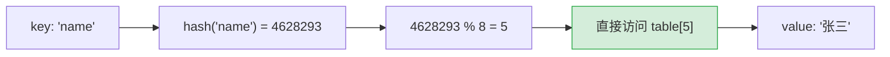
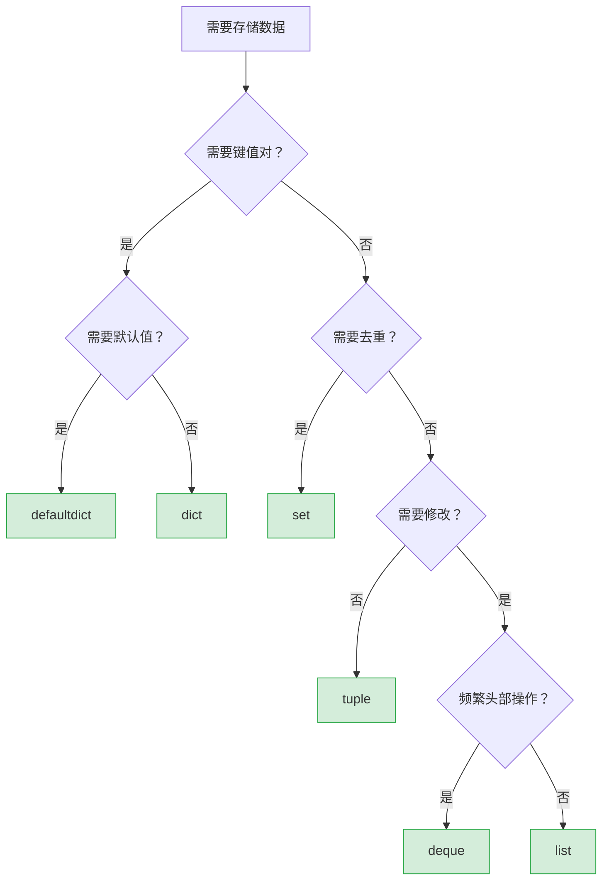
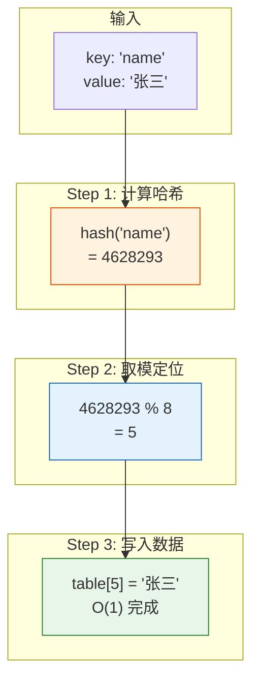

# Python 全栈实战（四）—— 数据结构深入

Python 的 dict 查找为什么是 O(1)？list 的 `append` 和 `insert(0, x)` 差了多少倍？选错数据结构，代码可能慢 1000 倍。

> **环境：** Python 3.14.3

---

## 1. list：动态数组

Python 的 `list` 底层是**动态数组**（类似 C++ 的 `std::vector`、Java 的 `ArrayList`），不是链表。元素在内存中连续存放，通过索引直接计算偏移量访问。

```python
numbers = [10, 20, 30, 40, 50]

# O(1) 操作
numbers[2]          # 30（索引访问）
numbers.append(60)  # 追加到末尾
numbers.pop()       # 移除末尾元素

# O(n) 操作（需要移动后续元素）
numbers.insert(0, 0)    # 在开头插入 → 后面所有元素右移
numbers.pop(0)           # 删除开头 → 后面所有元素左移
```

### list 常用操作的时间复杂度

| 操作 | 时间复杂度 | 说明 |
|------|-----------|------|
| `lst[i]` | O(1) | 索引访问 |
| `lst.append(x)` | O(1) 均摊 | 末尾追加 |
| `lst.pop()` | O(1) | 删除末尾 |
| `lst.pop(0)` | O(n) | 删除开头，全部左移 |
| `lst.insert(0, x)` | O(n) | 开头插入，全部右移 |
| `x in lst` | O(n) | 线性查找 |
| `lst.sort()` | O(n log n) | TimSort 排序 |

### 动态扩容机制

list 不够装时会自动扩容（通常是当前容量的 1.125 倍左右），扩容时需要拷贝所有元素到新的内存空间。所以 `append` 在绝大多数调用中是 O(1)，偶尔触发扩容时是 O(n)——均摊下来仍然是 O(1)。

```python
import sys

lst = []
prev_size = 0
for i in range(20):
    lst.append(i)
    current_size = sys.getsizeof(lst)
    if current_size != prev_size:
        print(f"长度 {len(lst):2d} → 内存 {current_size} 字节（扩容）")
        prev_size = current_size
```

```
长度  1 → 内存  88 字节（扩容）
长度  5 → 内存 120 字节（扩容）
长度  9 → 内存 184 字节（扩容）
长度 17 → 内存 248 字节（扩容）
```

容量增长并不是严格翻倍，而是按一定比例渐进增长，平衡内存浪费和扩容频率。

## 2. tuple：不可变序列

tuple 和 list 的区别就一条：**创建后不能修改**。不能 append、不能 pop、不能改元素。

```python
point = (3, 4)
# point[0] = 5      # ❌ TypeError: 'tuple' does not support item assignment

# tuple 可以做 dict 的 key（因为不可变 = 可哈希）
locations = {
    (35.6, 139.7): "东京",
    (31.2, 121.5): "上海",
}
# list 不行：
# bad = {[35.6, 139.7]: "东京"}  # ❌ TypeError: unhashable type: 'list'
```

### 什么时候用 tuple、什么时候用 list？

- **tuple**：数据结构固定，语义明确（如坐标 `(x, y)`、RGB `(255, 128, 0)`、函数返回多值）
- **list**：元素数量动态变化，需要增删改操作

tuple 还有一个性能优势：CPython 会缓存小的 tuple 对象。创建 `(1, 2, 3)` 比 `[1, 2, 3]` 快，内存也少约 10-20%。

### 命名元组

普通 tuple 用索引 `point[0]` 取值，可读性差。`collections.namedtuple` 或 `typing.NamedTuple` 给每个位置起名字：

```python
from typing import NamedTuple

class Point(NamedTuple):
    x: float
    y: float

p = Point(3.0, 4.0)
print(p.x, p.y)          # 3.0 4.0（用名字访问）
print(p[0], p[1])         # 3.0 4.0（也支持索引）

# 计算距离
distance = (p.x ** 2 + p.y ** 2) ** 0.5
```

如果需要可变的结构化数据，用 `dataclass`（第 5 篇详解）。

## 3. dict：哈希表

Python 的 `dict` 底层是**哈希表**（Hash Table），查找、插入、删除都是 O(1)。Python 3.7+ 保证 dict 保持插入顺序。

```python
user = {"name": "张三", "age": 25, "city": "北京"}

# 基本操作
user["email"] = "z@test.com"      # 插入/更新
del user["city"]                  # 删除
print(user.get("phone", "无"))    # 安全取值（不存在返回默认值）

# 遍历
for key, value in user.items():
    print(f"{key}: {value}")

# 合并字典（Python 3.9+）
defaults = {"timeout": 30, "retries": 3}
overrides = {"timeout": 10}
config = defaults | overrides     # {"timeout": 10, "retries": 3}
```

### 哈希表原理

dict 为什么能 O(1) 查找？核心逻辑：

1. 对 key 计算哈希值：`hash("name")` → 一个整数
2. 用哈希值对数组长度取模，得到存储位置（索引）
3. 直接跳到该位置读取 value



两个不同的 key 可能算出相同的索引（哈希碰撞）。CPython 用**开放寻址法**处理碰撞：如果目标位置被占了，就按一定规则找下一个空位。碰撞越多，性能越接近 O(n)——但正常情况下哈希分布很均匀，碰撞率极低。

### dict 操作的时间复杂度

| 操作 | 平均 | 最差 |
|------|------|------|
| `d[key]` | O(1) | O(n) |
| `d[key] = val` | O(1) | O(n) |
| `del d[key]` | O(1) | O(n) |
| `key in d` | O(1) | O(n) |
| 遍历所有元素 | O(n) | O(n) |

最差情况（O(n)）只发生在所有 key 都碰撞到同一个位置——实际项目中几乎不会遇到。

### 能做 dict key 的条件

只有**可哈希**（hashable）的对象才能做 key。简单判断：**不可变的对象**通常可哈希。

```python
# ✅ 可以做 key
d = {
    42: "int",
    3.14: "float",
    "hello": "str",
    (1, 2): "tuple",
    True: "bool",
}

# ❌ 不可以做 key
# d = {[1, 2]: "list"}    # TypeError: unhashable type: 'list'
# d = {{}: "dict"}        # TypeError: unhashable type: 'dict'
```

## 4. set：集合

set 底层也是哈希表，只存 key 不存 value。核心能力：**去重**和**集合运算**。

```python
# 创建 set
tags = {"python", "web", "python", "api"}
print(tags)  # {'python', 'web', 'api'}（自动去重）

# 注意：空 set 必须用 set()，不能用 {}
empty_set = set()    # ✅
empty_dict = {}      # 这是空 dict，不是空 set

# 集合运算
frontend = {"html", "css", "javascript", "typescript"}
backend = {"python", "javascript", "sql", "typescript"}

# 交集：两边都有的
print(frontend & backend)        # {'javascript', 'typescript'}

# 并集：所有的
print(frontend | backend)        # {'html', 'css', 'javascript', ...}

# 差集：frontend 有但 backend 没有的
print(frontend - backend)        # {'html', 'css'}

# 对称差集：只属于一边的
print(frontend ^ backend)        # {'html', 'css', 'python', 'sql'}
```

### 用 set 加速 `in` 查找

`in` 操作在 list 是 O(n)，在 set 是 O(1)。数据量大时差异巨大：

```python
import time

data = list(range(1_000_000))
data_set = set(data)

# list 查找
start = time.perf_counter()
999_999 in data
list_time = time.perf_counter() - start

# set 查找
start = time.perf_counter()
999_999 in data_set
set_time = time.perf_counter() - start

print(f"list: {list_time:.6f}s")    # list: 0.012345s
print(f"set:  {set_time:.6f}s")     # set:  0.000001s
```

如果需要频繁做 `if x in collection` 判断，把 list 转成 set 能快上万倍。

## 5. collections 模块

标准库 `collections` 提供了几个增强版数据结构：

### defaultdict：带默认值的字典

```python
from collections import defaultdict

# 统计每个单词出现的次数
words = ["apple", "banana", "apple", "cherry", "banana", "apple"]

# 普通 dict 需要先判断 key 是否存在
word_count = {}
for word in words:
    if word not in word_count:
        word_count[word] = 0
    word_count[word] += 1

# defaultdict 自动初始化默认值
word_count = defaultdict(int)    # int() 的默认值是 0
for word in words:
    word_count[word] += 1        # 不存在的 key 自动创建，值为 0

print(dict(word_count))
# {'apple': 3, 'banana': 2, 'cherry': 1}
```

`defaultdict(list)` 也很常用——把相关元素分组：

```python
from collections import defaultdict

students = [
    ("A班", "张三"), ("B班", "李四"),
    ("A班", "王五"), ("B班", "赵六"),
]

groups = defaultdict(list)
for class_name, student in students:
    groups[class_name].append(student)

# {'A班': ['张三', '王五'], 'B班': ['李四', '赵六']}
```

### Counter：计数器

```python
from collections import Counter

text = "hello world"
char_count = Counter(text)
print(char_count.most_common(3))
# [('l', 3), ('o', 2), ('h', 1)]

# 支持算术运算
a = Counter(["apple", "banana", "apple"])
b = Counter(["banana", "cherry"])
print(a + b)   # Counter({'apple': 2, 'banana': 2, 'cherry': 1})
print(a - b)   # Counter({'apple': 2})
```

### deque：双端队列

需要频繁在头部插入/删除元素时，`deque` 比 `list` 快得多（O(1) vs O(n)):

```python
from collections import deque

# 用 deque 实现固定大小的滑动窗口
recent_logs = deque(maxlen=5)
for i in range(10):
    recent_logs.append(f"log_{i}")

print(list(recent_logs))
# ['log_5', 'log_6', 'log_7', 'log_8', 'log_9']（自动丢弃最早的）
```

| 操作 | list | deque |
|------|------|-------|
| 末尾追加 `append` | O(1) | O(1) |
| 开头插入 `appendleft` | O(n) | **O(1)** |
| 末尾删除 `pop` | O(1) | O(1) |
| 开头删除 `popleft` | O(n) | **O(1)** |
| 索引访问 `d[i]` | O(1) | **O(n)** |

deque 在头部操作快，但随机索引访问变慢了——典型的 Trade-off。如果同时需要快速头部操作和随机访问，需要换其他数据结构（如平衡树）。

## 6. 推导式进阶

### 嵌套推导式

```python
# 二维矩阵转一维（展平）
matrix = [[1, 2, 3], [4, 5, 6], [7, 8, 9]]
flat = [x for row in matrix for x in row]
# [1, 2, 3, 4, 5, 6, 7, 8, 9]

# 阅读顺序：从左到右就是从外到内
# 等价于：
flat = []
for row in matrix:
    for x in row:
        flat.append(x)
```

嵌套超过两层就不要用推导式了，可读性急剧下降。拆成普通 for 循环。

### 生成器表达式

把推导式的方括号 `[]` 换成圆括号 `()`，得到的不是列表，而是**生成器**——惰性求值，按需生成，不占内存：

```python
# 列表推导：一次性生成 1000 万个元素，占内存
big_list = [x ** 2 for x in range(10_000_000)]

# 生成器表达式：惰性求值，几乎不占内存
big_gen = (x ** 2 for x in range(10_000_000))

# 配合 sum / max / min 等函数使用
total = sum(x ** 2 for x in range(10_000_000))  # <--- 括号可省略（函数参数里）
```

生成器在第 8 篇会深入展开。

## 7. 数据结构选择决策树



### 可视化：哈希表插入过程

下面通过图示展示 dict 插入的三个步骤：计算 key 的哈希值 → 对数组长度取模确定桶位置 → 直接写入数据。

#### 哈希表插入流程



#### 哈希表内部结构可视化

下方图表展示了插入 `name`、`age`、`city` 三个 key 的哈希表状态变化过程：

```mermaid
flowchart TD
    subgraph step1["Step 1: insert('name', '张三')"]
        A1["hash('name') = 4_628_293"] --> B1["4_628_293 % 8 = 5"]
        B1 --> C1["table[5] = '张三' ✓"]
        C1 --> D1["✅ 已写入，O(1)"]
    end

    subgraph step2["Step 2: insert('age', '25')"]
        A2["hash('age') = 3_827_491"] --> B2["3_827_491 % 8 = 2"]
        B2 --> C2["table[2] = '25' ✓"]
        C2 --> D2["✅ 已写入，O(1)"]
    end

    subgraph step3["Step 3: insert('city', '北京')"]
        A3["hash('city') = 2_938_471"] --> B3["2_938_471 % 8 = 7"]
        B3 --> C3["table[7] = '北京' ✓"]
        C3 --> D3["✅ 已写入，O(1)"]
    end
```



#### 哈希表最终状态

| 索引 | 数据 | 说明 |
|-----|------|------|
| 0 | — | 空 |
| 1 | — | 空 |
| 2 | `"age": "25"` | 已填充 |
| 3 | — | 空 |
| 4 | — | 空 |
| 5 | `"name": "张三"` | 已填充 |
| 6 | — | 空 |
| 7 | `"city": "北京"` | 已填充 |

> **说明**：哈希函数 `hash(key) % 8` 将任意字符串映射到 0-7 范围。三个 key 恰好落在不同槽位，没有冲突，所有插入操作均为 O(1)。


## 常见坑点

**1. dict 遍历时修改**

```python
d = {"a": 1, "b": 2, "c": 3}

# ❌ 遍历时删除 key
for key in d:
    if d[key] < 3:
        del d[key]    # RuntimeError: dictionary changed size during iteration

# ✅ 先收集要删的 key，再统一删
keys_to_delete = [k for k, v in d.items() if v < 3]
for key in keys_to_delete:
    del d[key]
```

**2. list 浅拷贝陷阱**

```python
# 嵌套列表的拷贝只复制了外层
original = [[1, 2], [3, 4]]
shallow_copy = original.copy()     # 或 original[:]

shallow_copy[0][0] = 999
print(original[0][0])              # 999（原列表也被改了！）

# 深拷贝才能完全独立
import copy
deep_copy = copy.deepcopy(original)
```

**3. 空 set 的创建**

`{}` 创建的是空 dict，不是空 set。空 set 必须用 `set()`。这是 Python 设计上的一个历史遗留问题。

## 总结

- list 是动态数组，尾部操作 O(1)，头部操作 O(n)
- dict 和 set 底层都是哈希表，查找/插入/删除均为 O(1)
- tuple 不可变，可做 dict 的 key，比 list 更轻量
- `defaultdict` 省去 key 存在性检查，`Counter` 专门做计数，`deque` 擅长双端操作
- 推导式超过两层嵌套就改用 for 循环
- 需要频繁做 `in` 判断时，把 list 转 set 能快上万倍

下一篇进入**面向对象：Python 风格**——`dataclass`、魔术方法、多继承与 MRO。

## 参考

- [Python 官方文档 - TimeComplexity](https://wiki.python.org/moin/TimeComplexity)
- [Python 官方文档 - collections](https://docs.python.org/3.14/library/collections.html)
- [CPython Dict 实现源码](https://github.com/python/cpython/blob/main/Objects/dictobject.c)
