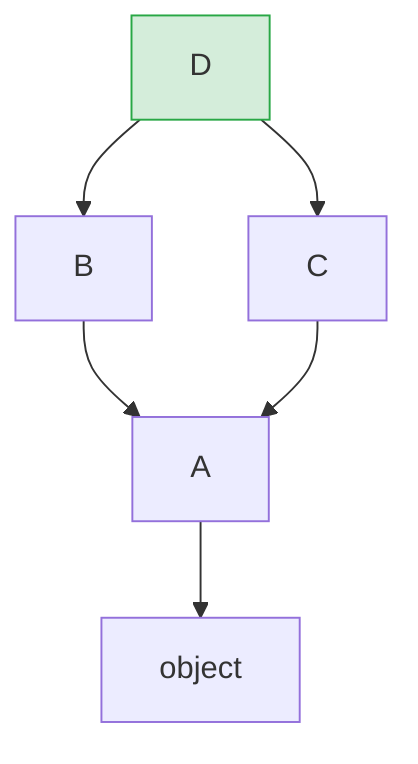

# Python 全栈实战（五）—— 面向对象：Python 风格

Python 的 OOP 跟 Java/TypeScript 的套路不一样。没有接口关键字，没有 `private`，鸭子类型贯穿始终——"如果它走起来像鸭子、叫起来像鸭子，它就是鸭子"。

> **环境：** Python 3.14.3

---

## 1. class 基础

```python
class User:
    """用户类"""

    def __init__(self, name: str, age: int) -> None:
        self.name = name        # 实例属性
        self.age = age
        self._login_count = 0   # 约定私有（单下划线）

    def greet(self) -> str:
        return f"你好，我是 {self.name}，{self.age} 岁"

    def login(self) -> None:
        self._login_count += 1


user = User("张三", 25)
print(user.greet())          # 你好，我是 张三，25 岁
print(user._login_count)     # 0（能访问，但约定不应该从外部访问）
```

几个关键点：

- `__init__` 是初始化方法（类似 JS 的 `constructor`），不是构造函数。真正的构造函数是 `__new__`（很少用到）。
- `self` 是实例自身的引用（类似 JS 的 `this`），但**必须显式写在参数列表里**，不能省略。
- Python 没有 `public` / `private` / `protected` 关键字。单下划线 `_` 前缀表示"约定私有"，双下划线 `__` 前缀触发名称改写（Name Mangling）。

### 类属性 vs 实例属性

```python
class Connection:
    MAX_RETRIES = 3                 # 类属性：所有实例共享
    _active_count = 0

    def __init__(self, host: str) -> None:
        self.host = host            # 实例属性：每个实例独立
        Connection._active_count += 1

    @classmethod
    def get_active_count(cls) -> int:
        return cls._active_count

    @staticmethod
    def is_valid_host(host: str) -> bool:
        return "." in host


conn1 = Connection("db.example.com")
conn2 = Connection("cache.example.com")
print(Connection.get_active_count())     # 2
print(Connection.is_valid_host("localhost"))  # False
```

- `@classmethod`：第一个参数是类本身 `cls`（不是实例），用于操作类属性或作为替代构造器
- `@staticmethod`：不接收 `cls` 或 `self`，跟普通函数一样，只是组织上放在类里面

## 2. dataclass：告别重复的 __init__

手写 `__init__`、`__repr__`、`__eq__` 很繁琐。`dataclass` 装饰器自动生成这些方法：

```python
from dataclasses import dataclass, field


@dataclass
class Product:
    name: str
    price: float
    quantity: int = 0
    tags: list[str] = field(default_factory=list)  # 可变默认值用 field


# 无需写 __init__，自动根据字段生成
item = Product("键盘", 299.0, quantity=50, tags=["外设", "办公"])
print(item)
# Product(name='键盘', price=299.0, quantity=50, tags=['外设', '办公'])

# 自动生成 __eq__
item2 = Product("键盘", 299.0, quantity=50, tags=["外设", "办公"])
print(item == item2)  # True（按字段值比较）
```

### dataclass 常用参数

```python
@dataclass(frozen=True)           # 不可变（类似 TypeScript 的 readonly）
class Point:
    x: float
    y: float

p = Point(3.0, 4.0)
# p.x = 5.0  # ❌ FrozenInstanceError

@dataclass(slots=True)            # 使用 __slots__，节省 30-40% 内存
class SensorData:
    timestamp: float
    value: float
    sensor_id: str
```

`slots=True`（Python 3.10+）让 dataclass 使用 `__slots__` 而非 `__dict__` 存储属性。好处：内存更小、属性访问更快。代价：不能动态添加未声明的属性。

### 什么时候用 dataclass、什么时候用普通 class？

- **dataclass**：主要存储数据，少量方法。类似 TypeScript 的 `interface` / `type`
- **普通 class**：复杂的业务逻辑、需要精细控制初始化过程、继承层级较深

## 3. 魔术方法（Dunder Methods）

以双下划线包围的方法（`__xxx__`）叫魔术方法（Magic Methods / Dunder Methods），是 Python 对象协议的核心。

```python
from dataclasses import dataclass


@dataclass
class Money:
    amount: float
    currency: str = "CNY"

    def __repr__(self) -> str:
        """开发者看到的表示（用于 debug）"""
        return f"Money({self.amount}, '{self.currency}')"

    def __str__(self) -> str:
        """用户看到的表示（用于 print）"""
        symbols = {"CNY": "¥", "USD": "$", "EUR": "€"}
        symbol = symbols.get(self.currency, self.currency)
        return f"{symbol}{self.amount:,.2f}"

    def __add__(self, other: "Money") -> "Money":
        """支持 + 运算符"""
        if self.currency != other.currency:
            raise ValueError(f"币种不同：{self.currency} vs {other.currency}")
        return Money(self.amount + other.amount, self.currency)

    def __lt__(self, other: "Money") -> bool:
        """支持 < 运算符（同时启用排序）"""
        return self.amount < other.amount

    def __bool__(self) -> bool:
        """布尔判断：金额大于 0 为 True"""
        return self.amount > 0


a = Money(100)
b = Money(200)

print(repr(a))     # Money(100, 'CNY')
print(str(a))      # ¥100.00
print(a + b)       # ¥300.00
print(a < b)       # True
print(bool(Money(0)))  # False
```

### 常用魔术方法速查

| 方法 | 触发方式 | 用途 |
|------|---------|------|
| `__init__` | `Cls()` | 初始化 |
| `__repr__` | `repr(obj)` | 开发者友好的字符串表示 |
| `__str__` | `str(obj)` / `print(obj)` | 用户友好的字符串表示 |
| `__eq__` | `a == b` | 相等比较 |
| `__hash__` | `hash(obj)` | 哈希值（用于 dict key / set） |
| `__lt__` | `a < b` | 小于比较（启用 `sorted`） |
| `__len__` | `len(obj)` | 长度 |
| `__getitem__` | `obj[key]` | 索引/键访问 |
| `__contains__` | `x in obj` | 成员检测 |
| `__call__` | `obj()` | 把对象当函数调用 |
| `__enter__` / `__exit__` | `with obj:` | 上下文管理器（第 7 篇） |
| `__iter__` / `__next__` | `for x in obj:` | 迭代器（第 8 篇） |

## 4. 继承

```python
from dataclasses import dataclass


@dataclass
class Animal:
    name: str
    sound: str = "..."

    def speak(self) -> str:
        return f"{self.name} 说：{self.sound}"


@dataclass
class Dog(Animal):
    sound: str = "汪汪"
    breed: str = "unknown"

    def fetch(self, item: str) -> str:
        return f"{self.name} 捡回了 {item}"


dog = Dog("旺财", breed="柴犬")
print(dog.speak())         # 旺财 说：汪汪
print(dog.fetch("球"))     # 旺财 捡回了 球
print(isinstance(dog, Animal))  # True
```

### 方法覆盖与 super()

```python
class Base:
    def greet(self) -> str:
        return "你好"

class Child(Base):
    def greet(self) -> str:
        base_greeting = super().greet()    # 调用父类方法
        return f"{base_greeting}，世界！"

print(Child().greet())  # 你好，世界！
```

## 5. 多继承与 MRO

Python 支持多继承——一个类可以同时继承多个父类。方法查找的顺序由 **MRO（Method Resolution Order）** 决定，使用 C3 线性化算法。

```python
class A:
    def method(self) -> str:
        return "A"

class B(A):
    def method(self) -> str:
        return "B"

class C(A):
    def method(self) -> str:
        return "C"

class D(B, C):
    pass

print(D().method())         # "B"（B 在 C 前面）
print(D.__mro__)
# (<class 'D'>, <class 'B'>, <class 'C'>, <class 'A'>, <class 'object'>)
```

MRO 的查找顺序：`D → B → C → A → object`。一旦在 B 中找到 `method`，就不再往后查了。



**实际建议**：尽量避免复杂的多继承。如果两个父类有同名方法，行为会变得不直观。Python 社区更推荐用**组合（Composition）** 替代多继承，或者用 **Mixin** 模式——Mixin 类只提供方法，不带状态：

```python
class JsonMixin:
    """Mixin：提供 JSON 序列化能力"""
    def to_json(self) -> str:
        import json
        return json.dumps(self.__dict__, ensure_ascii=False)


@dataclass
class User(JsonMixin):
    name: str
    age: int


print(User("张三", 25).to_json())
# {"name": "张三", "age": 25}
```

## 6. property：属性访问控制

`@property` 装饰器把方法伪装成属性，实现 getter/setter 逻辑：

```python
class Temperature:
    def __init__(self, celsius: float) -> None:
        self._celsius = celsius

    @property
    def celsius(self) -> float:
        return self._celsius

    @celsius.setter
    def celsius(self, value: float) -> None:
        if value < -273.15:
            raise ValueError("温度不能低于绝对零度 -273.15°C")
        self._celsius = value

    @property
    def fahrenheit(self) -> float:
        """只读属性：华氏温度"""
        return self._celsius * 9 / 5 + 32


temp = Temperature(100)
print(temp.celsius)       # 100（像属性一样访问，实际调用了 getter）
print(temp.fahrenheit)    # 212.0

temp.celsius = 0          # 触发 setter（带校验）
# temp.celsius = -300     # ❌ ValueError
# temp.fahrenheit = 100   # ❌ AttributeError（只读）
```

`@property` 的价值：外部代码用 `obj.attr` 的简洁语法，内部做校验和计算。如果之后需要给一个简单属性加上校验逻辑，只要加 `@property`，调用方的代码不用改。

## 7. __slots__：内存优化

默认情况下，每个 Python 对象用 `__dict__`（一个 dict）存储属性，灵活但浪费内存。`__slots__` 预声明属性名，用固定大小的数组替代 dict：

```python
class WithDict:
    def __init__(self, x, y):
        self.x = x
        self.y = y

class WithSlots:
    __slots__ = ("x", "y")

    def __init__(self, x, y):
        self.x = x
        self.y = y


import sys
a = WithDict(1, 2)
b = WithSlots(1, 2)

print(sys.getsizeof(a) + sys.getsizeof(a.__dict__))  # ~200 字节
print(sys.getsizeof(b))                               # ~56 字节
```

内存省了 70%。创建百万级对象时（如游戏实体、数据处理的行对象），差距非常明显。

代价：使用 `__slots__` 后不能动态添加未声明的属性，继承也有一些限制。`@dataclass(slots=True)` 是更方便的用法。

## 8. 抽象基类（ABC）

需要强制子类实现某些方法时，用 `abc.ABC`：

```python
from abc import ABC, abstractmethod


class PaymentProcessor(ABC):
    @abstractmethod
    def charge(self, amount: float) -> bool:
        """子类必须实现此方法"""
        ...

    @abstractmethod
    def refund(self, transaction_id: str) -> bool:
        ...

    def validate_amount(self, amount: float) -> bool:
        """非抽象方法：子类继承，也可以覆盖"""
        return amount > 0


class StripeProcessor(PaymentProcessor):
    def charge(self, amount: float) -> bool:
        print(f"Stripe 收费 ¥{amount:.2f}")
        return True

    def refund(self, transaction_id: str) -> bool:
        print(f"Stripe 退款 {transaction_id}")
        return True


# processor = PaymentProcessor()            # ❌ TypeError: Can't instantiate
processor = StripeProcessor()
processor.charge(99.9)                       # ✅ Stripe 收费 ¥99.90
```

ABC 提供了编译时的安全网——忘了实现抽象方法，实例化时就报 `TypeError`。但 Python 社区更倾向于用 `Protocol`（第 6 篇）替代 ABC，因为 Protocol 不要求继承关系。

## 常见坑点

**1. 可变类属性共享**

```python
class Team:
    members = []   # ❌ 类属性，所有实例共享同一个列表

team_a = Team()
team_b = Team()
team_a.members.append("张三")
print(team_b.members)   # ['张三']（team_b 也受影响！）
```

修复：在 `__init__` 里初始化可变属性，或用 `dataclass` 的 `field(default_factory=list)`。

**2. super() 在多继承中的行为**

`super()` 不是"调用父类"，而是"调用 MRO 中的下一个类"。在多继承场景下，`super()` 的调用链可能跳到一个你没预期的类。

```python
class A:
    def __init__(self):
        print("A")

class B(A):
    def __init__(self):
        super().__init__()   # 下一个是 C，不是 A！
        print("B")

class C(A):
    def __init__(self):
        super().__init__()
        print("C")

class D(B, C):
    def __init__(self):
        super().__init__()
        print("D")

D()  # A → C → B → D（按 MRO 反向输出）
```

## 总结

- `__init__` 初始化实例，`self` 必须显式声明
- `dataclass` 自动生成 `__init__` / `__repr__` / `__eq__`，`frozen=True` 不可变，`slots=True` 省内存
- 魔术方法是 Python 对象协议的核心——通过实现 `__add__`、`__lt__` 等方法来支持运算符
- 多继承的方法查找按 MRO（C3 线性化）顺序，推荐用 Mixin 或组合替代复杂多继承
- `@property` 把方法伪装成属性，对外简洁、对内可控
- `__slots__` 用固定数组替代 `__dict__`，数据密集场景节省 60-70% 内存

下一篇进入**类型系统与静态分析**——Type Hints、Protocol 与 Pyright 实战。

## 参考

- [Python 官方文档 - Data Model](https://docs.python.org/3.14/reference/datamodel.html)
- [Python 官方文档 - dataclasses](https://docs.python.org/3.14/library/dataclasses.html)
- [PEP 557 - Data Classes](https://peps.python.org/pep-0557/)
- [Python MRO - C3 Linearization](https://www.python.org/download/releases/2.3/mro/)
