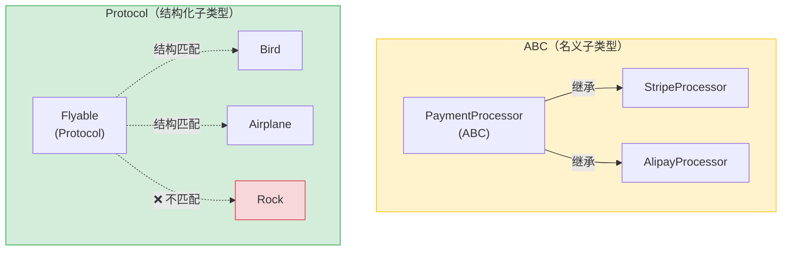

# Python 全栈实战（六）—— 类型系统与静态分析

Python 是动态类型语言，但 Type Hints 让它拥有了接近 TypeScript 的类型安全体验。关键区别：**类型注解不影响运行时**，它只是给 Pyright/mypy 这类工具看的"元数据"。

> **环境：** Python 3.14.3, Pyright latest

---

## 1. 基础类型注解

```python
# 变量注解
name: str = "张三"
age: int = 25
height: float = 1.75
is_active: bool = True

# 函数注解
def greet(name: str, times: int = 1) -> str:
    return f"你好，{name}！" * times

# None 返回值
def log(message: str) -> None:
    print(message)
```

类型注解不会阻止运行——`name: str = 123` 不会在运行时报错。但 Pyright 会标红，IDE 会提示。这跟 TypeScript 编译时检查、运行时不检查的思路一致。

## 2. 容器类型

Python 3.9+ 可以直接用内置类型做泛型标注，不需要从 `typing` 导入：

```python
# Python 3.9+ 写法（推荐）
names: list[str] = ["张三", "李四"]
scores: dict[str, int] = {"数学": 90, "英语": 85}
coordinates: tuple[float, float] = (3.0, 4.0)
unique_ids: set[int] = {1, 2, 3}

# 嵌套泛型
matrix: list[list[int]] = [[1, 2], [3, 4]]
user_groups: dict[str, list[str]] = {
    "admin": ["张三"],
    "user": ["李四", "王五"],
}
```

`tuple` 的类型标注有两种含义：
- `tuple[int, str, float]`：固定长度，每个位置类型不同
- `tuple[int, ...]`：任意长度，所有元素都是 int

## 3. Optional 与 Union

```python
from typing import Optional

# Optional[X] 等价于 X | None（Python 3.10+）
def find_user(user_id: int) -> Optional[dict]:
    """找不到返回 None"""
    if user_id == 1:
        return {"name": "张三"}
    return None

# Python 3.10+ 推荐用 | 语法（更简洁）
def find_user_v2(user_id: int) -> dict | None:
    ...

# Union：多种类型
def process(value: int | str | float) -> str:
    return str(value)
```

**Python 3.14 的变化**：由于延迟求值注解（PEP 649）的支持，类型注解在运行时不再立即求值。之前某些场景需要用 `from __future__ import annotations` 来处理前向引用，3.14 默认就支持了：

```python
# Python 3.14 之前需要特殊处理的场景
class TreeNode:
    def __init__(self, value: int, children: list["TreeNode"]) -> None:
        # "TreeNode" 要加引号，因为类还没定义完
        self.value = value
        self.children = children

# Python 3.14：延迟求值，不需要引号了
class TreeNode:
    def __init__(self, value: int, children: list[TreeNode]) -> None:
        self.value = value
        self.children = children
```

## 4. TypeAlias 与类型别名

复杂类型定义复用时，用类型别名：

```python
# Python 3.12+ 推荐用 type 语句（PEP 695）
type UserId = int
type UserDict = dict[str, str | int | None]
type Callback = Callable[[str, int], bool]
type JsonValue = str | int | float | bool | None | list["JsonValue"] | dict[str, "JsonValue"]

def get_user(user_id: UserId) -> UserDict:
    return {"name": "张三", "age": 25}
```

`type` 语句（Python 3.12+）比旧的 `TypeAlias` 赋值方式更清晰，也支持前向引用（如递归类型 `JsonValue`）。

## 5. 泛型

泛型让函数或类能处理多种类型，同时保持类型安全：

```python
# Python 3.12+ 语法（PEP 695）
def first[T](items: list[T]) -> T | None:
    """返回列表第一个元素"""
    return items[0] if items else None

# T 由传入的参数自动推导
result1 = first([1, 2, 3])       # 推导为 int | None
result2 = first(["a", "b"])      # 推导为 str | None

# 泛型类
class Stack[T]:
    def __init__(self) -> None:
        self._items: list[T] = []

    def push(self, item: T) -> None:
        self._items.append(item)

    def pop(self) -> T:
        return self._items.pop()

    def is_empty(self) -> bool:
        return len(self._items) == 0


int_stack = Stack[int]()
int_stack.push(42)
# int_stack.push("hello")  # Pyright 报错：str 不能赋给 int
```

Python 3.12 之前需要用 `TypeVar` 声明泛型变量，语法更啰嗦：

```python
# 旧写法（3.11 及以下）
from typing import TypeVar
T = TypeVar("T")

def first(items: list[T]) -> T | None: ...
```

3.12+ 的 `def first[T]` 语法跟 TypeScript 的 `function first<T>` 几乎一样直观。

## 6. Protocol：鸭子类型的形式化

Python 崇尚鸭子类型——不检查类型是什么，只检查它能做什么。`Protocol` 把这个理念形式化：

```python
from typing import Protocol


class Flyable(Protocol):
    def fly(self) -> str: ...     # 只声明方法签名，不实现


class Bird:
    def fly(self) -> str:
        return "扇动翅膀飞行"

class Airplane:
    def fly(self) -> str:
        return "喷气引擎推进"

class Rock:
    def roll(self) -> str:
        return "滚动"


def take_off(thing: Flyable) -> None:
    print(thing.fly())

take_off(Bird())      # ✅ Bird 有 fly 方法
take_off(Airplane())  # ✅ Airplane 也有 fly 方法
# take_off(Rock())    # ❌ Pyright 报错：Rock 不满足 Flyable 协议
```

Protocol 跟 TypeScript 的 `interface` 最像——**不需要继承**，只要结构匹配就通过。这就是"结构化子类型"（Structural Subtyping），对比 Java/C++ 的"名义子类型"（Nominal Subtyping，必须 `implements`）。

### Protocol vs ABC 的选择

| 特性 | Protocol | ABC |
|------|----------|-----|
| 需要继承 | ❌ 不需要 | ✅ 需要 |
| 运行时检查 | ❌ 纯静态 | ✅ `isinstance` 可用 |
| 适合场景 | 第三方库类型约束、鸭子类型 | 自己的类继承体系 |
| 类比 | TypeScript `interface` | Java `abstract class` |

**建议**：项目内部的继承体系用 ABC，跨模块/跨库的类型约束用 Protocol。



### 带属性的 Protocol

```python
from typing import Protocol


class Sized(Protocol):
    @property
    def size(self) -> int: ...


class File:
    def __init__(self, content: bytes) -> None:
        self._content = content

    @property
    def size(self) -> int:
        return len(self._content)


def check_limit(obj: Sized, max_size: int) -> bool:
    return obj.size <= max_size

check_limit(File(b"hello"), 1024)  # ✅
```

## 7. Literal 与精确类型

```python
from typing import Literal

# 限制参数只能是特定的值（类似 TypeScript 的字面量联合类型）
def set_log_level(level: Literal["DEBUG", "INFO", "WARNING", "ERROR"]) -> None:
    print(f"日志级别设为 {level}")

set_log_level("INFO")      # ✅
# set_log_level("VERBOSE")  # ❌ Pyright 报错
```

## 8. TypedDict：字典的类型约束

普通 `dict[str, Any]` 丧失了类型信息。`TypedDict` 为字典的每个 key 指定类型：

```python
from typing import TypedDict, NotRequired


class UserProfile(TypedDict):
    name: str
    age: int
    email: NotRequired[str]    # 可选字段


def create_profile(data: UserProfile) -> None:
    print(f"用户：{data['name']}，年龄：{data['age']}")


# ✅ 正确
create_profile({"name": "张三", "age": 25})
create_profile({"name": "李四", "age": 30, "email": "l@test.com"})

# ❌ Pyright 报错：缺少 age
# create_profile({"name": "张三"})
```

`TypedDict` 在处理 JSON API 响应时特别有用——比 `dict[str, Any]` 安全得多。

## 9. Pyright 实战配置

在 `pyproject.toml` 中配置 Pyright 的检查级别：

```toml
[tool.pyright]
pythonVersion = "3.14"
typeCheckingMode = "standard"    # basic → standard → strict

# 精细控制单项规则
reportMissingTypeStubs = false
reportUnusedImport = true
reportUnusedVariable = true
reportUnnecessaryTypeIgnoreComment = true
```

三种模式的区别：

| 能力 | basic | standard | strict |
|------|-------|----------|--------|
| 类型不匹配 | ✅ | ✅ | ✅ |
| 缺少返回类型注解 | ❌ | ✅ | ✅ |
| 缺少参数类型注解 | ❌ | ❌ | ✅ |
| 隐式 Any | ❌ | ❌ | ✅ |

**渐进式类型化策略**：
1. 新项目从 `basic` 起步
2. 关键模块（API 接口、核心业务逻辑）逐步切到 `standard`
3. 团队共识后全量切 `strict`

可以通过文件级或行级覆盖：

```python
# 文件顶部：局部放宽
# pyright: basic

# 行级忽略：特定行跳过检查
result = some_untyped_function()  # type: ignore[no-any-return]
```

## 10. 常见类型模式

### Callable（可调用对象）

```python
from collections.abc import Callable

# 接收一个 (str, int) -> bool 的函数
def register_handler(
    event: str,
    handler: Callable[[str, int], bool],
) -> None:
    ...
```

### TypeGuard（类型收窄）

```python
from typing import TypeGuard


def is_string_list(val: list[object]) -> TypeGuard[list[str]]:
    """类型守卫：检查是否为字符串列表"""
    return all(isinstance(item, str) for item in val)


def process(data: list[object]) -> None:
    if is_string_list(data):
        # 这里 data 被收窄为 list[str]
        print(data[0].upper())   # ✅ Pyright 知道是 str
```

### overload（函数重载）

```python
from typing import overload

@overload
def parse(raw: str) -> dict: ...
@overload
def parse(raw: bytes) -> dict: ...

def parse(raw: str | bytes) -> dict:
    if isinstance(raw, bytes):
        raw = raw.decode("utf-8")
    import json
    return json.loads(raw)

# Pyright 能根据传入类型推导返回类型
result = parse('{"a": 1}')      # dict
result = parse(b'{"a": 1}')     # dict
```

## 常见坑点

**1. 类型注解不做运行时校验**

```python
def add(a: int, b: int) -> int:
    return a + b

# 运行时不会报错，只有 Pyright 会报
print(add("hello", "world"))  # "helloworld"（字符串拼接，没有 TypeError）
```

需要运行时校验用 Pydantic（第 16 篇 FastAPI 会详解）。

**2. list[int] 是不变（Invariant）的**

```python
def process(items: list[int]) -> None: ...

children: list[bool] = [True, False]
# process(children)  # ❌ Pyright 报错：list[bool] 不能赋给 list[int]
```

虽然 `bool` 是 `int` 的子类，但 `list[bool]` 不是 `list[int]` 的子类型——因为 `process` 可能往列表里 append 一个 int，破坏了 `list[bool]` 的约束。如果只读取不修改，用 `Sequence[int]` 代替：

```python
from collections.abc import Sequence

def process(items: Sequence[int]) -> None: ...  # Sequence 是协变的
process([True, False])  # ✅
```

## 总结

- Type Hints 是"元数据"，不影响运行时，只让工具和 IDE 做静态分析
- Python 3.12+ 用 `type` 语句和 `def func[T]` 语法定义泛型，跟 TypeScript 语法接近
- `Protocol` 是鸭子类型的形式化，不需要继承，只要结构匹配就通过
- `TypedDict` 为 dict 的每个 key 约束类型，处理 JSON 数据时比 `dict[str, Any]` 安全得多
- Python 3.14 的延迟求值注解（PEP 649）消除了前向引用的痛点
- Pyright 从 `basic` 起步，渐进式提升类型覆盖率

下一篇进入**错误处理与上下文管理器**——Python 异常体系与 `with` 语句原理。

## 参考

- [Python 官方文档 - typing](https://docs.python.org/3.14/library/typing.html)
- [PEP 544 - Protocols: Structural subtyping](https://peps.python.org/pep-0544/)
- [PEP 695 - Type Parameter Syntax](https://peps.python.org/pep-0695/)
- [PEP 649 - Deferred Evaluation of Annotations](https://peps.python.org/pep-0649/)
- [Pyright Documentation](https://microsoft.github.io/pyright/)
