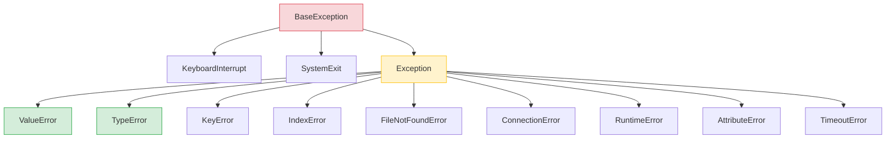
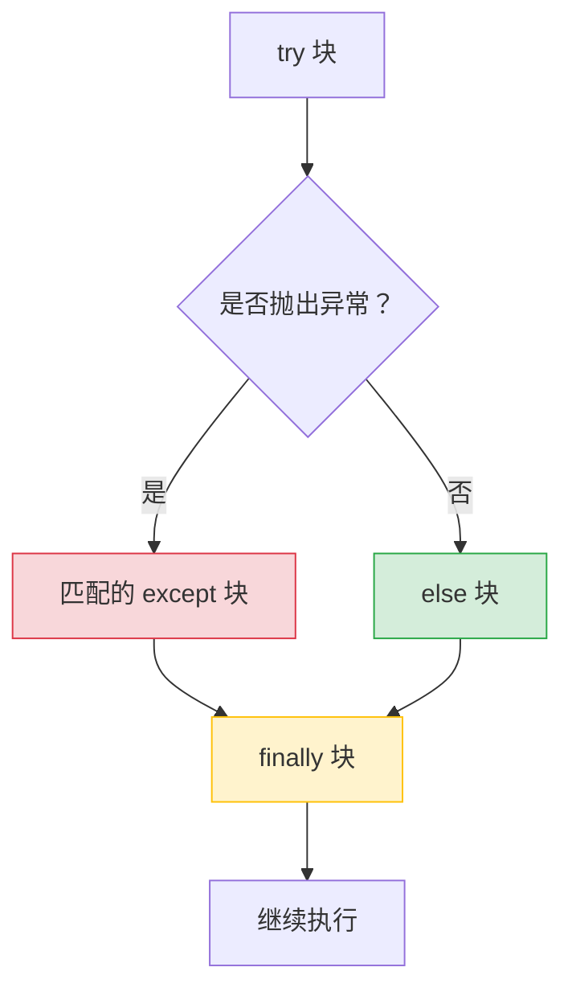
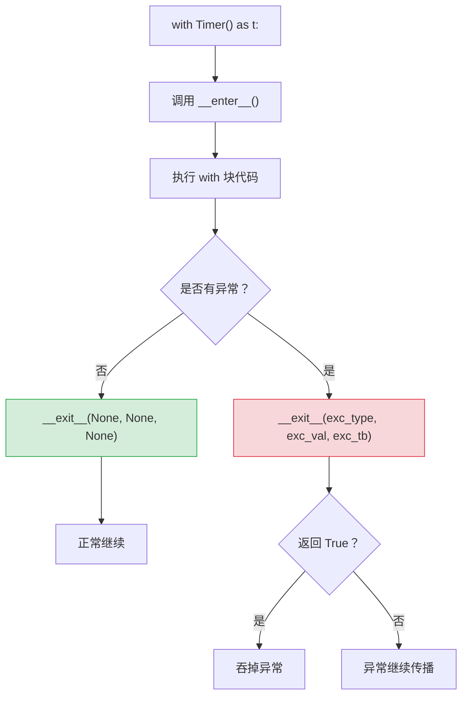

# Python 全栈实战（七）—— 错误处理与上下文管理器

try/except 只是错误处理的表面。Python 的异常体系设计精巧——异常链能追溯根因，`with` 语句保证资源必定释放，`contextlib` 让你用生成器写出优雅的资源管理器。

> **环境：** Python 3.14.3

---

## 1. 异常体系

Python 的异常是一棵类继承树。所有异常都继承自 `BaseException`，实际开发中只需要关注 `Exception` 以下的分支：



`except Exception` 能捕获几乎所有业务异常，但不会捕获 `KeyboardInterrupt`（Ctrl+C）和 `SystemExit`（`sys.exit()`）——这两个是系统级信号，不应该被业务代码拦截。

## 2. try/except/else/finally

```python
def read_config(path: str) -> dict:
    try:
        with open(path) as f:
            import json
            return json.load(f)
    except FileNotFoundError:
        print(f"配置文件不存在：{path}")
        return {}
    except json.JSONDecodeError as exc:
        print(f"JSON 解析失败：{exc}")
        return {}
    else:
        # try 没有异常时才执行（很少用，但特定场景有用）
        print("配置加载成功")
    finally:
        # 无论是否异常都执行（清理资源）
        print("清理完成")
```

四个块的执行逻辑：



**`else` 块的价值**：把"正常逻辑"从 try 块中分离出来。try 块应该只包含可能抛异常的代码，不要把后续处理也塞进去——否则后续代码的异常会被意外捕获。

### 捕获多种异常

```python
# 同一个处理逻辑
try:
    value = int(user_input)
except (ValueError, TypeError) as exc:
    print(f"输入无效：{exc}")

# 不同的处理逻辑
try:
    response = httpx.get(url, timeout=5)
    data = response.json()
except httpx.TimeoutException:
    data = load_from_cache(url)         # 超时降级到缓存
except httpx.HTTPStatusError as exc:
    log_error(exc)
    data = {}
```

## 3. 自定义异常

生产代码不应该直接抛 `ValueError` / `RuntimeError`——自定义异常让错误语义更明确、捕获更精准：

```python
class AppError(Exception):
    """应用级错误基类"""
    def __init__(self, message: str, code: str = "UNKNOWN") -> None:
        super().__init__(message)
        self.code = code


class NotFoundError(AppError):
    """资源不存在"""
    def __init__(self, resource: str, resource_id: str) -> None:
        super().__init__(
            f"{resource} '{resource_id}' 不存在",
            code="NOT_FOUND",
        )
        self.resource = resource
        self.resource_id = resource_id


class AuthenticationError(AppError):
    """认证失败"""
    def __init__(self, reason: str = "token 无效或已过期") -> None:
        super().__init__(reason, code="AUTH_FAILED")


# 使用
def get_user(user_id: str) -> dict:
    user = db.find_user(user_id)
    if user is None:
        raise NotFoundError("User", user_id)
    return user

try:
    user = get_user("abc123")
except NotFoundError as exc:
    print(f"[{exc.code}] {exc}")
    # [NOT_FOUND] User 'abc123' 不存在
except AppError as exc:
    print(f"应用错误：{exc}")
```

异常类的继承层级让你灵活选择捕获粒度：`except NotFoundError` 只捕获找不到的情况，`except AppError` 捕获所有应用错误。

## 4. 异常链（raise ... from）

一个异常触发了另一个异常时，用 `raise ... from` 保留完整的因果链：

```python
import json


def parse_user_config(raw: str) -> dict:
    try:
        config = json.loads(raw)
    except json.JSONDecodeError as exc:
        # 把原始异常作为 cause 链接上去
        raise AppError("用户配置格式错误", code="INVALID_CONFIG") from exc

try:
    parse_user_config("{bad json}")
except AppError as exc:
    print(f"错误：{exc}")
    print(f"根因：{exc.__cause__}")
    # 错误：用户配置格式错误
    # 根因：Expecting property name enclosed in double quotes: line 1 column 2 (char 1)
```

`from exc` 的作用：在 traceback 中显示 `The above exception was the direct cause of the following exception`，让排查问题时能看到完整的因果链。

如果不加 `from`，直接在 except 块里 raise 新异常，Python 也会记录原始异常——但显示的是 `During handling of the above exception, another exception occurred`，语义不够明确。

`raise ... from None` 可以主动切断异常链（隐藏内部实现细节）：

```python
try:
    result = internal_complex_operation()
except InternalDatabaseError:
    raise AppError("操作失败") from None  # 不暴露内部数据库异常
```

## 5. with 语句与上下文管理器

`with` 语句的核心承诺：**无论代码是否异常，资源一定会被释放**。

```python
# 文件操作：with 保证文件一定关闭
with open("data.txt", "w") as f:
    f.write("hello")
    # 即使这里抛异常，f.close() 也会执行

# 不用 with 的写法（容易忘记关闭）
f = open("data.txt")
try:
    data = f.read()
finally:
    f.close()
```

### 协议：__enter__ 和 __exit__

`with` 语句调用两个魔术方法：

```python
class Timer:
    """可用于 with 语句的计时器"""
    def __enter__(self):
        import time
        self.start = time.perf_counter()
        return self                  # as 后面的变量绑定到这个返回值

    def __exit__(self, exc_type, exc_val, exc_tb):
        import time
        elapsed = time.perf_counter() - self.start
        print(f"耗时 {elapsed:.4f}s")
        return False                 # False = 不吞掉异常，继续传播


with Timer() as t:
    # 模拟耗时操作
    total = sum(range(1_000_000))
# 耗时 0.0234s
```

执行流程：
1. `__enter__()` 在进入 `with` 块时调用
2. `with` 块内的代码正常执行
3. `__exit__()` 在退出 `with` 块时调用（无论是否有异常）
4. `__exit__` 返回 `True` 表示吞掉异常，返回 `False` 表示继续向上传播



## 6. contextlib：更简洁的上下文管理器

手写 `__enter__` / `__exit__` 太啰嗦。`contextlib.contextmanager` 装饰器用生成器语法简化：

```python
from contextlib import contextmanager
import time


@contextmanager
def timer(label: str = "操作"):
    start = time.perf_counter()
    try:
        yield                   # <--- yield 之前 = __enter__，yield 之后 = __exit__
    finally:
        elapsed = time.perf_counter() - start
        print(f"{label} 耗时 {elapsed:.4f}s")


with timer("数据处理"):
    total = sum(range(10_000_000))
# 数据处理 耗时 0.2345s
```

`yield` 把函数切成两半——`yield` 前面的代码在进入 `with` 时执行，`yield` 后面的代码在退出 `with` 时执行。`finally` 确保退出逻辑一定执行。

### 实用案例：临时切换工作目录

```python
from contextlib import contextmanager
import os
from pathlib import Path


@contextmanager
def working_directory(path: str | Path):
    """临时切换工作目录，退出时自动恢复"""
    original = Path.cwd()
    try:
        os.chdir(path)
        yield Path(path)
    finally:
        os.chdir(original)


with working_directory("/tmp"):
    print(Path.cwd())   # /tmp
print(Path.cwd())       # 回到原目录
```

### contextlib.suppress：忽略特定异常

```python
from contextlib import suppress
import os

# 删除文件，如果不存在就忽略
with suppress(FileNotFoundError):
    os.remove("temp.txt")

# 等价于：
# try:
#     os.remove("temp.txt")
# except FileNotFoundError:
#     pass
```

## 7. ExceptionGroup（Python 3.11+）

当并发任务中多个异常同时发生时，用 `ExceptionGroup` 把它们打包在一起：

```python
import asyncio


async def task_a():
    raise ValueError("任务 A 失败")

async def task_b():
    raise ConnectionError("任务 B 失败")


async def main():
    try:
        async with asyncio.TaskGroup() as tg:
            tg.create_task(task_a())
            tg.create_task(task_b())
    except* ValueError as eg:            # except* 匹配异常组中的特定类型
        for exc in eg.exceptions:
            print(f"值错误：{exc}")
    except* ConnectionError as eg:
        for exc in eg.exceptions:
            print(f"连接错误：{exc}")


asyncio.run(main())
# 值错误：任务 A 失败
# 连接错误：任务 B 失败
```

`except*` 是 Python 3.11 引入的语法，专门处理 `ExceptionGroup`。每个 `except*` 分支过滤和处理对应类型的异常，剩余未匹配的异常继续传播。

## 8. 错误处理最佳实践

```python
# ❌ 裸 except：吞掉所有异常，包括 KeyboardInterrupt
try:
    risky_operation()
except:
    pass

# ❌ except Exception + pass：隐藏 bug
try:
    risky_operation()
except Exception:
    pass

# ✅ 捕获具体异常，记录或处理
try:
    risky_operation()
except ConnectionError as exc:
    logger.warning(f"连接失败，使用缓存：{exc}")
    return cached_data
except ValueError as exc:
    raise AppError("参数无效") from exc

# ✅ LBYL vs EAFP
# LBYL（Look Before You Leap）—— 先检查再操作
if key in data_dict:
    value = data_dict[key]

# EAFP（Easier to Ask Forgiveness than Permission）—— 先操作再处理异常
try:
    value = data_dict[key]
except KeyError:
    value = default_value
```

Python 社区推崇 EAFP 风格——在 key 大概率存在的场景下，直接 try 比每次都 if 检查更快（省去一次哈希查找）。但如果异常是常态（高频触发），LBYL 反而更好——异常的创建和捕获有性能开销。

## 常见坑点

**1. finally 中的 return 会吞掉异常**

```python
def dangerous():
    try:
        raise ValueError("出错了")
    finally:
        return "正常"     # ❌ finally 中的 return 会吞掉异常！

print(dangerous())         # "正常"（ValueError 消失了）
```

Ruff 的 `B012` 规则会检测这个问题。finally 块里不要 return。

**2. 上下文管理器的 __exit__ 返回值**

`__exit__` 返回 `True` 表示"我已经处理了这个异常"——异常不再往上传播，调用方感知不到出了错。除非你明确要吞掉异常，否则永远返回 `False`（或不返回，默认就是 `None` → `False`）。

## 总结

- 异常体系是继承树，`except Exception` 捕获业务异常，不捕获系统信号
- 自定义异常提升错误语义的清晰度，`raise ... from` 保留因果链
- `with` 语句基于 `__enter__` / `__exit__` 协议，保证资源一定释放
- `contextlib.contextmanager` 用生成器语法简化上下文管理器的编写
- `ExceptionGroup` + `except*`（3.11+）处理并发场景中的多异常
- EAFP 优于 LBYL，除非异常是高频触发的常态路径

下一篇进入**文件 IO 与数据序列化**——`pathlib` 路径操作、JSON/CSV/TOML 处理。

## 参考

- [Python 官方文档 - 异常层级](https://docs.python.org/3.14/library/exceptions.html#exception-hierarchy)
- [Python 官方文档 - contextlib](https://docs.python.org/3.14/library/contextlib.html)
- [PEP 654 - Exception Groups and except*](https://peps.python.org/pep-0654/)
