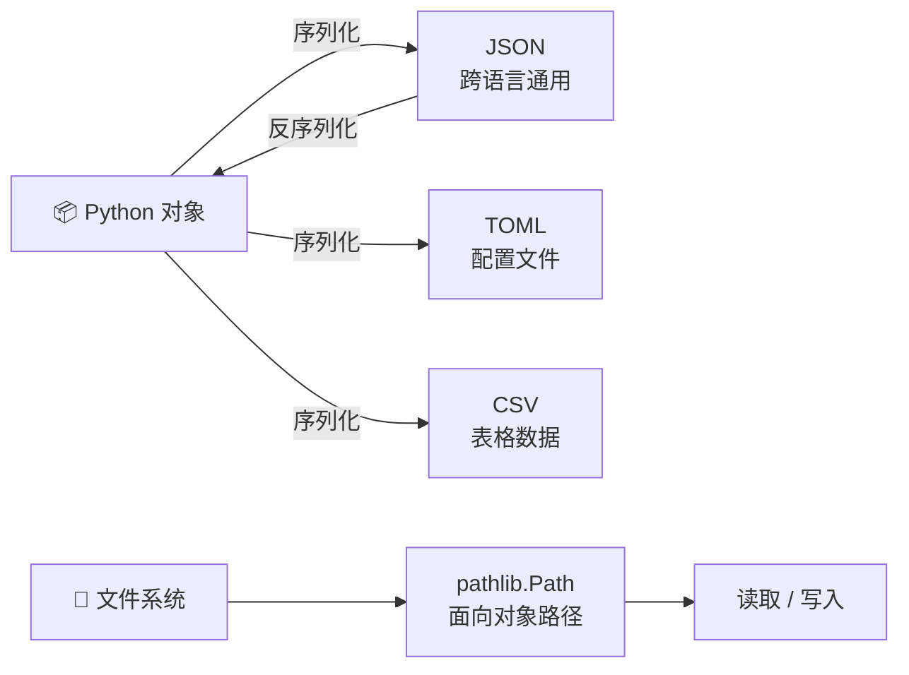

# Python 全栈实战（八）—— 文件 IO 与数据序列化

读写文件、处理路径、解析 JSON/CSV——这些操作占据了日常 Python 开发 30% 以上的时间。`pathlib` 该彻底替代 `os.path` 了。

> **环境：** Python 3.14.3

---

## 1. pathlib：现代路径操作



`os.path` 返回的是字符串，路径拼接靠 `os.path.join()`，不直观也不安全。`pathlib.Path` 是面向对象的路径 API，Python 3.4 引入，3.14 已经是标准做法。

```python
from pathlib import Path

# 创建路径对象
project_dir = Path("/Users/dev/my-project")
config_file = project_dir / "config" / "settings.toml"  # / 运算符拼接路径
print(config_file)
# /Users/dev/my-project/config/settings.toml

# 路径信息
print(config_file.name)       # settings.toml
print(config_file.stem)       # settings（无扩展名）
print(config_file.suffix)     # .toml
print(config_file.parent)     # /Users/dev/my-project/config
print(config_file.parts)      # ('/', 'Users', 'dev', 'my-project', 'config', 'settings.toml')

# 当前目录和用户目录
cwd = Path.cwd()              # 当前工作目录
home = Path.home()             # 用户主目录
```

### 文件/目录操作

```python
from pathlib import Path

output_dir = Path("output/reports")

# 创建目录（parents=True 递归创建，exist_ok=True 已存在不报错）
output_dir.mkdir(parents=True, exist_ok=True)

# 检查路径
output_dir.exists()            # True
output_dir.is_dir()            # True
output_dir.is_file()           # False

# 遍历目录
for item in Path(".").iterdir():
    tag = "📁" if item.is_dir() else "📄"
    print(f"{tag} {item.name}")

# glob 模式匹配
for py_file in Path("src").glob("**/*.py"):    # 递归查找所有 .py 文件
    print(py_file)

# 重命名、移动、删除
path = Path("old_name.txt")
path.rename("new_name.txt")         # 重命名
path.unlink(missing_ok=True)        # 删除文件（missing_ok=True 不存在不报错）
```

### os.path vs pathlib 对照

| 操作 | os.path | pathlib |
|------|---------|---------|
| 拼接路径 | `os.path.join(a, b)` | `Path(a) / b` |
| 文件名 | `os.path.basename(p)` | `p.name` |
| 扩展名 | `os.path.splitext(p)[1]` | `p.suffix` |
| 是否存在 | `os.path.exists(p)` | `p.exists()` |
| 读取文件 | `open(p).read()` | `p.read_text()` |
| 绝对路径 | `os.path.abspath(p)` | `p.resolve()` |

## 2. 文件读写

### 基础读写

```python
from pathlib import Path

# 快捷读写（小文件推荐）
Path("note.txt").write_text("你好，Python！", encoding="utf-8")
content = Path("note.txt").read_text(encoding="utf-8")
print(content)   # 你好，Python！

# 二进制文件
image_data = Path("photo.jpg").read_bytes()
Path("copy.jpg").write_bytes(image_data)
```

### 逐行处理（大文件）

小文件直接 `read_text()` 一次读入内存没问题。大文件（几百 MB 以上）要逐行或分块读取，避免内存爆炸：

```python
from pathlib import Path

# ✅ 逐行读取：内存中只保留当前行
line_count = 0
with open("huge_log.txt", encoding="utf-8") as f:
    for line in f:          # 文件对象本身就是迭代器
        if "ERROR" in line:
            line_count += 1

print(f"共 {line_count} 条错误日志")
```

```python
# ✅ 分块读取二进制文件
CHUNK_SIZE = 8192   # 8KB

def copy_file(src: Path, dst: Path) -> None:
    """流式复制文件，内存占用恒定 8KB"""
    with open(src, "rb") as f_in, open(dst, "wb") as f_out:
        while chunk := f_in.read(CHUNK_SIZE):    # 海象运算符
            f_out.write(chunk)
```

`while chunk := f_in.read(CHUNK_SIZE)` 利用海象运算符，读完所有数据后 `read()` 返回空 bytes（假值），循环自动终止。

### 编码问题

```python
# ❌ 不指定 encoding，不同系统默认值不同
content = Path("data.txt").read_text()  # Windows 默认 GBK，Linux 默认 UTF-8

# ✅ 显式指定 encoding
content = Path("data.txt").read_text(encoding="utf-8")

# 处理编码错误
content = Path("messy.txt").read_text(encoding="utf-8", errors="replace")
# 无法解码的字节替换为 �

# 检测文件编码（需要安装 chardet）
# uv add chardet
import chardet
raw = Path("unknown.txt").read_bytes()
detected = chardet.detect(raw)
print(detected)  # {'encoding': 'GB2312', 'confidence': 0.99}
```

## 3. JSON 处理

```python
import json
from pathlib import Path

# Python 对象 → JSON 字符串
user = {"name": "张三", "age": 25, "skills": ["Python", "FastAPI"]}

json_str = json.dumps(user, ensure_ascii=False, indent=2)
# ensure_ascii=False：中文不转义
# indent=2：格式化缩进

print(json_str)
# {
#   "name": "张三",
#   "age": 25,
#   "skills": ["Python", "FastAPI"]
# }

# JSON 字符串 → Python 对象
parsed = json.loads(json_str)
print(parsed["name"])   # 张三

# 直接读写文件
Path("user.json").write_text(
    json.dumps(user, ensure_ascii=False, indent=2),
    encoding="utf-8",
)

with open("user.json", encoding="utf-8") as f:
    loaded = json.load(f)         # json.load 从文件对象读取
```

### 自定义序列化

`json.dumps` 遇到不支持的类型会抛 `TypeError`。用 `default` 参数处理：

```python
import json
from datetime import datetime
from pathlib import Path
from dataclasses import dataclass, asdict


@dataclass
class Event:
    name: str
    timestamp: datetime
    tags: list[str]


def json_serializer(obj):
    """自定义 JSON 序列化器"""
    if isinstance(obj, datetime):
        return obj.isoformat()
    if isinstance(obj, Path):
        return str(obj)
    raise TypeError(f"无法序列化类型 {type(obj)}")


event = Event("部署", datetime.now(), ["prod", "v2.0"])
json_str = json.dumps(asdict(event), default=json_serializer, ensure_ascii=False)
print(json_str)
# {"name": "部署", "timestamp": "2026-03-25T10:30:00.123456", "tags": ["prod", "v2.0"]}
```

## 4. CSV 处理

```python
import csv
from pathlib import Path

# 写入 CSV
users = [
    {"name": "张三", "age": 25, "city": "北京"},
    {"name": "李四", "age": 30, "city": "上海"},
    {"name": "王五", "age": 28, "city": "深圳"},
]

with open("users.csv", "w", newline="", encoding="utf-8-sig") as f:
    # utf-8-sig：带 BOM 头，Excel 打开中文不乱码
    writer = csv.DictWriter(f, fieldnames=["name", "age", "city"])
    writer.writeheader()
    writer.writerows(users)

# 读取 CSV
with open("users.csv", encoding="utf-8-sig") as f:
    reader = csv.DictReader(f)
    for row in reader:
        print(f"{row['name']}，{row['age']} 岁，{row['city']}")
```

CSV 的 `newline=""` 参数很关键——不传的话 Windows 上会多出空行。`utf-8-sig` 编码解决 Excel 打开 UTF-8 CSV 乱码的经典问题。

### 大 CSV 文件处理

```python
import csv
from collections import Counter

# 统计 100 万行 CSV 中各城市的用户数
city_count: Counter[str] = Counter()

with open("big_data.csv", encoding="utf-8") as f:
    reader = csv.DictReader(f)
    for row in reader:          # 逐行迭代，不会一次性加载到内存
        city_count[row["city"]] += 1

for city, count in city_count.most_common(5):
    print(f"{city}: {count}")
```

## 5. TOML 处理

TOML 是 `pyproject.toml` 的格式，Python 3.11+ 内置了 `tomllib`（只读）。

```python
import tomllib
from pathlib import Path

# 读取 TOML
toml_content = Path("pyproject.toml").read_text(encoding="utf-8")
config = tomllib.loads(toml_content)

# 或者用二进制模式直接读
with open("pyproject.toml", "rb") as f:
    config = tomllib.load(f)

print(config["project"]["name"])          # 项目名
print(config["project"]["version"])       # 版本号
print(config["tool"]["ruff"]["line-length"])  # Ruff 行宽配置
```

`tomllib` 只能读不能写。需要写入 TOML 的场景（如生成配置文件），安装第三方库 `tomli-w`：

```bash
uv add tomli-w
```

```python
import tomli_w
from pathlib import Path

config = {
    "database": {
        "host": "localhost",
        "port": 5432,
        "name": "myapp",
    },
    "cache": {
        "backend": "redis",
        "ttl": 3600,
    },
}

Path("config.toml").write_bytes(tomli_w.dumps(config).encode())
```

## 6. 临时文件与目录

```python
import tempfile
from pathlib import Path

# 临时文件（自动清理）
with tempfile.NamedTemporaryFile(mode="w", suffix=".json", delete=False) as f:
    f.write('{"temp": true}')
    temp_path = Path(f.name)
    print(f"临时文件：{temp_path}")

# 临时目录（退出 with 块时自动删除整个目录）
with tempfile.TemporaryDirectory() as tmpdir:
    tmp_path = Path(tmpdir)
    (tmp_path / "data.txt").write_text("临时数据")
    print(f"临时目录：{tmp_path}")
# 退出后 tmpdir 已被删除
```

`TemporaryDirectory` 在测试中特别好用——每个测试用例用独立的临时目录，结束后自动清理。

## 7. 实战：配置文件加载器

整合前面的知识，写一个支持多种格式的配置加载器：

```python
import json
import tomllib
from pathlib import Path


def load_config(path: str | Path) -> dict:
    """根据文件扩展名自动选择解析器"""
    filepath = Path(path)

    if not filepath.exists():
        raise FileNotFoundError(f"配置文件不存在：{filepath}")

    match filepath.suffix:
        case ".json":
            return json.loads(filepath.read_text(encoding="utf-8"))
        case ".toml":
            with open(filepath, "rb") as f:
                return tomllib.load(f)
        case other:
            raise ValueError(f"不支持的配置格式：{other}")


# 使用
config = load_config("pyproject.toml")
print(config["project"]["name"])
```

这段代码用了 `match-case`（第 2 篇讲的模式匹配）做分发，比 if/elif 链更清晰。

## 常见坑点

**1. 路径分隔符问题**

```python
# ❌ 硬编码路径分隔符
path = "data\\files\\report.csv"      # Windows 写法，Linux 上会出错

# ✅ 用 pathlib，自动处理跨平台
path = Path("data") / "files" / "report.csv"
```

**2. 文件写入没有 flush**

```python
# ❌ 程序崩溃时数据可能丢失（还在缓冲区）
f = open("log.txt", "a")
f.write("重要日志\n")
# 如果这里程序崩溃，上面写的数据可能没落盘

# ✅ 用 with 语句，退出时自动 flush + close
with open("log.txt", "a") as f:
    f.write("重要日志\n")
```

**3. json.dumps 对中文的默认行为**

`json.dumps` 默认 `ensure_ascii=True`，中文会被转义成 `\u5f20\u4e09`。处理中文数据时一定加 `ensure_ascii=False`。

## 总结

- `pathlib.Path` 是路径操作的标准方式，用 `/` 运算符拼接路径，跨平台安全
- 大文件用 `for line in f` 逐行迭代或 `f.read(chunk_size)` 分块读取
- 编码问题：始终显式指定 `encoding="utf-8"`，Excel 兼容用 `utf-8-sig`
- JSON 用 `json.dumps/loads`，TOML 用内置 `tomllib`（只读），CSV 用 `csv.DictReader/DictWriter`
- `tempfile.TemporaryDirectory` 适合测试场景，退出自动清理

下一篇进入**迭代器与生成器**——`yield` 与惰性求值的威力。

## 参考

- [Python 官方文档 - pathlib](https://docs.python.org/3.14/library/pathlib.html)
- [Python 官方文档 - json](https://docs.python.org/3.14/library/json.html)
- [Python 官方文档 - csv](https://docs.python.org/3.14/library/csv.html)
- [Python 官方文档 - tomllib](https://docs.python.org/3.14/library/tomllib.html)
