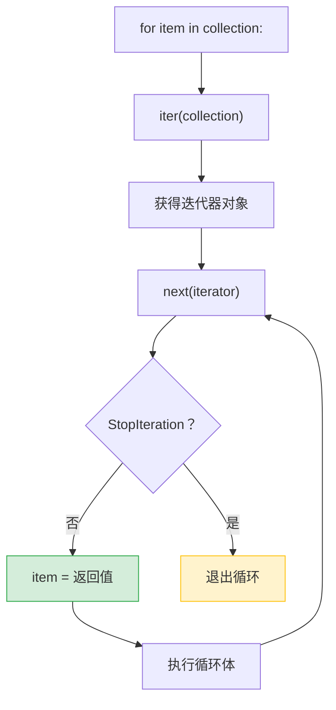

# Python 全栈实战（九）—— 迭代器与生成器

`for item in collection` 这行代码背后有一套精巧的协议。理解了迭代器协议，生成器就是顺理成章的事——用 `yield` 让函数"暂停执行，下次从断点继续"。

> **环境：** Python 3.14.3

---

## 1. 迭代协议

Python 的 `for` 循环不是基于索引的——它依赖**迭代协议**，由两个魔术方法构成：

- `__iter__()` → 返回迭代器对象
- `__next__()` → 返回下一个值，没有更多值时抛 `StopIteration`

```python
numbers = [10, 20, 30]

# for 循环的底层等价操作
iterator = iter(numbers)       # 调用 numbers.__iter__()
print(next(iterator))          # 10，调用 iterator.__next__()
print(next(iterator))          # 20
print(next(iterator))          # 30
# next(iterator)               # StopIteration 异常
```



### 自定义迭代器

```python
class Countdown:
    """倒计时迭代器"""
    def __init__(self, start: int) -> None:
        self.current = start

    def __iter__(self):
        return self           # 返回自身作为迭代器

    def __next__(self) -> int:
        if self.current <= 0:
            raise StopIteration
        value = self.current
        self.current -= 1
        return value


for n in Countdown(5):
    print(n, end=" ")
# 5 4 3 2 1
```

这段代码展示了迭代器的完整协议。但实际开发中很少手写迭代器类——生成器函数是更简洁的方式。

## 2. 生成器函数

函数里出现 `yield` 关键字，这个函数就变成了**生成器函数**。调用它不会执行函数体，而是返回一个生成器对象（迭代器的一种）。

```python
def countdown(start: int):
    """生成器版本的倒计时"""
    current = start
    while current > 0:
        yield current          # 暂停执行，返回 current
        current -= 1           # 下次 next() 时从这里继续


for n in countdown(5):
    print(n, end=" ")
# 5 4 3 2 1
```

对比上面的 `Countdown` 类——同样的功能，生成器版本少了一半代码。`yield` 自动处理了 `__iter__`、`__next__` 和 `StopIteration`。

### yield 的执行流程

```python
def simple_gen():
    print("开始")
    yield 1
    print("继续")
    yield 2
    print("结束")

gen = simple_gen()       # 不执行任何代码，只创建生成器对象
print(next(gen))         # 打印"开始"，返回 1，暂停在 yield 1 之后
print(next(gen))         # 打印"继续"，返回 2，暂停在 yield 2 之后
# next(gen)              # 打印"结束"，然后抛 StopIteration
```

每次 `next()` 调用，函数从上一个 `yield` 处恢复执行，直到遇到下一个 `yield` 或函数结束。函数的局部变量在暂停期间保持不变——这就是生成器的核心机制。

## 3. 惰性求值

生成器的价值在于**惰性求值**——数据按需生成，不会一次性全部加载到内存。

```python
import sys

# 列表：一次性创建 1000 万个元素
big_list = [x ** 2 for x in range(10_000_000)]
print(f"列表内存：{sys.getsizeof(big_list) / 1024 / 1024:.1f} MB")
# 列表内存：76.3 MB

# 生成器：几乎不占内存
big_gen = (x ** 2 for x in range(10_000_000))
print(f"生成器内存：{sys.getsizeof(big_gen)} bytes")
# 生成器内存：200 bytes
```

76 MB vs 200 字节。生成器不存储任何元素，每次调用 `next()` 时才计算下一个值。

### 实战：逐行处理大文件

```python
from pathlib import Path


def read_non_empty_lines(path: str | Path):
    """生成器：逐行读取文件，跳过空行和注释"""
    with open(path, encoding="utf-8") as f:
        for line in f:
            stripped = line.strip()
            if stripped and not stripped.startswith("#"):
                yield stripped


# 无论文件多大，内存占用恒定
for line in read_non_empty_lines("config.txt"):
    print(line)
```

生成器套在 `with` 语句里，文件在生成器耗尽后自动关闭。

## 4. yield from：委托生成器

`yield from` 把一个可迭代对象的所有元素"转发"出去，省掉手写 `for item in iterable: yield item`：

```python
def flatten(nested: list[list]) -> list:
    """展平嵌套列表"""
    for sublist in nested:
        yield from sublist      # 等价于 for item in sublist: yield item


result = list(flatten([[1, 2], [3, 4], [5]]))
# [1, 2, 3, 4, 5]
```

`yield from` 还可以委托给另一个生成器：

```python
def count_up(n: int):
    yield from range(1, n + 1)

def count_down(n: int):
    yield from range(n, 0, -1)

def count_up_then_down(n: int):
    yield from count_up(n)       # 先 1, 2, ..., n
    yield from count_down(n)     # 再 n, n-1, ..., 1


print(list(count_up_then_down(3)))
# [1, 2, 3, 3, 2, 1]
```

## 5. 生成器管道（Pipeline）

多个生成器可以串联成管道——每个生成器做一步处理，数据像水一样流过管道。整个管道只在最终消费时才开始执行，内存占用极低。

```python
from pathlib import Path


def read_lines(path: str | Path):
    """阶段 1：逐行读取"""
    with open(path, encoding="utf-8") as f:
        yield from f


def strip_lines(lines):
    """阶段 2：去除首尾空白"""
    for line in lines:
        yield line.strip()


def filter_errors(lines):
    """阶段 3：只保留 ERROR 行"""
    for line in lines:
        if "ERROR" in line:
            yield line


def extract_message(lines):
    """阶段 4：提取错误信息"""
    for line in lines:
        # 假设格式：[2026-03-25 10:00:00] ERROR: 具体错误
        parts = line.split("ERROR:", 1)
        if len(parts) == 2:
            yield parts[1].strip()


# 组装管道
pipeline = extract_message(
    filter_errors(
        strip_lines(
            read_lines("app.log")
        )
    )
)

# 只有这里开始迭代时，整个管道才启动
for message in pipeline:
    print(message)
```

管道中每一步都是生成器，数据一行一行流过——读一行 → 去空白 → 判断是否 ERROR → 提取消息。跟 Unix 的管道 `cat app.log | grep ERROR | cut -d: -f2` 思路完全一致。

## 6. itertools：迭代器的瑞士军刀

标准库 `itertools` 提供了一组高性能的迭代器工具，全部惰性求值：

### 常用组合

```python
import itertools

# chain：串联多个可迭代对象
combined = itertools.chain([1, 2], [3, 4], [5])
print(list(combined))   # [1, 2, 3, 4, 5]

# islice：对迭代器切片（不用创建完整列表）
first_5 = itertools.islice(range(1_000_000), 5)
print(list(first_5))    # [0, 1, 2, 3, 4]

# takewhile / dropwhile：按条件截取
nums = [1, 3, 5, 7, 2, 4, 6]
print(list(itertools.takewhile(lambda x: x < 6, nums)))   # [1, 3, 5]
print(list(itertools.dropwhile(lambda x: x < 6, nums)))   # [7, 2, 4, 6]

# groupby：分组（数据必须先排序）
data = [
    ("A", 1), ("A", 2), ("B", 3), ("B", 4), ("A", 5),
]
sorted_data = sorted(data, key=lambda x: x[0])
for key, group in itertools.groupby(sorted_data, key=lambda x: x[0]):
    print(f"{key}: {list(group)}")
# A: [('A', 1), ('A', 2), ('A', 5)]
# B: [('B', 3), ('B', 4)]
```

### 排列与组合

```python
import itertools

items = ["A", "B", "C"]

# 排列（Permutations）：考虑顺序
print(list(itertools.permutations(items, 2)))
# [('A','B'), ('A','C'), ('B','A'), ('B','C'), ('C','A'), ('C','B')]

# 组合（Combinations）：不考虑顺序
print(list(itertools.combinations(items, 2)))
# [('A','B'), ('A','C'), ('B','C')]

# 笛卡尔积（Product）
print(list(itertools.product([0, 1], repeat=3)))
# [(0,0,0), (0,0,1), (0,1,0), (0,1,1), (1,0,0), (1,0,1), (1,1,0), (1,1,1)]
```

### 无限序列

```python
import itertools

# count：无限计数
counter = itertools.count(start=10, step=5)
print(next(counter))   # 10
print(next(counter))   # 15
print(next(counter))   # 20

# cycle：无限循环
colors = itertools.cycle(["红", "绿", "蓝"])
for _, color in zip(range(7), colors):
    print(color, end=" ")
# 红 绿 蓝 红 绿 蓝 红

# repeat：重复 n 次
print(list(itertools.repeat("x", 5)))   # ['x', 'x', 'x', 'x', 'x']
```

无限序列配合 `islice` 或 `takewhile` 截断使用，避免死循环。

## 7. 生成器的 send() 和 close()

生成器不仅能输出数据，还能接收外部输入：

```python
def running_average():
    """计算流式数据的移动平均值"""
    total = 0.0
    count = 0
    average = None
    while True:
        value = yield average    # yield 输出当前平均值，同时接收新值
        if value is None:
            break
        total += value
        count += 1
        average = total / count


avg = running_average()
next(avg)                       # 启动生成器（必须先调一次 next）
print(avg.send(10))             # 10.0
print(avg.send(20))             # 15.0
print(avg.send(30))             # 20.0
avg.close()                     # 关闭生成器
```

`send(value)` 把值传递给 `yield` 表达式的返回值。实际项目中 `send()` 用得很少——大多数场景用普通的生成器 + 参数就够了。了解它的存在即可，asyncio 的协程底层就是基于这个机制。

## 8. Manim 动画：可视化 yield 暂停/恢复

以下 Manim 代码动态展示生成器的 `yield` 暂停与恢复过程。安装 `manim` 后用 `manim render -pql yield_demo.py YieldDemo` 渲染：

```python
# yield_demo.py
from manim import *


class YieldDemo(Scene):
    def construct(self):
        title = Text("生成器 yield 执行流程", font_size=36).to_edge(UP)
        self.play(Write(title))

        # 代码块
        code_lines = [
            "def countdown(n):",
            "    while n > 0:",
            "        yield n      # ← 暂停",
            "        n -= 1       # ← 恢复后继续",
        ]
        code_group = VGroup(*[
            Text(line, font="Courier New", font_size=20, color=WHITE)
            for line in code_lines
        ]).arrange(DOWN, aligned_edge=LEFT, buff=0.3).shift(LEFT * 3)

        self.play(FadeIn(code_group))

        # 执行指针
        pointer = Triangle(fill_opacity=1, color=YELLOW).scale(0.15).rotate(-PI / 2)

        # 状态面板
        state_label = Text("n = 3", font_size=28, color=GREEN).shift(RIGHT * 3 + UP)
        output_label = Text("输出: []", font_size=28, color=BLUE).shift(RIGHT * 3)
        self.play(FadeIn(state_label), FadeIn(output_label))

        outputs = []
        for n_val in [3, 2, 1]:
            # 移动指针到 yield 行
            pointer.next_to(code_group[2], LEFT, buff=0.2)
            self.play(FadeIn(pointer))

            # 高亮 yield 行
            self.play(code_group[2].animate.set_color(YELLOW))

            # 更新状态
            new_state = Text(f"n = {n_val}", font_size=28, color=GREEN).move_to(state_label)
            self.play(Transform(state_label, new_state))

            # 暂停标记
            pause_text = Text("⏸ 暂停，返回 " + str(n_val), font_size=22, color=ORANGE)
            pause_text.shift(RIGHT * 3 + DOWN)
            self.play(FadeIn(pause_text))
            self.wait(0.8)

            # 更新输出
            outputs.append(str(n_val))
            new_output = Text(f"输出: [{', '.join(outputs)}]", font_size=28, color=BLUE)
            new_output.move_to(output_label)
            self.play(Transform(output_label, new_output))

            # 恢复
            self.play(FadeOut(pause_text))
            self.play(code_group[2].animate.set_color(WHITE))

            # 移动到 n -= 1
            pointer.next_to(code_group[3], LEFT, buff=0.2)
            self.play(code_group[3].animate.set_color(GREEN_B))
            self.wait(0.3)
            self.play(code_group[3].animate.set_color(WHITE))
            self.play(FadeOut(pointer))

        # 结束
        done = Text("✅ StopIteration — 生成器耗尽", font_size=24, color=RED)
        done.shift(DOWN * 2)
        self.play(FadeIn(done))
        self.wait(2)
```

这段动画展示了三个关键时刻：指针移到 `yield` 行暂停、输出值被返回、`next()` 调用后从断点恢复继续执行。

## 常见坑点

**1. 生成器只能遍历一次**

```python
gen = (x ** 2 for x in range(5))
print(list(gen))   # [0, 1, 4, 9, 16]
print(list(gen))   # []（已耗尽，不能重复遍历）
```

如果需要多次遍历，要么用列表，要么重新创建生成器。

**2. 在生成器里 return 不会抛异常**

```python
def limited():
    yield 1
    yield 2
    return "done"    # return 的值被塞进 StopIteration.value

gen = limited()
print(next(gen))   # 1
print(next(gen))   # 2
try:
    next(gen)
except StopIteration as e:
    print(e.value)   # "done"
```

`return` 的值很少被用到，但 `yield from` 可以捕获它。

**3. 生成器表达式 vs 列表推导式的选择**

- 只遍历一次 → 生成器表达式 `(x for x in ...)`
- 需要索引、切片、多次遍历、知道长度 → 列表推导式 `[x for x in ...]`
- 传入 `sum()`、`max()`、`min()` 等函数 → 生成器表达式（省内存）

## 总结

- 迭代协议由 `__iter__` + `__next__` 构成，`for` 循环底层就是重复调用 `next()` 直到 `StopIteration`
- 生成器函数用 `yield` 暂停执行并返回值，下次 `next()` 从断点恢复
- 生成器是惰性求值的——数据按需生成，内存占用恒定
- 多个生成器可以串联成管道，数据像水流一样逐步处理
- `itertools` 提供了 chain、islice、groupby、permutations 等高性能迭代工具
- 生成器只能遍历一次，需要多次使用时转为列表或重新创建

下一篇进入**异步编程：asyncio**——async/await 的底层就是生成器协议的升级版。

## 参考

- [Python 官方文档 - 迭代器](https://docs.python.org/3.14/tutorial/classes.html#iterators)
- [Python 官方文档 - itertools](https://docs.python.org/3.14/library/itertools.html)
- [PEP 380 - Syntax for Delegating to a Subgenerator (yield from)](https://peps.python.org/pep-0380/)
