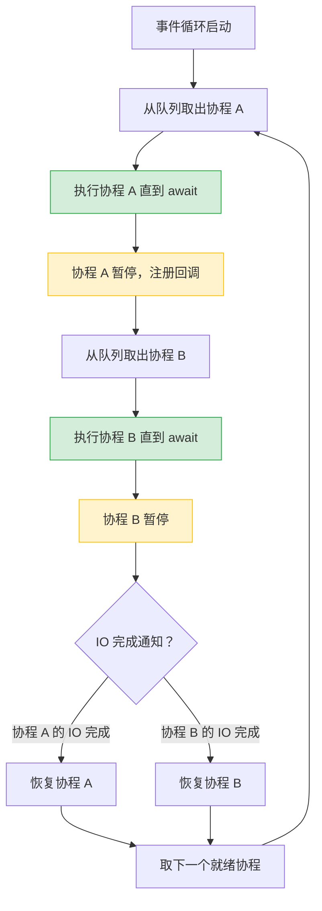

# Python 全栈实战（十）—— 异步编程：asyncio

Node.js 开发者对 async/await 很熟悉。Python 的异步模型思路一致，但实现细节不同——没有隐式的事件循环，所有异步代码必须在 `asyncio.run()` 里启动。

> **环境：** Python 3.14.3

---

## 1. 为什么需要异步

一个 HTTP 请求耗时 200ms，其中 CPU 计算只花了 0.1ms，剩下 199.9ms 都在等网络。同步代码在等待期间什么也不干，线程被占着。异步编程的核心思路：**等待 IO 时，切换去做别的事**。

```python
import time

# 同步：依次执行，3 个请求 = 3 倍时间
def sync_fetch():
    for i in range(3):
        time.sleep(1)          # 模拟网络请求
        print(f"请求 {i} 完成")

sync_fetch()                   # 总耗时 ~3s
```

```python
import asyncio

# 异步：同时等待，3 个请求 ≈ 1 倍时间
async def async_fetch(i: int):
    await asyncio.sleep(1)     # 模拟网络请求（非阻塞等待）
    print(f"请求 {i} 完成")

async def main():
    await asyncio.gather(
        async_fetch(0),
        async_fetch(1),
        async_fetch(2),
    )

asyncio.run(main())            # 总耗时 ~1s
```

3 秒变 1 秒。`asyncio.sleep` 不会阻塞线程——它告诉事件循环"我要等 1 秒，先去处理别的任务"。

## 2. 协程基础

`async def` 定义的函数是**协程函数**，调用它不会执行代码，而是返回一个协程对象：

```python
async def greet(name: str) -> str:
    return f"你好，{name}！"

# 直接调用不执行
coro = greet("Python")
print(type(coro))        # <class 'coroutine'>

# 必须用 await 或 asyncio.run 来执行
result = asyncio.run(greet("Python"))
print(result)            # 你好，Python！
```

`await` 只能在 `async def` 内部使用。`asyncio.run()` 是程序的入口点——创建事件循环、执行协程、清理资源。

## 3. 事件循环

事件循环是 asyncio 的调度中心。它维护一个待执行的协程队列，不断取出就绪的协程执行，遇到 `await` 时暂停当前协程、切换到下一个。



跟 Node.js 的事件循环本质相同——单线程、非阻塞、IO 多路复用。区别在于 Node.js 的事件循环是隐式的（`process` 自动启动），Python 需要显式调用 `asyncio.run()`。

## 4. 并发执行

### asyncio.gather：并发等待多个协程

```python
import asyncio
import time


async def fetch_url(url: str) -> dict:
    """模拟 HTTP 请求"""
    await asyncio.sleep(1)      # 模拟网络延迟
    return {"url": url, "status": 200}


async def main():
    start = time.perf_counter()

    # gather 并发执行所有协程
    results = await asyncio.gather(
        fetch_url("https://api.github.com"),
        fetch_url("https://httpbin.org/get"),
        fetch_url("https://jsonplaceholder.typicode.com/posts/1"),
    )

    elapsed = time.perf_counter() - start
    print(f"3 个请求完成，总耗时 {elapsed:.2f}s")
    for r in results:
        print(f"  {r['url']} → {r['status']}")


asyncio.run(main())
# 3 个请求完成，总耗时 1.00s
```

### TaskGroup：结构化并发（Python 3.11+）

`TaskGroup` 比 `gather` 更安全——任何一个任务失败，自动取消其余任务：

```python
import asyncio


async def risky_task(task_id: int) -> str:
    await asyncio.sleep(0.5)
    if task_id == 2:
        raise ValueError(f"任务 {task_id} 失败")
    return f"任务 {task_id} 成功"


async def main():
    try:
        async with asyncio.TaskGroup() as tg:
            task1 = tg.create_task(risky_task(1))
            task2 = tg.create_task(risky_task(2))    # 会失败
            task3 = tg.create_task(risky_task(3))
    except* ValueError as eg:
        for exc in eg.exceptions:
            print(f"捕获错误：{exc}")
    # 任务 2 失败后，任务 1 和 3 也被取消


asyncio.run(main())
```

`TaskGroup` 配合第 7 篇讲的 `except*` 语法，可以精确处理并发场景中的多异常。

### gather vs TaskGroup

| 特性 | `asyncio.gather` | `asyncio.TaskGroup` |
|------|-------------------|---------------------|
| 一个任务失败 | 默认其他任务继续执行 | 自动取消其余任务 |
| 错误处理 | `return_exceptions=True` 收集 | `except*` 精确过滤 |
| 生命周期 | 手动管理 | `async with` 自动管理 |
| 推荐场景 | 独立任务、允许部分失败 | 任务有关联、要么全成要么全败 |

新代码推荐用 `TaskGroup`。`gather` 适合老项目兼容或确实需要独立失败的场景。

## 5. 信号量：控制并发度

不限并发数去请求外部 API，容易触发限流或耗尽连接池。信号量（Semaphore）限制同时执行的协程数量：

```python
import asyncio


async def fetch_with_limit(sem: asyncio.Semaphore, url: str) -> str:
    async with sem:               # 获取信号量（超过限制时等待）
        print(f"开始请求 {url}")
        await asyncio.sleep(1)    # 模拟请求
        print(f"完成请求 {url}")
        return url


async def main():
    sem = asyncio.Semaphore(3)    # 最多同时 3 个请求
    urls = [f"https://api.example.com/page/{i}" for i in range(10)]

    tasks = [fetch_with_limit(sem, url) for url in urls]
    results = await asyncio.gather(*tasks)
    print(f"完成 {len(results)} 个请求")


asyncio.run(main())
# 每次最多 3 个请求并行，10 个请求总耗时 ~4s（而非 10s）
```

## 6. 异步上下文管理器

实现 `__aenter__` / `__aexit__` 的对象可以用 `async with`：

```python
import asyncio
from contextlib import asynccontextmanager


@asynccontextmanager
async def managed_connection(host: str):
    """异步版本的上下文管理器"""
    print(f"连接 {host}...")
    await asyncio.sleep(0.1)    # 模拟连接建立
    conn = {"host": host, "status": "connected"}
    try:
        yield conn               # 把连接交给 with 块
    finally:
        print(f"断开 {host}")
        await asyncio.sleep(0.1) # 模拟连接关闭


async def main():
    async with managed_connection("db.example.com") as conn:
        print(f"使用连接：{conn}")
    # 退出 async with 后自动断开


asyncio.run(main())
# 连接 db.example.com...
# 使用连接：{'host': 'db.example.com', 'status': 'connected'}
# 断开 db.example.com
```

## 7. 异步生成器

`yield` + `async def` = 异步生成器，用 `async for` 消费：

```python
import asyncio


async def fetch_pages(base_url: str, total_pages: int):
    """异步生成器：逐页获取数据"""
    for page in range(1, total_pages + 1):
        await asyncio.sleep(0.5)     # 模拟网络请求
        data = {"page": page, "items": [f"item_{i}" for i in range(10)]}
        yield data                    # 异步 yield


async def main():
    async for page_data in fetch_pages("https://api.example.com", 5):
        print(f"第 {page_data['page']} 页：{len(page_data['items'])} 条数据")


asyncio.run(main())
```

## 8. 实战：httpx 异步请求

httpx 是 Python 的现代 HTTP 客户端，同时支持同步和异步 API：

```bash
uv add httpx
```

```python
import asyncio
import httpx


async def fetch_repos(language: str) -> list[dict]:
    """搜索 GitHub 上指定语言的热门仓库"""
    async with httpx.AsyncClient() as client:       # 异步客户端
        response = await client.get(
            "https://api.github.com/search/repositories",
            params={"q": f"language:{language}", "sort": "stars", "per_page": 5},
            timeout=10,
        )
        response.raise_for_status()
        return response.json()["items"]


async def main():
    # 并发查询两种语言的热门仓库
    python_repos, rust_repos = await asyncio.gather(
        fetch_repos("python"),
        fetch_repos("rust"),
    )

    print("🐍 Python 热门仓库：")
    for repo in python_repos:
        print(f"  ⭐ {repo['stargazers_count']:>6,}  {repo['full_name']}")

    print("\n🦀 Rust 热门仓库：")
    for repo in rust_repos:
        print(f"  ⭐ {repo['stargazers_count']:>6,}  {repo['full_name']}")


asyncio.run(main())
```

`httpx.AsyncClient` 用作 `async with` 上下文管理器——退出时自动关闭连接池。不要每次请求都创建新的 `AsyncClient`，复用它就像复用数据库连接池一样重要。

## 9. asyncio 常用 API 速查

| API | 用途 |
|-----|------|
| `asyncio.run(coro)` | 程序入口，创建事件循环并执行协程 |
| `await asyncio.gather(*coros)` | 并发执行多个协程，返回结果列表 |
| `async with asyncio.TaskGroup()` | 结构化并发，一个失败全部取消 |
| `asyncio.Semaphore(n)` | 限制同时执行的协程数 |
| `await asyncio.sleep(seconds)` | 非阻塞等待 |
| `asyncio.create_task(coro)` | 创建后台任务（不立即 await） |
| `await asyncio.wait_for(coro, timeout)` | 带超时的等待 |
| `asyncio.Queue` | 异步队列（生产者-消费者模式） |

## 常见坑点

**1. 在协程中调用同步阻塞函数**

```python
import time

async def bad_example():
    time.sleep(5)          # ❌ 阻塞整个事件循环！所有协程都卡住
    # 应该用 await asyncio.sleep(5)

# 如果必须调用同步阻塞函数（如 CPU 密集型计算）
async def proper_way():
    loop = asyncio.get_running_loop()
    result = await loop.run_in_executor(None, time.sleep, 5)  # 在线程池中执行
```

`run_in_executor` 把同步函数扔到线程池里执行，不阻塞事件循环。

**2. 忘记 await**

```python
async def fetch_data():
    return {"data": 42}

async def main():
    result = fetch_data()    # ❌ 忘记 await，result 是协程对象不是 dict
    print(result)             # <coroutine object fetch_data at 0x...>
    print(await result)       # ✅ {"data": 42}
```

Pyright 会检测未 await 的协程并报警告，开启类型检查能避免这个问题。

**3. 嵌套 asyncio.run()**

```python
async def inner():
    return 42

async def outer():
    result = asyncio.run(inner())  # ❌ RuntimeError: 不能嵌套 asyncio.run
    # 应该直接 await
    result = await inner()         # ✅
```

`asyncio.run()` 只在最外层调用一次。协程内部用 `await` 调用其他协程。

## 总结

- `async def` 定义协程函数，`await` 暂停协程等待结果，`asyncio.run()` 作为程序入口
- 事件循环单线程调度所有协程——遇到 `await` 暂停当前协程、切换到下一个
- `asyncio.gather` 并发执行独立任务，`TaskGroup` 提供结构化并发（一拆即停）
- `Semaphore` 控制并发上限，防止打爆外部 API
- 同步阻塞函数不能直接在协程中调用，用 `run_in_executor` 转到线程池
- httpx 的 `AsyncClient` 是异步 HTTP 请求的标准选择

下一篇进入**多线程与多进程：GIL 真相**——asyncio 解决了 IO 等待问题，但 CPU 密集型任务需要另一套方案。

## 参考

- [Python 官方文档 - asyncio](https://docs.python.org/3.14/library/asyncio.html)
- [PEP 3156 - Asynchronous IO Support](https://peps.python.org/pep-3156/)
- [httpx 官方文档](https://www.python-httpx.org/)
