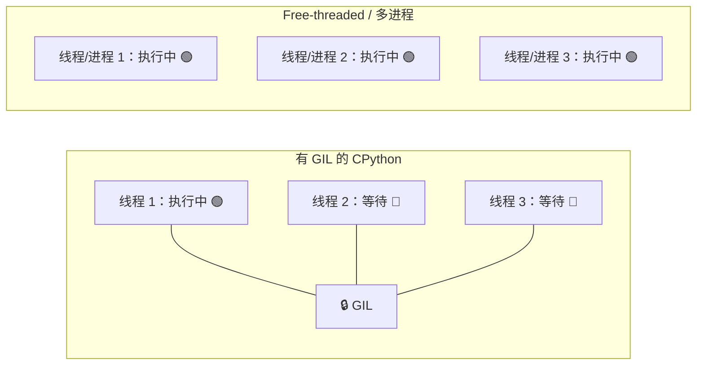
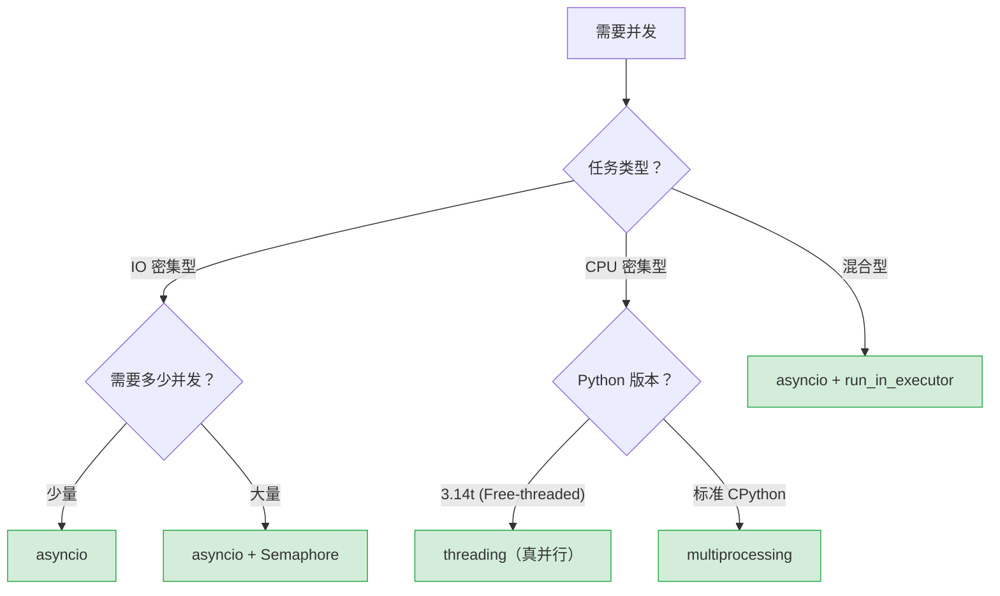

# Python 全栈实战（十一）—— 多线程与多进程：GIL 真相

"Python 多线程是假的，因为有 GIL。"——这话只对了一半。GIL 限制的是 CPU 密集型任务的并行，IO 密集型的多线程完全没问题。Python 3.14 的 Free-threaded 模式正在改变这个局面。

> **环境：** Python 3.14.3

---

## 1. GIL 是什么

GIL（Global Interpreter Lock）是 CPython 解释器中的一把全局互斥锁。同一时刻，只有一个线程能执行 Python 字节码。

这意味着：**即使你创建了 8 个线程跑在 8 核 CPU 上，同一时刻只有 1 个线程在执行 Python 代码**。其他 7 个线程在等 GIL。



### 为什么要有 GIL

CPython 的内存管理用引用计数。每个对象都有一个计数器记录被引用的次数，归零即释放。如果没有 GIL，多线程同时操作引用计数就会出现竞态条件——对象可能被过早释放或永远无法释放。GIL 是为了保护引用计数的线程安全，牺牲了 CPU 并行性。

### GIL 的实际影响

| 任务类型 | 多线程效果 | 原因 |
|---------|-----------|------|
| IO 密集型（网络请求、文件读写） | ✅ 有效加速 | IO 等待时线程释放 GIL |
| CPU 密集型（数学计算、图像处理） | ❌ 无法加速 | GIL 阻止并行执行 |

## 2. threading：多线程

IO 等待期间线程会释放 GIL，所以多线程对 IO 密集型任务有效：

```python
import threading
import time


def download_file(url: str) -> None:
    """模拟下载文件"""
    print(f"开始下载 {url}")
    time.sleep(2)                 # IO 等待，释放 GIL
    print(f"下载完成 {url}")


# 串行：6 秒
start = time.perf_counter()
for url in ["file_a", "file_b", "file_c"]:
    download_file(url)
print(f"串行耗时：{time.perf_counter() - start:.1f}s")   # ~6s

# 多线程：2 秒
start = time.perf_counter()
threads = []
for url in ["file_a", "file_b", "file_c"]:
    t = threading.Thread(target=download_file, args=(url,))
    threads.append(t)
    t.start()

for t in threads:
    t.join()                      # 等待所有线程完成
print(f"多线程耗时：{time.perf_counter() - start:.1f}s")  # ~2s
```

### CPU 密集型用多线程的反例

```python
import threading
import time


def count_up(n: int) -> int:
    """CPU 密集型：纯计算"""
    total = 0
    for i in range(n):
        total += i
    return total


N = 50_000_000

# 单线程
start = time.perf_counter()
count_up(N)
print(f"单线程：{time.perf_counter() - start:.2f}s")    # ~2.5s

# 双线程（期望快一倍？实际更慢）
start = time.perf_counter()
t1 = threading.Thread(target=count_up, args=(N // 2,))
t2 = threading.Thread(target=count_up, args=(N // 2,))
t1.start(); t2.start()
t1.join(); t2.join()
print(f"双线程：{time.perf_counter() - start:.2f}s")    # ~2.8s（更慢！）
```

双线程反而更慢——两个线程不断争抢 GIL，上下文切换的开销让结果雪上加霜。CPU 密集型任务用多线程没有意义。

## 3. multiprocessing：多进程

多进程绕过 GIL——每个进程有独立的 Python 解释器和 GIL，真正的并行执行：

```python
import multiprocessing
import time


def count_up(n: int) -> int:
    total = 0
    for i in range(n):
        total += i
    return total


N = 50_000_000

if __name__ == "__main__":       # Windows/macOS 上多进程必须在 __main__ 里启动
    # 多进程
    start = time.perf_counter()
    with multiprocessing.Pool(processes=4) as pool:
        results = pool.map(count_up, [N // 4] * 4)
    print(f"四进程：{time.perf_counter() - start:.2f}s")  # ~0.8s（快了 3 倍+）
```

### 多线程 vs 多进程

| 特性 | 多线程 (threading) | 多进程 (multiprocessing) |
|------|-------------------|------------------------|
| GIL 影响 | 受限 | 不受限（独立 GIL） |
| 适合场景 | IO 密集型 | CPU 密集型 |
| 内存共享 | 共享内存 | 独立内存（需要序列化传递） |
| 启动速度 | 快（毫秒） | 慢（百毫秒） |
| 创建开销 | 低 | 高（需要 fork/spawn 进程） |

## 4. concurrent.futures：统一接口

`concurrent.futures` 模块提供了线程池和进程池的统一 API，比直接用 threading/multiprocessing 更简洁：

```python
from concurrent.futures import ThreadPoolExecutor, ProcessPoolExecutor
import time


def fetch_data(url: str) -> dict:
    """IO 密集型任务"""
    time.sleep(1)
    return {"url": url, "status": 200}


def heavy_compute(n: int) -> int:
    """CPU 密集型任务"""
    return sum(range(n))


# 线程池（IO 密集型）
with ThreadPoolExecutor(max_workers=5) as executor:
    urls = [f"https://api.example.com/{i}" for i in range(10)]
    futures = [executor.submit(fetch_data, url) for url in urls]

    for future in futures:
        result = future.result()    # 阻塞直到该任务完成
        print(result)


# 进程池（CPU 密集型）
if __name__ == "__main__":
    with ProcessPoolExecutor(max_workers=4) as executor:
        chunks = [10_000_000] * 4
        results = list(executor.map(heavy_compute, chunks))
        print(f"总计：{sum(results)}")
```

### as_completed：谁先完成谁先处理

```python
from concurrent.futures import ThreadPoolExecutor, as_completed
import time
import random


def variable_task(task_id: int) -> tuple[int, float]:
    """耗时不确定的任务"""
    duration = random.uniform(0.5, 3.0)
    time.sleep(duration)
    return task_id, duration


with ThreadPoolExecutor(max_workers=5) as executor:
    futures = {
        executor.submit(variable_task, i): i
        for i in range(5)
    }

    # 谁先完成就先处理谁（不按提交顺序）
    for future in as_completed(futures):
        task_id, duration = future.result()
        print(f"任务 {task_id} 完成，耗时 {duration:.1f}s")
```

## 5. 线程安全

多线程共享内存，操作共享数据需要加锁：

```python
import threading

counter = 0

def increment(n: int) -> None:
    global counter
    for _ in range(n):
        counter += 1        # ❌ 非原子操作，存在竞态条件

threads = [threading.Thread(target=increment, args=(100_000,)) for _ in range(10)]
for t in threads: t.start()
for t in threads: t.join()
print(counter)               # 预期 1_000_000，实际可能小于这个值
```

`counter += 1` 底层是读取 → 加 1 → 写回三步操作，两个线程可能读到相同的旧值。

```python
import threading

lock = threading.Lock()
counter = 0

def safe_increment(n: int) -> None:
    global counter
    for _ in range(n):
        with lock:           # 获取锁，保证只有一个线程执行这段代码
            counter += 1

threads = [threading.Thread(target=safe_increment, args=(100_000,)) for _ in range(10)]
for t in threads: t.start()
for t in threads: t.join()
print(counter)               # 1_000_000 ✅
```

代价：加锁后同一时刻只有一个线程能操作 counter，吞吐量下降。生产代码中尽量避免多线程共享可变状态——用消息传递（队列）替代共享内存是更安全的模式。

## 6. Free-threaded Python（PEP 779）

Python 3.13 开始实验性支持 Free-threaded 模式（即 no-GIL），3.14 正式支持（PEP 779）。

安装 Free-threaded 版本：

```bash
# 用 uv 安装 Free-threaded 版本
uv python install 3.14t      # 注意后缀 t（threaded）

# 验证 GIL 状态
uv run --python 3.14t python -c "import sys; print(sys._is_gil_enabled())"
# False（GIL 已禁用）
```

在 Free-threaded 模式下，多线程能真正并行执行 CPU 密集型任务：

```python
# 用 3.14t 运行
import threading
import time


def count_up(n: int) -> int:
    total = 0
    for i in range(n):
        total += i
    return total


N = 50_000_000
results = [0, 0]

def worker(idx: int, n: int) -> None:
    results[idx] = count_up(n)

# Free-threaded 模式下，双线程能真正并行
start = time.perf_counter()
t1 = threading.Thread(target=worker, args=(0, N // 2))
t2 = threading.Thread(target=worker, args=(1, N // 2))
t1.start(); t2.start()
t1.join(); t2.join()
elapsed = time.perf_counter() - start
print(f"双线程耗时：{elapsed:.2f}s")  # 比单线程快接近 2 倍
```

### Free-threaded 的 Trade-off

| 优势 | 代价 |
|------|------|
| 多线程真正并行 | 单线程性能下降约 10-15% |
| 不需要多进程的序列化开销 | 部分 C 扩展库尚未适配 |
| 线程间可共享内存 | 需要更严格的线程安全意识 |

目前 NumPy、httpx 等主流库已经兼容 Free-threaded 模式。但有些依赖 GIL 保证线程安全的 C 扩展还没更新。建议在新项目中尝试，老项目先观望。

## 7. 选择决策树



简单规则：
- **IO 等待为主**（网络请求、文件读写）→ `asyncio`（首选）或 `ThreadPoolExecutor`
- **CPU 计算为主**（数学运算、数据处理）→ `ProcessPoolExecutor` 或 Free-threaded
- **混合场景** → `asyncio` + `run_in_executor` 把 CPU 任务扔到线程池/进程池

### 可视化：GIL 线程切换 vs Free-threaded 并行

下面通过时间轴动画对比展示：有 GIL 时线程交替执行 vs Free-threaded 真并行。

```html
<div class="gil-demo">
  <div class="demo-title">GIL vs Free-threaded 线程执行对比</div>

  <!-- GIL Section -->
  <div class="section-label gil-label">
    <span class="lock-icon">🔒</span> 有 GIL（标准 CPython）
    <span class="tag">同一时刻只有 1 个线程执行</span>
  </div>
  <div class="timeline gil-timeline">
    <div class="time-axis">
      <span class="axis-label">时间 →</span>
    </div>
    <div class="thread-row" data-thread="T1">
      <span class="thread-label">Thread 1</span>
      <div class="time-segments">
        <div class="segment seg-1" style="left:0%; width:33.3%"></div>
        <div class="segment seg-1" style="left:50%; width:16.7%"></div>
        <div class="segment seg-1" style="left:83.3%; width:16.7%"></div>
      </div>
    </div>
    <div class="thread-row" data-thread="T2">
      <span class="thread-label">Thread 2</span>
      <div class="time-segments">
        <div class="segment seg-2" style="left:33.3%; width:16.7%"></div>
        <div class="segment seg-2" style="left:66.7%; width:16.7%"></div>
        <div class="segment seg-2" style="left:100%; width:0%"></div>
      </div>
    </div>
    <div class="thread-row" data-thread="T3">
      <span class="thread-label">Thread 3</span>
      <div class="time-segments">
        <div class="segment seg-3" style="left:16.7%; width:16.7%"></div>
        <div class="segment seg-3" style="left:100%; width:0%"></div>
      </div>
    </div>
    <div class="note">颜色交替 = 线程争抢 GIL，上下文不断切换</div>
  </div>

  <!-- Free-threaded Section -->
  <div class="section-label ft-label">
    <span class="lock-icon">🔓</span> Free-threaded（Python 3.14t）
    <span class="tag green">3 个线程同时并行执行</span>
  </div>
  <div class="timeline ft-timeline">
    <div class="time-axis">
      <span class="axis-label">时间 →</span>
    </div>
    <div class="thread-row parallel" data-thread="T1">
      <span class="thread-label">Thread 1</span>
      <div class="time-segments">
        <div class="segment seg-1" style="left:0%; width:33.3%"></div>
      </div>
    </div>
    <div class="thread-row parallel" data-thread="T2">
      <span class="thread-label">Thread 2</span>
      <div class="time-segments">
        <div class="segment seg-2" style="left:0%; width:33.3%"></div>
      </div>
    </div>
    <div class="thread-row parallel" data-thread="T3">
      <span class="thread-label">Thread 3</span>
      <div class="time-segments">
        <div class="segment seg-3" style="left:0%; width:33.3%"></div>
      </div>
    </div>
    <div class="note green">三线程并肩前进，CPU 核心充分利用，速度 ×3</div>
  </div>

  <!-- Animation Toggle -->
  <div class="controls">
    <button class="btn" onclick="toggleGilAnimation()">▶ 播放动画</button>
    <span class="speed-label">速度：</span>
    <button class="btn small" onclick="setSpeed(2)">2x</button>
    <button class="btn small active" onclick="setSpeed(1)">1x</button>
    <button class="btn small" onclick="setSpeed(0.5)">0.5x</button>
  </div>
</div>

<style>
.gil-demo {
  background: #1a1a2e;
  border-radius: 12px;
  padding: 24px;
  font-family: 'SF Mono', 'Fira Code', monospace;
  color: #e0e0e0;
  max-width: 720px;
  margin: 0 auto;
}
.demo-title {
  text-align: center;
  font-size: 16px;
  color: #ffd700;
  margin-bottom: 20px;
}
.section-label {
  display: flex;
  align-items: center;
  gap: 8px;
  font-size: 14px;
  font-weight: bold;
  margin: 16px 0 8px;
}
.gil-label { color: #ff6b6b; }
.ft-label { color: #51cf66; }
.lock-icon { font-size: 16px; }
.tag {
  background: rgba(255,107,107,0.2);
  color: #ff6b6b;
  padding: 2px 8px;
  border-radius: 4px;
  font-size: 11px;
  font-weight: normal;
}
.tag.green {
  background: rgba(81,207,102,0.2);
  color: #51cf66;
}
.timeline {
  background: #0d1117;
  border-radius: 8px;
  padding: 16px;
  position: relative;
}
.time-axis {
  display: flex;
  align-items: center;
  margin-bottom: 12px;
  padding-left: 80px;
}
.axis-label {
  font-size: 11px;
  color: #6c7086;
  flex: 1;
}
.axis-label::after {
  content: '⟩⟩⟩⟩⟩⟩⟩⟩⟩⟩⟩⟩⟩⟩⟩⟩⟩⟩⟩⟩⟩⟩⟩⟩⟩⟩⟩⟩⟩⟩⟩⟩⟩⟩⟩⟩⟩⟩⟩⟩⟩⟩⟩⟩⟩⟩⟩⟩⟩⟩⟩⟩⟩⟩⟩⟩⟩⟩';
  margin-left: 8px;
  letter-spacing: -1px;
  overflow: hidden;
  white-space: nowrap;
}
.thread-row {
  display: flex;
  align-items: center;
  margin-bottom: 8px;
  height: 28px;
  position: relative;
}
.thread-label {
  width: 80px;
  font-size: 12px;
  color: #6c7086;
  flex-shrink: 0;
}
.time-segments {
  flex: 1;
  height: 24px;
  position: relative;
  background: #161b22;
  border-radius: 4px;
}
.segment {
  position: absolute;
  height: 100%;
  border-radius: 3px;
  top: 0;
}
.seg-1 { background: rgba(137,180,250,0.8); }
.seg-2 { background: rgba(166,227,161,0.8); }
.seg-3 { background: rgba(250,179,135,0.8); }
.note {
  font-size: 11px;
  color: #ff6b6b;
  text-align: center;
  margin-top: 8px;
  opacity: 0.8;
}
.note.green { color: #51cf66; }

/* Animation */
@keyframes slideRight {
  from { width: 0; }
  to { width: var(--seg-width, 33.3%); }
}
@keyframes slideRight2 {
  from { width: 0; left: 33.3%; }
  to { width: var(--seg-width2, 16.7%); }
}
.gil-timeline.animating .segment:nth-child(1) {
  animation: slideRight 2s linear forwards;
}
.gil-timeline.animating .segment:nth-child(2) {
  animation: slideRight2 1s linear 2s forwards;
}
.ft-timeline.animating .segment {
  animation: slideRight 2s linear forwards;
}
@keyframes fadeInSeg {
  from { opacity: 0; }
  to { opacity: 1; }
}
.gil-timeline.animating .segment {
  opacity: 0;
  animation: fadeInSeg 0.3s forwards, slideRight 2s linear forwards;
}
.ft-timeline.animating .segment {
  opacity: 0;
  animation: fadeInSeg 0.3s forwards, slideRight 2s linear forwards;
}

.controls {
  display: flex;
  align-items: center;
  justify-content: center;
  gap: 8px;
  margin-top: 16px;
}
.btn {
  background: #4a4a6a;
  border: none;
  color: #fff;
  padding: 8px 20px;
  border-radius: 6px;
  cursor: pointer;
  font-family: inherit;
  font-size: 13px;
  transition: background 0.2s;
}
.btn:hover { background: #6a6a8a; }
.btn.small {
  padding: 6px 12px;
  font-size: 12px;
  background: #313244;
}
.btn.small.active {
  background: #cba6f7;
  color: #1e1e2e;
}
.speed-label {
  font-size: 12px;
  color: #6c7086;
  margin-left: 8px;
}
</style>

<script>
let animating = false;
let speed = 1;

function toggleGilAnimation() {
  const gil = document.querySelector('.gil-timeline');
  const ft = document.querySelector('.ft-timeline');
  if (!animating) {
    gil.classList.add('animating');
    ft.classList.add('animating');
    animating = true;
    setTimeout(() => {
      gil.classList.remove('animating');
      ft.classList.remove('animating');
      animating = false;
    }, 3000 / speed);
  }
}

function setSpeed(s) {
  speed = s;
  document.querySelectorAll('.btn.small').forEach(b => b.classList.remove('active'));
  event.target.classList.add('active');
}
</script>
```

> **说明**：点击「播放动画」观察 GIL 下的线程切换模式（颜色交替出现）与 Free-threaded 的并行模式（三种颜色同时前进）的对比。

## 常见坑点

**1. 多进程传参必须可序列化**

```python
# ❌ lambda 不能被序列化（pickle），多进程传不过去
with ProcessPoolExecutor() as executor:
    executor.submit(lambda x: x ** 2, 42)
    # PicklingError: Can't pickle <lambda>

# ✅ 用命名函数
def square(x):
    return x ** 2

with ProcessPoolExecutor() as executor:
    executor.submit(square, 42)
```

**2. daemon 线程不等 join**

```python
t = threading.Thread(target=long_task, daemon=True)
t.start()
# 主线程结束时 daemon 线程直接被杀，可能丢数据
```

daemon 线程适合后台任务，但要确保不会因为主线程退出而丢失关键数据。

## 总结

- GIL 限制 CPU 密集型任务的线程并行，IO 密集型多线程不受影响
- `threading` 适合 IO 密集型，`multiprocessing` 适合 CPU 密集型
- `concurrent.futures` 提供了统一的线程池/进程池 API，用 `as_completed` 处理先完成的任务
- 多线程共享数据需要加锁（`threading.Lock`），尽量用队列替代共享可变状态
- Free-threaded Python（3.14t）移除了 GIL，多线程能真正并行执行 CPU 任务，代价是单线程性能略降

下一篇进入**项目结构与模块系统**——import 机制、`pyproject.toml` 与 uv 工作流。

## 参考

- [Python 官方文档 - threading](https://docs.python.org/3.14/library/threading.html)
- [Python 官方文档 - multiprocessing](https://docs.python.org/3.14/library/multiprocessing.html)
- [Python 官方文档 - concurrent.futures](https://docs.python.org/3.14/library/concurrent.futures.html)
- [PEP 779 - Free-threaded CPython](https://peps.python.org/pep-0779/)
- [Python GIL - Real Python](https://realpython.com/python-gil/)
