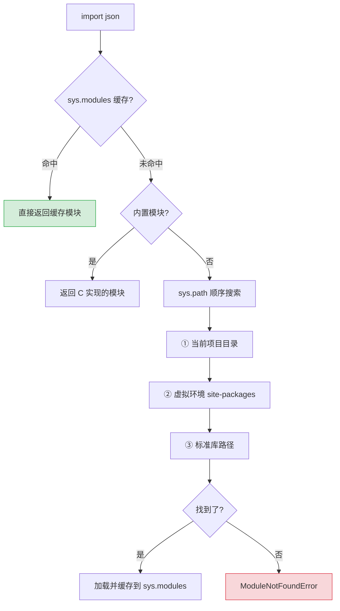

# Python 全栈实战（十二）—— 项目结构与模块系统

`import` 这行代码比看上去复杂得多。Python 的模块查找有一套优先级规则，搞不清楚就会遇到循环导入、找不到模块等经典问题。

> **环境：** Python 3.14.3, uv 0.11+

---

## 1. import 机制

```python
import json                        # 导入标准库模块
from pathlib import Path            # 从模块导入特定对象
from collections import defaultdict, Counter  # 导入多个
from . import utils                 # 相对导入（包内部使用）
from .models import User            # 相对导入具体对象
```

### 模块查找顺序

Python 按以下优先级查找模块：

1. **sys.modules 缓存**：已导入过的模块不会重复加载
2. **内置模块**：`sys`、`os` 等 C 实现的模块
3. **sys.path 中的路径**：按顺序搜索

```python
import sys
for p in sys.path:
    print(p)
# /Users/dev/my-project         ← 当前项目目录（最高优先级）
# /Users/dev/.local/share/uv/python/lib/python3.14
# /Users/dev/.local/share/uv/python/lib/python3.14/lib-dynload
# ...
```



**坑：命名冲突**。如果你的项目里有一个 `json.py` 文件，`import json` 会优先加载你的文件而不是标准库。避免给自己的文件起跟标准库同名的名字。

### __init__.py 的作用

`__init__.py` 把一个目录标记为 Python 包（Package）。Python 3.3+ 支持 Implicit Namespace Package（无 `__init__.py` 的包），但显式创建 `__init__.py` 仍是最佳实践——它让包的行为更可控、IDE 的自动补全更准确。

```python
# myapp/__init__.py
"""myapp 包的初始化模块"""

from .config import Settings       # 从子模块重新导出
from .models import User

__all__ = ["Settings", "User"]     # 控制 from myapp import * 导出的内容
```

`__all__` 定义了 `from myapp import *` 时导入哪些名字。日常开发中避免用 `import *`，显式导入更清晰。

## 2. 项目结构

### 小型项目（单模块）

```
my-script/
├── pyproject.toml
├── uv.lock
├── .python-version
└── main.py
```

### 中型项目（标准应用）

```
my-api/
├── pyproject.toml
├── uv.lock
├── .python-version
├── src/
│   └── my_api/                # 源码目录（Python 包名用下划线）
│       ├── __init__.py
│       ├── main.py            # 入口
│       ├── config.py          # 配置管理
│       ├── models/            # 数据模型
│       │   ├── __init__.py
│       │   └── user.py
│       ├── services/          # 业务逻辑
│       │   ├── __init__.py
│       │   └── auth.py
│       ├── routes/            # API 路由
│       │   ├── __init__.py
│       │   └── users.py
│       └── utils/             # 工具函数
│           ├── __init__.py
│           └── security.py
└── tests/                     # 测试目录（与 src 平级）
    ├── __init__.py
    ├── conftest.py            # pytest 共享 fixtures
    ├── test_auth.py
    └── test_users.py
```

### src 布局 vs 平铺布局

| 布局 | 结构 | 优点 | 缺点 |
|------|------|------|------|
| **src 布局** | `src/my_api/` | 避免测试意外导入未安装的包 | 多一层目录 |
| **平铺布局** | `my_api/` | 结构简单 | 容易导入到本地未安装的代码 |

Python 社区越来越推荐 **src 布局**。PyPA（Python Packaging Authority）的官方指南也建议用 src 布局。

## 3. pyproject.toml 完全指南

`pyproject.toml` 是 Python 项目的核心配置文件（PEP 621），统一了元数据、依赖、工具配置：

```toml
[project]
name = "my-api"
version = "0.1.0"
description = "示例 API 项目"
readme = "README.md"
license = {text = "MIT"}
requires-python = ">=3.14"
authors = [
    {name = "张三", email = "z@example.com"},
]
keywords = ["api", "fastapi"]
classifiers = [
    "Development Status :: 3 - Alpha",
    "Framework :: FastAPI",
    "Programming Language :: Python :: 3.14",
]
dependencies = [
    "fastapi>=0.135.2",
    "uvicorn[standard]>=0.34.0",
    "httpx>=0.28.1",
    "sqlalchemy>=2.0.48",
]

[dependency-groups]
dev = [
    "pytest>=9.0.2",
    "ruff>=0.15.7",
    "pyright>=1.1.394",
    "pytest-cov>=6.0",
]

[project.scripts]
# CLI 入口点：安装后可以直接在终端运行 my-api
my-api = "my_api.main:cli"

[build-system]
requires = ["hatchling"]
build-backend = "hatchling.build"

# ── 工具配置 ──────────────────────────────────

[tool.ruff]
target-version = "py314"
line-length = 88

[tool.ruff.lint]
select = ["E", "W", "F", "I", "UP", "B", "SIM", "N"]

[tool.pyright]
pythonVersion = "3.14"
typeCheckingMode = "standard"

[tool.pytest.ini_options]
testpaths = ["tests"]
addopts = "-v --tb=short"
```

### 依赖版本约束语法

| 语法 | 含义 | 示例 |
|------|------|------|
| `>=0.135.2` | 最低版本 | `fastapi>=0.135.2` |
| `>=0.28,<1.0` | 范围约束 | `httpx>=0.28,<1.0` |
| `~=2.0.48` | 兼容版本（`>=2.0.48,<2.1`） | `sqlalchemy~=2.0.48` |
| `==3.14.3` | 精确锁定（不推荐） | |

推荐用 `>=` 指定最低版本，让 uv 的锁文件（`uv.lock`）处理精确版本锁定。

## 4. uv 工作流

### 日常开发命令

```bash
# 同步依赖（根据 uv.lock 安装，类似 pnpm install）
uv sync

# 添加 / 移除依赖
uv add fastapi
uv add --dev pytest
uv remove httpx

# 更新依赖到最新兼容版本
uv lock --upgrade-package fastapi

# 运行脚本
uv run python -m my_api.main
uv run pytest

# 查看依赖树
uv tree
```

### uv.lock 管理

`uv.lock` 记录了所有依赖的精确版本和完整性哈希，**必须提交到 Git**。团队成员 clone 后 `uv sync` 即可还原完全一致的环境。

```bash
# .gitignore 中不要忽略 uv.lock
# ✅ 提交：pyproject.toml, uv.lock, .python-version
# ❌ 忽略：.venv/
```

### 全局工具安装

```bash
# 类似 npx / pipx，安装并运行全局 CLI 工具
uv tool install ruff
uv tool install httpie

# 临时运行（不安装）
uvx ruff check .
```

## 5. 循环导入

两个模块互相 import 是 Python 项目里最常见的结构问题：

```python
# ❌ 循环导入
# models.py
from services import validate_user   # services 导入 models，models 又导入 services

# services.py
from models import User              # 循环！
```

解决方案：

**方案一：延迟导入**（把 import 放在函数内部）
```python
# services.py
def get_user(user_id: int):
    from models import User          # 函数调用时才导入
    return User.query(user_id)
```

**方案二：调整依赖方向**
```python
# 把共享的类型/接口抽到独立模块
# types.py — 无依赖的类型定义
# models.py → 依赖 types.py
# services.py → 依赖 types.py 和 models.py
```

**方案三：TYPE_CHECKING 守卫**（仅类型注解需要时）
```python
from __future__ import annotations
from typing import TYPE_CHECKING

if TYPE_CHECKING:
    from models import User      # 只在类型检查时导入，运行时不执行

def process(user: User) -> None:
    ...
```

## 6. 相对导入 vs 绝对导入

```python
# 绝对导入（推荐，路径明确）
from my_api.models.user import User
from my_api.services.auth import authenticate

# 相对导入（包内部使用，更简洁）
from .models.user import User        # 当前包
from ..utils import hash_password    # 上一级包
```

**规则**：对外暴露的公共 API 用绝对导入；包内部模块之间用相对导入。Ruff 的 `I` 规则会自动排列 import 顺序（标准库 → 第三方 → 项目内部）。

## 常见坑点

**1. -m 运行和直接运行的区别**

```bash
# ✅ 用 -m 以模块方式运行（sys.path 正确设置）
uv run python -m my_api.main

# ⚠️ 直接运行脚本可能导致 import 失败
uv run python src/my_api/main.py
# ModuleNotFoundError: No module named 'my_api'
```

`python -m my_api.main` 会把项目根目录加入 `sys.path`，相对导入也能正常工作。直接运行脚本文件则可能找不到包。

**2. __pycache__ 目录**

Python 编译 `.py` 为字节码 `.pyc`，缓存在 `__pycache__/` 目录中。修改代码后 Python 会自动重新编译，但偶尔缓存会导致旧代码生效。遇到"明明改了代码但行为没变"的诡异问题，试试清除缓存：

```bash
find . -type d -name __pycache__ -exec rm -rf {} +
```

## 总结

- Python 按 sys.modules → 内置模块 → sys.path 的顺序查找模块
- `__init__.py` 标记目录为包，`__all__` 控制 `import *` 的导出范围
- 中型以上项目推荐 src 布局，避免测试导入未安装的代码
- `pyproject.toml` 统一元数据、依赖和工具配置，`uv.lock` 必须提交到 Git
- 循环导入用延迟导入、调整依赖方向或 `TYPE_CHECKING` 守卫解决

下一篇进入**测试驱动开发：pytest**——fixture、参数化、mock 与覆盖率。

## 参考

- [Python 官方文档 - The import system](https://docs.python.org/3.14/reference/import.html)
- [PEP 621 - Storing project metadata in pyproject.toml](https://peps.python.org/pep-0621/)
- [PyPA Packaging Guide](https://packaging.python.org/en/latest/)
- [uv 官方文档 - Projects](https://docs.astral.sh/uv/concepts/projects/)
