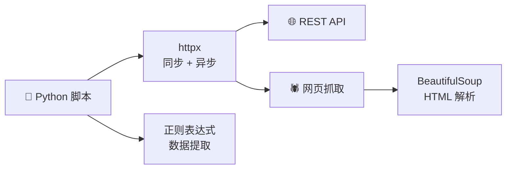

# Python 全栈实战（十四）—— 网络请求与自动化脚本

Python 被称为"胶水语言"，最大的能力之一就是自动化。httpx 发请求、正则抽数据、脚本串流程——这套组合拳在日常开发和运维中用得很频繁。

> **环境：** Python 3.14.3, httpx 0.28.1

---

## 1. httpx：现代 HTTP 客户端



httpx 是 `requests` 的现代替代品——API 几乎兼容，额外支持异步、HTTP/2、连接池管理。

```bash
uv add httpx
```

### 基础请求

```python
import httpx

# GET 请求
response = httpx.get("https://httpbin.org/get", params={"name": "Python"})
print(response.status_code)           # 200
print(response.json()["args"])        # {'name': 'Python'}

# POST 请求（JSON 数据）
response = httpx.post(
    "https://httpbin.org/post",
    json={"username": "admin", "password": "secret"},
)
print(response.json()["json"])        # {'username': 'admin', 'password': 'secret'}

# 自定义请求头
response = httpx.get(
    "https://api.github.com/user",
    headers={"Authorization": "Bearer YOUR_TOKEN"},
    timeout=10,
)
```

### Client 会话（连接池复用）

频繁请求同一个域名时，用 `httpx.Client` 复用 TCP 连接：

```python
import httpx

# ✅ 用 Client 管理连接池
with httpx.Client(
    base_url="https://api.github.com",
    headers={"Accept": "application/vnd.github.v3+json"},
    timeout=10,
) as client:
    repos = client.get("/users/python/repos", params={"per_page": 5})
    user = client.get("/users/python")

    print(f"仓库数：{len(repos.json())}")
    print(f"用户名：{user.json()['login']}")
```

`Client` 作为上下文管理器使用——退出时自动关闭连接池。不要每次请求都创建新 Client。

### 错误处理与重试

```python
import httpx
import time


def fetch_with_retry(
    url: str,
    max_retries: int = 3,
    backoff: float = 1.0,
) -> httpx.Response:
    """带指数退避的请求重试"""
    last_exc = None
    for attempt in range(1, max_retries + 1):
        try:
            response = httpx.get(url, timeout=10)
            response.raise_for_status()      # 4xx/5xx 抛 HTTPStatusError
            return response
        except (httpx.ConnectError, httpx.TimeoutException) as exc:
            last_exc = exc
            wait = backoff * (2 ** (attempt - 1))   # 指数退避：1s, 2s, 4s
            print(f"[{attempt}/{max_retries}] {exc}，{wait}s 后重试")
            time.sleep(wait)
        except httpx.HTTPStatusError as exc:
            if exc.response.status_code >= 500:     # 服务端错误才重试
                last_exc = exc
                time.sleep(backoff)
                continue
            raise                                    # 客户端错误直接抛出
    raise last_exc  # type: ignore[misc]
```

## 2. 正则表达式

`re` 模块提供正则表达式支持。对有 JavaScript 基础的人来说，语法基本一致。

```python
import re

# 基础匹配
text = "联系电话：138-1234-5678，备用：139-8765-4321"
phones = re.findall(r"1[3-9]\d-\d{4}-\d{4}", text)
print(phones)   # ['138-1234-5678', '139-8765-4321']

# 分组捕获
log = "[2026-03-25 10:30:45] ERROR: 连接超时 host=db.example.com"
match = re.match(
    r"\[(\d{4}-\d{2}-\d{2} \d{2}:\d{2}:\d{2})\] (\w+): (.+)",
    log,
)
if match:
    timestamp, level, message = match.groups()
    print(f"时间：{timestamp}")   # 2026-03-25 10:30:45
    print(f"级别：{level}")       # ERROR
    print(f"消息：{message}")     # 连接超时 host=db.example.com

# 替换
cleaned = re.sub(r"\s+", " ", "  多余   空格   清理  ")
print(cleaned)   # "多余 空格 清理"

# 编译正则（多次使用时提升性能）
EMAIL_PATTERN = re.compile(r"[\w.+-]+@[\w-]+\.[\w.]+")
emails = EMAIL_PATTERN.findall("联系 admin@test.com 或 support@example.org")
print(emails)    # ['admin@test.com', 'support@example.org']
```

### 常用正则速查

| 模式 | 含义 | 示例 |
|------|------|------|
| `\d` | 数字 | `\d{4}` → 4 位数字 |
| `\w` | 字母/数字/下划线 | `\w+` → 一个或多个 |
| `\s` | 空白字符 | `\s+` → 一个或多个空白 |
| `.` | 任意字符（除换行） | `.*` → 任意长度 |
| `^` / `$` | 行首/行尾 | `^\d+$` → 整行是数字 |
| `(...)` | 捕获组 | `(\d+)-(\d+)` |
| `(?:...)` | 非捕获组 | `(?:https?)://` |
| `(?P<name>...)` | 命名捕获组 | `(?P<year>\d{4})` |

## 3. 网页数据抓取

```bash
uv add beautifulsoup4 lxml
```

```python
import httpx
from bs4 import BeautifulSoup


def scrape_hacker_news() -> list[dict]:
    """抓取 Hacker News 首页标题"""
    response = httpx.get("https://news.ycombinator.com/", timeout=10)
    response.raise_for_status()

    soup = BeautifulSoup(response.text, "lxml")
    items = []

    for title_el in soup.select(".titleline > a"):
        items.append({
            "title": title_el.get_text(),
            "url": title_el.get("href", ""),
        })

    return items


for item in scrape_hacker_news()[:5]:
    print(f"📰 {item['title']}")
    print(f"   {item['url']}\n")
```

### 异步批量抓取

```python
import asyncio
import httpx
from bs4 import BeautifulSoup


async def fetch_title(client: httpx.AsyncClient, url: str) -> str | None:
    """获取网页标题"""
    try:
        response = await client.get(url, timeout=10, follow_redirects=True)
        soup = BeautifulSoup(response.text, "lxml")
        title_tag = soup.find("title")
        return title_tag.get_text().strip() if title_tag else None
    except httpx.HTTPError:
        return None


async def main():
    urls = [
        "https://python.org",
        "https://docs.astral.sh/uv/",
        "https://fastapi.tiangolo.com",
        "https://docs.pytest.org",
    ]

    sem = asyncio.Semaphore(3)        # 限制并发

    async with httpx.AsyncClient() as client:
        async def limited_fetch(url: str):
            async with sem:
                return url, await fetch_title(client, url)

        tasks = [limited_fetch(url) for url in urls]
        results = await asyncio.gather(*tasks)

    for url, title in results:
        print(f"{title or '获取失败'}")
        print(f"  ↳ {url}\n")


asyncio.run(main())
```

## 4. 自动化脚本模式

### 文件批处理

```python
from pathlib import Path
import json


def batch_convert_json_to_csv(input_dir: str, output_dir: str) -> int:
    """批量将 JSON 文件转换为 CSV"""
    import csv

    input_path = Path(input_dir)
    output_path = Path(output_dir)
    output_path.mkdir(parents=True, exist_ok=True)

    converted = 0
    for json_file in input_path.glob("*.json"):
        data = json.loads(json_file.read_text(encoding="utf-8"))

        if not isinstance(data, list) or not data:
            print(f"⚠️ 跳过 {json_file.name}（不是数组或为空）")
            continue

        csv_file = output_path / json_file.with_suffix(".csv").name
        with open(csv_file, "w", newline="", encoding="utf-8-sig") as f:
            writer = csv.DictWriter(f, fieldnames=data[0].keys())
            writer.writeheader()
            writer.writerows(data)

        converted += 1
        print(f"✅ {json_file.name} → {csv_file.name}")

    return converted


if __name__ == "__main__":
    count = batch_convert_json_to_csv("data/json", "data/csv")
    print(f"\n共转换 {count} 个文件")
```

### 定时任务脚本

```python
import time
import httpx
from datetime import datetime


def health_check(urls: list[str]) -> None:
    """检查多个服务的健康状态"""
    for url in urls:
        try:
            start = time.perf_counter()
            response = httpx.get(url, timeout=5)
            elapsed = (time.perf_counter() - start) * 1000

            status = "✅" if response.status_code == 200 else "⚠️"
            print(f"{status} {url} → {response.status_code} ({elapsed:.0f}ms)")
        except httpx.HTTPError as exc:
            print(f"❌ {url} → {type(exc).__name__}: {exc}")


def run_periodic(interval_seconds: int = 60) -> None:
    """定时循环执行"""
    services = [
        "https://api.github.com",
        "https://httpbin.org/status/200",
    ]

    while True:
        print(f"\n[{datetime.now().strftime('%H:%M:%S')}] 健康检查")
        health_check(services)
        time.sleep(interval_seconds)


if __name__ == "__main__":
    run_periodic(30)
```

## 5. subprocess：调用外部命令

```python
import subprocess


def run_cmd(cmd: str | list[str]) -> str:
    """执行 shell 命令并返回输出"""
    result = subprocess.run(
        cmd if isinstance(cmd, list) else cmd.split(),
        capture_output=True,
        text=True,
        check=True,            # 非零退出码抛 CalledProcessError
    )
    return result.stdout.strip()


# 获取 Git 信息
branch = run_cmd("git branch --show-current")
commit = run_cmd(["git", "log", "-1", "--format=%h %s"])
print(f"分支：{branch}")
print(f"最新提交：{commit}")

# 获取系统信息
disk = run_cmd(["df", "-h", "/"])
print(disk)
```

`subprocess.run` 的 `check=True` 参数很重要——命令执行失败会立即抛异常，避免静默失败。

## 常见坑点

**1. 请求头中的 User-Agent**

很多网站会拒绝没有 User-Agent 的请求或返回不同的内容。httpx 默认的 UA 是 `python-httpx/0.28.1`，有些反爬策略会拦截。

```python
headers = {"User-Agent": "Mozilla/5.0 (compatible; MyBot/1.0)"}
response = httpx.get(url, headers=headers)
```

**2. 正则表达式的贪婪与非贪婪**

```python
html = "<p>段落一</p><p>段落二</p>"

# 贪婪（默认）：尽可能多匹配
re.findall(r"<p>.*</p>", html)         # ['<p>段落一</p><p>段落二</p>']

# 非贪婪（加 ?）：尽可能少匹配
re.findall(r"<p>.*?</p>", html)        # ['<p>段落一</p>', '<p>段落二</p>']
```

**3. 爬虫的法律与道德边界**

遵守 `robots.txt`、不要高频请求导致目标服务器负载过高、不要抓取需要登录的私有数据。合理设置请求间隔（`time.sleep`）和并发限制（`Semaphore`）。

## 总结

- httpx 是 Python 的现代 HTTP 客户端，支持同步/异步、HTTP/2、连接池
- `httpx.Client` 复用连接池，适合批量请求同一域名
- 正则表达式用 `re.findall` 提取、`re.sub` 替换，复杂模式先 `re.compile` 编译
- BeautifulSoup + httpx 实现网页数据抓取，配合 asyncio 并发加速
- `subprocess.run` 调用外部命令，`check=True` 确保失败即报错

下一篇进入 **CLI 工具开发实战**——用 Typer + Rich 构建专业的命令行应用。

## 参考

- [httpx 官方文档](https://www.python-httpx.org/)
- [Python 官方文档 - re](https://docs.python.org/3.14/library/re.html)
- [Beautiful Soup 文档](https://www.crummy.com/software/BeautifulSoup/bs4/doc/)
