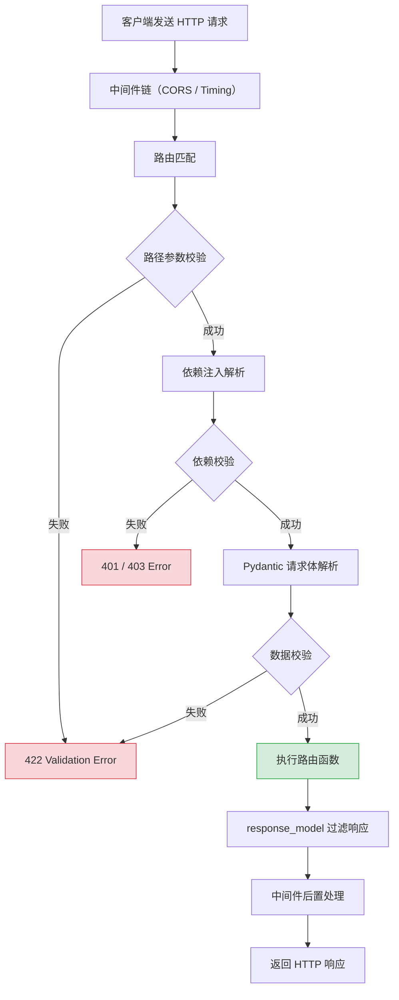

# Python 全栈实战（十六）—— FastAPI（一）：构建 REST API

FastAPI 把 Python 的类型注解玩到了极致——路由参数自动校验、请求体自动解析、文档自动生成。写完代码就有了 API 文档，这是 Flask 和 Django 都做不到的。

> **环境：** Python 3.14.3, FastAPI 0.135.2, Pydantic 2.12.5, Uvicorn 0.34+

---

## 1. 快速上手

```bash
uv init my-api && cd my-api
uv add fastapi uvicorn[standard]
```

```python
# main.py
from fastapi import FastAPI

app = FastAPI(title="我的第一个 API", version="0.1.0")

@app.get("/")
async def root():
    return {"message": "Hello, FastAPI!"}

@app.get("/users/{user_id}")
async def get_user(user_id: int):
    return {"user_id": user_id, "name": f"用户_{user_id}"}
```

```bash
uv run uvicorn main:app --reload
# INFO:     Uvicorn running on http://127.0.0.1:8000
```

打开浏览器访问 `http://127.0.0.1:8000/docs`——自动生成的 Swagger UI 交互式 API 文档，可以直接在页面上测试每个接口。

### 为什么选 FastAPI

| 特性 | Flask | Django REST | FastAPI |
|------|-------|-------------|---------|
| 类型校验 | 手动 | 序列化器 | 自动（Pydantic） |
| API 文档 | 插件 | 插件 | 内置（OpenAPI） |
| 异步支持 | 有限 | 有限 | 原生 async/await |
| 性能 | 基准 | 较慢 | 快 2-3 倍（Starlette） |
| 学习曲线 | 低 | 高 | 中 |

FastAPI 基于 Starlette（异步框架）和 Pydantic（数据验证），在性能和开发效率上同时拿到了高分。代价是生态不如 Django 成熟（没有内置 Admin、ORM），需要自己组装。

## 2. 路由与参数

### 路径参数

```python
@app.get("/items/{item_id}")
async def get_item(item_id: int):           # 自动验证 item_id 是整数
    return {"item_id": item_id}

# /items/42    → {"item_id": 42}
# /items/abc   → 422 Validation Error（自动报错）
```

### 查询参数

```python
@app.get("/items")
async def list_items(
    skip: int = 0,
    limit: int = 10,
    q: str | None = None,                   # 可选参数
):
    result = {"skip": skip, "limit": limit}
    if q:
        result["query"] = q
    return result

# /items?skip=10&limit=5&q=python
```

### 请求体（Pydantic 模型）

```python
from pydantic import BaseModel, EmailStr, Field


class UserCreate(BaseModel):
    name: str = Field(..., min_length=1, max_length=50)
    email: EmailStr
    age: int = Field(..., ge=0, le=150)
    bio: str | None = None


class UserResponse(BaseModel):
    id: int
    name: str
    email: str
    age: int


@app.post("/users", response_model=UserResponse, status_code=201)
async def create_user(user: UserCreate):
    # user 已经过 Pydantic 验证，类型安全
    return UserResponse(id=1, **user.model_dump())
```

```bash
# 发送合法数据
curl -X POST http://localhost:8000/users \
  -H "Content-Type: application/json" \
  -d '{"name":"张三","email":"z@test.com","age":25}'
# {"id":1,"name":"张三","email":"z@test.com","age":25}

# 发送无效数据
curl -X POST http://localhost:8000/users \
  -d '{"name":"","email":"not-email","age":-1}'
# 422: [{"msg":"String should have at least 1 character",...}]
```

Pydantic 自动校验每个字段——名字不能为空、email 格式必须合法、年龄必须在 0-150 之间。校验失败返回 422 和详细的错误信息。

## 3. 依赖注入

FastAPI 的依赖注入是它最强大的特性之一——用 `Depends()` 声明依赖，FastAPI 自动解析和注入。

```python
from fastapi import Depends, HTTPException, Header


async def verify_token(authorization: str = Header(...)) -> str:
    """校验 Token 的依赖"""
    if not authorization.startswith("Bearer "):
        raise HTTPException(status_code=401, detail="无效的 Token 格式")
    token = authorization.removeprefix("Bearer ")
    if token != "valid-token":
        raise HTTPException(status_code=401, detail="Token 无效")
    return token


async def get_current_user(token: str = Depends(verify_token)) -> dict:
    """获取当前用户的依赖（依赖 verify_token）"""
    return {"user_id": 1, "name": "张三", "token": token}


@app.get("/me")
async def read_current_user(user: dict = Depends(get_current_user)):
    return user
```

```bash
# 无 Token
curl http://localhost:8000/me
# 422: authorization header required

# 有效 Token
curl http://localhost:8000/me -H "Authorization: Bearer valid-token"
# {"user_id": 1, "name": "张三", "token": "valid-token"}
```

依赖可以嵌套：`read_current_user` → `get_current_user` → `verify_token`。FastAPI 自动解析整条依赖链。

### 路由级别依赖

依赖链自动解析的过程：


### 路由级别依赖

```python
# 整个路由组都需要认证
from fastapi import APIRouter

router = APIRouter(
    prefix="/admin",
    tags=["管理"],
    dependencies=[Depends(verify_token)],    # 所有路由都需要 Token
)

@router.get("/stats")
async def admin_stats():
    return {"total_users": 100}
```

## 4. 响应模型与序列化

```python
from pydantic import BaseModel, ConfigDict
from datetime import datetime


class UserBase(BaseModel):
    name: str
    email: str

class UserCreate(UserBase):
    password: str                    # 创建时需要密码

class UserPublic(UserBase):
    id: int
    created_at: datetime

    model_config = ConfigDict(
        from_attributes=True,        # 支持从 ORM 对象转换
    )


@app.post("/users", response_model=UserPublic)
async def create_user(user: UserCreate):
    # response_model=UserPublic 确保响应中不包含 password
    return {
        "id": 1,
        "name": user.name,
        "email": user.email,
        "created_at": datetime.now(),
        # password 字段自动被过滤掉
    }
```

`response_model` 起到两个作用：
1. **文档**：在 Swagger UI 中展示响应格式
2. **过滤**：自动移除不在模型中的字段（如 password），防止数据泄露

## 5. 错误处理

```python
from fastapi import HTTPException
from fastapi.responses import JSONResponse


# 方式一：HTTPException（简单场景）
@app.get("/items/{item_id}")
async def get_item(item_id: int):
    if item_id > 100:
        raise HTTPException(
            status_code=404,
            detail={"error": "ITEM_NOT_FOUND", "item_id": item_id},
        )
    return {"item_id": item_id}


# 方式二：自定义异常处理器（统一错误格式）
class AppError(Exception):
    def __init__(self, code: str, message: str, status: int = 400):
        self.code = code
        self.message = message
        self.status = status

@app.exception_handler(AppError)
async def app_error_handler(request, exc: AppError):
    return JSONResponse(
        status_code=exc.status,
        content={"error": exc.code, "message": exc.message},
    )

@app.get("/divide")
async def divide(a: int, b: int):
    if b == 0:
        raise AppError("DIVISION_ERROR", "除数不能为 0")
    return {"result": a / b}
```

## 6. 中间件

```python
import time
from fastapi import Request


@app.middleware("http")
async def add_timing_header(request: Request, call_next):
    """记录请求处理时间"""
    start = time.perf_counter()
    response = await call_next(request)
    elapsed = time.perf_counter() - start
    response.headers["X-Process-Time"] = f"{elapsed:.4f}"
    return response
```

## 7. 项目结构

```
my-api/
├── pyproject.toml
├── src/
│   └── my_api/
│       ├── __init__.py
│       ├── main.py              # FastAPI 应用入口
│       ├── config.py            # 配置管理
│       ├── dependencies.py      # 共享依赖
│       ├── models/              # Pydantic 模型
│       │   ├── __init__.py
│       │   └── user.py
│       └── routes/              # 路由模块
│           ├── __init__.py
│           ├── users.py
│           └── items.py
└── tests/
```

```python
# src/my_api/main.py
from fastapi import FastAPI
from .routes import users, items

app = FastAPI(title="My API", version="0.1.0")
app.include_router(users.router)
app.include_router(items.router)
```

```python
# src/my_api/routes/users.py
from fastapi import APIRouter
router = APIRouter(prefix="/users", tags=["用户"])

@router.get("/")
async def list_users(): ...

@router.post("/")
async def create_user(): ...
```

## 8. 请求生命周期



## 常见坑点

**1. 同步函数会阻塞事件循环**

```python
# ❌ 同步 IO 阻塞其他请求
@app.get("/slow")
async def slow_endpoint():
    import time
    time.sleep(5)             # 阻塞！其他请求全部等待
    return {"done": True}

# ✅ 方案一：用异步
@app.get("/slow")
async def slow_endpoint():
    await asyncio.sleep(5)
    return {"done": True}

# ✅ 方案二：定义为同步函数（FastAPI 自动放到线程池）
@app.get("/slow")
def slow_endpoint():          # 注意：没有 async
    import time
    time.sleep(5)             # FastAPI 自动在线程池中运行
    return {"done": True}
```

**2. Pydantic v1 vs v2 的 API 差异**

FastAPI 0.100+ 使用 Pydantic v2。旧代码中 `.dict()` 改为 `.model_dump()`，`.parse_obj()` 改为 `.model_validate()`。迁移时注意方法名变化。

## 总结

- FastAPI 通过 Type Hints 自动验证参数、生成 OpenAPI 文档
- Pydantic 模型定义请求体和响应格式，`response_model` 自动过滤敏感字段
- 依赖注入用 `Depends()` 声明，支持嵌套依赖链
- 同步路由函数自动在线程池执行，异步函数直接在事件循环中运行
- `APIRouter` 按模块组织路由，`include_router` 挂载到主应用

下一篇进入 **FastAPI（二）：数据库与认证**——SQLAlchemy 2.0 + Alembic + JWT。

## 参考

- [FastAPI 官方文档](https://fastapi.tiangolo.com/)
- [Pydantic v2 文档](https://docs.pydantic.dev/latest/)
- [Starlette 文档](https://www.starlette.io/)
