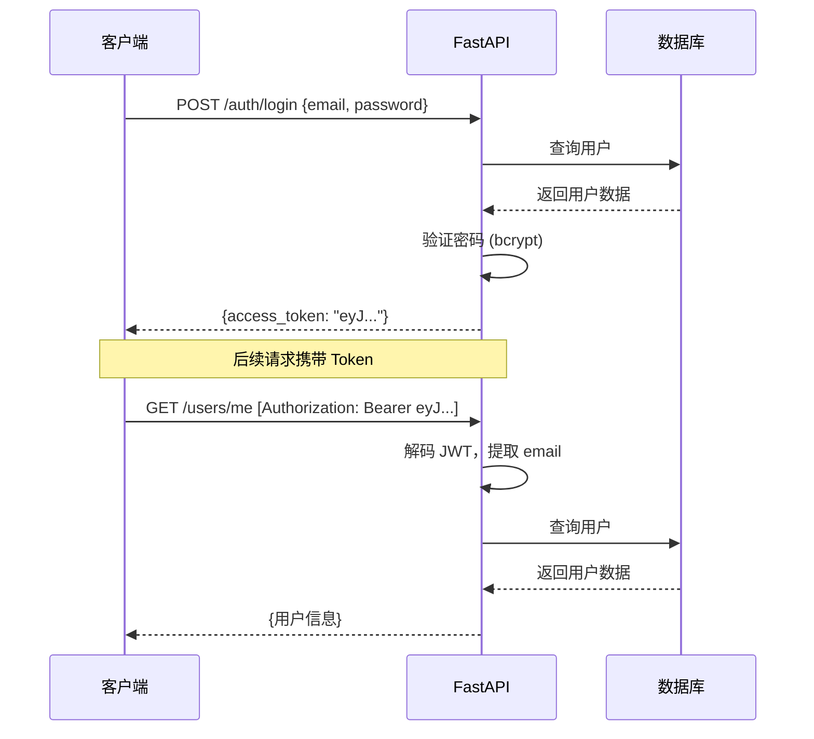

# Python 全栈实战（十七）—— FastAPI（二）：数据库与认证

API 没有数据库就是空壳。这篇把 SQLAlchemy 2.0 异步 ORM、Alembic 迁移和 JWT 认证串起来，搭建一个真正能存数据、能登录的后端。

> **环境：** Python 3.14.3, SQLAlchemy 2.0.48, Alembic 1.18.4, PyJWT

---

## 1. SQLAlchemy 2.0 异步 ORM

```bash
uv add sqlalchemy[asyncio] aiosqlite pyjwt passlib[bcrypt]
uv add --dev alembic
```

### 数据库连接

```python
# src/my_api/database.py
from sqlalchemy.ext.asyncio import create_async_engine, async_sessionmaker, AsyncSession
from sqlalchemy.orm import DeclarativeBase

DATABASE_URL = "sqlite+aiosqlite:///./app.db"

engine = create_async_engine(DATABASE_URL, echo=False)
async_session = async_sessionmaker(engine, expire_on_commit=False)


class Base(DeclarativeBase):
    pass


async def get_db() -> AsyncSession:
    """FastAPI 依赖：提供数据库会话"""
    async with async_session() as session:
        try:
            yield session
            await session.commit()
        except Exception:
            await session.rollback()
            raise
```

### 定义模型

```python
# src/my_api/models/user.py
from datetime import datetime
from sqlalchemy import String, DateTime, func
from sqlalchemy.orm import Mapped, mapped_column
from ..database import Base


class User(Base):
    __tablename__ = "users"

    id: Mapped[int] = mapped_column(primary_key=True)
    name: Mapped[str] = mapped_column(String(50))
    email: Mapped[str] = mapped_column(String(100), unique=True, index=True)
    hashed_password: Mapped[str] = mapped_column(String(200))
    is_active: Mapped[bool] = mapped_column(default=True)
    created_at: Mapped[datetime] = mapped_column(
        DateTime(timezone=True), server_default=func.now()
    )
```

SQLAlchemy 2.0 用 `Mapped[T]` 类型注解声明字段，比 1.x 的 `Column()` 更 Pythonic，Pyright 也能正确推导类型。

### CRUD 操作

```python
# src/my_api/services/user_service.py
from sqlalchemy import select
from sqlalchemy.ext.asyncio import AsyncSession
from ..models.user import User


async def get_user_by_email(db: AsyncSession, email: str) -> User | None:
    result = await db.execute(select(User).where(User.email == email))
    return result.scalar_one_or_none()


async def create_user(db: AsyncSession, name: str, email: str, hashed_password: str) -> User:
    user = User(name=name, email=email, hashed_password=hashed_password)
    db.add(user)
    await db.flush()                # flush 拿到自增 ID，但不提交事务
    await db.refresh(user)          # 刷新对象，获取数据库生成的字段
    return user


async def list_users(db: AsyncSession, skip: int = 0, limit: int = 20) -> list[User]:
    result = await db.execute(
        select(User).offset(skip).limit(limit).order_by(User.created_at.desc())
    )
    return list(result.scalars().all())
```

### 集成到 FastAPI

```python
# src/my_api/routes/users.py
from fastapi import APIRouter, Depends, HTTPException
from sqlalchemy.ext.asyncio import AsyncSession
from ..database import get_db
from ..models.user import User
from ..services import user_service
from ..schemas.user import UserCreate, UserPublic

router = APIRouter(prefix="/users", tags=["用户"])


@router.post("/", response_model=UserPublic, status_code=201)
async def register(data: UserCreate, db: AsyncSession = Depends(get_db)):
    existing = await user_service.get_user_by_email(db, data.email)
    if existing:
        raise HTTPException(400, "邮箱已注册")

    from ..utils.security import hash_password
    user = await user_service.create_user(
        db, data.name, data.email, hash_password(data.password)
    )
    return user


@router.get("/", response_model=list[UserPublic])
async def list_all(skip: int = 0, limit: int = 20, db: AsyncSession = Depends(get_db)):
    return await user_service.list_users(db, skip, limit)
```

## 2. Alembic 数据库迁移

手动建表不可维护。Alembic 追踪模型变化，生成迁移脚本：

```bash
uv run alembic init alembic
```

修改 `alembic/env.py`，接入异步引擎和模型元数据：

```python
# alembic/env.py（关键修改）
from my_api.database import Base, DATABASE_URL
target_metadata = Base.metadata

# 异步迁移配置
from sqlalchemy.ext.asyncio import create_async_engine

async def run_async_migrations():
    connectable = create_async_engine(DATABASE_URL)
    async with connectable.connect() as connection:
        await connection.run_sync(do_run_migrations)
    await connectable.dispose()
```

```bash
# 生成迁移脚本
uv run alembic revision --autogenerate -m "create users table"

# 执行迁移
uv run alembic upgrade head

# 回滚
uv run alembic downgrade -1

# 查看当前版本
uv run alembic current
```

`--autogenerate` 对比当前模型和数据库结构，自动生成 ALTER 语句。每次修改模型后都要跑一次 `revision --autogenerate`。

## 3. JWT 认证

```python
# src/my_api/utils/security.py
from datetime import datetime, timedelta, timezone
import jwt
from passlib.context import CryptContext

SECRET_KEY = "your-secret-key-change-in-production"   # 生产环境用环境变量
ALGORITHM = "HS256"
ACCESS_TOKEN_EXPIRE_MINUTES = 30

pwd_context = CryptContext(schemes=["bcrypt"])


def hash_password(password: str) -> str:
    return pwd_context.hash(password)

def verify_password(plain: str, hashed: str) -> bool:
    return pwd_context.verify(plain, hashed)

def create_access_token(data: dict, expires_delta: timedelta | None = None) -> str:
    to_encode = data.copy()
    expire = datetime.now(timezone.utc) + (expires_delta or timedelta(minutes=ACCESS_TOKEN_EXPIRE_MINUTES))
    to_encode["exp"] = expire
    return jwt.encode(to_encode, SECRET_KEY, algorithm=ALGORITHM)

def decode_access_token(token: str) -> dict:
    return jwt.decode(token, SECRET_KEY, algorithms=[ALGORITHM])
```

### JWT 认证流程



### 登录接口

```python
# src/my_api/routes/auth.py
from fastapi import APIRouter, Depends, HTTPException
from fastapi.security import OAuth2PasswordBearer, OAuth2PasswordRequestForm
from sqlalchemy.ext.asyncio import AsyncSession
from ..database import get_db
from ..services import user_service
from ..utils.security import verify_password, create_access_token, decode_access_token

router = APIRouter(prefix="/auth", tags=["认证"])
oauth2_scheme = OAuth2PasswordBearer(tokenUrl="/auth/login")


@router.post("/login")
async def login(
    form_data: OAuth2PasswordRequestForm = Depends(),
    db: AsyncSession = Depends(get_db),
):
    user = await user_service.get_user_by_email(db, form_data.username)
    if not user or not verify_password(form_data.password, user.hashed_password):
        raise HTTPException(401, "邮箱或密码错误")

    token = create_access_token({"sub": user.email})
    return {"access_token": token, "token_type": "bearer"}


async def get_current_user(
    token: str = Depends(oauth2_scheme),
    db: AsyncSession = Depends(get_db),
):
    """认证依赖：解析 Token 获取当前用户"""
    try:
        payload = decode_access_token(token)
        email = payload.get("sub")
        if email is None:
            raise HTTPException(401, "无效 Token")
    except jwt.ExpiredSignatureError:
        raise HTTPException(401, "Token 已过期")
    except jwt.InvalidTokenError:
        raise HTTPException(401, "无效 Token")

    user = await user_service.get_user_by_email(db, email)
    if user is None:
        raise HTTPException(401, "用户不存在")
    return user
```

```bash
# 注册
curl -X POST http://localhost:8000/users/ \
  -H "Content-Type: application/json" \
  -d '{"name":"张三","email":"z@test.com","password":"secret123"}'

# 登录获取 Token
curl -X POST http://localhost:8000/auth/login \
  -d "username=z@test.com&password=secret123"
# {"access_token":"eyJ...","token_type":"bearer"}

# 用 Token 访问受保护接口
curl http://localhost:8000/users/me \
  -H "Authorization: Bearer eyJ..."
```

## 4. 关联查询

```python
# 一对多：用户有多篇文章
from sqlalchemy import ForeignKey
from sqlalchemy.orm import relationship

class Post(Base):
    __tablename__ = "posts"
    id: Mapped[int] = mapped_column(primary_key=True)
    title: Mapped[str] = mapped_column(String(200))
    author_id: Mapped[int] = mapped_column(ForeignKey("users.id"))

    author: Mapped["User"] = relationship(back_populates="posts")

# User 模型添加反向关系
class User(Base):
    # ... 前面的字段
    posts: Mapped[list["Post"]] = relationship(back_populates="author")
```

### 避免 N+1 问题

```python
from sqlalchemy.orm import selectinload

# ❌ N+1：每个用户单独查询 posts
users = await db.execute(select(User))
for user in users.scalars():
    print(user.posts)          # 每次访问 posts 触发一次额外查询

# ✅ selectinload：一次查询所有关联数据
users = await db.execute(
    select(User).options(selectinload(User.posts))
)
```

## 常见坑点

**1. 异步 ORM 的懒加载陷阱**

SQLAlchemy 异步模式不支持隐式懒加载。访问未加载的关联属性会抛 `MissingGreenlet` 错误。必须用 `selectinload` / `joinedload` 显式指定预加载策略。

**2. Alembic autogenerate 的局限**

`--autogenerate` 不能检测所有变化（如列重命名、自定义类型变更）。生成后一定要人工检查迁移脚本再执行。

## 总结

- SQLAlchemy 2.0 用 `Mapped[T]` 注解定义模型，异步模式需要 `create_async_engine`
- Alembic `--autogenerate` 自动生成迁移脚本，每次模型变更后执行
- JWT 认证：登录返回 Token，后续请求通过 `Authorization: Bearer` 携带
- FastAPI 的 `Depends` 注入数据库会话和认证逻辑，依赖链自动解析
- `selectinload` 避免 N+1 查询问题

下一篇进入 **FastAPI（三）：部署与生产化**——Docker、Uvicorn 调优、中间件。

## 参考

- [SQLAlchemy 2.0 文档](https://docs.sqlalchemy.org/en/20/)
- [Alembic 文档](https://alembic.sqlalchemy.org/)
- [FastAPI 安全指南](https://fastapi.tiangolo.com/tutorial/security/)
