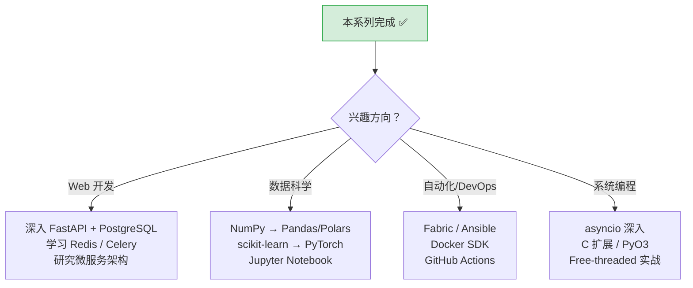

# Python 全栈实战（二十）—— Python 3.14 新特性与生态全景

站在 2026 年回头看，Python 在过去三个版本（3.12 → 3.14）的进化幅度比之前五年都大——泛型语法简化、GIL 可选、t-string、延迟注解。这些不是锦上添花，而是实质性的语言改进。

> **环境：** Python 3.14.3

---

## 1. Python 3.14 核心新特性

### t-string 模板字符串（PEP 750）

第 2 篇简单提过 t-string。这里展开讲它的实际价值——串联防注入和安全渲染。

```python
from string.templatelib import Template

# t-string 产生 Template 对象，不是字符串
name = "O'Malley'; DROP TABLE users;--"
template = t"SELECT * FROM users WHERE name = '{name}'"

# template.strings → 静态部分
# template.values  → 插值部分
print(template.strings)  # ("SELECT * FROM users WHERE name = '", "';--'")
print(template.values)   # ("O'Malley'; DROP TABLE users;--",)
```

库和框架可以拿到结构化的模板数据，在渲染前做参数化查询、HTML 转义等安全处理：

```python
def safe_sql(template: Template) -> tuple[str, list]:
    """将 t-string 转为参数化 SQL"""
    parts = []
    params = []
    for i, static in enumerate(template.strings):
        parts.append(static)
        if i < len(template.values):
            parts.append("?")
            params.append(template.values[i])
    return "".join(parts), params

query, params = safe_sql(t"SELECT * FROM users WHERE name = {name} AND age > {18}")
print(query)    # SELECT * FROM users WHERE name = ? AND age > ?
print(params)   # ["O'Malley'; DROP TABLE users;--", 18]
```

t-string 不替代 f-string——日常格式化仍然用 f-string，t-string 面向的是框架开发者和安全敏感的场景。

### 延迟求值注解（PEP 649）

Python 3.14 默认启用延迟求值的类型注解——注解不再在模块导入时立即求值，而是在需要时（如反射、运行时类型检查）才求值。

```python
# Python 3.14 之前：前向引用必须用字符串
class TreeNode:
    children: list["TreeNode"]   # 引号包裹

# Python 3.14：延迟求值，直接写
class TreeNode:
    children: list[TreeNode]     # 无需引号 ✅
```

这个变化消除了 `from __future__ import annotations` 的需求，也解决了 Pydantic 等运行时类型库的兼容性困扰。

### Free-threaded 正式支持（PEP 779）

Python 3.13 引入实验性 no-GIL，Python 3.14 正式确认 Free-threaded 模式作为官方支持的构建选项。

```bash
# 安装 Free-threaded 版本
uv python install 3.14t

# 验证
uv run --python 3.14t python -c "import sys; print(sys._is_gil_enabled())"
# False
```

核心变化（第 11 篇已详述）：
- 多线程能真正并行执行 CPU 密集型任务
- 单线程性能下降约 10-15%（参考计数保护机制的开销）
- 需要线程安全意识——不能再依赖 GIL 保证操作的原子性

## 2. Python 3.12-3.13 的重要改进

### 新泛型语法（PEP 695，3.12）

```python
# 旧写法
from typing import TypeVar
T = TypeVar("T")
def first(items: list[T]) -> T | None: ...

# 新写法（3.12+）
def first[T](items: list[T]) -> T | None: ...

# type 语句定义类型别名
type Vector = list[float]
type Matrix = list[Vector]
```

### 改进的错误信息（3.12-3.14）

Python 持续改进报错信息的可读性：

```python
# 旧版
# NameError: name 'response' is not defined

# 3.12+
# NameError: name 'response' is not defined. Did you mean: 'Response'?

# 字典键拼写错误也有提示
config = {"database": "postgres", "port": 5432}
# config["databse"]
# KeyError: 'databse'. Did you mean: 'database'?
```

### TaskGroup 与 ExceptionGroup（3.11）

```python
async with asyncio.TaskGroup() as tg:
    tg.create_task(task_a())
    tg.create_task(task_b())
# 一个失败，全部取消

# except* 处理异常组
except* ValueError as eg:
    for exc in eg.exceptions:
        print(exc)
```

## 3. Python 生态全景

### 领域 → 核心库对照

| 领域 | 推荐库（2026） | 说明 |
|------|---------------|------|
| **Web 框架** | FastAPI, Django | FastAPI 适合 API，Django 适合全栈 |
| **HTTP 客户端** | httpx | 替代 requests，支持异步和 HTTP/2 |
| **ORM** | SQLAlchemy 2.0 | 异步支持，Mapped 类型注解 |
| **数据验证** | Pydantic v2 | FastAPI 的核心依赖 |
| **CLI** | Typer + Rich | 类型驱动的 CLI 开发 |
| **测试** | pytest | 社区标准，插件生态丰富 |
| **Lint/Format** | Ruff | 替代 flake8 + isort + black |
| **类型检查** | Pyright | VS Code 集成最好，速度快 |
| **包管理** | uv | 替代 pip + venv + pyenv + poetry |
| **任务队列** | Celery, ARQ | Celery 成熟，ARQ 轻量异步 |
| **数据科学** | Polars, Pandas | Polars 性能更高（Rust 实现） |
| **数据分析** | NumPy, SciPy | 科学计算基础设施 |
| **机器学习** | scikit-learn, PyTorch | 传统 ML 和深度学习 |
| **爬虫** | httpx + BeautifulSoup, Scrapy | 轻量级 vs 重量级 |
| **日志** | structlog, loguru | 结构化日志 |
| **配置管理** | pydantic-settings | 环境变量驱动 |

### 2026 年趋势

**uv 统治包管理**：uv 的下载量已超过 pip。新项目几乎没有不用 uv 的理由——速度快 10-100 倍，功能覆盖 pip + venv + pyenv + poetry。

**Ruff 统一代码风格**：替代了 flake8、isort、black、pydocstyle 等 5+ 个工具，一个二进制搞定 Lint + Format，配置集中在 `pyproject.toml`。

**Polars 崛起**：Pandas 仍然是最流行的数据分析库，但 Polars（Rust 实现、惰性求值、多线程）在大数据集上的性能优势让它快速增长。

**Free-threaded 生态适配**：NumPy、httpx、uvloop 等核心库已适配，但长尾的 C 扩展库还在进行中。预计 Python 3.15-3.16 会实现大部分生态适配。

## 4. 版本差异速查表

| 特性 | 引入版本 | 说明 |
|------|---------|------|
| 内置泛型 `list[int]` | 3.9 | 不再需要 `from typing import List` |
| `match-case` | 3.10 | 结构化模式匹配 |
| `X \| Y` 联合类型 | 3.10 | 替代 `Union[X, Y]` |
| `ExceptionGroup` + `except*` | 3.11 | 并发多异常处理 |
| `asyncio.TaskGroup` | 3.11 | 结构化并发 |
| `tomllib` | 3.11 | 内置 TOML 解析 |
| 新泛型语法 `def f[T]` | 3.12 | 替代 `TypeVar` |
| `type` 语句 | 3.12 | 类型别名新语法 |
| Free-threaded 实验 | 3.13 | 可选的 no-GIL 模式 |
| 改进的 REPL | 3.13 | 多行编辑、语法高亮 |
| t-string `t""` | 3.14 | 模板字符串 |
| 延迟求值注解 | 3.14 | PEP 649 |
| Free-threaded 正式 | 3.14 | PEP 779 |

## 5. 学习路线建议

完成这个系列后的进阶方向：



## 常见坑点

**1. 使用新语法时注意最低 Python 版本要求**

如果项目需要支持 Python 3.10 以下版本，不能用 `match-case`、`X | Y` 类型语法等新特性。`pyproject.toml` 中的 `requires-python` 字段明确约束了兼容范围。

**2. 第三方库的版本兼容**

升级 Python 大版本时，先检查所有依赖是否兼容新版本。`uv` 会在安装时自动检查兼容性约束。

## 总结

- Python 3.14 三大核心改进：t-string（安全模板）、延迟注解（消除前向引用）、Free-threaded（真并行）
- Python 3.12 的新泛型语法让类型注解接近 TypeScript 的简洁度
- 2026 年的 Python 工具链标准：uv（包管理）+ Ruff（Lint/Format）+ Pyright（类型检查）
- 从 Web 开发、数据科学、自动化到系统编程，Python 都有成熟的生态支持

下一篇是最终篇——**综合实战：全栈 API 项目**——从零搭建一个生产级项目，串联全系列知识点。

## 参考

- [Python 3.14 What's New](https://docs.python.org/3.14/whatsnew/3.14.html)
- [PEP 750 - Template Strings](https://peps.python.org/pep-0750/)
- [PEP 649 - Deferred Evaluation of Annotations](https://peps.python.org/pep-0649/)
- [PEP 779 - Free-threaded CPython](https://peps.python.org/pep-0779/)
- [PEP 695 - Type Parameter Syntax](https://peps.python.org/pep-0695/)
