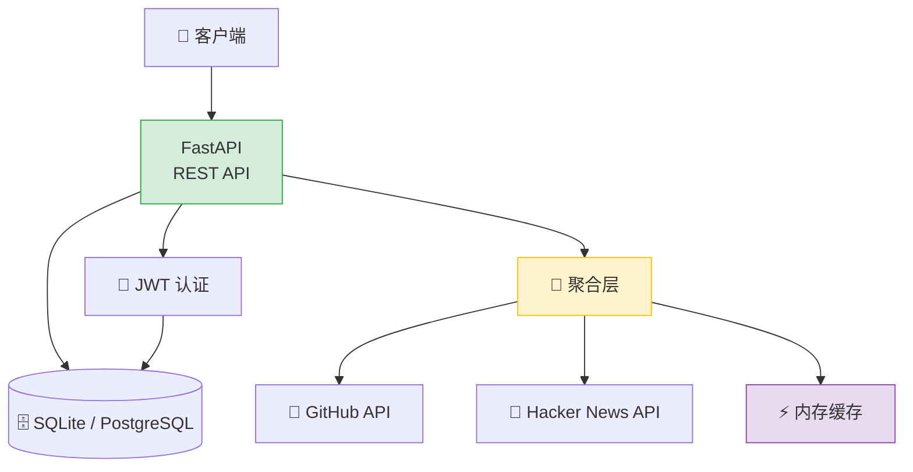

# Python 全栈实战（二十一）—— 综合实战：API 聚合服务

21 篇系列的收官——把前面所有知识点串成一个完整的项目：API 聚合服务。它聚合多个外部数据源，提供统一的查询接口，涵盖项目搭建、数据库、认证、异步请求、缓存、测试和 Docker 部署。

> **环境：** Python 3.14.3, FastAPI 0.135.2, SQLAlchemy 2.0.48, httpx 0.28.1

---

## 1. 项目概述

**API 聚合服务（API Hub）**——整合多个公开 API 的数据，提供统一的查询接口：

- 聚合 GitHub 趋势仓库、Hacker News 热帖、天气数据
- 用户注册/登录（JWT 认证）
- 收藏功能（数据库持久化）
- 异步并发请求外部 API + 结果缓存
- 完整的测试覆盖 + Docker 部署

### 技术栈

| 层 | 技术 |
|----|------|
| 框架 | FastAPI |
| ORM | SQLAlchemy 2.0（异步） |
| 数据库 | SQLite（开发）/ PostgreSQL（生产） |
| HTTP 客户端 | httpx（异步） |
| 认证 | JWT (PyJWT) + bcrypt |
| 测试 | pytest + pytest-asyncio |
| 部署 | Docker + Docker Compose |

### 系统架构



## 2. 项目搭建

```bash
uv init api-hub && cd api-hub
uv add fastapi "uvicorn[standard]" httpx sqlalchemy[asyncio] aiosqlite pyjwt "passlib[bcrypt]" pydantic-settings
uv add --dev pytest pytest-asyncio pytest-cov ruff pyright httpx  # httpx 作为测试客户端
```

### 目录结构

```
api-hub/
├── pyproject.toml
├── uv.lock
├── .python-version
├── .env.example
├── Dockerfile
├── docker-compose.yml
├── alembic/
├── src/
│   └── api_hub/
│       ├── __init__.py
│       ├── main.py                 # 应用入口
│       ├── config.py               # 配置管理
│       ├── database.py             # 数据库连接
│       ├── models/                 # SQLAlchemy 模型
│       │   ├── __init__.py
│       │   └── user.py
│       ├── schemas/                # Pydantic 模型
│       │   ├── __init__.py
│       │   ├── user.py
│       │   └── source.py
│       ├── routes/                 # API 路由
│       │   ├── __init__.py
│       │   ├── auth.py
│       │   ├── sources.py
│       │   └── favorites.py
│       ├── services/               # 业务逻辑
│       │   ├── __init__.py
│       │   ├── auth_service.py
│       │   ├── github_service.py
│       │   ├── hackernews_service.py
│       │   └── aggregator.py
│       └── utils/
│           ├── __init__.py
│           ├── security.py
│           └── cache.py
└── tests/
    ├── conftest.py
    ├── test_auth.py
    ├── test_sources.py
    └── test_aggregator.py
```

## 3. 核心代码

### 配置管理（第 18 篇）

```python
# src/api_hub/config.py
from pydantic_settings import BaseSettings


class Settings(BaseSettings):
    app_name: str = "API Hub"
    database_url: str = "sqlite+aiosqlite:///./api_hub.db"
    secret_key: str = "dev-secret-change-me"
    access_token_expire_minutes: int = 30
    github_token: str | None = None          # 可选：提高 GitHub API 限额
    cache_ttl_seconds: int = 300             # 缓存 5 分钟

    model_config = {"env_file": ".env"}


settings = Settings()
```

### 数据库层（第 17 篇）

```python
# src/api_hub/database.py
from sqlalchemy.ext.asyncio import create_async_engine, async_sessionmaker
from sqlalchemy.orm import DeclarativeBase
from .config import settings

engine = create_async_engine(settings.database_url)
async_session = async_sessionmaker(engine, expire_on_commit=False)


class Base(DeclarativeBase):
    pass


async def get_db():
    async with async_session() as session:
        try:
            yield session
            await session.commit()
        except Exception:
            await session.rollback()
            raise
```

### 数据模型（第 5、17 篇）

```python
# src/api_hub/models/user.py
from datetime import datetime
from sqlalchemy import String, DateTime, ForeignKey, func
from sqlalchemy.orm import Mapped, mapped_column, relationship
from ..database import Base


class User(Base):
    __tablename__ = "users"

    id: Mapped[int] = mapped_column(primary_key=True)
    email: Mapped[str] = mapped_column(String(100), unique=True, index=True)
    name: Mapped[str] = mapped_column(String(50))
    hashed_password: Mapped[str] = mapped_column(String(200))
    is_active: Mapped[bool] = mapped_column(default=True)
    created_at: Mapped[datetime] = mapped_column(DateTime(timezone=True), server_default=func.now())

    favorites: Mapped[list["Favorite"]] = relationship(back_populates="user", cascade="all, delete-orphan")


class Favorite(Base):
    __tablename__ = "favorites"

    id: Mapped[int] = mapped_column(primary_key=True)
    user_id: Mapped[int] = mapped_column(ForeignKey("users.id"))
    source: Mapped[str] = mapped_column(String(50))     # github / hackernews
    external_id: Mapped[str] = mapped_column(String(200))
    title: Mapped[str] = mapped_column(String(500))
    url: Mapped[str] = mapped_column(String(500))
    created_at: Mapped[datetime] = mapped_column(DateTime(timezone=True), server_default=func.now())

    user: Mapped["User"] = relationship(back_populates="favorites")
```

### 外部 API 服务（第 10、14 篇）

```python
# src/api_hub/services/github_service.py
import httpx
from ..config import settings
from ..schemas.source import SourceItem


async def fetch_trending_repos(language: str = "python", limit: int = 10) -> list[SourceItem]:
    """获取 GitHub 趋势仓库"""
    headers = {}
    if settings.github_token:
        headers["Authorization"] = f"Bearer {settings.github_token}"

    async with httpx.AsyncClient() as client:
        response = await client.get(
            "https://api.github.com/search/repositories",
            params={
                "q": f"language:{language}",
                "sort": "stars",
                "order": "desc",
                "per_page": limit,
            },
            headers=headers,
            timeout=10,
        )
        response.raise_for_status()
        data = response.json()

    return [
        SourceItem(
            source="github",
            external_id=str(repo["id"]),
            title=f"{repo['full_name']} ⭐{repo['stargazers_count']:,}",
            url=repo["html_url"],
            description=repo.get("description", ""),
        )
        for repo in data["items"]
    ]
```

```python
# src/api_hub/services/hackernews_service.py
import httpx
from ..schemas.source import SourceItem


async def fetch_top_stories(limit: int = 10) -> list[SourceItem]:
    """获取 Hacker News 热帖"""
    async with httpx.AsyncClient() as client:
        # 1. 获取热帖 ID 列表
        response = await client.get(
            "https://hacker-news.firebaseio.com/v0/topstories.json",
            timeout=10,
        )
        story_ids = response.json()[:limit]

        # 2. 并发获取每篇的详情
        import asyncio
        tasks = [
            client.get(f"https://hacker-news.firebaseio.com/v0/item/{sid}.json", timeout=10)
            for sid in story_ids
        ]
        responses = await asyncio.gather(*tasks)

    items = []
    for resp in responses:
        story = resp.json()
        if story and story.get("title"):
            items.append(SourceItem(
                source="hackernews",
                external_id=str(story["id"]),
                title=story["title"],
                url=story.get("url", f"https://news.ycombinator.com/item?id={story['id']}"),
                description=f"{story.get('score', 0)} points | {story.get('descendants', 0)} comments",
            ))
    return items
```

### 聚合层 + 缓存（第 3、10 篇）

```python
# src/api_hub/services/aggregator.py
import asyncio
from ..schemas.source import SourceItem, AggregatedResult
from . import github_service, hackernews_service
from ..utils.cache import timed_cache


@timed_cache(seconds=300)
async def aggregate_all() -> AggregatedResult:
    """并发请求所有数据源，聚合结果"""
    github_task = github_service.fetch_trending_repos()
    hn_task = hackernews_service.fetch_top_stories()

    results = await asyncio.gather(
        github_task, hn_task,
        return_exceptions=True,      # 单个源失败不影响其他
    )

    items: list[SourceItem] = []
    errors: list[str] = []

    for i, result in enumerate(results):
        source_name = ["GitHub", "Hacker News"][i]
        if isinstance(result, Exception):
            errors.append(f"{source_name}: {result}")
        else:
            items.extend(result)

    return AggregatedResult(items=items, errors=errors, total=len(items))
```

```python
# src/api_hub/utils/cache.py
import asyncio
import time
from functools import wraps


def timed_cache(seconds: int = 300):
    """简单的时间缓存装饰器（用于异步函数）"""
    def decorator(func):
        cache: dict[str, tuple[float, object]] = {}

        @wraps(func)
        async def wrapper(*args, **kwargs):
            key = f"{args}_{kwargs}"
            now = time.time()

            if key in cache:
                cached_time, cached_result = cache[key]
                if now - cached_time < seconds:
                    return cached_result

            result = await func(*args, **kwargs)
            cache[key] = (now, result)
            return result

        wrapper.cache_clear = lambda: cache.clear()
        return wrapper
    return decorator
```

### API 路由（第 16 篇）

```python
# src/api_hub/routes/sources.py
from fastapi import APIRouter, Depends, Query
from ..services import aggregator, github_service, hackernews_service
from ..schemas.source import AggregatedResult, SourceItem

router = APIRouter(prefix="/sources", tags=["数据源"])


@router.get("/", response_model=AggregatedResult)
async def get_all_sources():
    """获取所有数据源的聚合结果"""
    return await aggregator.aggregate_all()


@router.get("/github", response_model=list[SourceItem])
async def get_github(
    language: str = Query("python", description="编程语言"),
    limit: int = Query(10, ge=1, le=50),
):
    return await github_service.fetch_trending_repos(language, limit)


@router.get("/hackernews", response_model=list[SourceItem])
async def get_hackernews(limit: int = Query(10, ge=1, le=50)):
    return await hackernews_service.fetch_top_stories(limit)
```

### 应用入口（第 16-18 篇）

```python
# src/api_hub/main.py
from contextlib import asynccontextmanager
from fastapi import FastAPI
from fastapi.middleware.cors import CORSMiddleware

from .config import settings
from .database import engine, Base
from .routes import auth, sources, favorites


@asynccontextmanager
async def lifespan(app: FastAPI):
    async with engine.begin() as conn:
        await conn.run_sync(Base.metadata.create_all)
    yield
    await engine.dispose()


app = FastAPI(
    title=settings.app_name,
    version="1.0.0",
    lifespan=lifespan,
)

app.add_middleware(
    CORSMiddleware,
    allow_origins=["*"],
    allow_methods=["*"],
    allow_headers=["*"],
)

app.include_router(auth.router)
app.include_router(sources.router)
app.include_router(favorites.router)


@app.get("/health", tags=["运维"])
async def health():
    return {"status": "healthy", "app": settings.app_name}
```

## 4. Pydantic 模型（第 6、16 篇）

```python
# src/api_hub/schemas/source.py
from pydantic import BaseModel


class SourceItem(BaseModel):
    source: str
    external_id: str
    title: str
    url: str
    description: str = ""


class AggregatedResult(BaseModel):
    items: list[SourceItem]
    errors: list[str] = []
    total: int
```

## 5. 测试（第 13 篇）

```python
# tests/conftest.py
import pytest
import pytest_asyncio
from httpx import AsyncClient, ASGITransport
from sqlalchemy.ext.asyncio import create_async_engine, async_sessionmaker

from api_hub.main import app
from api_hub.database import Base, get_db


TEST_DATABASE_URL = "sqlite+aiosqlite:///./test.db"
test_engine = create_async_engine(TEST_DATABASE_URL)
test_session = async_sessionmaker(test_engine, expire_on_commit=False)


@pytest_asyncio.fixture
async def db():
    async with test_engine.begin() as conn:
        await conn.run_sync(Base.metadata.create_all)
    async with test_session() as session:
        yield session
    async with test_engine.begin() as conn:
        await conn.run_sync(Base.metadata.drop_all)


@pytest_asyncio.fixture
async def client(db):
    async def override_get_db():
        yield db

    app.dependency_overrides[get_db] = override_get_db
    transport = ASGITransport(app=app)
    async with AsyncClient(transport=transport, base_url="http://test") as ac:
        yield ac
    app.dependency_overrides.clear()
```

```python
# tests/test_auth.py
import pytest


@pytest.mark.asyncio
async def test_register_and_login(client):
    # 注册
    response = await client.post("/auth/register", json={
        "name": "张三", "email": "z@test.com", "password": "secret123"
    })
    assert response.status_code == 201

    # 登录
    response = await client.post("/auth/login", data={
        "username": "z@test.com", "password": "secret123"
    })
    assert response.status_code == 200
    assert "access_token" in response.json()


@pytest.mark.asyncio
async def test_register_duplicate_email(client):
    await client.post("/auth/register", json={
        "name": "张三", "email": "z@test.com", "password": "secret123"
    })
    response = await client.post("/auth/register", json={
        "name": "李四", "email": "z@test.com", "password": "other123"
    })
    assert response.status_code == 400
```

```python
# tests/test_sources.py
import pytest
from unittest.mock import AsyncMock, patch
from api_hub.schemas.source import SourceItem


@pytest.mark.asyncio
async def test_get_all_sources(client):
    mock_items = [
        SourceItem(
            source="github", external_id="1",
            title="test/repo", url="https://github.com/test/repo"
        ),
    ]

    with patch("api_hub.services.aggregator.aggregate_all") as mock:
        from api_hub.schemas.source import AggregatedResult
        mock.return_value = AggregatedResult(items=mock_items, total=1)
        response = await client.get("/sources/")

    assert response.status_code == 200
    data = response.json()
    assert data["total"] == 1
```

运行测试：

```bash
uv run pytest -v --cov=src/api_hub
```

## 6. Docker 部署（第 18 篇）

```dockerfile
# Dockerfile
FROM python:3.14-slim AS builder
COPY --from=ghcr.io/astral-sh/uv:latest /uv /usr/local/bin/uv
WORKDIR /app
COPY pyproject.toml uv.lock ./
RUN uv sync --frozen --no-dev

FROM python:3.14-slim
WORKDIR /app
COPY --from=builder /app/.venv /app/.venv
COPY src/ src/
ENV PATH="/app/.venv/bin:$PATH"
EXPOSE 8000
CMD ["uvicorn", "api_hub.main:app", "--host", "0.0.0.0", "--port", "8000"]
```

```bash
docker compose up -d
curl http://localhost:8000/health
curl http://localhost:8000/sources/
curl http://localhost:8000/docs        # Swagger UI
```

## 7. 知识点串联

| 篇目 | 本项目中的体现 |
|------|---------------|
| 01 环境搭建 | uv init + pyproject.toml + Ruff + Pyright |
| 02 语法速通 | f-string、推导式、match-case |
| 03 函数与装饰器 | `timed_cache` 缓存装饰器 |
| 04 数据结构 | dict/list 操作、数据聚合 |
| 05 面向对象 | SQLAlchemy 模型类定义 |
| 06 类型系统 | Pydantic 模型、函数类型注解 |
| 07 错误处理 | HTTPException、自定义错误处理器 |
| 08 文件 IO | 配置文件读取、.env 管理 |
| 09 迭代器与生成器 | 生成器管道处理数据 |
| 10 asyncio | gather 并发请求、AsyncClient |
| 11 多线程/GIL | 理解 async 与线程的关系 |
| 12 项目结构 | src 布局、模块化组织 |
| 13 测试 | pytest fixture、Mock、覆盖率 |
| 14 网络请求 | httpx 异步请求 GitHub/HN API |
| 15 CLI | 可扩展为管理 CLI 工具 |
| 16-18 FastAPI | 路由、依赖注入、DB、JWT、部署 |
| 19 性能 | 缓存策略、并发控制 |
| 20 新特性 | Python 3.14 语法和工具链 |

## 总结

这个项目覆盖了 Python 全栈开发的完整链路：

- **项目初始化**：uv + pyproject.toml + 工具链配置
- **数据层**：SQLAlchemy 2.0 异步 ORM + Pydantic 验证
- **业务层**：外部 API 聚合 + 异步并发 + 缓存
- **接口层**：FastAPI 路由 + JWT 认证 + 依赖注入
- **测试层**：pytest + Mock + 覆盖率
- **部署层**：Docker 多阶段构建 + docker-compose

系列完结 🎉。从环境搭建到生产部署，21 篇文章覆盖了 Python 开发的核心知识。接下来就是在实际项目中反复练习——写代码、读源码、解决真实问题，这些才是技术成长的主旋律。

## 项目源码结构参考

完整代码可以按照本文的结构自行搭建。核心要点已全部展示，动手实现一遍比看十遍文章更有效。

## 参考

- [FastAPI 官方文档](https://fastapi.tiangolo.com/)
- [SQLAlchemy 2.0 文档](https://docs.sqlalchemy.org/en/20/)
- [httpx 官方文档](https://www.python-httpx.org/)
- [pytest-asyncio 文档](https://pytest-asyncio.readthedocs.io/)
