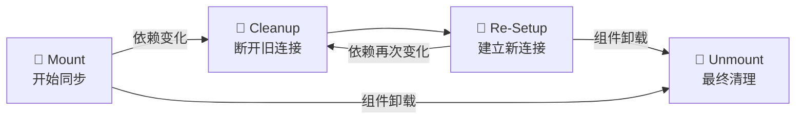
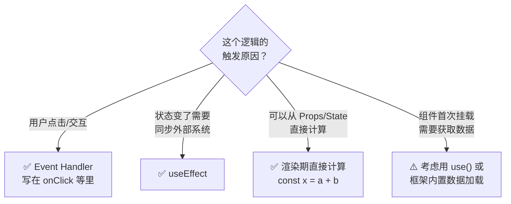

# 06. 同步与副作用：逃生舱

当你在 useEffect 里写了一个 fetch 请求，组件销毁后请求还在跑，控制台报错 `Can't perform a React state update on an unmounted component`。这是 useEffect 最常见的误用场景。

`useEffect` 是 React 提供的**逃生舱**。用于连接组件外部的系统（API、DOM、第三方 SDK）。

## 心理模型：逃生舱 (Escape Hatches)

将 React 想象成一个高度自动化的**无菌实验室**（纯渲染世界）。在这里，一切都是可预测的，尘埃不染。
但偶尔，需要把手伸出窗外去拿个快递，或者在泥地里打个滚。

`useEffect` 就是这个**逃生舱**。它允许组件暂时离开 React 的纯粹逻辑，去连接外部系统。

- **内部系统**：State, Props, Context (React 能够完全控制)。
- **外部系统**：Browser DOM API, `window.addEventListener`, `fetch`, `setInterval` (React 无法控制)。

**Effects 的唯一目的就是：将 React 组件与外部系统同步 (Synchronize)。**

## 效果的生命周期



Effect 的思考方式与组件不同。它不是"渲染时发生什么"，而是"如何同步"。

### 1. 挂载 (Mount) - 开始同步
当组件第一次出现在屏幕上时，Effect 会运行。这是建立连接的时候。
- 比如：`connection.connect()`
- 比如：`window.addEventListener('scroll', handler)`

### 2. 更新 (Update) - 重新同步
如果 Effect 依赖的数据（Dependencies）变了，React 需要先断开上一次的连接，然后建立新的连接。
这是一个非常关键的概念：**为了保持同步，必须先清理旧的，再建立新的。**

### 3. 卸载 (Unmount) - 停止同步
当组件从屏幕上消失时，React 会最后一次运行清理函数，彻底断开连接。

### 心理模型：插座与插头

想象给手机充电。

- **Mount**: 把充电器插到插座上（开始充电）。
- **Dependency Change**: 若要换个房间充电。不能直接瞬移。必须**先拔掉插头 (Cleanup)**，走到新房间，然后**再插上插头 (Setup)**。
- **Unmount**: 充满电了，把插头拔掉。

## 依赖数组 (Dependency Array) 的真相

`useEffect` 的第二个参数 `[]` 经常被误解为"让这个 Effect 什么时候运行"。
这是一个错误的思维模式。

正确的思维是：**"Effect 代码里用到了 React 里的哪些变量？"**

```javascript
function ChatRoom({ roomId }) {
  useEffect(() => {
    const connection = createConnection(roomId);
    connection.connect(); // Setup

    return () => {
      connection.disconnect(); // Cleanup
    };
  }, [roomId]); // ✅ 必须包含 roomId，因为代码里用了它
}
```

如果欺骗 React，比如代码里用了 `roomId` 但数组里写了 `[]`，就会发生 Bug：
用户切换了房间（`roomId` 变了），但 React 以为没变，所以**没有拔掉旧房间的连接，也没有连上新房间**。用户就在一个错误的聊天室里说话。

## 什么时候并不需要 Effect？



**误区 1：用于计算数据**
```javascript
// ❌ 别这么写
useEffect(() => {
  setFullName(firstName + ' ' + lastName);
}, [firstName, lastName]);

// ✅ 直接在渲染过程中计算
const fullName = firstName + ' ' + lastName;
```
如果一个值可以根据现有的 Props 或 State 计算出来，**不要用 Effect**。直接算。

**误区 2：响应用户交互**
如果逻辑是为了响应"用户点击"，那么代码应该写在 **Event Handler (onClick)** 里，而不是 Effect 里。
Effect 是为了响应"因为状态变了，所以需要同步外部系统"，而不是响应"用户刚刚点了按钮"。

## 为什么我的 Effect 会跑两次？

在开发环境（Only in Development），开启 **Strict Mode** 后，很多 Effect 会运行两次：

Mount -> Unmount -> Mount (Connect -> Disconnect -> Connect)

**React 是故意这么做的。**
这是为了检验清理函数 (Cleanup) 是否正确。

想象一个聊天室组件：
1.  React 先连接聊天室 (Connect)。
2.  React 紧接着断开连接 (Disconnect)。
3.  React 再次连接聊天室 (Connect)。

如果 Cleanup 没写好（比如没有真正断开连接），就会建立两个连接。用户可能会收到两条一模一样的消息。这种"压力测试"能有效暴露清理逻辑中的缺陷。

**如果在两次运行之间没有出错，那么在生产环境中即使 Effect 运行多次也是安全的。**

## Trade-offs

### 依赖数组写错导致无限循环
如果依赖数组包含了一个每次渲染都新建的对象或函数，Effect 会无限循环。

```javascript
// ❌ 每次渲染都创建新对象，依赖数组永远不等
useEffect(() => {
  doSomething({ id: 1 });
}, [{ id: 1 }]); // 每次渲染都是新对象

// ✅ 提取稳定值
const config = { id: 1 };
useEffect(() => {
  doSomething(config);
}, [config]);
```

### 清理时机不适合所有场景
useEffect 清理函数只在组件卸载时执行。如果需要**跨组件共享的副作用**，useEffect 无能为力。

比如：多Tab 同步状态、SharedWorker 连接。需要在更高层级管理生命周期，或者用 `useSyncExternalStore` 替代。

### 订阅粒度不如 useSyncExternalStore
useEffect 的订阅模型是"全量重新同步"。依赖变化时，整个 Effect 重新运行。

`useSyncExternalStore` 可以实现更精确的订阅——只订阅用到的数据片段，避免不必要的重渲染。

## 常见坑点

### 清理函数漏写 WebSocket/EventSource
如果 Effect 里建立了 WebSocket 连接，组件卸载时不会自动断开。

```javascript
// ❌ 没有清理函数
useEffect(() => {
  const ws = new WebSocket(url);
  setMessages(ws.messages);
}, [url]);

// ✅ 必须清理
useEffect(() => {
  const ws = new WebSocket(url);
  setMessages(ws.messages);
  return () => ws.close(); // <--- 关键
}, [url]);
```

### setInterval 没有正确清理
setInterval 创建的定时器，不会随着组件重新渲染而重置。如果依赖数组里有 `setInterval` 内部的变量，这个 Interval 永远不会更新。

```javascript
// ❌ setInterval 里的 count 永远是初始值（闭包陷阱）
useEffect(() => {
  const id = setInterval(() => {
    setCount(count + 1); // count 永远是 0
  }, 1000);
}, []);

// ✅ 用函数式更新，或者把 setInterval 放进依赖数组
useEffect(() => {
  const id = setInterval(() => {
    setCount(c => c + 1); // 用函数式更新
  }, 1000);
  return () => clearInterval(id);
}, []);
```

### ref 在渲染期间被修改
在渲染期间修改 ref（而非在 Event Handler 里修改）会导致 Bug。

```javascript
// ❌ 在 Effect 里修改 ref
useEffect(() => {
  countRef.current = count;
  someFunc(countRef.current); // 可能拿到过期值
}, [count]);

// ✅ 渲染期直接赋值，不需要 Effect
const someFunc = (value) => { /* ... */ };
useEffect(() => someFunc(count), [count]);
```

## 总结

1.  **Effect 是逃生舱**，用于连接 React 之外的外部系统（API、DOM、事件）。
2.  **核心不仅仅是运行，而是同步**。重点在于如何正确地 Setup 和 Cleanup。
3.  **依赖数组是诚实列表**。它必须如实列出用到的所有 React 变量。
4.  **不要滥用 Effect**。如果在渲染期间能算出结果，或者逻辑是响应用户点击的，那就别用 Effect。
5.  **Strict Mode 会双重挂载**。这是一种安全检查，用来验证 Effect 是否能正确清理自己。
