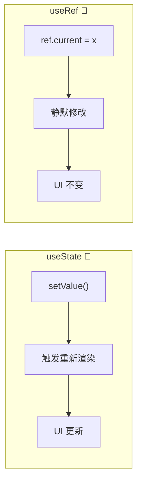

# 08. 引用与 DOM：脱离渲染循环

在 React 的声明式世界里，大部分时候只需要修改 State，React 就会更新 DOM。
但有时候，需要“绕过” React，去直接操作 DOM（比如让输入框聚焦、滚动到页面底部），或者需要保存一些“不应该触发渲染”的数据（比如定时器 ID）。

这时，需要 **Refs (References)**。

## 心理模型：口袋 (The Pocket)

如果说 State 是“相机的胶卷”（每次变化都会导致洗出新照片/重新渲染），那么 Ref 就是衣服上的**口袋**。

*   **State**: 放在台面上的数据。一旦变化，React 就会看到（触发渲染）。
*   **Ref**: 放在口袋里的小纸条。可以随时掏出来改写上面的字，React **根本不知道**，也不会因此重新渲染组件。

## useRef 的本质



`useRef` 返回的是一个普通的 JavaScript 对象，它只有一个属性：`current`。

```javascript
const myRef = useRef(initialValue);
// myRef === { current: initialValue }
```

React 保证：**无论组件渲染多少次，返回的永远是同一个对象引用（口袋）。**

### 场景 1: 存储不触发渲染的数据

最典型的例子是：计时器 ID。

```javascript
function StopWatch() {
  const [time, setTime] = useState(0);
  const intervalId = useRef(null); // ✅ 放在口袋里

  function handleStart() {
    // 修改口袋里的东西，React 毫不知情，不会触发渲染
    intervalId.current = setInterval(() => {
      setTime(t => t + 1); // 这个才会触发渲染
    }, 1000);
  }

  function handleStop() {
    clearInterval(intervalId.current); // 从口袋里读出来
  }
  // ...
}
```

如果尝试用 `useState` 来存 ID，每次 `setId` 都会导致不必要的重新渲染。
如果使用普通变量 `let id = null`，每次重新渲染时 id 都会被重置为 null，导致丢失。
只有 `useRef` 能在“跨越渲染保持数据”的同时“不触发更新”。

### 场景 2: 操作 DOM

这是 Ref 最常见的用途。

React 的 `UI = f(state)` 公式虽然强大，但有些浏览器原生能力是无法通过单纯的 State 描述的，比如：
*   让 Input 聚焦 (`input.focus()`)
*   滚动到特定位置 (`div.scrollIntoView()`)
*   测量元素尺寸 (`div.getBoundingClientRect()`)

为了让 React 把“口袋”挂到真实的 DOM 节点上，需要使用 `ref` 属性：

```javascript
function Form() {
  const inputRef = useRef(null); // 1. 准备一个空口袋

  function handleClick() {
    // 3. 在需要的时候，从口袋里掏出 DOM 节点使用
    inputRef.current.focus(); 
  }

  return (
    <>
      <input ref={inputRef} /> {/* 2. 让 React 把真实 DOM 塞进口袋 */}
      <button onClick={handleClick}>Focus input</button>
    </>
  );
}
```

流程分解：
1.  React 创建组件，`inputRef.current` 是 `null`。
2.  React 渲染 JSX，创建真实 DOM `<input>`。
3.  React 发现 `ref={inputRef}`，于是自动把这个 DOM 节点赋值给 `inputRef.current`。
4.  `handleClick` 运行时，就能读到这个 DOM 了。

## Trade-offs

**useRef vs useState：动画场景下的性能差异**

动画帧需要 60fps（每帧 ~16ms）。在 `requestAnimationFrame` 里调用 `setState`，会触发 React 协调（Reconciliation）计算。如果列表有 1000 个节点，这个计算可能占用 8-10ms，导致动画卡顿。

用 `useRef` 修改值则完全绕过了这个过程。代价是：没有响应式更新，动画逻辑需要自己维护状态。

```javascript
// ❌ useState 在动画中：每次 set 都触发协调计算
function BadAnimation() {
  const [pos, setPos] = useState(0);
  useEffect(() => {
    const id = requestAnimationFrame(() => setPos(p => p + 1)); // 卡顿风险
  }, []);
}

// ✅ useRef 在动画中：直接写值，零协调开销
function GoodAnimation() {
  const posRef = useRef(0);
  useEffect(() => {
    const id = requestAnimationFrame(() => {
      posRef.current += 1; // 直接修改
      element.style.transform = `translateX(${posRef.current}px)`;
    });
  }, []);
}
```

**ref callback vs ref object：灵活性与稳定性的取舍**

React 提供了两种 ref 写法：
- `useRef()` 返回一个稳定对象，`current` 是最新值
- `ref={el => thisNode = el}` 是 callback ref，可以动态访问多个节点

callback ref 灵活性更高，但 React 可能会多次调用它（卸载时调用一次，返回新节点时再调用一次）。如果忘记处理这种边界情况，会出现 ref 为 null 的 bug。

**Escape Hatch vs Proper State：逃逸舱的代价**

`useRef` 是 React 宣称的设计上的"逃生舱"。它的存在意味着 React 的声明式模型有边界——总有些事情它做不了。

代价是：依赖 escape hatch 的代码更难测试、更难推理。因为 ref 变化不触发渲染，测试框架看不到这个"副作用"。

正确的态度是：把 useRef 当成必要的妥协，而不是随手可用的工具。

## 常见坑点

### 1. ref 回调里的闭包陷阱

如果这样写：

```javascript
<input ref={node => this.input = node} />
```

当组件卸载时，React 会调用一次 `ref={null}`。此时 `this.input` 变成 `null`，但如果代码里还在用这个引用，就会抛出错误。

**解法**：在 ref callback 内部做 null 判断。

```javascript
<input ref={node => {
  if (node) this.input = node; // 只在有值时赋值
  else this.input = null;     // 卸载时显式置空
}} />
```

### 2. 定时器用 ref 存了 ID，但忘了清理

```javascript
function Component() {
  const timerId = useRef(null);

  useEffect(() => {
    timerId.current = setInterval(() => {
      console.log(Date.now());
    }, 1000);
    // ❌ 忘了 return () => clearInterval(timerId.current);
  }, []);

  return <div>计时器 Demo</div>;
}
```

**后果**：组件卸载后定时器还在跑，可能导致内存泄漏或状态混乱。

**解法**：始终在 useEffect 里返回清理函数。

### 3. 异步更新后读取 ref 的值是旧的

```javascript
function Demo() {
  const countRef = useRef(0);

  const handleClick = () => {
    countRef.current += 1;
    fetchData().then(() => {
      console.log(countRef.current); // 此时可能已经变化
    });
  };
  // ...
}
```

在 Promise 回调里，`countRef.current` 可能已经变化了多次。ref 本身不保证"时序正确"。

**解法**：如果需要"捕获"某个时刻的值，在异步操作开始前先存到一个 const 里。

## 什么时候不该用 Ref？

切记：Ref 是**逃生舱**。

如果发现正在用 Ref 来读写数据以控制界面显示，那可能走错路了。

**❌ 错误做法：命令式修改**
```javascript
// 不要这样！
myDivRef.current.innerText = "Hello";
myDivRef.current.style.color = "red";
```

**✅ 正确做法：声明式 State**
```javascript
// 这样更 React
<div style={{ color: isRed ? 'red' : 'black' }}>
   {text}
</div>
```

只有当无法通过 State 描述意图时（比如“聚焦”是一个动作，不是一个状态），才使用 Ref。

## 总结

1.  **useRef** 是一个即使修改也不会触发渲染的“盒子” `{ current: ... }`。
2.  **Ref 就像口袋**。用来装那些“React 不需要知道”或者“React 还没法管”的东西。
3.  最常见用途：**操作 DOM** 和 **存储定时器 ID**。
4.  **不要滥用**。如果能用 State 解决，就别用 Ref 去手动操作 DOM。
