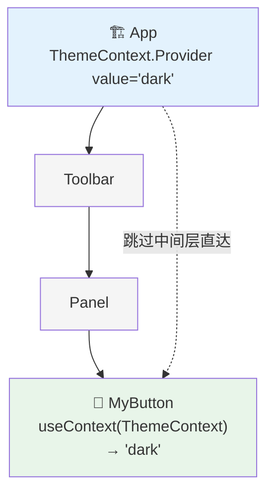

# 09. 上下文：依赖注入与隐式数据流

Props 是 React 数据流的显式血脉。但如果组件层级很深，一层一层地传递 Props（Prop Drilling）会让人痛不欲生。

想象要把这行字传给曾曾曾孙组件：
`<GrandGrandGrandChild theme="dark" />`

需要经过许多完全不关心这个 props 的中间组件。这显然不合理。

React 提供了 **Context (上下文)** 来解决这个问题。

## 心理模型：依赖注入 (Dependency Injection)

如果说 Props 是**手动搬运**，一层一层往下送。
那么 Context 就是**传送门**或者**广播塔**。

它的本质是**依赖注入 (Dependency Injection)**：组件可以声明它“依赖”某个数据，而不管这个数据来自哪里，也不需要通过父组件显式传递。

1.  在顶层建立一个**Provider (提供者)**。
2.  任意深度的后代组件建立一个**Consumer (消费者 / useContext)**。
3.  数据直接越过中间层级，注入到消费者组件中。

## 如何使用 Context



Context 分为三步：**创建、提供、使用**。

### 1. 创建 (Create)
一般在一个单独的文件里，或者组件外部。

```javascript
import { createContext } from 'react';

// 创建一个“主题”上下文，默认值是 'light'
// 提示：默认值仅在组件找不到匹配的 Provider 时生效
export const ThemeContext = createContext('light');
```

### 2. 提供 (Provide)
在组件树的上方，通过 Provider 组件圈出一块“上下文作用域”。

```javascript
import { ThemeContext } from './ThemeContext';

function App() {
  const [theme, setTheme] = useState('dark');

  return (
    // 这里的 value 就是注入到作用域内的值
    <ThemeContext.Provider value={theme}>
      <Toolbar /> 
      {/* Toolbar 内部可能包含了成百上千个组件 */}
    </ThemeContext.Provider>
  );
}
```

### 3. 使用 (Use)
在任何被覆盖的子组件里，直接读取值。

```javascript
import { useContext } from 'react';
import { ThemeContext } from './ThemeContext';

function MyButton() {
  // 直接拿到 'dark'，不需要父组件传 Props
  const theme = useContext(ThemeContext);
  
  return <button className={theme}>I am styled!</button>;
}
```

## Context + Reducer：轻量级状态管理

只要将 `useReducer` 的 `dispatch` 函数也放进 Context，就能构建一个无需第三方库的全局状态管理方案。

**架构模式**：
1.  **State Context**：存储数据。
2.  **Dispatch Context**：存储修改数据的函数。

```javascript
// 这是一个极简版的 Redux 替代方案
const [state, dispatch] = useReducer(reducer, initialState);

<TasksContext.Provider value={state}>
  <DispatchContext.Provider value={dispatch}>
    <DeepComponent />
  </DispatchContext.Provider>
</TasksContext.Provider>
```

**为什么分开？**
为了性能。如果只读取 `dispatch` 的组件（比如按钮）也订阅了 `state`，那么当 `state` 变化时，按钮也会不必要地重新渲染。通过拆分 Context，可以将读取数据和触发更新分离。

## ⚠️ 性能陷阱：Context 不是银弹

很多开发者误以为 Context 是全能的状态管理器，其实它有一个致命的性能隐患：

**只要 Provider 的 value 发生变化，所有使用了 useContext 的组件都会强制重新渲染。**

无论组件是否只用了 value 中的一小部分属性，它都会重绘。Context 没有像 Redux/Zustand 那样的“选择器 (Selector)”机制来细粒度订阅更新。

**优化策略**：
1.  **拆分 Context**：不要把所有全局状态塞进一个巨大的 Context 对象。将不相关的数据拆分到不同的 Context 中（如 `UserContext` 和 `ThemeContext` 分离）。
2.  **Memoize Value**：传递给 Provider 的 `value` 对象必须是用 `useMemo` 缓存过的。如果直接写 `<Provider value={{ a: 1, b: 2 }}>`，每次父组件渲染都会生成新对象，导致所有子组件强制重绘。

## 最佳实践与反模式

1.  **Context 破坏了组件复用性**。
    如果在 `Button` 组件里直接 `useContext(ThemeContext)`，这个按钮就没法在没有 ThemeProvider 的地方使用了。它产生了隐式依赖。
    *   **建议**：对于通用 UI 组件，优先使用 Props。对于业务容器组件，使用 Context。

2.  **不要为了避嫌 Prop Drilling 就滥用 Context**。
    传递 2-3 层 Props 是完全正常的，显式的数据流更易于追踪和维护。只有当穿透层级过深，或者数据确实是全局性的（主题、用户、语言）时，才考虑 Context。

## 总结

1.  **Context 解决了 Prop Drilling 问题**，实现了依赖注入。
2.  **createContext** 定义，**Provider** 注入，**useContext** 消费。
3.  **Context + useReducer** 是中小型应用的完美状态管理方案。
4.  **警惕性能陷阱**：大对象 Context 会导致广泛的无效渲染。拆分 Context 和 Memoize Value 是关键优化手段。
