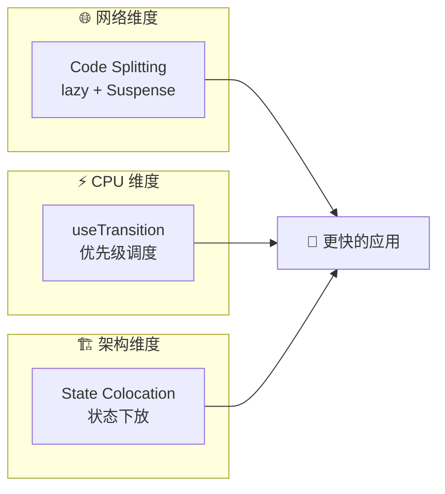

# 13. 进阶性能：并发与架构

React 的 re-render 默认会递归所有子组件，即使 props 没变。`memo` 可以拦截这种浪费。但业务复杂后，光靠"少做事"已经不够了。

性能优化还有三个维度：
1. **分包 (Code Splitting)**：网络维度的减法。
2. **并发 (Concurrency)**：CPU 维度的调度。
3. **状态下放 (State Colocation)**：架构维度的重构。



## 1. 懒加载：按需配送 (Code Splitting)

如果应用是一个巨大的超市，用户只想买一个苹果，却非要开着 18 轮大卡车把整个超市的货都拉到他家门口，这显然很慢。

在 React 中，默认的打包工具（Webpack/Vite）会把所有代码打包成一个巨大的 JS 文件。
即使是一个用户可能永远不会点开的"设置页面"，其代码也会在首屏加载时下载。

### 心理模型：按需配送

需要把应用切分成无数个小包裹。只有当用户点击了某个按钮，才去服务器下载对应的代码。

```javascript
import { lazy, Suspense } from 'react';

// ❌ 静态导入：不管用不用，先下载下来
// import SettingsPage from './SettingsPage';

// ✅ 懒加载：只有渲染这个组件时，才去网络请求代码
const SettingsPage = lazy(() => import('./SettingsPage'));

function App() {
  return (
    // Suspense 是必须的：在下载代码的几百毫秒里，展示什么 loading？
    <Suspense fallback={<Spinner />}>
       {showSettings && <SettingsPage />}
    </Suspense>
  );
}
```

## 2. 并发模式：VIP 通道 (Concurrency)

在 React 18 之前，渲染是**同步**的。一旦开始，无法中断。
如果列表过滤需要 200ms，那么这 200ms 内页面会完全卡死，用户的打字输入无法响应。

React 18 引入了并发渲染，允许将更新分为两类：
1. **高优先级（紧急）**：打字、点击、拖拽。需要立即反馈。
2. **低优先级（过渡）**：搜索结果列表渲染、图表绘制。可以慢一点，可以被打断。

### useTransition

```javascript
import { useState, useTransition } from 'react';

function SearchBox() {
  const [text, setText] = useState('');
  const [list, setList] = useState([]);
  const [isPending, startTransition] = useTransition();

  function handleChange(e) {
    // 1. 紧急：立刻更新输入框的值，不能卡
    setText(e.target.value);

    // 2. 过渡：将"过滤列表"这个繁重任务标记为低优先级
    startTransition(() => {
      const filtered = filterBigList(e.target.value);
      setList(filtered);
    });
  }

  return (
    <>
      <input value={text} onChange={handleChange} />
      {isPending ? 'Loading list...' : <List items={list} />}
    </>
  );
}
```

### 心理模型：VIP 通道

* `setText` 走了 VIP 通道，React 优先处理它。
* `startTransition` 里的更新走了普通通道。
* 如果 CPU 忙不过来，React 会暂停处理普通通道的任务，先响应用户的打字。感觉上就是页面"更丝滑"了。

## 3. 架构优化：控制爆炸半径

很多时候，性能问题不是因为计算慢，而是因为**受影响的组件太多**。

### 心理模型：爆炸半径

```javascript
// ❌ 坏架构：State 在最顶层
function App() {
  const [inputValue, setInputValue] = useState(''); // 这里的 state 变化会导致 App 重新渲染

  return (
    <div>
      <input value={inputValue} onChange={e => setInputValue(e.target.value)} />
      <ExpensiveTree /> {/* 这个昂贵组件被迫陪跑 */}
    </div>
  );
}
```

即使给 `ExpensiveTree` 加了 `memo`，这依然是不好的架构。更好的方法是：**把状态移到它真正被需要的地方**。

```javascript
// ✅ 好架构：State 下放 (State Colocation)
function InputBox() {
  const [inputValue, setInputValue] = useState('');
  return <input value={inputValue} onChange={e => setInputValue(e.target.value)} />;
}

function App() {
  return (
    <div>
      <InputBox /> {/* 它的渲染局限在自己内部 */}
      <ExpensiveTree /> {/* 完全不受影响，哪怕不加 memo */}
    </div>
  );
}
```

通过将 State "下放"到叶子节点，可以将渲染的"爆炸半径"控制在最小范围，从而保护了应用的其他部分。

## Trade-offs

**Concurrent Mode 的开销：不是免费的午餐**

React 18 的并发渲染引入了 Scheduler（调度器）。它需要在每一帧检查："有没有更高优先级的更新？"这个检查本身有开销。

对于简单的 CRUD 表单，并发模式反而可能增加 5-10% 的 CPU 占用。只有在以下场景才值得启用：
- 列表过滤/搜索（输入和结果渲染竞争）
- 大数据渲染（500+ 节点）
- 拖拽/实时图表

**useTransition vs useDeferredValue：选择困惑**

这两个 API 都能标记"可中断"的更新，但使用场景不同：

| API | 场景 | 代价 |
|-----|------|------|
| `useTransition` | 在组件内部，主动标记某段逻辑为低优先级 | 调用方需要改代码 |
| `useDeferredValue` | 想让某个 value 延迟生效（比如子组件接收的 props） | 可能产生"陈旧"状态 |

选 `useDeferredValue` 的代价：组件会渲染两次（一次新值、一次延迟值），如果子组件有 useEffect，副作用会触发两次。

**Scheduler 优先级级别：蜜汁复杂**

React 的调度器有三层优先级（从高到低）：
- **Immediate**：同步任务，如用户点击
- **User-blocking**：需要尽快响应，如输入联想
- **User-visible**：正常 UI 更新
- **Background**：低优先级任务

但这套优先级系统对调试不透明。`console.log` 打印出来的顺序，跟实际渲染顺序可能不一致。新手容易踩"看起来更新了但 UI 没变"的坑。

## 常见坑点

### 1. startTransition 里读取了"非受控"的 State

```javascript
function Search() {
  const [query, setQuery] = useState('');
  const [results, setResults] = useState([]);

  const handleChange = (e) => {
    setQuery(e.target.value);
    startTransition(() => {
      // ❌ 这里读取了 query，但 query 在 startTransition 外已经更新了
      // React 可能会"混在一起"，导致结果不正确
      setResults(search(query));
    });
  };
}
```

**后果**：搜索结果可能和输入不匹配，因为 React 会"插队"处理非 transition 的 setQuery。

**解法**：把 query 作为参数传给 search 函数，而不是闭包读取。

```javascript
startTransition(() => {
  setResults(search(e.target.value)); // 直接用新值
});
```

### 2. 误把网络请求放进 transition

```javascript
startTransition(() => {
  setResults(data); // ✅ 这是纯计算
  fetch('/api/results').then(...); // ❌ 这是副作用，不应该进 transition
});
```

**后果**：transition 是"可中断"的。如果用户在渲染过程中输入了新字符，整个更新被取消，已发出的网络请求不会被取消。

**解法**：网络请求放在 transition 外面，或使用 `useEffect` + `AbortController`。

### 3. 状态下放后，兄弟组件无法共享数据

```javascript
// ❌ 把 state 下放到子组件后，数据无法共享
function App() {
  return (
    <>
      <InputBox />      {/* inputValue 在这里 */}
      <ExpensiveTree /> {/* 想用 inputValue 但拿不到 */}
    </>
  );
}
```

**后果**：如果两个组件需要共享同一个数据，强行下放会导致"prop drilling"（层层传递）或引入 Context。

**解法**：根据数据的"消费者范围"决定下放层级。共享数据用 Context 或状态管理库。

## 总结

性能优化是一个系统工程：

1. **Network**: 使用 `lazy` + `Suspense` 切分代码，减少首屏体积。
2. **CPU (Scheduling)**: 使用 `useTransition` 将重任务标记为低优先级，保持界面响应。
3. **CPU (Structure)**: 主要靠 **状态下放** 来隔离渲染，次要靠 `memo` 来拦截渲染。
