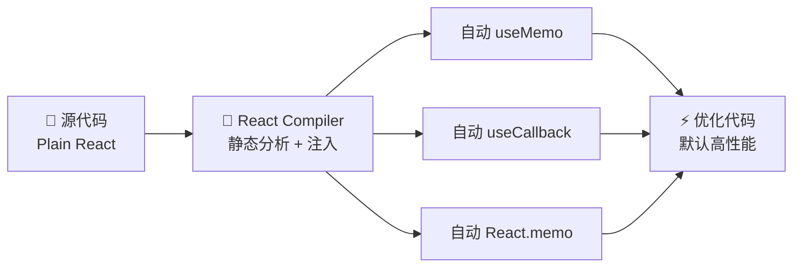

# 14. React Compiler：自动驾驶

手写 `memo` + `useCallback` + `useMemo` 防止不必要的 re-render。
一旦依赖项写错，轻则白渲染，重则数据过期、界面卡死。

React 19 引入了 **React Compiler**，试图把手动挡变成**自动驾驶**。

## 心理模型：自动流水线 (The Assembly Line)

想象一个高度智能的流水线机器人。
它会在代码 **编译阶段 (Build Time)** 读取 JavaScript 代码，分析数据流向。

它能看懂：
*   “哦，这个 `handleClick` 函数里面虽然用到了 state，但只要 state 没变，这个函数就不需要重新创建。” - **自动生成 useCallback**
*   “这个 `calculatedValue` 只要 `props.a` 没变，结果就是一样的。” - **自动生成 useMemo**
*   “这个组件如果输入没变，那就不需要重新运行。” - **自动生成 React.memo**

## 它是怎么工作的？



编写的代码（Plain React）：

```javascript
function Heading({ title }) {
  const style = { color: 'blue' }; // 每次渲染都创建一个新对象
  return <h1 style={style}>{title}</h1>;
}
```

编译器处理后的代码（Memoized React）：

```javascript
// 伪代码，仅做原理展示
function Heading({ title }) {
  const $ = useMemoCache(2); // 编译器注入的 hook
  
  let style;
  if ($[0] !== empty) {
    style = $[0];
  } else {
    style = { color: 'blue' }; // 只有第一次会被创建
    $[0] = style;
  }

  let t0;
  if ($[1] !== title) { // 只要 title 没变，就复用之前的 JSX
    t0 = <h1 style={style}>{title}</h1>;
    $[1] = title;
    $[2] = t0;
  } else {
    t0 = $[2];
  }
  return t0;
}
```

注意：**React Compiler 不依赖依赖数组 (dependency array)**。它通过静态分析来确定依赖，比人类手动写的数组更准确，彻底消灭了“闭包陷阱”和 `eslint-plugin-react-hooks` 报错。

## 这意味着什么？

1.  **不再需要 useMemo / useCallback / memo**。可以把它们从代码库里删除了。
2.  **更简单的代码**。只需要写业务逻辑，不需要操心“变量引用是否稳定”。
3.  **默认高性能**。以前高性能需要额外努力，现在高性能是默认行为。

## 如何拥抱编译器？

虽然名字叫 "Compiler"，但它不需要你重写任何代码。

### 1. 开启编译
在 React 19（及后续版本）的生态中，大多数框架（Next.js, Vite, Babel）都提供了插件支持。
只需在配置文件中开启 `reactCompiler: true` (具体配置视框架而定)。

### 2. 必须安装 ESLint 插件
编译器不是万能的，它需要代码遵守 React 的规则。如果不遵守，编译器会自动跳过优化（de-opt）。

安装 `eslint-plugin-react-compiler`，它会在写出**难以优化**的代码时发出警告：

*   ❌ 在渲染过程中修改了 ref。
*   ❌ 在 useEffect 外部读取了 ref。
*   ❌ 违反了 Hooks 的规则（条件中使用 Hook）。

### 3. 不要急着删除 useMemo
虽然编译器能自动优化，但在过渡期，**不要** 批量删除现有的 `useMemo` / `useCallback`。编译器可以和手动优化共存。

慢慢地，在新代码中，会发现越来越少需要手动写这些 Hooks 了。

## 金科玉律：Valid JS is Valid React

虽然编译器很强，但在以前，React 对很多“不规范”的代码是睁一只眼闭一只眼的（比如在 render 中稍微修改一点变量）。

**React Compiler 对代码纯度的要求极其严格。**
如果代码原本就有副作用问题，编译器可能会放大这个 Bug。

只要遵守规则，**React Compiler 就像给应用免费升级引擎**。不需要改写代码，只需要开启编译器，应用就会变得更快。

## Trade-offs

### 编译时间成本
首次编译时，Compiler 需要额外时间做静态分析。大型项目初始构建时间增加 10-30%。CI/CD 流水线上感知最明显。

### Rules of React 约束
不是所有代码都能被优化。必须严格遵守 Hooks 规则，违反规则的代码不会报错——只是静默跳过优化。

### 迁移成本
已有大量 `useCallback`/`useMemo` 的项目，Compiler 可能和手写优化冲突。建议逐步验证，不要一次性批量删除。

### 适用范围
小型表单、简单交互页面，手写优化已经足够快。Compiler 带来的收益不明显，迁移成本反而不划算。

## 总结

1.  **React Compiler 是自动优化器**。它在编译时自动为组件添加记忆化逻辑，实现 Fine-grained Reactivity。
2.  **手动挡变自动挡**。开发者不再需要手动管理 `useMemo` 和依赖数组，解决了“闭包陷阱”。
3.  **代码质量检测器**。配合 ESLint 插件，它能强制写出更加规范、更符合"纯函数"定义的代码。
