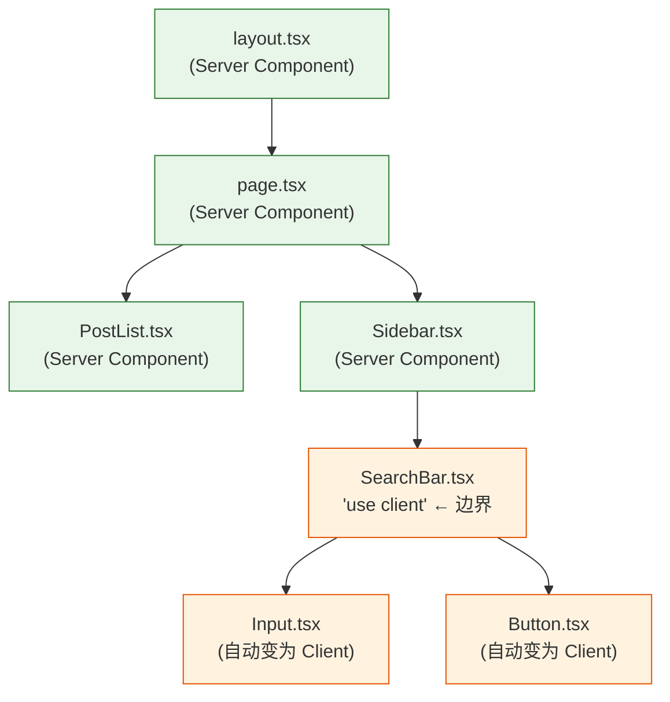

# 15. 服务端组件 (RSC)：后端的反攻

在 React 诞生后的前 7 年里，遵循着"客户端渲染 (CSR)"的模式：浏览器下载一个空白 HTML 和一个巨大的 JS 包，然后在用户电脑上从零开始组装页面。

这种模式有两个痛点：
1.  **包体积过大**：为了渲染 Markdown，需要把整个 markdown-parser 库（20KB）下载到用户手机上。
2.  **网络瀑布流**：组件加载 -> useEffect fetch -> 等待 API -> 渲染子组件 -> 子组件 fetch...

React 团队在 2020 年提出了革命性的 **React Server Components (RSC)**。

## 心理模型：三明治 (The Sandwich)

以前，React 应用要么全在客户端（CSR），要么全在服务端（SSR，生成 HTML 字符串）。
RSC 引入了一个全新的概念：**组件是可以在服务器上运行的**。

想象一个三明治：
*   **服务端组件 (面包)**：负责 layout、数据获取、静态展示。
*   **客户端组件 (肉)**：负责交互、点击、状态。

React 现在允许**混合使用**这两种组件。

### RSC 的超能力

服务端组件 (默认组件) 有几个惊人的特性：

1.  **零 Bundle Size**：它们的代码**永远不会**被发送到浏览器。
    *   这意味着可以直接引入巨大的数据库 ORM、Markdown 解析器、甚至读取本地文件系统。
    *   用户下载的 JS 包里，只有渲染结果（UI），没有库代码。

2.  **直接访问后端**：不再需要 `fetch('/api/data')`。
    *   可以直接写 `await db.query()`。因为代码就是在服务器上跑的。

```javascript
// app/page.tsx (这是一个 Server Component)
import db from './db'; 

// ✅ 这是一个 async 组件，直接读取数据库
export default async function Page() {
  const data = await db.query('SELECT * FROM posts');
  
  return (
    <main>
      <h1>Blog Posts</h1>
      {/* 直接渲染数据，这一行是在服务器完成的 */}
      <ul>
        {data.map(post => <li key={post.id}>{post.title}</li>)}
      </ul>
      
      {/* 只有像 SearchBar 这种需要交互的组件，才会被发送到浏览器 */}
      <SearchBar /> 
    </main>
  );
}
```

## 客户端组件：Client Boundary

服务器上没有 `window`，没有 `onClick`，没有 `useState`（因为服务器只跑一次）。
如果需要交互（比如点击按钮、输入框），需要显式地声明一个"客户端边界"。

```javascript
// components/SearchBar.tsx
'use client'; // 👈 这行指令告诉 React：从这里开始，打包发送到浏览器

import { useState } from 'react';

export default function SearchBar() {
  const [text, setText] = useState(''); // ✅ 可以使用 State
  return <input onChange={e => setText(e.target.value)} />;
}
```

### 边界的传递规则

`'use client'` 是一个**边界声明**，不是一个"标签"。它的含义是：从这个文件开始，以及它 import 的所有模块，都被视为客户端代码。



绿色部分（Server Components）的代码永远不会出现在浏览器的 JS bundle 中。橙色部分（Client Components）才会被打包发送。

## RSC Payload：Flight 协议

服务端组件的渲染结果不是 HTML 字符串，而是一种叫做 **RSC Payload** (也叫 Flight 格式) 的流式数据。

传统 SSR 返回的是完整的 HTML：
```html
<div><h1>Hello</h1><p>World</p></div>
```

RSC 返回的是序列化的**组件树描述**：
```
0:["$","div",null,{"children":[["$","h1",null,{"children":"Hello"}],["$","p",null,{"children":"World"}]]}]
```

这种格式的优势在于：
1.  **可流式传输**：每个组件渲染完成后立即发送，不需要等整棵树完成。
2.  **可增量更新**：导航时不需要重新加载整个页面，只刷新变化的部分。
3.  **保留客户端状态**：页面因为 Server Action 触发的重新渲染不会丢失输入框中的文字、滚动位置等客户端状态。

## 缓存策略

Next.js 在 RSC 基础上构建了多层缓存：

| 缓存层 | 位置 | 作用 |
|--------|------|------|
| **Request Memoization** | 服务器（单次请求内） | 同一个请求中多次调用 `fetch` 同一 URL，只发一次请求 |
| **Data Cache** | 服务器（跨请求） | `fetch` 的结果被持久化缓存。通过 `revalidate` 控制过期时间 |
| **Full Route Cache** | 服务器 | 静态路由的 RSC Payload 和 HTML 被缓存，不需要每次都重新渲染 |
| **Router Cache** | 浏览器 | 客户端导航时，访问过的路由段被缓存在内存中。后退时瞬间恢复 |

缓存默认是激进的（能缓存就缓存）。如果数据需要实时更新，需要明确使用 `revalidatePath()` 或设置 `export const dynamic = 'force-dynamic'`。

### 常见问题：数据不更新

如果调用 Server Action 修改了数据但页面没变化，多半是缓存没失效。确保在 Action 最后调用了 `revalidatePath('/目标路径')` 或 `revalidateTag('标签名')`。

## 总结

1.  **React 不再只是前端库**。RSC 让 React 跨越了服务器和客户端的边界。
2.  **默认全在服务端**。为了性能，默认组件都是 Server Component。只有显式标记 `'use client'` 的才加载到浏览器。
3.  **Flight 协议**是 RSC 的传输格式。它不是 HTML，而是序列化的组件树，支持流式传输和增量更新。
4.  **缓存是默认行为**。Next.js 的四层缓存让页面速度极快，但也需要理解何时失效以避免数据"冻住"。
5.  **数据获取前置**。在 Server Component 里直接 await 数据，消灭了客户端的 useEffect Waterfall。
