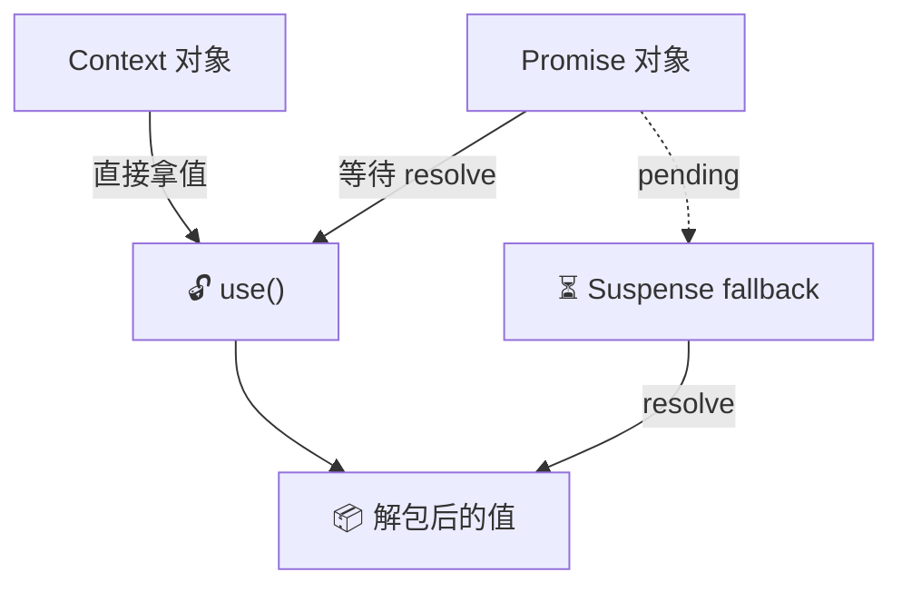

# 17. The use Hook：统一异步与上下文

React 的 Hooks 规则很严格：
1.  只能在组件顶层调用。
2.  不能在条件语句 (`if`) 中调用。
3.  不能在循环中调用。

这在处理 Context 或 Promise 时非常受限。

React 引入了一个特殊的 Hook，名字就叫 **`use`**。
它就像一个万能的**“拆包器”**，并且打破了上述的限制（它是唯一一个可以在 `if` 和循环里调用的 Hook）。

## 心理模型：拆包器 (The Unwrapper)



不论给 `use` 什么东西（是一个 Promise，还是一个 Context），其任务就是**“把里面的值拿出来”**。

如果里面还没准备好（Promise pending），它就会让 React **暂停渲染 (Suspend)**，直到值准备好为止。

### 场景 1: 读取 Context（条件渲染）

以前，必须在顶层读取 Context，即使根本不需要它。

```javascript
// ❌ 以前：即使 showDetail 为 false，也要先读取 ThemeContext
const theme = useContext(ThemeContext);
if (!showDetail) return null;
```

现在，可以按需读取：

```javascript
// ✅ 现在：只有进入 if 分支才会读取
if (showDetail) {
  const theme = use(ThemeContext);
  return <div className={theme}>...</div>
}
```

这让组件的逻辑更加灵活。

### 场景 2: 读取 Promise（从客户端直接读取 async 数据）

这是 `use` 最强大的地方。它允许在客户端组件的渲染过程中**直接解包 Promise**。

```javascript
import { use, Suspense } from 'react';

// 这是一个普通的 Promise（比如从 fetch 返回，或者从 Server Component 传下来）
const commentsPromise = fetchComments(); 

function Comments({ commentsPromise }) {
  // ✨ 魔法发生在这里：use 会自动等待 Promise resolve
  // 如果 pending，整个组件会 suspend
  const comments = use(commentsPromise); 

  return (
    <ul>
      {comments.map(c => <li key={c.id}>{c.text}</li>)}
    </ul>
  );
}

function Page() {
  return (
    <Suspense fallback="Loading comments...">
      <Comments commentsPromise={commentsPromise} />
    </Suspense>
  );
}
```

## 为什么这很重要？

这标志着 React 数据流的终极统一。

以前，处理异步数据要用 `useEffect` + `useState` + `loading` 变量。
处理 Context 要用 `useContext`。

现在，**所有“未来会到的值”和“现在就在的值”，都可以用 `use` 来统一读取。**

*   如果是 Context，直接拿。
*   如果是 Promise，等待并 Suspend。

这让组件代码变得极其干净，更像是同步代码，而不是挂满了 `then()` 和回调的异步面条代码。

## 实战模式：条件读取 Context

传统 Hook 规则要求 `useContext` 不能写在 `if` 里面。但 `use` 突破了这个限制：

```javascript
function StatusBar({ showTheme }) {
  // ✅ 只有需要时才读取 Context
  if (showTheme) {
    const theme = use(ThemeContext);
    return <div style={{ color: theme.color }}>Themed</div>;
  }
  return <div>Default</div>;
}
```

这在有大量可选 Context 的组件中尤其有用——避免了不必要的订阅和重渲染。

## ⚠️ 注意事项

**Promise 缓存陷阱**：传给 `use` 的 Promise **必须来自组件外部**（如 Server Component 传递的 prop），不能在渲染函数内部创建。

```javascript
// ❌ 每次渲染都创建新 Promise，导致无限 Suspend
function Bad() {
  const data = use(fetch('/api/data').then(r => r.json()));
}

// ✅ Promise 来自外部（父组件或路由加载器）
function Good({ dataPromise }) {
  const data = use(dataPromise);
  return <div>{data.name}</div>;
}
```

**与 useEffect 的对比**：`use` 不会引起额外的渲染周期。传统的 `useEffect` + `setState` 至少需要两次渲染（空 → 有数据），而 `use` 配合 Suspense 只有一次（Suspense fallback → 最终 UI）。

## 总结

1.  **use 是通用的拆包器**。它可以解包 Context 和 Promise。
2.  **打破规则**。它是唯一可以在 `if` 和循环中调用的 Hook。
3.  **拥抱 Suspense**。当 `use` 解包一个 Promise 时，它依赖外层的 `<Suspense>` 来展示 Loading 状态。
4.  **简化心智**。不再区分"同步数据"和"异步数据"，在 React 组件眼中，它们都是可以用 `use` 读取的资源。
5.  **Promise 必须来自外部**。不能在渲染期间创建新的 Promise 传给 `use`，否则会触发无限循环。
