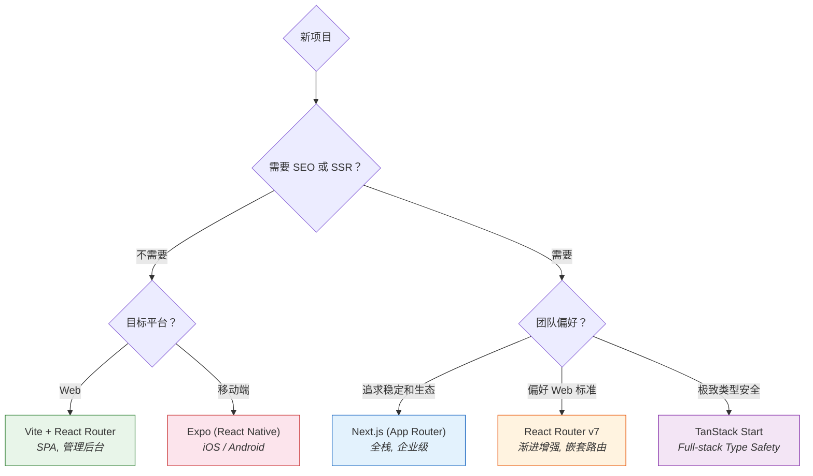

# 18. 生态与框架：如何启动

在 2026 年，如果去 React 官网点击 "Get Started"，会发现官方不再推荐 `create-react-app` (CRA)。
相反，官方推荐使用 **Next.js**, **Remix**, 或者 **Vite**。

这让很多新手困惑：如果只是想写个 Hello World，为什么需要这么多复杂的框架？

## 心理模型：交通工具选择

选择 React 的启动方式，就像选择交通工具。目的地（产品需求）决定了该选哪辆车。

### 1. Vite：轻量级跑车

*   **特点**：极速启动，结构简单，纯客户端渲染 (CSR)。
*   **适用场景**：
    *   后台管理系统 (Dashboard)。
    *   嵌入其他系统的组件。
    *   不需要 SEO 的单页应用。
*   **本质**：产物是 `index.html` + `bundle.js`。任何静态服务器（Nginx, S3）上一扔就能跑。
*   **不足**：没有 SSR，没有内置路由（需要自己加 React Router），没有数据获取层。

```bash
npm create vite@latest my-app -- --template react-ts
```

### 2. Next.js：全栈航母

*   **特点**：全栈框架，支持 SSR、RSC、API Routes、Middleware，自带文件路由。
*   **适用场景**：
    *   电商、博客、新闻门户（需要 SEO）。
    *   全栈应用（直接连数据库）。
    *   追求极致首屏性能的应用。
*   **本质**：产物包含一个 **Node.js 服务器**。需要部署到 Vercel 或 Docker 容器中运行。

```bash
npx create-next-app@latest
```

Next.js 目前是 React 生态中使用最广泛的全栈框架。App Router（基于 RSC）虽然学习曲线陡峭，但一旦理解了 Server/Client Component 的边界划分，开发效率非常高。

### 3. Remix / React Router v7：Web 标准拥护者

Remix 在 2024 年与 React Router 合并，现在 React Router v7 就是 Remix 的继承者。

*   **特点**：深度拥抱 Web 标准（Form, Request, Response），嵌套路由 + 并行数据加载。
*   **适用场景**：
    *   注重渐进增强的应用（禁用 JS 也能基本运行）。
    *   对 Web 标准有执念的团队。
    *   多层嵌套布局的复杂应用。
*   **优势**：数据加载与路由深度绑定。每个路由段有自己的 `loader`，多个路由段的数据加载是**并行**的，不存在瀑布流。

```bash
npx create-react-router@latest my-app
```

### 4. TanStack Start：新生力量

TanStack（React Query 的作者 Tanner Linsley 的项目）推出的全栈框架。

*   **特点**：类型安全到极致（Full-stack Type Safety），基于 Vinxi 构建。
*   **定位**：如果说 Next.js 是"React 官方的选择"，TanStack Start 是给那些希望**完全掌控底层**的资深开发者准备的。
*   **现状**：仍在 Beta 阶段，但进展很快。如果已经在用 TanStack Router + TanStack Query，迁移成本很低。

### 5. Expo：移动端的 React

React 不只是 Web 框架。通过 **React Native** 和 **Expo**，同一套 React 心智模型可以构建原生移动应用。

*   **Expo** 是 React Native 的工具链和平台，处理了原生配置、构建、推送通知等复杂工作。
*   **Expo Router**：把 Next.js 的文件路由带到了移动端。
*   通过 **React Native for Web**，甚至可以用同一套代码同时构建 Web 和 Native 应用。

## 选型决策流程



## 为什么要用框架？

可能会问："为什么不能只用 React 库本身？"

可以，但这就像**自己买零件组装汽车**。需要自己配置 Vite/Webpack，自己配置路由 (React Router)，自己处理 CSS 压缩，自己搭建 API 层...

React 官方现在的态度是：**React 是一个库 (Library)，但为了最好的体验，应该在一个框架 (Framework) 中使用它。**

框架统一解决了：
*   **路由**：文件即路由 (File-system routing)。
*   **数据获取**：RSC、Server Actions、Loader 等机制。
*   **性能**：自动代码分割 (Code Splitting)、图片优化。
*   **部署**：内置的构建和部署流程。

## 总结

1.  **别再用 CRA**。`create-react-app` 已经停止维护。
2.  **默认选 Next.js**。不确定选什么时，Next.js 是最安全的选择——既能做静态网站，也能做全栈应用。
3.  **SPA 选 Vite**。确定只需要纯前端 SPA 或学习 demo 时，Vite 是最快最简单的选择。
4.  **移动端选 Expo**。React 的心智模型可以直接复用到原生 App 开发。
5.  **React 已经不只是 UI 库**。它演变成了一个**平台**，而 Next.js / Remix / Expo 是在这个平台上运行的**完整操作系统**。
